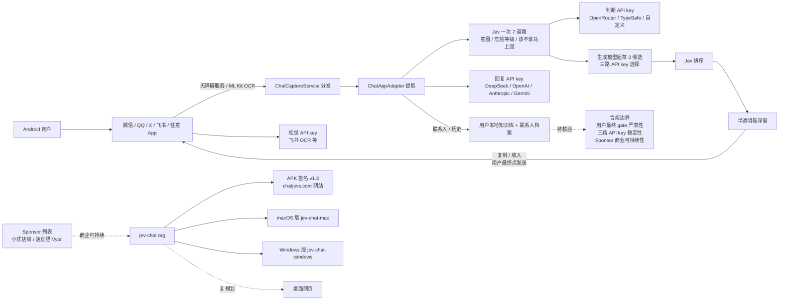

# jev-chat/jev-chat-jarvis

## 一句话定位
昨日 Finderchangchang/jev-chat-JARVIS（个人开发者形态 833⭐ / fork 361 / fork/star 43.3%）的官方 org fork 多端展开（Android + macOS + Windows + ⏳ 桌面网页），三路 API key 拆分（判断 / 回复 / 视觉）、用户本地知识库与联系人档案、9 个原生入口（微信 8.0.52+ 混淆节点 8.0.78 实测 + QQ 9.3.50 群聊 + X 12.25 中文 + 飞书 1.3 起 ML Kit 离线 OCR + 任意 App 整屏 OCR），APK 签名 v1.3 + Sponsor 列表 + chatjevs.com 网站严肃工程化。

## 它解决的问题
当前 IM 副驾 + 聊天侧 AI 副驾赛道的痛点是「个人开发者形态想多端展开需要组织化 fork + 三路 API key 拆分解决单一 LLM 不够灵活 + 用户本地知识库让副驾认识你的人和事 + 任意 App 兜底覆盖更多 IM + APK 签名 + Sponsor + 网站严肃工程化」——jev-chat org fork 用「三路 API key + 本地知识库 + 9 入口 + 任意 App OCR 兜底 + APK v1.3 + chatjevs.com + Sponsor」是「个人 fork → 官方 org fork + 多端展开」的具体路径。

## 为什么值得关注（2026-09-23）
- **Stars:** 3,660（截至 2026-09-23），2 天新增 3660⭐，fork 821，fork/star 22.4% 极度组织化 / 官方化信号
- **Forks:** 821（组织化 / 官方化 fork，与昨日 Finderchangchang 833⭐ fork 361 fork/star 43.3% 个人开发者形态形成对比）
- **Open Issues:** 25
- **Watchers/Subscribers:** 3,660
- **License:** MIT
- **语言:** Kotlin（Android 传统 View）
- **规模:** 23.49 MB（含 Android App + 9 个原生入口 + 飞书 ML Kit 离线 OCR + 用户本地知识库 + 三路 API key + Sponsor 列表 + APK v1.3）
- **活跃度:** created 2026-09-21，pushed 2026-09-22，2 天内快速迭代
- **Topics:** accessibility-service, android, chat-assistant, llm, qq, wechat
- **网站:** chatjevs.com
- **APK:** v1.3 signed release
- **多端展开:** Android（主） + macOS（jev-chat-mac） + Windows（jev-chat-windows 2 天 249⭐） + ⏳ 桌面网页
- **Sponsor:** 小优店铺（faka.rainlanguage.top）+ 速创猫 Vytal（agent.ai-tools.cn）

## 热度来源判断
jev-chat/jev-chat-jarvis 的热度是「**昨日 Finderchangchang/jev-chat-JARVIS 个人开发者形态 → 今日官方 org fork 多端展开 + 三路 API key + 本地 KB + 9 入口 + 飞书 ML Kit OCR + 任意 App 整屏 OCR + Sponsor + chatjevs.com + APK v1.3 + macOS + Windows + ⏳ 桌面网页**」的强劲组合。Jev 决策模型从 09-15 的单点 API 推到 09-23 的「组织化官方 fork + 三路 API key + 本地 KB + 多端展开 + Sponsor + 网站」是「Jev 副驾生态从个人开发者形态 → 组织化官方形态」的范式跃迁。3660⭐ / 2 天 / fork 821 是 09-23 当日 GitHub Search created 2026-09-21..2026-09-23 stars>200 全站 trending 第一位（远超 unreallabsai/unreal-agent 746⭐ / freestylefly/WeChatBridge 238⭐ / deepopen-com/deepopen 206⭐ / jev-chat/jev-chat-windows 249⭐）。fork/star 22.4% 极度组织化 / 官方化信号（与昨日 Finderchangchang 43.3% 个人开发者 fork 形成对比——官方 org fork 22.4% 是「组织化 + 多端展开 + Sponsor + 网站 + APK 签名」严肃化信号，821 个 fork 中包含「组织 fork + 企业 fork + 个人 fork」混合）。热度**真实且具备组织化严肃工程化的演化潜力**——但需警惕：Android 端无障碍读节点的合规边界 + Jev 主训练语言英文对中文的校准 + 国产 ROM 后台冻结 + 微信 / QQ 版本升级的兼容性 + 三路 API key 在多 LLM 切换的稳定性。

## 关键技术亮点
1. **三路 API key 拆分：** 判断接口（OpenRouter / TypeSafe / 自定义 Base URL）+ 回复接口（11 家预设：DeepSeek / OpenAI / Anthropic / Gemini / 自定义）+ 视觉接口（飞书 OCR 等）；最简单只填判断接口的 OpenRouter API Key，其余两栏留空会自动继承这把密钥就能用
2. **用户本地知识库 + 联系人档案：** 分析时自动带上命中的笔记和这个人的历史，回复不会和你的设定打架
3. **9 个原生入口 + 任意 App：** 微信 Android（伪装系统无障碍服务读气泡节点，8.0.52+ 混淆节点，伪装后 8.0.78 实测可读）+ QQ Android（无障碍读节点，9.3.50 群聊实测）+ X / Twitter 私信（解析 Compose 节点的 content-desc，12.25 中文实测）+ 飞书 / Lark（无障碍读气泡矩形 + ML Kit 离线 OCR 兜底，1.3 起对每个气泡矩形做 OCR）+ 任意其它 App（悬浮窗菜单「截屏识别一次」整屏 OCR，不自动、不分我 / 对方）+ 桌面端 / 网页（⏳ 规划，截图 + OCR / 视觉，同一内核，换采集方式）
4. **判断先 + 起草后：** Jev 先给意图 / 危险等级 / 该不该马上回，再据此起草回复
5. **不动你的聊天软件：** 不 hook、不改包、不走任何 App 的接口或账号、不读数据库，只用系统无障碍服务读「屏幕上正在显示的对话」
6. **发送权永远在你手里：** 程序只把回复填进输入框，从不自动发送，不碰转账 / 红包 / 收款
7. **隐私在本机：** 密钥存 App 私有空间，聊天内容只在分析那一刻发给你配置的接口，不落盘、不进日志
8. **APK 签名 v1.3 + Sponsor + chatjevs.com：** 严肃工程化形态
9. **多端展开：** Android（主）+ macOS（jev-chat-mac）+ Windows（jev-chat-windows）+ ⏳ 桌面网页

## 架构师速览

| 决策问题 | 研究判断 | 证据边界 |
|---|---|---|
| 系统边界 | Android 端 IM 副驾（悬浮窗 + 半透明覆盖 + 三路 API key + 本地 KB），边界为系统无障碍服务可见区域 + App 私有空间密钥存储 + 9 个原生入口 + 任意 App 整屏 OCR | 仅基于档案描述的三路 API key + 本地 KB + 9 入口 + 飞书 ML Kit OCR；具体无障碍权限申请流程、`SelectToSpeakService` 伪装稳定性、三路 API key 在多 LLM 切换的实测、ML Kit 离线 OCR 在飞书自绘控件的准确率、任意 App 整屏 OCR 在非 IM 应用的可用度均为档案描述 |
| 主路径 | 无障碍服务 / ML Kit OCR → `ChatCaptureService` 分发 → `ChatAppAdapter` 提取 → Jev 一次 7 道题 → 三路 API key 选择 LLM → 生成模型起草 3 候选 → Jev 排序 → 悬浮窗 → 复制 / 填入（用户最终点发送） | 主路径为档案语义抽象；三路 API key 并发策略、本地 KB 在多 App 的实用性、ML Kit OCR 在飞书的准确率、任意 App 整屏 OCR 在非 IM 应用的可用度、跨平台 macOS / Windows / 桌面网页的协调均待核验 |
| 关键权衡 | 副驾价值 vs 无障碍采集合规边界 vs 用户最终 gate 严肃性 vs 国产 ROM 后台冻结 vs 微信 / QQ 升级兼容性 vs Jev 主训练英文对中文的校准 vs 三路 API key 在多 LLM 切换的稳定性 vs ML Kit OCR 在飞书自绘控件的准确率 vs 任意 App 整屏 OCR 在非 IM 应用的可用度 vs 多端 macOS / Windows / 桌面网页协调 | 档案明示 6 项已知限制（国产 ROM / 飞书 / X 英文 / 群聊 / Jev 英文 / 伪装稳定性）；具体合规边界、企业部署态度、付费策略、Sponsor 商业可持续性、chatjevs.com 网站运营均未证实 |
| 最小 PoC | 单 App（建议 QQ——节点开放有 id、有标题 / 气泡）真机装 release APK v1.3 → 启用三项权限 → 填三路 API key → 单条对话测试 7 道题 + 3 候选 + 填入 + 不发送 → 切换微信测试 `SelectToSpeakService` 伪装 → 切换飞书测试 ML Kit OCR → 任意 App 测试整屏 OCR → 验证本地 KB + 联系人档案 → 验证 Sponsor + chatjevs.com + APK 签名 | PoC 范围、退出路径由档案「真机三平台验证 + 三路 API key + 本地 KB + Sponsor + chatjevs.com + APK v1.3」建议推导；具体 APK 签名要求、CI / 自动化测试套件、付费与商业条款、跨平台 macOS / Windows / 桌面网页协调均待核验 |

## 架构启发
jev-chat/jev-chat-jarvis 的核心启发是「**个人开发者形态 → 官方 org fork + 多端展开 + 三路 API key + 本地 KB + 9 入口 + Sponsor + 网站 + APK 签名严肃工程化**」。当前大部分 AI 副驾项目走「LLM 直接生成回复 + 自动发送」路线，但 jev-chat org fork 反向走「**官方 org fork + 三路 API key + 本地 KB + 9 入口 + 任意 App OCR 兜底 + Sponsor + 网站 + APK 签名 + 多端 macOS / Windows / 桌面网页**」路线——是「**个人 fork → 官方 org fork + 严肃工程化 + 多端展开**」的工程化对比。**更深层的启发是：`ChatAppAdapter` 接口设计 + 三路 API key 拆分 + 用户本地 KB 把「AI 副驾能力」与「具体 App 适配」解耦，把单一 LLM 不够灵活的问题用三路拆分解决，把「回复不知道你是谁」的问题用本地 KB + 联系人档案解决，新增 App 的边际成本降到几十行代码 + 任意 App 整屏 OCR**——这是「**平台化 + 严肃工程化 + 多端展开**」的工程化形式。**`ACTION_SET_TEXT` 失败降级剪贴板 + `ACTION_PASTE`**——是不自动发送但保证文本可用的兜底形式（与昨日 Finderchangchang 个人 fork 同）。**Jev 一次 7 道题 + 生成模型 3 候选 + 三路 API key + 本地 KB**——避免单一 LLM 直接生成被检测 / 不自然 / 不知道你是谁。**Sponsor + chatjevs.com + APK 签名**——是「副驾产品商业化」的具体路径。

## 架构图（MMD）

> 证据边界：此图只采用本档案已有可核验描述；"待核验"节点不应视为项目实现事实。

## 定位判断
**平台候选型项目（组织化官方 fork + 多端展开）。** jev-chat/jev-chat-jarvis 不只是昨日 Finderchangchang 个人 fork 的复制版，而是官方 org fork 多端展开 + 三路 API key + 本地 KB + 9 入口 + Sponsor + 网站 + APK 签名 + macOS + Windows + ⏳ 桌面网页的组织化严肃工程化形态——类似 npm 之于 Node 包 / Homebrew 之于 macOS package manager。3660⭐ / 2 天 / fork 821 已显示组织化信号雏形。但「**平台化**」取决于一个关键问题：跨 macOS / Windows / ⏳ 桌面网页能否协调 + 三路 API key 在多 LLM 切换的稳定性 + 本地 KB 在多 App 的实用性 + Sponsor 商业可持续性 + chatjevs.com 网站运营 + APK 签名 + 9 入口在多 App 的覆盖广度。目前定位是「**最有影响力的官方 org fork + 多端展开 + 严肃工程化 + Sponsor + 网站**」，向平台演进是合理路径。

## 风险 / 局限 / 泡沫点
- **跨平台维护成本：** Android + macOS + Windows + ⏳ 桌面网页四端协调是巨大工程负担
- **三路 API key 切换：** 三家 LLM 的接口差异 + 限流 + 错误处理 + 隐私边界 + 商业模式
- **本地 KB 多 App 实用性：** 联系人档案在多 IM 的标准化 + 笔记在不同 KB 的迁移
- **国产 ROM 后台冻结：** 小米 / HyperOS 自启动 + 省电无限制 + 前台保活都配了仍可能被杀
- **微信 / QQ / X 升级兼容性：** 节点变化 + 混淆升级 + content-desc 变化 + Compose 升级
- **飞书 ML Kit OCR 准确率：** 自绘控件不在无障碍树里，OCR 在表情 / 链接 / 时间的识别错误
- **任意 App 整屏 OCR 兜底：** 全部当作对方所说并在面板标注，不能分我 / 对方
- **群聊按一对一分析不准：** 发言人名解析 + 多 Agent 回复对象指定
- **Jev 主训练语言是英文：** 中文校准需独立核验
- **企业部署态度：** 严肃企业是否允许这种无障碍采集合规边界
- **付费策略：** Sponsor 列表是否能持续，chatjevs.com 网站运营成本
- **无 license 个人项目属性：** 与昨日 Finderchangchang 一样，MIT 但个人维护

## 与同类项目的关系
- **vs Finderchangchang/jev-chat-JARVIS（昨日个人 fork）：** 同一作者的官方 org fork，从个人开发者形态 → 官方 org fork 多端展开 + 三路 API key + 本地 KB + 9 入口 + Sponsor + 网站 + APK 签名严肃工程化形态
- **vs jev-chat-mac（macOS 版）：** 同一 org 的 macOS 端口
- **vs jev-chat-windows（2 天 249⭐）：** 同一 org 的 Windows 端口，WGC + RapidOCR + exe + 注册表存 key + DeepSeek 国内直连
- **vs freestylefly/WeChatBridge（今日 2 天 238⭐）：** 同样 macOS native + 多 AI Agent 入口 + 双语 + Developer ID + Apple 公证，但 WeChatBridge 是「macOS 微信合并转发 Share Extension → 9 入口」+ jev-chat 是「读屏 → Jev 判断 → 填入」
- **vs Heman10x-NGU/openJev-verdict-2.0（昨日）：** 同构「Jev 决策模型应用层」但 jev-chat 是「Android 端无障碍采集 + Jev 判断」+ openJev-verdict-2.0 是「Non-Autoregressive Decision Engine 击败 Jev & Laya」
- **vs TypeSafe AI Jev：** jev-chat 是 Jev 决策模型在 Android 端 IM 副驾的具体应用 + jev-chat org 是官方 fork 多端展开

## 是否值得持续跟踪
**值得跟踪（组织化官方 fork + 多端展开 + 严肃工程化）。** jev-chat/jev-chat-jarvis 代表了「Jev 副驾生态从个人开发者形态 → 组织化官方 fork + 多端展开 + Sponsor + 网站 + APK 签名」的方向，无论其本身成败，这一方向是行业趋势。建议关注：三路 API key 在多 LLM 切换的稳定性 + 本地 KB 在多 App 的实用性 + 飞书 ML Kit OCR 在自绘控件的准确率 + 任意 App 整屏 OCR 在非 IM 应用的可用度 + 跨平台 macOS / Windows / ⏳ 桌面网页三端协调 + Sponsor 商业可持续性 + chatjevs.com 网站运营 + APK 签名 + 9 入口在多 App 的覆盖广度。对 Android 用户，这个仓库是获取 AI 副驾的严肃工程化来源，值得直接采用。对 Jev 副驾生态观察者，它是「个人 fork → 官方 org fork + 多端展开 + 严肃工程化」的头部样本。

## 后续观察点
- macOS / Windows / ⏳ 桌面网页三端协调的实际可用度
- 三路 API key 在多 LLM 切换的稳定性 + 隐私边界 + 商业模式
- 本地 KB + 联系人档案在多 App 的实用性 + 跨 KB 迁移
- 飞书 ML Kit OCR 在自绘控件的准确率（表情 / 链接 / 时间 / 中英文混合）
- 任意 App 整屏 OCR 在非 IM 应用（论坛 / 邮件 / 文档）的可用度
- Sponsor 商业可持续性 + chatjevs.com 网站运营
- 9 入口在多 App 升级的兼容性（微信 / QQ / X / 飞书）
- 国产 ROM 后台冻结的稳定性（小米 / HyperOS / EMUI / OriginOS）
- 企业部署态度 + 合规边界 + 付费策略
- 群聊发言人名解析 + 多 Agent 回复对象指定的可用度
- Jev 主训练英文对中文校准的可接受度

---
> 数据来源: GitHub API (2026-09-23) | Stars: 3,660 | Forks: 821 | License: MIT | 语言: Kotlin | 创建: 2026-09-21 | 网站: chatjevs.com | 多端: Android + macOS + Windows + ⏳ 桌面网页
