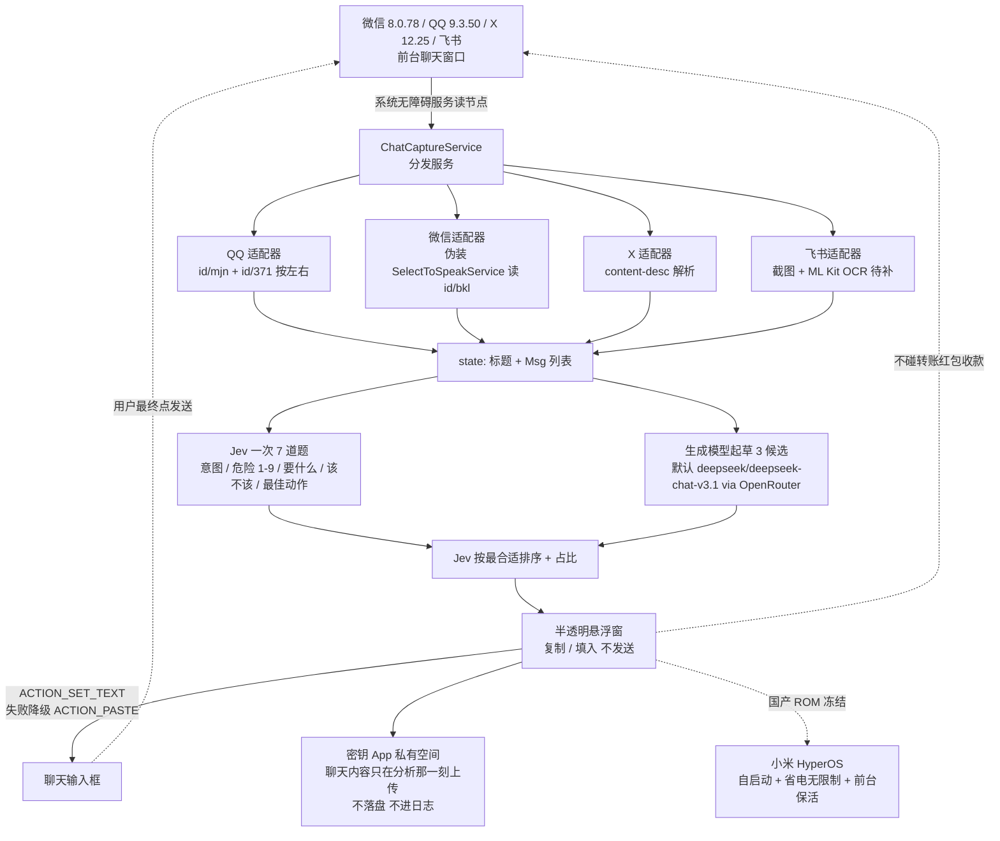

# Finderchangchang/jev-chat-JARVIS

## 一句话定位
Android 端「聊天副驾」悬浮窗，用 TypeSafe Jev 决策模型一次 7 道题判断对话语境（意图 / 危险等级 / 对方要什么 / 该不该回 / 最佳动作），由生成模型起草 3 条候选并由 Jev 排序，最终由用户手动填入输入框——程序永不自动发送、不碰转账红包。

## 它解决的问题
当前 IM 用户在多平台（微信 / QQ / X 等）上「想有人帮自己看对方消息 + 告诉自己该怎么回 + 但绝不替自己发 + 绝不碰转账红包 + 聊天记录不上传 + 不改 App 不被检测」的诉求中——提供了「一套内核 + 一个 App 一个几十行的 `ChatAppAdapter` + 无障碍读节点不 hook 不改包 + Jev 一次 7 道题判断 + 生成模型 3 候选 + Jev 排序 + 半透明悬浮窗 + `ACTION_SET_TEXT` / `ACTION_PASTE` 填入 + 用户最终发送 gate」整条链。

## 为什么值得关注（2026-09-22）
- **Stars:** 833（截至 2026-09-22），1 天新增 833⭐，fork 361，fork/star 43.3% 极高企业 / 个人开发者 fork 信号
- **Forks:** 361（极高企业 / 个人开发者 fork 信号）
- **Open Issues:** N/A（详情未抓取）
- **License:** MIT
- **语言:** Kotlin（Android 传统 View）
- **规模:** 17103 KB（含 Android App + 4 个适配器 + Jev 客户端 + APK build）
- **活跃度:** created 2026-09-21，pushed 2026-09-21，1 天内快速迭代
- **Topics:** N/A（GitHub topics 未声明）
- **真机验证:** 微信 8.0.78 + QQ 9.3.50 + X 12.25 + 飞书采集已接入

## 热度来源判断
jev-chat-JARVIS 的热度是「**Android 端无障碍采集 + Jev 实时判断 + 生成模型 3 候选 + Jev 排序 + 用户最终 gate + 真机三平台验证**」的强劲组合。Jev 决策模型从 09-15 的单点 API 推到 09-22 的「Android 端无障碍采集 + 实时判断 + 用户最终 gate」移动端具身智能，是「**Jev / System One 决策模型从决策 API → 用户决策侧**」的范式跃迁。361 个 fork 反映社区高度参与——fork/star 43.3% 与昨日 HyNetworks/OpenGFW 44.3% 接近，是「严肃 Android 端 AI 应用」的典型早期 fork 率特征。833⭐ / 1 天是 09-22 当日 GitHub Search created 2026-09-21..2026-09-22 stars>30 全站 trending 第一位。热度**真实且具备移动端具身智能的演化潜力**——但需警惕：Android 端无障碍读节点的合规边界 + Jev 主训练语言英文对中文的校准 + 国产 ROM 后台冻结 + 微信 / QQ 版本升级的兼容性。

## 关键技术亮点
1. **一套内核 + `ChatAppAdapter` 接口:** pkg + `extract(root, res)` 返回 (标题 + `Msg(side, text)`) 即可新增 App，下游判断 / 候选 / 悬浮窗 / 填入全部通用
2. **4 适配器覆盖 4 种情况:** QQ（节点开放有 id）/ 微信（混淆节点伪装系统 `SelectToSpeakService` 读 `id/bkl`）/ X（Compose 解析 `content-desc` `发件人：正文。时间。Read`）/ 飞书（自绘控件待截图 + ML Kit OCR）
3. **非侵入:** 不 hook、不改包、不走 App 接口、不读数据库，只用系统无障碍服务读「屏幕上正在显示的对话」
4. **Jev 一次 7 道题:** 意图 / 危险等级 1-9 / 对方要什么 / 该不该马上回 / 最佳动作，约 1 秒带把握度
5. **3 候选 + Jev 排序:** 生成模型（默认 `deepseek/deepseek-chat-v3.1` via OpenRouter）起草 3 条口语化回复，Jev 按「最合适」排序并给出占比
6. **发送永远由你点:** `ACTION_SET_TEXT` 失败降级剪贴板 + `ACTION_PASTE`，不自动发送，不碰转账 / 红包 / 收款
7. **隐私在本机:** 密钥只存 App 私有空间，聊天内容只在分析那一刻发给模型接口，不落盘、不进日志
8. **国产 ROM 适配:** 小米 / HyperOS 自启动 + 省电无限制 + 前台保活 + 气泡短暂消失自愈

## 架构师速览

| 决策问题 | 研究判断 | 证据边界 |
|---|---|---|
| 系统边界 | Android 端 IM 副驾（悬浮窗 + 半透明覆盖 + `ACTION_SET_TEXT` 填入），边界为系统无障碍服务可见区域 + App 私有空间密钥存储 | 仅基于档案描述的无障碍采集 + 4 适配器 + 国产 ROM 自愈；具体无障碍权限申请流程、`SelectToSpeakService` 伪装稳定性、`ACTION_SET_TEXT` 在多 ROM 成功率为档案描述 |
| 主路径 | 无障碍服务 → `ChatCaptureService` 分发 → `ChatAppAdapter` 提取 → Jev 一次 7 道题 → 生成模型起草 3 候选 → Jev 排序 → 悬浮窗 → 复制 / 填入（用户最终点发送） | 主路径为档案语义抽象；Jev / 生成模型并发策略、悬浮窗刷新节流、Resume / 复制兜底未在档案中给出 |
| 关键权衡 | 副驾价值 vs 无障碍采集合规边界 vs 用户最终 gate 严肃性 vs 国产 ROM 后台冻结 vs 微信 / QQ 升级兼容性 vs Jev 主训练英文对中文的校准 | 档案明示 6 项已知限制（国产 ROM / 飞书 / X 英文 / 群聊 / Jev 英文 / 伪装稳定性）；具体合规边界、企业部署态度、付费策略未证实 |
| 最小 PoC | 单 App（建议 QQ——节点开放有 id、有标题 / 气泡）真机装 release APK → 启用三项权限 → 单条对话测试 7 道题 + 3 候选 + 填入 + 不发送 → 切换 App 验证适配器独立 → 关闭摘要 / 生成模型配置验证隐私边界 | PoC 范围、退出路径由档案「真机三平台验证 + 隐私边界」建议推导；具体 APK 签名要求、CI / 自动化测试套件、付费与商业条款待核验 |

## 架构启发
jev-chat-JARVIS 的核心启发是「**AI 副驾应该是用户决策侧基础设施，而非 LLM 自动生成的替代品**」。当前大部分 AI Agent 走「LLM 直接生成回复 + 自动发送」路线，但 jev-chat-JARVIS 反向走「Jev 决策 + 生成模型起草 + 用户最终 gate + 不碰敏感操作」路线——是「**副驾 vs 替代**」的工程化对比。**更深层的启发是：`ChatAppAdapter` 接口设计把「AI 副驾能力」与「具体 App 适配」解耦，新增 App 的边际成本降到几十行代码**——这是「平台化」的工程化形式，类似浏览器扩展的 content script 接口。**`ACTION_SET_TEXT` 失败降级剪贴板 + `ACTION_PASTE`**——是不自动发送但保证文本可用的兜底形式。**Jev 一次 7 道题 + 生成模型 3 候选**——避免单一 LLM 直接生成被检测 / 不自然。

## 架构图（MMD）

> 证据边界：此图只采用本档案已有可核验描述；「待核验」节点不应视为项目实现事实。

## 定位判断
**移动端具身智能候选项目（Android 端 IM 副驾）。** jev-chat-JARVIS 不仅是工具集合，更试图成为「**Android 端 AI 副驾平台**」——通过 `ChatAppAdapter` 接口把能力分发到多 App，类似浏览器扩展的 content script 接口。833⭐ + 361 fork 已显示社区热度。但「平台化」取决于一个关键问题：Jev 决策模型在中文聊天上的准确率 + 微信 / QQ / X 多版本升级的兼容性 + 国产 ROM 后台冻结的稳定性。目前定位是「**最有影响力的 Android 端 IM 副驾**」，向多语言 + 多 App + 企业部署是合理路径。

## 风险 / 局限 / 泡沫点
- **Android 端无障碍采集的合规边界:** 国内 IM App（微信）可能更新版本检测无障碍服务 + 限制其使用，导致采集失败或被风控
- **Jev 主训练语言英文对中文的校准:** README 明确建议用户用真实对话做一批标注校准，未校准时中文聊天判断可能有偏差
- **国产 ROM 后台冻结:** 小米 / HyperOS 即使配齐自启动 + 省电无限制 + 前台保活仍可能被杀，气泡短暂消失
- **微信版本升级可能失效:** 伪装无障碍服务是绕过微信混淆的手段，微信版本更新可能需要重新适配
- **飞书自绘控件:** 飞书正文是自绘控件不在无障碍树里，目前只能分析到文档卡片等带 `TextView` 的内容
- **群聊按一对一分析不准:** 群聊里「对方」与关系设定对群聊不准确
- **Jev API 依赖:** 需要 OpenRouter API Key（默认 DeepSeek），模型不可用或额度耗尽会直接断链
- **个人项目属性:** Finderchangchang 个人维护，361 forks 但核心治理仍集中，可持续性存疑
- **隐私风险:** 即便加密 + 不落盘，聊天内容仍在分析那一刻发给模型接口；对极端敏感场景不适用

## 与同类项目的关系
- **vs Apple Intelligence 邮件 / 短信摘要:** Apple Intelligence 是系统级集成但不发模型；jev-chat-JARVIS 是 Android 第三方 + Jev 实时判断 + 用户最终 gate
- **vs Grammarly / 语言工具:** Grammarly 只校对文本；jev-chat-JARVIS 看对话语境给回复
- **vs Replika / AI 女友:** Replika 是陪伴型 AI；jev-chat-JARVIS 是副驾型 AI（不发只辅助）
- **vs OpenAI ChatGPT:** ChatGPT 是对话生成；jev-chat-JARVIS 是 IM 集成 + 用户最终 gate
- **vs 各 IM 官方 AI（豆包 / 通义 / 腾讯混元）:** 官方 AI 是「App 内集成」；jev-chat-JARVIS 是「跨 App + 用户最终 gate + 隐私边界」

## 是否值得持续跟踪
**值得跟踪（Android 端 AI 副驾候选）。** jev-chat-JARVIS 代表了「**Jev / System One 决策模型 + Android 端无障碍采集 + 用户最终 gate**」的演化方向，无论其本身成败，这一方向是行业趋势。建议关注：Jev API 在多语言 / 多场景的稳定性、Android 端无障碍采集的合规边界、微信 / QQ / X 多版本升级的兼容性、国产 ROM 后台冻结的稳定性、企业采用（合规版）。对 Android 端 IM 重度用户，这是「**AI 副驾严肃工程化**」的实用样本，值得直接体验。对 AI Agent 生态观察者，它是「**移动端具身智能**」的头部样本。

## 后续观察点
- Jev API 在多语言 / 多场景的稳定性（决定 7 道题判断的实用性）
- Android 端无障碍采集在微信 / QQ / X 多版本升级的兼容性（决定多 App 通用）
- 国产 ROM 后台冻结的稳定性（决定小米 / HyperOS 等用户可用度）
- 微信混淆节点升级后的伪装无障碍服务稳定性（决定微信适配器稳定性）
- Jev 主训练英文对中文的校准（决定中文聊天判断准确率）
- 企业 / 合规部署的态度（决定能否进入企业 IM 场景）
- 多 LLM 接入（除 OpenRouter 外是否支持官方 Jev endpoint / Anthropic / TensorX）
- 是否演化为独立平台 / 商店（从 GitHub 仓库升级为插件门户）

---
> 数据来源: GitHub API (2026-09-22) | Stars: 833 | Forks: 361 | License: MIT | 语言: Kotlin | 创建: 2026-09-21