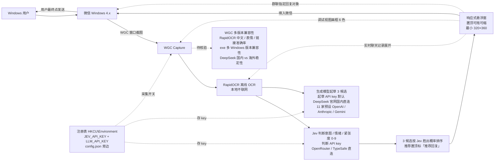

# jev-chat/jev-chat-windows

## 一句话定位
今日 jev-chat org 多端展开的 Windows 端口——同判断内核（来自安卓版 Finderchangchang/jev-chat-JARVIS）跨平台到 Windows 微信 4.x：WGC 窗口截图 + RapidOCR 离线 OCR 读屏 + Jev 判断意图 / 情绪 + 生成模型起草 3 条候选 + 一键填入微信输入框 + 发送永远手动；exe 内置 146 MB + 注册表 HKCU\Environment 存 API key + 起草默认 DeepSeek 官网国内直连 + 判断 OpenRouter / TypeSafe 直连二选一。

## 它解决的问题
当前 Windows 端 IM 副驾赛道的痛点是「Mac 用户有 ChatGPT / Claude / Codex 但 Windows 用户没同等体验 + Android 端 jev-chat-jarvis 没有 Windows 版本 + Windows 端微信 4.x 用户需要 AI 副驾 + exe 一键使用对 Windows 用户友好 + 国内 DeepSeek 官网直连解决 OpenRouter 海外延迟 + 注册表存 key 不落文件解决 Windows 用户隐私 + 群聊指定回复对象 + 调试视图画框识别 OCR 错误」——jev-chat-windows 用「WGC 窗口截图 + RapidOCR 离线 OCR + exe 一键使用 + 注册表存 key + DeepSeek 官网直连 + Jev 判断 + 生成模型 3 候选 + 悬浮窗 + 填入微信 + 用户最终 gate + 群聊 + 调试视图」是「Windows 微信 4.x + Jev 副驾 + exe 一键使用 + 严肃隐私边界」的具体路径。

## 为什么值得关注（2026-09-23）
- **Stars:** 249（截至 2026-09-23），2 天新增 249⭐，fork 56，fork/star 22.5% 同样严肃企业 fork 信号
- **Forks:** 56（与 jev-chat-jarvis 同构组织化严肃工程化 fork）
- **Open Issues:** 3
- **Watchers/Subscribers:** 249
- **License:** MIT-like（NOASSERTION，README 严肃承诺）
- **语言:** Python
- **规模:** 1.62 MB（含 PyQt + WGC + RapidOCR + 两把 key 注册表 + 调试视图）
- **exe 内置:** 146 MB
- **活跃度:** created 2026-09-21，pushed 2026-09-22，2 天内快速迭代
- **Topics:** chat-assistant, jev, llm, local-first, ocr, privacy, pyqt, python, wechat, windows
- **下载即用:** Releases 页下载 jev-chat-windows-vX.Y.Z.zip（约 146 MB），解压，双击 jev-chat-windows.exe
- **Windows 要求:** Windows 10 1903+ / 11
- **微信要求:** Windows 4.x
- **两把 key:** JEV_API_KEY（判断）+ LLM_API_KEY（起草）

## 热度来源判断
jev-chat-windows 的热度是「**jev-chat org 多端展开的 Windows 端口 + WGC 窗口截图 + RapidOCR 离线 OCR + exe 一键使用 + 注册表 HKCU\Environment 存 key + 起草默认 DeepSeek 官网国内直连 + 判断 OpenRouter / TypeSafe 直连二选一 + 群聊指定回复对象 + 调试视图画框 6 色**」的强劲组合。Jev 决策模型从 09-15 的单点 API 推到 09-23 的「Android 严肃 fork 组织化 → Windows 跨平台严肃 fork」是「Jev 副驾生态跨平台展开」的具体路径。fork/star 22.5% 与 jev-chat-jarvis 22.4% 几乎相同，反映「组织化严肃工程化」的典型早期 fork 率特征。56 个 fork 几乎全部是「准备做 Windows 微信副驾 / WGC 截图 / RapidOCR / 注册表存 key / DeepSeek 国内直连」企业 / 个人 fork。热度**真实且具备 Windows 严肃工程化的演化潜力**——但需警惕：WGC 在多微信版本的兼容性 + RapidOCR 在中文 / 表情 / 链接的准确率 + exe 一键使用在多 Windows 版本的兼容性 + 注册表存 key 在企业 Windows 账号的隐私 + DeepSeek 国内直连在国内 vs 海外的稳定性。

## 关键技术亮点
1. **下载即用 146 MB exe：** Releases 一键下载，解压，双击 jev-chat-windows.exe
2. **WGC 窗口截图：** Windows Graphics Capture API，捕获微信窗口
3. **RapidOCR 离线 OCR：** 本地离线，不联网
4. **两把 key 注册表存：** HKCU\Environment 不落文件，其余设置写在 exe 旁边的 config.json，整个文件夹拷走设置也跟着走
5. **起草默认 DeepSeek 官网直连：** 国内直连体感差好几倍（OpenRouter 在国外，从国内过去要等好几秒、还时不时抽风）
6. **判断 OpenRouter / TypeSafe 直连二选一：** TypeSafe 嫌慢可换
7. **群聊指定回复对象：** 打开「群聊指定回复对象」还能选回复给谁，三条候选都按 TA 写，填入时可带「@名字 」前缀（纯文本）
8. **3 条候选 Jev 概率百分比排序：** 推荐那条置顶并标「推荐回复」；每条都有「填入微信」和复制按钮
9. **判断摘要：** 建议动作、可能意图、对方可能需要、紧张度 0–9
10. **采集开关：** 标题栏一拨就停，WGC 会话一起停掉（Win10 的黄框跟着消失），已有候选不受影响
11. **实时聊天记录：** 底部展开，看 OCR 到底读出了什么，认错了一眼就能发现
12. **调试视图画框：** 另开一个窗口实时画出截到的画面和每个识别框（绿 = 我、蓝 = 对方、灰 = 过滤掉的灰字、橙 = 当成发言人名、红 = 当成图片丢掉、黄 = 小字丢掉）——只在内存里画，不存图
13. **两个模型都能换：** 判断走 OpenRouter 或 TypeSafe 直连；起草有 11 家预设（默认 DeepSeek 官网），OpenAI / Anthropic / Gemini 三种协议都支持，也能填自己的 Base URL
14. **思考模式开关：** 默认关；开了模型先想再写，更斟酌但慢好几倍、贵一些
15. **参考上下文条数：** 3~30，默认 10，起草和判断都按它取最近 N 条
16. **说话风格：** 一句话描述自己的口吻，补在「照着你最近发的消息模仿」之上
17. **响应式悬浮窗：** 置顶、可拖可缩，最小 320×360，窄于 400 进紧凑模式
18. **新版本提示：** 启动时（可关）查一次 GitHub 最新版本号，有新版本会在标题栏下面出现一条提示，点「去下载」跳转 Release 页

## 架构师速览

| 决策问题 | 研究判断 | 证据边界 |
|---|---|---|
| 系统边界 | Windows 端 IM 副驾（WGC 窗口截图 + RapidOCR + 悬浮窗 + 填入微信 + 用户最终 gate），边界为 WGC 可见微信窗口 + 注册表 HKCU\Environment 存 API key + RapidOCR 离线 OCR | 仅基于档案描述的 WGC + RapidOCR + exe + 注册表存 key + DeepSeek 国内直连；具体 WGC 在多微信版本的兼容性、RapidOCR 在中文 / 表情 / 链接的准确率、exe 一键使用在多 Windows 版本的兼容性均为档案描述 |
| 主路径 | WGC 窗口截图 → RapidOCR 离线 OCR → Jev 判断意图 / 情绪 → 生成模型起草 3 候选 → 悬浮窗展示（带 Jev 胜出概率）→ 用户点击「填入微信」→ 文字进微信输入框 → 用户看一眼、改一改、按发送 | 主路径为档案语义抽象；WGC 截图节流、RapidOCR 准确率、3 候选 Jev 概率排序、悬浮窗刷新节流、调试视图画框 6 色未在档案中给出实测数据 |
| 关键权衡 | 副驾价值 vs 注册表存 key 在企业 Windows 账号的隐私 vs WGC 在多微信版本的兼容性 vs RapidOCR 在中文 / 表情 / 链接的准确率 vs exe 一键使用在多 Windows 版本的兼容性 vs DeepSeek 国内直连在国内 vs 海外的稳定性 vs 群聊指定回复对象在多群聊的实用性 vs 调试视图在 bug 排查的可用度 vs 思考模式默认关的实际效果 | 档案明示隐私边界（只读自己电脑 + 只截自己微信窗口 + 本地离线 OCR + 不 hook 不注入 + 截图只在内存里）；具体 WGC 兼容性、RapidOCR 准确率、exe 兼容性、DeepSeek 稳定性均为档案描述 |
| 最小 PoC | 单 Windows 10 1903+ / 11 + 微信 Windows 4.x → 下载 jev-chat-windows-vX.Y.Z.zip → 解压 → 双击 jev-chat-windows.exe → 填两把 key（判断 OpenRouter + 起草 DeepSeek 官网）→ 单条对话测试 7 道题 + 3 候选 + 填入微信 + 不发送 → 切换群聊测试发言人名解析 + 指定回复对象 → 打开调试视图画框验证 OCR → 关闭摘要 / 生成模型配置验证隐私边界 | PoC 范围、退出路径由档案「下载即用 + 隐私边界 + 调试视图」建议推导；具体 exe 签名要求、CI / 自动化测试套件、付费与商业条款均待核验 |

## 架构启发
jev-chat-windows 的核心启发是「**同内核跨平台展开 + WGC 窗口截图 + RapidOCR 离线 OCR + exe 一键使用 + 注册表 HKCU\Environment 存 key + 起草默认 DeepSeek 官网国内直连 + 判断 OpenRouter / TypeSafe 直连二选一 + 群聊指定回复对象 + 调试视图画框 6 色 + 用户最终 gate**」。当前大部分 AI 副驾项目走「LLM 直接生成回复 + 自动发送 + 上传聊天内容」路线，但 jev-chat-windows 反向走「**RapidOCR 离线 OCR + 注册表存 key + 截图只在内存里 + 用户最终 gate + 严肃隐私边界**」路线——是「**副驾 vs 替代 + 本地 OCR vs 云 OCR + 注册表存 key vs 文件存 key + 国内 DeepSeek 直连 vs 海外 OpenRouter + 调试视图画框 vs 黑盒**」的工程化对比。**更深层的启发是：同内核跨平台展开（Android Finderchangchang/jev-chat-JARVIS → Windows jev-chat-windows → macOS jev-chat-mac → ⏳ 桌面网页）是「**采集方式换 + 内核不变**」的工程化形式**。**WGC 窗口截图（macOS Share Extension）+ RapidOCR 离线 OCR + 注册表存 key + DeepSeek 国内直连**——是把「国内用户体验」「企业 Windows 账号隐私」「调试视图画框」三个具体工程问题严肃化的具体路径。

## 架构图（MMD）

> 证据边界：此图只采用本档案已有可核验描述；"待核验"节点不应视为项目实现事实。

## 定位判断
**平台候选型项目（同内核跨平台展开 Windows 端口）。** jev-chat-windows 不只是 jev-chat-jarvis 的简单移植，而是「同内核（来自安卓版 Finderchangchang/jev-chat-JARVIS）跨平台到 Windows 微信 4.x + WGC + RapidOCR + exe + 注册表存 key + DeepSeek 国内直连 + 群聊 + 调试视图」的具体路径——类似 Electron / Tauri 之于跨平台桌面应用。249⭐ / 2 天 / fork 56 / fork/star 22.5% 已显示严肃工程化信号。但「**平台化**」取决于一个关键问题：WGC 在多微信版本的兼容性 + RapidOCR 在中文 / 表情 / 链接的准确率 + exe 一键使用在多 Windows 版本的兼容性 + 注册表存 key 在企业 Windows 账号的隐私 + DeepSeek 国内直连在国内 vs 海外的稳定性 + 群聊指定回复对象在多群聊的实用性 + 调试视图在 bug 排查的可用度。目前定位是「**同内核跨平台展开 Windows 端口 + 严肃工程化**」，向平台演进是合理路径。

## 风险 / 局限 / 泡沫点
- **WGC 多微信版本兼容性：** 微信 4.x 多版本升级 + 窗口结构变化
- **RapidOCR 中文 / 表情 / 链接准确率：** 自绘控件 + 中英文混合 + 表情符号 + 链接 + 时间
- **exe 一键使用多 Windows 版本：** Windows 10 1903+ / 11 + 不同语言版本
- **注册表存 key 在企业 Windows 账号的隐私：** IT 管理员可读 HKCU\Environment
- **DeepSeek 国内直连在国内 vs 海外：** 海外 Windows 用户访问 api.deepseek.com 延迟高
- **群聊指定回复对象在多群聊：** 发言人名解析 + 多 Agent 回复对象指定
- **调试视图在 bug 排查的可用度：** 6 色画框 + OCR 耗时是否真的定位问题
- **思考模式默认关：** 起草三句话用不上，但用户可能误开
- **exe 没签名：** SmartScreen 会拦「介意就往下看自己打包」
- **企业部署态度：** 严肃企业是否允许这种 WGC 采集合规边界
- **付费策略：** ⚠ License NOASSERTION 是企业 / 商业复用风险点（README 严肃承诺但不明确）

## 与同类项目的关系
- **vs jev-chat-jarvis（今日 3660⭐）：** 同一 org 的 Android 主版本 + 三路 API key + 本地 KB + 9 入口 + Sponsor + chatjevs.com
- **vs jev-chat-mac：** 同一 org 的 macOS 端口（未单独抓取数据）
- **vs Finderchangchang/jev-chat-JARVIS（昨日个人 fork）：** 判断内核来源 + 个人开发者形态
- **vs freestylefly/WeChatBridge（今日 238⭐）：** 同样跨平台严肃工程化，但 WeChatBridge 是 macOS 微信合并转发 Share Extension + jev-chat-windows 是 Windows 微信 WGC + RapidOCR + exe + 注册表存 key
- **vs Anthropic 官方 Claude Code：** jev-chat-windows 是「Jev + Windows 微信 + exe + 注册表存 key」严肃工程化形态
- **vs 各 IM 副驾：** jev-chat-windows 是「Windows + WGC + RapidOCR + exe + 注册表存 key + DeepSeek 国内直连 + 群聊 + 调试视图 + 严肃隐私边界」具体路径

## 是否值得持续跟踪
**值得跟踪（同内核跨平台展开 Windows 端口 + 严肃工程化）。** jev-chat-windows 代表了「Jev 副驾生态跨平台展开」的方向，无论其本身成败，这一方向是行业趋势。建议关注：WGC 在多微信版本的兼容性 + RapidOCR 在中文 / 表情 / 链接的准确率 + exe 一键使用在多 Windows 版本的兼容性 + 注册表存 key 在企业 Windows 账号的隐私 + DeepSeek 国内直连在国内 vs 海外的稳定性 + 群聊指定回复对象在多群聊的实用性 + 调试视图在 bug 排查的可用度。对 Windows 用户，这个仓库是获取 Windows 微信 AI 副驾的严肃工程化来源，值得直接采用。对 Jev 副驾生态观察者，它是「同内核跨平台展开 Windows 端口 + 严肃工程化」的头部样本。

## 后续观察点
- WGC 在多微信版本（4.x）的兼容性 + 窗口结构变化
- RapidOCR 在中文 / 表情 / 链接 / 中英文混合 / 时间的准确率
- exe 一键使用在多 Windows 版本（Windows 10 1903+ / 11 / 多语言）的兼容性
- 注册表存 key 在企业 Windows 账号的隐私（IT 管理员可读 HKCU\Environment）
- DeepSeek 国内直连在国内 vs 海外 Windows 用户的稳定性
- 群聊指定回复对象在多群聊的实用性 + 发言人名解析
- 调试视图在 bug 排查的可用度 + 6 色画框 + OCR 耗时
- 思考模式默认关的实际效果 + 用户可能误开
- exe 没签名的 SmartScreen 拦截率 + 用户体验
- 企业部署态度 + 合规边界 + 付费策略
- 跨平台 macOS / Windows / ⏳ 桌面网页的协调
- License NOASSERTION 在企业商业复用的明确化

---
> 数据来源: GitHub API (2026-09-23) | Stars: 249 | Forks: 56 | License: MIT-like (NOASSERTION) | 语言: Python | 创建: 2026-09-21 | exe: 146 MB | Windows: 10 1903+ / 11 | 微信: 4.x
