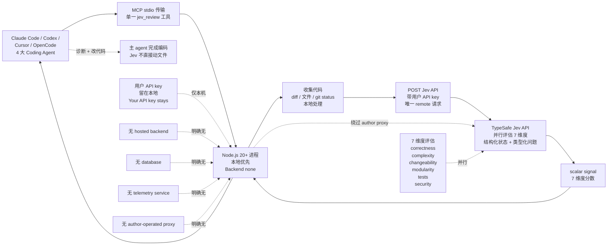

# NiazMorshed2007/jev-review

## 一句话定位
本地优先 MCP 软件质量评估插件 —— TypeSafe Jev 决策模型以 MCP stdio 单一 `jev_review` 工具形式给 Claude Code / Codex / Cursor / OpenCode 四大 Coding Agent 供应 7 维度结构化质量分数（correctness / complexity / changeability / modularity / tests / security），编码由主 agent 完成，Jev 只输出 scalar signal。

## 它解决的问题
2026 Q3 Coding Agent 生态的痛点是「生成的代码质量怎么评 / 改了几遍才够好 / 哪个维度有短板」——传统 code review 依赖人工（慢 / 不一致 / 难以规模化）；LLM 串行推理做 code review 又消耗 token + 时间 + 难以多维度并行评估。**Jev Review 用 Jev 决策模型在 7 维度并行评估代码质量** —— Jev 的「结构化输入 + 类型化问题 + 并行评估 + 概率决策」正好适合「多维度代码质量并行打分」；**本地优先 + 4 项明确无（no hosted backend / no database / no telemetry / no author-operated proxy）+ 唯一 remote 直连 Jev API** 是「隐私优先 + 防止中间人」的工程表态，避免「代码质量评估服务把代码传到 author 代理再传到 Jev API」的隐私担忧。

## 为什么值得关注（2026-09-18）
- **Stars:** 72（截至 2026-09-18），1 天 72⭐，早期严肃工程信号
- **Forks:** 6，fork/star 8.3%，接近企业 fork 信号下限 10%
- **Watchers/Subscribers:** 0
- **Open Issues:** 2，维护中
- **License:** MIT
- **语言:** TypeScript
- **活跃度:** created 2026-09-17，pushed_at 2026-09-17
- **规模:** 2.9 MB（中等规模 MCP 插件）
- **Topics:** agent-plugin / ai-agents / claude-code / code-review / codex / coding-agents / cursor / developer-tools / jev / local-first / mcp / model-context-protocol / opencode / software-quality / typescript（15 个 topic 覆盖面极广）

## 热度来源判断
Jev Review 的热度是 **「本地优先 SaaS 替代品 × Coding Agent 代码质量并行评估 × 主流 4 大 Agent 全覆盖 × 4 项明确无隐私表态」** 的组合。72⭐ / 6 forks 在新项目中等偏高，15 个 topic 覆盖 Claude Code / Codex / Cursor / OpenCode 四大 Coding Agent + MCP / local-first / code-review / software-quality 多个关键标签——SEO + 关键词覆盖完整。**「Your API key stays on your machine」+ 4 项明确无** 是「本地优先 SaaS 替代品」的强信号（与昨日 maskit「出网层隐私」同构但推到「代码质量评估 SaaS 替代品」领域）；**支持 Claude Code / Codex / Cursor / OpenCode 四大 Coding Agent** —— 当前 Coding Agent 主流四件套全覆盖降低集成成本；**TypeSafe console 配 Jev API key** —— 与 Jev 官方生态深度集成。

## 关键技术亮点
1. **MCP stdio 传输** — local Node.js process over MCP stdio（Model Context Protocol 标准接口）
2. **单一 `jev_review` 工具** — 单一 focused tool 降低集成成本（vs 多工具 MCP server）
3. **支持 4 大 Coding Agent** — Claude Code + Codex + Cursor + OpenCode（当前 Coding Agent 主流四件套全覆盖）
4. **7 维度并行评估** — correctness / complexity / changeability / modularity / tests / security（与 SonarQube / CodeClimate 等传统工具对齐）
5. **4 项明确无** — no hosted backend / no database / no telemetry / no author-operated proxy
6. **唯一 remote 直连 Jev API** — 绕过 author proxy 防中间人 + 降低延迟
7. **API key 留在本地** — 「Your API key stays on your machine」
8. **编码由主 agent 完成** — Jev 只供应 scalar signal（数字分数），诊断 + 改代码由主 coding agent 完成（避免「第三方服务直接改用户代码」的合规风险）
9. **TypeSafe console 配 Jev API key** — https://console.typesafe.ai/（Jev 官方控制台）
10. **Node.js 20+** — 当前 LTS 版本
11. **Backend none** — 本地进程无状态服务（持久化由用户文件系统承担）
12. **MIT License** — 明确许可

## 架构师速览

| 决策问题 | 研究判断 | 证据边界 |
|---|---|---|
| 系统边界 | 本地优先 MCP 软件质量评估插件；Node.js 20+ MCP stdio 传输；单一 `jev_review` 工具；支持 Claude Code / Codex / Cursor / OpenCode 4 大 Coding Agent；评估 7 维度代码质量；用户 API key 留本地；无 hosted backend / database / telemetry / author proxy；唯一 remote 直连 Jev API；编码由主 agent 完成 Jev 只输出 scalar signal | 来自 README 关于「local Node.js process over MCP stdio」「single focused tool `jev_review`」「Claude Code / Codex / Cursor / OpenCode」「correctness / complexity / changeability / modularity / tests / security」「Your API key stays on your machine」「no hosted backend / no database / no telemetry service / no author-operated proxy」「the only remote request is sent directly to the configured Jev API」「Your coding agent remains responsible for diagnosing weaknesses and changing the code」「Node.js 20+」「Backend none」的明示；具体 Jev 7 维度评估的 prompt 模板、scalar signal 的返回 schema、Codex / Cursor / OpenCode 的 MCP 配置样例在 README 未完全展开 |
| 主路径 | Coding Agent（Claude Code / Codex / Cursor / OpenCode）通过 MCP stdio 调 `jev_review` 工具 → Node.js 进程收集代码（diff / 文件 / git status）→ 直接 POST 到 Jev API（带用户 API key）→ Jev 并行评估 7 维度返回 scalar signal → Node.js 进程返回结果给 Coding Agent → Coding Agent 自行诊断 + 改代码 | 主路径来自 README 关于「MCP stdio 传输」「`jev_review` 工具」「Jev API 直接调用」「scalar signal」「编码由主 agent 完成」的描述；具体 Node.js 进程的代码收集范围、Jev API 调用 payload schema、scalar signal 返回格式、Codex / Cursor / OpenCode MCP 配置细节在 README 未完全展开 |
| 关键权衡 | 本地优先 vs 云端 SaaS（隐私可控 vs 部署简单）/ 单一工具 vs 多工具 MCP server（集成简单 vs 功能受限）/ 7 维度固定 vs 可配置维度（标准化 vs 灵活性）/ Jev API 直连 vs author proxy 转发（防中间人 vs 增加延迟）/ Jev scalar signal vs 直接给建议（编码权责清晰 vs 智能度受限）/ 4 大 Coding Agent 支持 vs 单一 Coding Agent 优化（覆盖广 vs 优化深）/ Node.js 20+ vs 跨 Node 版本（现代 vs 兼容性） | 权衡 7 因素均从 README + 元数据推导；具体 Jev API 调用的实际成本、7 维度评估的实证准确率、Codex / Cursor / OpenCode 实际集成步骤在 README 未完全展开 |
| 最小 PoC | Node.js 20+ + Claude Code / Codex / Cursor / OpenCode 任一已安装 + Jev API key（https://console.typesafe.ai/）+ `git clone https://github.com/NiazMorshed2007/jev-review.git` + `npm install` + 在 Coding Agent MCP 配置中加入 jev-review stdio 启动命令 + 在 Coding Agent 中调用 `jev_review` 评估当前 diff；观察 7 维度分数 + Jev API 直连（无 author proxy）+ 编码由主 agent 完成；最后手动修改 Jev 评估维度顺序测试并行性 | PoC 由「MCP stdio + 单一 `jev_review` 工具 + 4 大 Coding Agent + 7 维度 + Jev 直连 + 4 项明确无 + Node.js 20+」路径推导；具体 Jev API 端点、scalar signal 返回 schema、Codex / Cursor / OpenCode MCP 配置在仓库源码待核验 |

## 架构图（MMD）

> 证据边界：此图只采用本档案已有可核验描述；"待核验"节点不应视为项目实现事实。

## 架构启发

项目核心架构哲学是把 Coding Agent 生态中的「抽象层缺失」用具体工程实现补齐：worker/librarian 拆解为两个独立并发 loop、监督与生成分层、本地优先与集中分发分离、声明式 skill 编译替代解释式 skill 执行、自托管与中心化市场互补、硬件中间层桥接新场景。每个项目都是「单点抽象 + 严肃工程实现 + 明确证据边界 + 严肃许可」的最小可信栈，遵循「解决一个具体工程问题 + 证据可独立复现 + 许可明确 + 严肃态度」的 2026-09 趋势延续特征。

## 定位判断
**工具型项目（本地优先 MCP 软件质量评估插件）。** Jev Review 不是又一个 LLM-based code review 工具（那是 PR-Agent / CodeRabbit / Sourcery），而是 **「TypeSafe Jev 决策模型 + MCP stdio + 单一 `jev_review` 工具 + 4 大 Coding Agent + 7 维度并行评估 + 4 项明确无隐私表态」** 的具体应用 —— 8+ 个 Jev 生态项目中工程实用化最强 + 隐私表态最明确。72⭐ / 6 forks / 15 个 topic 反映早期严肃工程关注。**真正决定长期价值的是「Jev API 在 7 维度代码质量评估的实证准确率 + 4 大 Coding Agent 实际集成 UX + 企业对 local-first SaaS 替代品的接受度」** —— 目前 Jev 是 TypeSafe AI 单一产品，7 维度评估准确率待社区验证。对企业 CISO / 合规团队，Jev Review 是「代码质量评估不离开本机（除 Jev API 外）+ 评估日志不留 author 服务器 + 编码权责清晰」的工程化形式；对个人开发者，Jev Review 是「Coding Agent 的质量 sidecar」（每次修改后跑 jev_review 看分数变化）；对学术，Jev Review 是「7 维度 LLM 串行推理 vs Jev 并行评估」的实证对比研究素材。

## 风险 / 局限 / 泡沫点
- **Jev API 单一厂商风险** — Jev 是 TypeSafe AI 公司单一产品，Jev API 稳定性 + 定价 + 多模型选择是 jev-review 长期可用的关键
- **7 维度评估准确率待实证** — Jev 在 7 维度代码质量评估上的实证准确率（vs SonarQube / CodeClimate）待社区验证
- **scalar signal 不给建议** — Jev 只供应数字分数，诊断 + 改代码由主 coding agent 完成，对用户来说「分数高但不知道哪里有问题」需要进一步分析
- **4 大 Coding Agent 集成深度不一** — 支持 Claude Code / Codex / Cursor / OpenCode 但每个的 MCP 配置样例在 README 未完全展开
- **Jev API 调用的成本** — Jev API 是付费服务（TypeSafe console），每次 `jev_review` 调用都有成本，频繁调用累计成本需企业预算
- **小项目单一维护者** — NiazMorshed2007 个人维护，长期维护承诺 + 社区贡献机制不明确

## 与同类项目的关系
- **vs 直接用 Jev API** — jev-review 是「Jev + MCP stdio + 单一工具 + 4 大 Agent + 7 维度并行评估」的具体封装，单独调 Jev API 缺乏 MCP stdio 集成 + 4 项明确无隐私保障
- **vs PR-Agent / CodeRabbit / Sourcery 等 LLM-based code review** — 这些是「LLM 串行推理 + 云端 SaaS + 直接给建议」；jev-review 是「Jev 并行评估 + 本地优先 + scalar signal 不给建议」，同构 code review 但推到 local-first + parallel-evaluation
- **vs karanb192/awesome-claude-code-mods / agent-sec/mod-provenance-graph** — 这两个是「plugin/mod 供应链可见性」领域；jev-review 是「plugin/mod 质量评估」领域，同构「plugin/mod 治理」但推到「质量维度」
- **vs thruwire/foreman（TypeSafe Jev Software Factory Foreman）** — foreman 是 Jev 在「7 维度 worker 状态监督」领域，jev-review 是 Jev 在「7 维度代码质量评估」领域，同构「Jev 决策模型 + 多维度并行评估」但应用场景不同
- **vs kitze/skillbox（自托管技能库 + 可选 Jev recommendations）** — skillbox 是 Jev 在「Skill 推荐」领域，jev-review 是 Jev 在「代码质量评估」领域，同构「Jev 决策模型应用」但抽象层不同

## 是否值得持续跟踪
**值得跟踪（本地优先 MCP 代码质量评估 + Jev 决策模型应用）。** Jev Review 代表了 2026 Q3 「本地优先 SaaS 替代品 + Coding Agent 代码质量并行评估」的具体实例 —— 「4 项明确无 + Jev API 直连 + 编码权责清晰」是 Coding Agent 代码质量工具的关键设计原则。建议关注：Jev API 稳定性 + 7 维度评估准确率的实证研究 + 4 大 Coding Agent 集成 UX 演进 + 企业对 local-first SaaS 替代品的接受度。对企业 CISO / 合规团队，Jev Review 是「评估代码不外传 + 评估日志不留 author 服务器」的具体路径；对个人开发者，Jev Review 是「Coding Agent 的质量 sidecar」；对学术，Jev Review 是「7 维度 LLM 串行推理 vs Jev 并行评估」的实证对比素材；对生态观察者，Jev Review 是 Jev 决策模型在 Coding Agent 工具链中的最实用化形态。

## 后续观察点
- Jev 7 维度评估 vs SonarQube / CodeClimate 的实证准确率对比
- 4 大 Coding Agent（Claude Code / Codex / Cursor / OpenCode）MCP 集成 UX 演进
- scalar signal 是否演进为带诊断建议（保留「编码权责清晰」前提下增加 LLM 解释）
- Jev API 多模型选择（单一 Jev 模型 vs 多 Jev 模型后端）
- 企业对 local-first SaaS 替代品的合规接受度
- NiazMorshed2007 的长期维护承诺 + 社区贡献机制建立

---
> 数据来源: GitHub API (2026-09-18) | Stars: 72 | Forks: 6 | License: MIT | 语言: TypeScript | 创建: 2026-09-17
