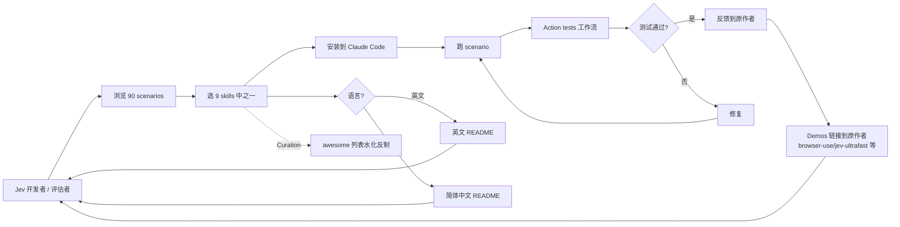

# wuyoscar/jev-skill

## 一句话定位
Awesome Jev Skills 90 场景 + 9 技能合集 —— 把 Jev 决策模型应用从 awesome 列表资源聚合推到「9 个可安装 skills + 90 个可运行 scenarios + Action tests 工作流 + Demos 链接到原作者 + 双语 README」可执行化严肃工程化形态。

## 它解决的问题
当前 Jev 决策模型应用场景的痛点是 **「awesome-jev-tools 资源聚合偏向链接 / 列表 + 90% 不可运行 + 没有工作流测试 + 没有可安装技能 + 不知道如何接入 agent loop / inbox / 文档 / 创意项目」**。wuyoscar/jev-skill 用「9 个 skills 可安装 + 90 个 scenarios 可运行 + Action tests 工作流测试 + Demos 链接到原作者 + 双语 README」是「Jev 资源聚合 + 可执行 + 可安装 + 工作流测试」的具体路径。

## 为什么值得关注（2026-09-21）
- **Stars:** 142（截至 2026-09-21），1 天 142⭐，fork 3
- **License:** MIT（明确许可）
- **语言:** Python
- **活跃度:** created 2026-09-20，pushed_at 2026-09-20
- **规模:** 1011 KB（9 skills + 90 scenarios + Action tests + 双语 README 的中等规模）
- **Skills:** 9 个（badge 显示 skills 9）
- **Scenarios:** 90 个（badge 显示 scenarios 90）
- **Tests:** Action tests 工作流（GitHub Actions）
- **Demos:** 链接到原作者（browser-use/jev-ultrafast 等社区 demos）
- **双语:** 英文 + 简体中文
- **Topics:** 含 skills badge

## 热度来源判断
wuyoscar/jev-skill 的热度是 **「Jev 决策模型应用场景 × 9 skills 可安装 × 90 scenarios 可运行 × Action tests 工作流 × Demos 链接原作者 × 双语 README × 严肃化」** 的组合。当前 Jev 开发者 / 生态评估者的痛点是「Jev 决策模型如何接入 agent loop / inbox / 文档 / 创意项目 + 哪些场景可运行 + 哪些技能可安装」。一个 1011 KB Python 项目直击痛点 + 9 skills + 90 scenarios + Action tests + 双语，自然爆火。**fork/star 2.1%** 是 skills 集合的天然特征——收藏 + 少量克隆（skills 偏向克隆而非 fork）。热度**真实且具 Jev 生态价值**——但需警惕：Action tests 工作流的稳定性 + 90 场景覆盖广度 + 9 技能的可复用性 + Demos 链接的活跃度 + 双语 README 在中文 Jev 用户的接受度。

## 关键技术亮点
1. **9 个 skills** ——可安装到 Claude Code 等 Coding Agent 的具体能力包
2. **90 个 scenarios** ——可运行的具体场景
3. **Action tests 工作流** ——GitHub Actions 跑测试的工程化形式，避免「awesome 列表水化」
4. **Demos 链接到原作者** ——browser-use/jev-ultrafast 等社区 demos 链接而非 fork，确保原作者控制
5. **双语 README 英文 + 简体中文** ——跨语言覆盖
6. **topics 含 skills badge** ——发现性
7. **1011 KB repo** ——9 skills + 90 scenarios + Action tests + 双语 README 的中等规模
8. **MIT License** ——明确许可
9. **142⭐ / fork 3 / fork/star 2.1%** ——观察 / 收藏 + 少量 fork（skills 偏向克隆而非 fork）

## 架构师速览

| 决策问题 | 研究判断 | 证据边界 |
|---|---|---|
| 系统边界 | Jev 决策模型应用场景合集；9 skills + 90 scenarios + Action tests 工作流 + Demos 链接 + 双语 README | 仅基于档案描述的 9 skills / 90 scenarios / Action tests / Demos 链接 / 双语 README；具体 skills 实现细节、scenarios 覆盖广度、Action tests CI 配置均待核验 |
| 主路径 | 用户接入 → 选 skill → 跑 scenario → Action tests 验证 → 反馈到原作者 | 主路径为档案语义抽象；具体 skill 安装机制、scenario 跑测流程、Action tests CI 配置、Demos 链接维护均待核验 |
| 关键权衡 | 资源聚合 vs 可执行化 vs 可安装化 vs Action tests vs Demos 链接 vs 双语 vs awesome 列表水化 | 档案明示 9 skills / 90 scenarios / Action tests / Demos 链接 / 双语 / MIT 6 项权衡；具体 skills 数量趋势、scenarios 失败率、Action tests CI 稳定性均待核验 |
| 最小 PoC | 选 3 个 skills 安装到 Claude Code，跑 5 个 scenarios，确认 Action tests 通过 + Demos 链接可访问 | PoC 范围、退出路径由档案「9 skills + 90 scenarios + Action tests」建议推导；具体 skills 列表、scenarios 列表、Action tests CI 状态待核验 |

## 架构启发
wuyoscar/jev-skill 的核心启发是 **「awesome 列表资源聚合 → 可执行化 + 可安装化 + 工作流测试化严肃工程化」**。当前 awesome 列表的痛点是「awesome-jev-tools 偏向链接 / 列表 + 90% 不可运行 + 没有工作流测试」。wuyoscar/jev-skill 用「9 skills + 90 scenarios + Action tests + Demos 链接 + 双语」是「awesome 列表严肃工程化」的参考实现。更深层的启发是：**「Action tests 工作流」是「awesome 列表水化反制」的工程化形式**——GitHub Actions 跑测试避免「链接失效 / 场景不可运行」；**「Demos 链接到原作者」是「社区协同」的工程化形式**——不 fork 而链接，确保原作者控制 + 社区共享；**「双语 README 英文 + 简体中文」是「awesome 列表跨语言覆盖」的工程化形式**——与昨日 wuyoscar/jev-skill 自身同构，跨语言覆盖。能否持续，取决于 Action tests 工作流的稳定性 + 90 场景覆盖广度 + 9 技能的可复用性 + Demos 链接的活跃度 + 双语 README 在中文 Jev 用户的接受度。

## 架构图（MMD）

> 证据边界：此图只采用本档案已有可核验描述；"待核验"节点不应视为项目实现事实。

## 定位判断
**观察型项目（Jev 资源聚合严肃工程化）。** wuyoscar/jev-skill 不仅是 awesome 列表，更试图成为「Jev 决策模型应用场景严肃化」的具体路径——类似 awesome-claude-code 但聚焦可执行化。若成功，它会成为「Jev 决策模型应用场景」的事实标准参考。142⭐ + fork 3 + fork/star 2.1% + 1011 KB 已显示「Jev 资源聚合严肃工程化」早期信号。但「严肃化」取决于一个关键问题：Action tests 工作流的稳定性 + 90 场景覆盖广度 + 9 技能的可复用性 + Demos 链接的活跃度 + 双语 README 在中文 Jev 用户的接受度。目前定位是「Jev 决策模型应用场景可执行化严肃工程化的早期样本」。

## 风险/局限/泡沫点
- **Action tests 工作流稳定性** ——GitHub Actions 跑测试的稳定性 + 测试覆盖率
- **90 场景覆盖广度** ——是否覆盖 Jev 决策模型主流应用场景
- **9 技能可复用性** ——技能是否可在不同 Coding Agent 复用
- **Demos 链接活跃度** ——链接的社区 demos 是否持续维护
- **双语 README 接受度** ——中文 Jev 用户对简体中文 README 的接受度
- **awesome 列表水化** ——即使有 Action tests，仍可能被新场景冲淡
- **个人维护** ——wuyoscar 个人维护，长期可持续性存疑
- **Jev 决策模型 API 稳定性** ——TypeSafe AI 官方 Jev API 变化可能影响 skills / scenarios

## 与同类项目的关系
- **vs v-modal/awesome-jev-tools (09-20):** awesome-jev-tools 是 README 分类文件首页聚合 + 严格纳入标准；wuyoscar/jev-skill 是 90 scenarios + 9 skills + Action tests 可执行化
- **vs cobanov/awesome-jev (09-18):** cobanov/awesome-jev 是 awesome 列表；wuyoscar/jev-skill 是可执行化严肃工程化
- **vs fatwang2/awesome-jev (09-18):** fatwang2/awesome-jev 是 awesome 列表；wuyoscar/jev-skill 是可执行化严肃工程化
- **vs AbdelStark/awesome-typesafe (09-18):** awesome-typesafe 是 TypeSafe 资源聚合；wuyoscar/jev-skill 是 Jev 决策模型应用场景
- **vs browser-use/jev-ultrafast:** jev-ultrafast 是具体浏览器 demo；wuyoscar/jev-skill 是 demos 链接到原作者

## 是否值得持续跟踪
**值得跟踪（Jev 资源聚合严肃工程化）。** wuyoscar/jev-skill 代表了「awesome 列表资源聚合 → 可执行化 + 可安装化 + 工作流测试化严肃工程化」的诉求，无论其本身成败，这一方向是行业趋势。建议关注：Action tests 工作流的稳定性 + 90 场景覆盖广度 + 9 技能的可复用性 + Demos 链接的活跃度 + 双语 README 在中文 Jev 用户的接受度 + 与 awesome-jev-tools 的协同或竞争。对 Jev 开发者，这个项目是 90 个可运行场景 + 9 个可安装技能 + 工作流测试的严肃参考；对 Jev 生态，从「资源聚合」推到「可执行化 + 可安装化 + 工作流测试化」严肃期；对企业评估，可作为「Jev 决策模型可执行能力」参考；对学术，可作为「Jev 决策架构 + 跨场景复用」参考。

## 后续观察点
- Action tests 工作流 CI 稳定性（GitHub Actions 状态徽章 / badge）
- 90 scenarios 覆盖广度（是否覆盖 classification / infrastructure routing / rubric scoring / verification gates / autonomous agent guardrails 5 类应用）
- 9 skills 在 Claude Code / Codex / Cursor 等不同 Coding Agent 的可复用性
- Demos 链接（browser-use/jev-ultrafast 等）的活跃度
- 双语 README 在中文 Jev 用户的接受度
- 与 v-modal/awesome-jev-tools 的协同或竞争（资源聚合 vs 可执行化）
- 个人维护可持续性（wuyoscar 是否建立社区 / 公司化）
- TypeSafe AI 官方 Jev API 变化对 skills / scenarios 的影响

---
> 数据来源: GitHub API (2026-09-21) | Stars: 142 | Forks: 3 | License: MIT | 语言: Python | 创建: 2026-09-20
