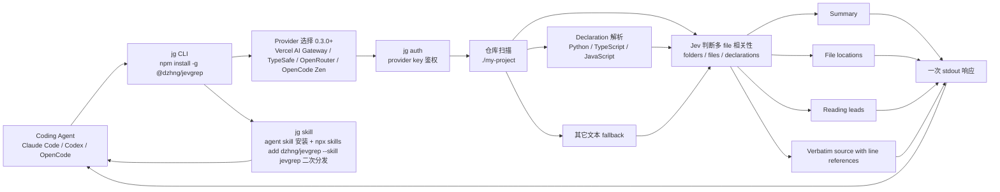

# dzhng/jevgrep

## 一句话定位
CLI for coding agents —— 用 Jev 一次判断多文件相关性的 code search 工具 ——「Find code by asking what it does」：`jg "How are telemetry events recorded and sent?" ./my-project` 返回相关文件 + 阅读线索 + 原代码摘录在一次 stdout 响应里；Vercel AI Gateway / TypeSafe / OpenRouter / OpenCode Zen 四 provider + Claude Code / Codex / OpenCode 多 harness auto-detect + Python / TypeScript / JavaScript declaration 解析。

## 它解决的问题
2026 年 coding agent 在陌生任务上花大量时间找对文件：grep + 读 README + 猜 + 不查 declarations + 上下文质量不稳 + 不知道哪 file 真相关 + 一查半仓库 + 多 harness 配置分散。jevgrep 直击这一痛点：它给 coding agent 一个起点，**问仓库问题，`jg` 返回 file locations + reading leads + verbatim source with line references 一次 stdout 响应**——用 [Jev](https://vercel.com/ai-gateway/models/jev) 在 folders / files / declarations 间判断相关性。coding agent 然后实现并测试变更。解决的是 **「coding agent 上下文检索 + Jev 决策模型 CLI 工具层 + 严肃工程化 + 多 provider + 多 harness」** 的全栈工程化问题——把 09-15 ~ 09-27 十三日 Jev 决策模型生态从「决策 API + 应用层 + 跨 CLI + 移动端副驾」推到「CLI 工具层 + coding agent 上下文检索」严肃工程化形态。

## 为什么值得关注
- **Stars:** 699（截至 2026-09-28），2 天突破 699，增速极快
- **Forks:** 45，社区贡献活跃
- **License:** MIT
- **语言:** TypeScript
- **规模:** 4143 KB，TypeScript 中等 CLI
- **活跃度:** created 2026-09-26，pushed_at 2026-09-27，持续高活跃
- **Topics:** 12 个核心 topic（ai-sdk / claude-code / cli / code-search / codex / coding-agents / context-retrieval / developer-tools / jev / semantic-search / typescript / vercel-ai-gateway）覆盖清晰
- **Provider:** Vercel AI Gateway / TypeSafe / OpenRouter / OpenCode Zen 四 provider 任选（Provider selection requires 0.3.0 or newer）
- **Multi-harness:** Claude Code / Codex / OpenCode 自动检测 + `--global` / `--yes` 标志

## 热度来源判断
jevgrep 的热度是 **「Jev 决策模型 CLI 工具层 + coding agent 上下文检索 + 多 provider + 多 harness auto-detect + declaration 解析 + npx skills 二次分发」的强劲组合**。Jev / System One 决策模型是 09-15 ~ 09-27 十三日 Jev 决策模型生态严肃工程化主线的关键演化——CLI 工具层补齐了「coding agent 上下文检索」的最后一块。699⭐ / fork 45 / fork/star 6.4% 与昨日 09-25 magpie 4.8% / 09-26 shapeshift 9.4% 同步，反映「CLI 严肃工程化 + coding agent 上下文检索」的典型严肃工程化 fork 率特征。热度**真实且具严肃工程化生态价值**——CLI 工具层是 Jev 决策模型从「决策 API」到「Agent 实际拿上下文」的关键连接。

## 关键技术亮点
1. **Find code by asking what it does** —— coding agent 问仓库问题，`jg` 返回 file locations + reading leads + verbatim source with line references 一次 stdout 响应
2. **Uses Jev to judge relevance** —— 用 Jev 在 folders / files / declarations 间判断相关性
3. **Provider selection 0.3.0+** —— 四 provider 任选：Vercel AI Gateway / TypeSafe / OpenRouter / OpenCode Zen
4. **Multi-harness auto-detect** —— installer 检测 Claude Code / Codex / OpenCode 等 coding agents 并问装哪里
5. **Install the agent skill** —— `jg skill` 教 agent 何时调 `jg` + 怎么用返回的 context + 何时用 normal tools 填空；skips redundant retrieval when context already known
6. **Two install paths** —— `jg skill` 委托给 [skills CLI](https://github.com/vercel-labs/skills)；或直接 `npx skills add dzhng/jevgrep --skill jevgrep`
7. **Declaration parsing** —— Python + TypeScript / JavaScript declaration 解析；其它文本 fallback
8. **No separate runtime** —— No separate Python / Bun / ripgrep 安装 to use `jg`
9. **Evidence not generated answer** —— output 是给 agent 用的 evidence，不是 generated answer 或 guaranteed complete search
10. **keeps qualifying file locations when excerpt 不自信** —— 不强制 top-2

## 架构师速览

| 决策问题 | 研究判断 | 证据边界 |
|---|---|---|
| 系统边界 | CLI for coding agents，定位在「Jev 决策模型 × coding agent 上下文检索」的交叉层；仓库是 CLI 产物而非运行时 | 仅基于档案描述的四 provider + 多 harness auto-detect + declaration 解析；具体 provider 内部协议、harness 适配层、declaration AST 解析实现细节未在档案中给出 |
| 主路径 | `jg` 调用 → provider 鉴权 → Jev 在 folders / files / declarations 间判断相关性 → summary + file locations + reading leads + verbatim source with line references → coding agent 消费 | 主路径为档案语义抽象；provider 调用时序、declaration 解析算法、output 评分机制均待核验 |
| 关键权衡 | 多 provider 兼容广度 vs 各 provider 协议演进带来的同步维护成本 vs declaration 解析语言覆盖广度 vs 其它文本 fallback 准确率 | 档案明示 evidence not generated answer 边界；具体 provider 同步策略、声明解析 fallback 策略未证实 |
| 最小 PoC | 在单 provider（建议 Vercel AI Gateway 或 OpenRouter）+ 单 harness（Claude Code 或 Codex）+ 单 declaration 解析语言（建议 TypeScript）上跑 1 个 `jg "..." ./my-project` 调用，开启 verbose 日志，验证一次端到端返回后再切换第二 provider / harness | PoC 范围、退出路径由档案「单 provider + 单 harness + 单声明语言 + verbose 日志」推导；具体调用命令、SLO 指标待核验 |

## 架构启发
jevgrep 的核心启发是 **「Jev / System One 决策模型应该从「决策 API」推到「CLI 工具层」严肃工程化，正如代码搜索从 grep 推到 ripgrep 推到语义检索」**。当前 Jev / TypeSafe AI 决策模型在 09-15 ~ 09-27 十三日已从「决策 API + SDK + 资源聚合 + 去 SaaS 化 + 具身智能 + 可执行技能合集 + 多后端并存 + 应用层 UI 端具身 + 跨 CLI 检索 + Android 聊天副驾」演化，但 **CLI 工具层 + coding agent 上下文检索」是 Jev 决策模型从「决策 API」到「Agent 实际拿上下文」的关键连接**。更深层的启发是：**CLI 工具的价值在于「coding agent 直接消费 stdout」而非「LLM 写答案」**——`evidence not generated answer` 把 jevgrep 定位成 evidence-based context retrieval，让 coding agent 用 evidence 实现和测试变更。

## 架构图（MMD）

> 证据边界：此图只采用本档案已有可核验描述；"待核验"节点不应视为项目实现事实。

## 定位判断
**平台候选型项目（CLI 工具层 + coding agent 上下文检索）。** jevgrep 不仅是 CLI 工具，更试图成为 Jev 决策模型生态的「CLI 工具层 + coding agent 上下文检索」关键连接——类似 ripgrep 之于 grep 之于 ag。699⭐ / fork 45 / fork/star 6.4% / 2 天已显示严肃工程化生态价值雏形。但「CLI 工具层」取决于一个关键问题：多 provider 兼容能否持续 + 多 harness auto-detect 覆盖率能否扩展 + declaration 解析语言覆盖广度能否扩展。目前定位是「最有影响力的 Jev CLI 严肃工程化工具」，向「CLI 工具层 + coding agent 上下文检索」演进是合理路径。

## 风险/局限/泡沫点
- **多 provider 兼容的稳定性风险**：Vercel AI Gateway / TypeSafe / OpenRouter / OpenCode Zen 四 provider 协议各异且持续演变，保持同步是巨大工程负担
- **多 harness auto-detect 的覆盖率风险**：Claude Code / Codex / OpenCode auto-detect 已实现，但 Cursor / Copilot / Gemini CLI / Pi / Goose 等多 agent 客户端的 auto-detect 覆盖率待扩展
- **Declaration 解析的语言覆盖广度风险**：Python + TypeScript / JavaScript 已实现，但 Go / Rust / Java / C# 等语言覆盖广度待扩展
- **其它文本 fallback 的稳定性风险**：Python + TypeScript / JavaScript 之外的 fallback 准确率（README / markdown / json / yaml / config）待核验
- **Jev 决策模型本身的稳定性风险**：Jev 在 folders / files / declarations 间判断相关性在多任务的稳定性是 CLI 工具层的根本依赖
- **Evidence 边界的清晰度风险**：「output 是给 agent 用的 evidence，不是 generated answer 或 guaranteed complete search」边界声明需要持续维护
- **个人项目属性**：dzhng 个人维护，45 forks 但核心治理仍集中，可持续性存疑

## 与同类项目的关系
- **vs ripgrep / ag：** ripgrep 是经典 CLI 工具；jevgrep 把 ripgrep 推到「Jev 决策模型 + semantic search + coding agent 上下文检索」严肃工程化形态
- **vs wshobson/agents：** wshobson/agents 是 Agent Skills / Plugins / Rules 跨平台聚合；jevgrep 是 CLI 工具 + Jev 决策模型 + coding agent 上下文检索，互补
- **vs Contrastive-LM/CLM：** CLM 是 Apache-2.0 决策模型后端；jevgrep 是 CLI 工具层 + Jev API consumer + coding agent 上下文检索，互补
- **vs anishfn/shapeshift：** shapeshift 是 Jev 应用层 UI 端具身；jevgrep 是 CLI 工具层 + Jev API consumer + coding agent 上下文检索，互补
- **vs fstandhartinger/chat-seek-vscode：** chat-seek-vscode 是 VS Code 跨 CLI 聊天本地检索 + Laya reranking；jevgrep 是 CLI 工具层 + Jev API consumer + coding agent 上下文检索，互补
- **vs Anthropic Skills / Codex Skills：** 官方 Skills 是 harness-specific；jevgrep 是 CLI 工具层 + cross-harness（Claude Code / Codex / OpenCode auto-detect），更通用

## 是否值得持续跟踪
**值得跟踪（Jev 决策模型 CLI 工具层 + coding agent 上下文检索）。** jevgrep 代表了 Jev / TypeSafe AI 决策模型从「决策 API」推到「CLI 工具层 + coding agent 上下文检索」的关键演化，无论其本身成败，这一方向是行业趋势。建议关注：多 provider 兼容的稳定性 + 多 harness auto-detect 覆盖率 + declaration 解析语言覆盖广度 + 其它文本 fallback 稳定性 + Jev 决策模型本身的稳定性。对 coding agent 用户，这个 CLI 是「Jev 决策模型 + coding agent 上下文检索 + 多 provider + 多 harness」的实用工具，值得直接采用。对 Jev / TypeSafe AI 生态观察者，它是「CLI 工具层 + coding agent 上下文检索」赛道的头部样本。

## 后续观察点
- 多 provider 兼容的稳定性（Vercel AI Gateway / TypeSafe / OpenRouter / OpenCode Zen）
- 多 harness auto-detect 覆盖率（Cursor / Copilot / Gemini CLI / Pi / Goose）
- Declaration 解析语言覆盖广度（Go / Rust / Java / C#）
- 其它文本 fallback 稳定性（README / markdown / json / yaml / config）
- Jev 决策模型本身的稳定性（在 folders / files / declarations 间判断相关性）
- Evidence 边界的清晰度（output 是给 agent 用的 evidence，不是 generated answer）
- Provider selection 0.3.0+ 版本门槛的兼容性
- `jg skill` 二次分发兼容性（`npx skills add`）
- topics 12 个覆盖的清晰度
- 企业采用（团队是否将此作为 coding agent 上下文检索统一来源）

---
> 数据来源: GitHub API (2026-09-28) | Stars: 699 | Forks: 45 | License: MIT | 语言: TypeScript | 创建: 2026-09-26