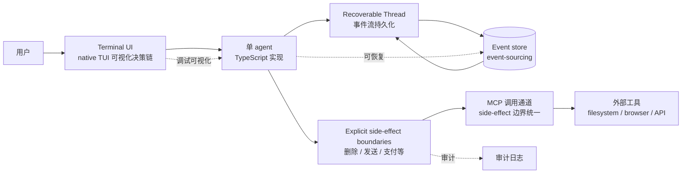

# joe960913/Jixu

## 一句话定位
面向 TypeScript 的"强韧单 Agent Harness"——可恢复的 Thread、显式的副作用边界、原生终端 UI；用 event-sourcing 做状态持久化，用 MCP 做外部工具接入，主张"单 agent + 强韧运行时"而非多 agent 编排。

## 它解决的问题
multi-agent 协调在 2026 年是显学（AutoGen / CrewAI / Sage Router 等），但单 agent 同样面临生产级挑战：① **状态丢失**——长任务中断后如何恢复？② **副作用不可逆**——agent 调用了"删除文件""发送邮件"后能否回滚？③ **调试困难**——agent 决策链不透明。Jixu 用三招分别解决：① **durable execution + event-sourcing**——所有事件持久化，中断后可恢复；② **explicit side-effect boundaries**——把副作用显式标注，便于审计与回滚；③ **native terminal UI**——终端内可视化决策链，降低调试门槛。

## 为什么值得关注（2026-08-23）
- **5 天 107⭐**（GitHub API 可核验）：增速温和，处于探索阶段
- **明确的设计哲学：** topics 包含 `single-agent` + `durable-execution` + `event-sourcing`，与其他 multi-agent 框架形成对照
- **MCP 内嵌：** 把 MCP 作为 side-effect 边界的一部分，与当前 MCP 协议化趋势一致
- **TypeScript 实现：** 复用 Node / Deno / Bun 生态，与主流 IDE / IDE 插件集成友好

## 热度来源判断
**"单 agent 务实路线 × event-sourcing × MCP 集成"三重驱动。** 在 multi-agent 大潮下，"单 agent 也能很强"是一种反向声音，吸引认同"少即是多"的开发者。**107⭐的增速反映真实小众关注**——不靠品牌流量，靠设计哲学吸引同好。下游采用需关注：① durable execution 的实战稳定性；② MCP side-effect 边界的实际拦截粒度；③ 与 LangGraph / Inngest 等成熟方案的对比。

## 关键技术亮点
1. **durable execution + event-sourcing：** 状态以事件流持久化，中断后可恢复
2. **explicit side-effect boundaries：** 把"删除 / 发送 / 支付"等副作用显式标注，便于审计与回滚
3. **MCP 内嵌为 side-effect 通道：** 调用外部工具走 MCP，治理语义统一
4. **recoverable Threads：** 会话级状态可恢复，类似数据库事务
5. **native terminal UI：** 终端内可视化决策链，降低调试门槛
6. **TypeScript 原生：** 不依赖 Python / 异步运行时，与 Node 生态深度集成

## 架构师速览

| 决策问题 | 研究判断 | 证据边界 |
|---|---|---|
| 系统边界 | Jixu 是单 agent harness，承担"durable execution + side-effect 边界 + terminal UI"；主张"少 agent 即少协调成本" | 仅基于 topics 与 README 描述；具体事件持久化机制、side-effect 拦截粒度、MCP 集成深度均待代码核验 |
| 主路径 | 用户输入 → terminal UI → agent 决策 → 通过 MCP 调用外部工具（side-effect 边界）→ 事件流持久化 → 可恢复 Thread | 主路径为档案语义抽象；具体事件格式、回滚策略、MCP 拦截点均待核验 |
| 关键权衡 | "单 agent + 强韧"vs"multi-agent 协同的上限"；"explicit side-effect"vs"开发的繁琐度"；"TypeScript 原生"vs"Python AI 生态的主流性" | 均为推断；具体事件格式、side-effect 拦截、Python 生态协同均待核验 |
| 最小 PoC | 启动 Jixu terminal UI，跑一个"先读取本地文件 → 通过 MCP 写新文件"的简单任务，故意中断后恢复，观察 Thread 是否真能恢复；尝试调用一个 destructive MCP 工具验证 side-effect 边界是否生效 | PoC 范围与退出路径由"单线程、可恢复、可审计"原则推导；具体命令、版本兼容、SLO 指标待核验 |

## 架构启发
Jixu 的核心启发是 **"少 agent 即少协调成本"**——multi-agent 协调固然强大，但协调本身的开销（消息路由、冲突仲裁、状态同步）会消耗大量资源；Jixu 主张"把单 agent 做扎实（durable + 可恢复 + side-effect 边界）"往往比"堆 agent 数"更务实。另一启发：**event-sourcing 是 agent 状态管理的天然选择**——agent 决策是事件流，event-sourcing 让恢复、回放、审计都成为内建能力，比传统 ORM 状态更适配 agent 场景。

## 架构图（MMD）

> 证据边界：此图只采用本档案已有可核验描述；"待核验"节点不应视为项目实现事实。

## 定位判断
**工具型项目（单 agent harness 的务实路线样本）。** 107⭐的增速反映"小而专"的设计哲学吸引小众关注。短期看，它是 TypeScript 生态中少见的单 agent harness；中期看，若 durable execution 与 side-effect 边界被证明实用，可能影响其他框架设计。**与 LangGraph / Inngest 等的对比是关键**——后者更成熟但也复杂，Jixu 的差异化在于"显式 side-effect + terminal UI"的简单性。

## 风险 / 局限 / 泡沫点
- **早期阶段风险：** 107⭐说明用户基数小，bug 修复与文档完善依赖个人维护者
- **TypeScript 生态与 AI 主流的差距：** Python 是 AI 主流生态，TypeScript 在模型 / 数据 / 训练工具上不及 Python 丰富
- **single-agent 路线的上限：** 复杂任务（多领域、多工具、长流程）可能仍需 multi-agent
- **MCP 拦截粒度的实际效果：** 拦截过严会让 agent 死板，拦截过松会让 side-effect 不可控
- **event-sourcing 的存储成本：** 长任务产生大量事件，存储与回放成本需考虑
- **个人项目属性：** joe960913 个人维护，长期可持续性需观察

## 与同类项目的关系
- **vs LangGraph / Inngest：** 那些是更成熟的 durable execution 框架；Jixu 强调 TypeScript 原生 + agent-specific side-effect
- **vs CrewAI / AutoGen：** 那些是 multi-agent 编排；Jixu 是单 agent harness
- **vs wang2122/sprix-sage-router：** 那个是 multi-agent 决策层；Jixu 主张少 agent 更务实
- **vs joe960913/Jixu 的设计哲学：** 与"harness 中间层"趋势（opencodex / codex-security）互补——Jixu 关注 state / durability，那些关注 model routing / security
- **vs Cloudflare Workflows / Temporal：** 那些是通用 durable execution；Jixu 是 agent-specific

## 是否值得持续跟踪
**值得持续跟踪（单 agent harness 的务实路线样本）。** 107⭐的增速温和但设计哲学清晰。建议关注：① event-sourcing 与 side-effect 拦截的实战稳定性；② 是否被 LangGraph / Inngest 等借鉴；③ TypeScript 在 AI 生态中的话语权提升。对 TypeScript 偏好的开发者：可作为单 agent harness 的轻量替代；对架构师：是"少 agent 即少协调"哲学的对照参考。

## 后续观察点
- durable execution 的稳定性（长任务中断恢复的成功率）
- side-effect 边界的实际粒度与开发者体验
- TypeScript AI 生态的发展（是否有更多模型 / 工具 / 框架）
- 是否被主流框架（LangGraph / Inngest / Temporal）借鉴
- 个人维护者活跃度与社区规模扩张

---
> 数据来源: GitHub API (2026-08-23) | Stars: 107 | License: 未明示（仓库未公开 SPDX） | 语言: TypeScript | 创建: 2026-08-18 | 推送到 main: 2026-08-22
