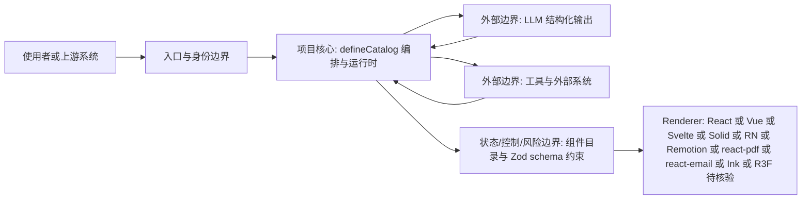

# vercel-labs/json-render

## 一句话定位
Generative UI 框架——让 AI 根据自然语言提示生成动态界面，但严格限定在预定义的组件目录（catalog）中，在保证灵活性的同时确保输出的安全性和可预测性。

## 它解决的问题
让 LLM 生成 UI 是一个新兴但危险的需求：直接让 AI 输出 HTML/React 代码有安全风险（XSS、逻辑错误）且输出不可预测。json-render 提供了一个框架——开发者定义一个组件目录（哪些 Card、Metric、Button 组件可用及它们的 props schema），AI 只能从这个目录中选择组件并填充符合 schema 的 JSON。这既获得了"AI 生成 UI"的灵活性，又确保了输出的安全性（AI 无法使用未定义的组件）和可预测性（JSON 输出始终匹配 schema）。

## 为什么值得关注（2026-07-08）
- 15,855 stars，创建于 2026-01-14（非常新！），半年内达到 15K+ stars 的增速极为惊人
- Vercel Labs 出品，Apache 2.0 许可证，代表 Vercel 对 Generative UI 方向的正式布局
- 跨平台支持：React、Vue、Svelte、Solid（Web）、React Native（移动端）、Remotion（视频）、react-pdf（PDF）、react-email（邮件）、Ink（终端 UI）、react-three-fiber（3D）、Next.js（全栈）
- 内置 36 个预构建的 shadcn/ui 组件，开箱即用
- 官网 json-render.dev 提供在线体验

## 热度来源判断
**Vercel 品牌效应 + Generative UI 趋势红利**。15K stars 在半年内达成，有两重驱动：(1) Vercel Labs 的品牌效应——开发者对 Vercel 出品的前端工具有天然信任；(2) Generative UI 是 2025-2026 年的前端热点方向，json-render 是这个方向上第一个成熟的框架级方案。需要注意的是，Vercel Labs 项目的特点是"快速验证概念"——有些项目最终成为正式产品，有些则停留在实验阶段。json-render 的长期定位还需观察。

## 关键技术亮点亮点
1. **Guardrailed Catalog 设计**：通过 `defineCatalog()` 定义可用的组件和 actions，每个组件用 Zod schema 约束 props。AI 只能输出目录中已定义的组件组合，从架构层面消除了"AI 生成不安全代码"的风险。这是比"让 AI 输出 HTML"安全得多的方案。
2. **跨平台统一 Catalog**：同一个组件目录定义可以渲染到 React、Vue、Svelte、Solid、React Native、Remotion（视频）、PDF、Email、Ink（终端）、3D 等多种目标。这意味着一次定义，处处渲染——一个 AI 生成的仪表盘可以同时呈现在 Web、移动端和 PDF 中。
3. **渐进式流式渲染**：支持流式传输和渐进式渲染——随着模型响应逐步到达，UI 逐步渲染，不需要等待完整响应。这对用户体验至关重要（避免了长时间等待）。
4. **36 个预构建 shadcn/ui 组件**：内置 Card、Metric、Button、Table、Chart 等常用组件，开发者可以直接使用或扩展，无需从零构建组件库。

## 架构师速览

| 决策问题 | 研究判断 | 证据边界 |
|---|---|---|
| 系统边界 | json-render 是一个 Generative UI 框架，处于"LLM 结构化输出"与"多端 UI 渲染"之间的中间层；它本身不调用 LLM，也不替代 shadcn/ui 组件库。 | 基于档案定位"Generative UI 基础设施层框架"及与 AI SDK、v0、shadcn/ui 的关系陈述；未审计源码。 |
| 主路径 | defineCatalog（Zod schema 定义组件与 props）→ LLM 输出受限 JSON → defineRegistry + Renderer 把 JSON 渲染到目标平台（React/Vue/Svelte/Solid/RN/Remotion/PDF/Email/Ink/3D）。 | 档案明列的 catalog→registry→renderer 三层架构与跨平台目标清单；具体协议、序列化格式与流式传输实现需源码核验。 |
| 关键权衡 | 用"约束换安全与可预测性"——AI 只能选择 catalog 内组件并按 schema 填充，代价是表达力被锁在预定义目录内，复杂交互场景（编辑器、设计工具）尚不适用。 | 档案明列"约束即自由"设计与"实际应用场景成熟度"风险；性能与 schema 违规率无量化数据。 |
| 最小 PoC | 选单一 Web 渠道（React + 内置 36 个 shadcn/ui 组件），用 defineCatalog 限定最小组件集，接入一家支持 structured output 的模型，记录 schema 违规率与渲染时延，再决定是否扩到 PDF/RN 等端。 | 档案建议"先在单一渠道、最小工具权限和可审计日志下验证"；具体模型供应商、PoC 验收阈值与部署形态待核验。 |

## 架构启发
json-render 的核心设计哲学是"约束即自由"——通过将 AI 的输出空间限制在一个预定义的组件目录中，反而获得了更好的生成质量（AI 不需要处理布局逻辑、样式、安全性，只需选择和配置组件）。这与传统的"让 AI 写代码"方案形成鲜明对比。Zod schema 约束确保了类型安全，defineRegistry + Renderer 的分离设计则让组件实现与 AI 接口完全解耦。这种"catalog → registry → renderer"的三层架构非常值得借鉴。

## 架构图（MMD）

> 证据边界：此图只采用本档案已有可核验描述；“待核验”节点不应视为项目实现事实。

## 定位判断
json-render 定位为 **Generative UI 基础设施层框架**。它不做 AI 模型调用（那是 AI SDK 的职责），也不做 UI 组件库（那是 shadcn/ui 的职责），而是定义了"AI 如何安全地生成结构化 UI"的中间层协议。如果 Generative UI 成为前端的主流范式（类似 Tailwind 之于 CSS），json-render 有望成为这个领域的标准框架。

## 风险 / 局限 / 泡沫点
1. **Vercel Labs 项目的不确定性**：vercel-labs 是实验性仓库，项目可能被合并到正式产品中、独立发展、或被放弃。与 vercel/ai 那样的正式仓库相比，长期投入不确定。
2. **LLM 结构化输出能力的依赖**：json-render 依赖 LLM 可靠地输出符合 schema 的 JSON。虽然当前的 structured output / function calling 能力已大幅提升，但在复杂 catalog 场景下仍可能出现幻觉或 schema 违规。
3. **实际应用场景的成熟度**：Generative UI 当前主要适合仪表盘、报告、简单工具等场景，对于复杂交互式应用（编辑器、设计工具）尚不适用。市场接受度有待验证。

## 与同类项目的关系
- **Vercel AI SDK (ai-sdk.dev)**：json-render 的自然上游——AI SDK 负责调用 LLM 并生成结构化输出，json-render 负责将结构化输出渲染为 UI。两者协同形成完整的 Generative UI 技术栈。
- **v0.dev (Vercel)**：Vercel 的商业 AI UI 生成产品。json-render 可能是 v0 底层技术的开源化，或者是 v0 理念的框架化。
- **LangChain / LCEL**：LangChain 的 structured output + tool calling 也能实现类似的"AI 输出结构化数据"能力，但缺乏专门的 UI 渲染层。json-render 更专注于 UI 场景。

## 是否值得持续跟踪
**高度值得关注，Generative UI 赛道的核心项目**。json-render 在半年内达到 15K stars 说明市场对这个方向有强烈需求。如果 Vercel 将其提升为正式产品（从 vercel-labs 迁移到 vercel 组织），则标志着 Generative UI 进入主流。建议每月关注更新。

## 后续观察点
1. **是否从 vercel-labs "毕业"到正式仓库**：这是判断 Vercel 对此项目投入程度的关键信号
2. **生产案例的涌现**：是否有知名产品公开使用 json-render 构建核心功能，验证其在真实场景中的可行性
3. **与 shadcn/ui 生态的融合深度**：是否会成为 shadcn/ui 的官方 Generative UI 层，形成更强的生态锁定

---
*首次记录：2026-07-08*
