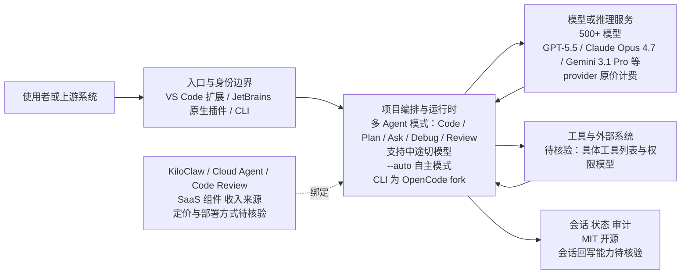

# Kilo Code

## 一句话定位

开源多平台 Coding Agent——VS Code / JetBrains / CLI 三端覆盖，500+ 模型中途切换，零加价按 provider 原价计费。

## 它解决的问题

商业 Coding Agent（Cursor、Copilot）锁定单一厂商和模型生态。开源 Coding Agent（Continue、Aider）覆盖面有限。Kilo Code 试图在开源 + 多平台 + 多模型 + 零加价之间找到平衡。

## 为什么值得关注（2026-06-20）

22,883 stars 日增 1,217——这是今天 Trending 中增长最快的 Coding Agent 项目。Kilo Code 支持 VS Code 扩展 + JetBrains 插件 + CLI 三端，500+ 模型（GPT-5.5、Claude Opus 4.7、Gemini 3.1 Pro 等），按 provider 原价计费零加价。

## 热度来源判断

**多平台 + 开源 + 零加价。** 这三点组合对价格敏感的开发者有强吸引力。日增 1,217 说明 Cursor/Copilot 的替代需求旺盛。CLI 是 OpenCode 的 fork（Kilo 承认），但 VS Code 和 JetBrains 扩展是原创。

## 关键技术亮点亮点

1. **三端覆盖：** VS Code 扩展（Marketplace）+ JetBrains 插件（原生）+ CLI（npm/curl/pnpm/bun/homebrew/AUR）。同一个 Agent 跨平台。

2. **500+ 模型中途切换：** 不锁定单一模型，可以在任务中途切换模型以匹配延迟/成本/推理需求。

3. **多 Agent 模式：** Code（默认编码）/ Plan（架构设计）/ Ask（只回答）/ Debug（调试）/ Review（代码审查）。

4. **Cloud Agent + Code Review + KiloClaw：** 不只是 IDE Agent——还有云端 Agent、自动 PR 代码审查、always-on Agent。

5. **MIT 开源：** 完全开源，包括 CLI（fork of OpenCode）。

## 架构师速览

| 决策问题 | 研究判断 | 证据边界 |
|---|---|---|
| 系统边界 | Kilo Code 是 TypeScript 实现的多平台 Coding Agent 编排层，三入口（VS Code 扩展 + JetBrains 原生插件 + CLI，CLI 明确为 OpenCode fork）共享同一 Agent，支持 500+ 模型与多 Agent 模式（Code/Plan/Ask/Debug/Review），并附带 Cloud Agent、Code Review、KiloClaw 等 SaaS 组件。 | 入口与 Agent 形态来自项目标签与档案描述；Cloud Agent / Code Review / KiloClaw 的实现细节未在档案中给出，待核验。 |
| 主路径 | 请求从三入口之一进入 → 项目编排/运行时（管理多 Agent 模式与中途切模型）→ 调用模型与工具/外部系统 → 会话状态/审计回写；`--auto` 模式声称可无人值守运行。 | 路径为档案所描述的职责抽象；具体协议、持久化与会话模型需源码核验。 |
| 关键权衡 | 扩展速度与权限/可观测性/供应商耦合的平衡：500+ 模型与多入口扩大覆盖面但放大选型与上下文丢失风险；CLI 依赖 OpenCode fork 引入上游 license/治理风险；"零加价"使收入必须来自 Cloud/Review/KiloClaw 等服务，文档中未披露定价。 | 权衡基于档案风险段；商业模式与 fork 治理细节未证实。 |
| 最小 PoC | 在单入口（建议先 CLI，便于隔离）启用最小 Agent 模式（如 Ask 或 Code），关闭高权限工具，接入审计/日志，对单个 provider/model 做会话级回放与退出路径验证；再扩到 VS Code/JetBrains。 | PoC 步骤仅依据档案给出的入口与模式描述；具体工具权限列表与日志接口待核验。 |

## 架构启发

Kilo Code 的设计哲学是"Coding Agent 应该是开发者主权的"：
- 模型选择权 → 500+ 模型
- 平台选择权 → VS Code / JetBrains / CLI
- 价格透明 → provider 原价零加价
- 可自主运行 → `--auto` 模式无需人工干预

这与 Cursor/Copilot 的"平台锁定"形成鲜明对比。

## 架构图（MMD）

> 证据边界：此图只采用本档案已有可核验描述；“待核验”节点不应视为项目实现事实。

## 定位判断

**开源 Coding Agent 平台。** 在 Coding Agent 光谱中：
- Cursor / Copilot = 商业 SaaS（锁定）
- Continue = 开源但功能有限
- Kilo Code = 开源 + 全功能 + 多平台

## 风险 / 局限 / 泡沫点

1. **CLI 是 fork：** Kilo CLI 基于 OpenCode fork。如果 OpenCode 限制 fork 或改变 license，有风险。
2. **商业模式不清：** "零加价"意味着 Kilo 不从模型调用赚钱。收入来源可能是 Cloud Agent / Code Review / KiloClaw 等 SaaS 服务。
3. **质量参差：** 500+ 模型中大部分质量平庸，中途切换可能导致上下文丢失。
4. **社区维护成本：** 多语言 README（20+ 语言）、多平台适配需要大量维护投入。

## 与同类项目的关系

| 项目 | 平台 | 模型 | 开源 | 价格 |
|------|------|------|------|------|
| Kilo Code | VS Code + JetBrains + CLI | 500+ | MIT | provider 原价 |
| Cursor | VS Code fork | 有限 | ❌ | 订阅制 |
| Continue | VS Code + JetBrains | BYO | Apache 2.0 | 免费 |
| Aider | CLI | BYO | Apache 2.0 | 免费 |

Kilo Code 与 Continue 是直接竞争——都是开源多平台 Coding Agent。Kilo 的差异化是 Cloud Agent 和 KiloClaw 等 SaaS 功能。

## 是否值得持续跟踪

**是，但需谨慎。** 22.9K stars 和日增 1,217 说明市场需求旺盛。但 CLI fork 来源和商业模式需要持续观察。

## 后续观察点

1. JetBrains 插件的稳定性和用户反馈
2. 商业模式演化（Cloud Agent / KiloClaw 定价）
3. 与 Continue 的市场份额对比
4. 企业采用情况
5. `--auto` 模式在 CI/CD 中的可靠性

---
*首次记录：2026-06-20*
