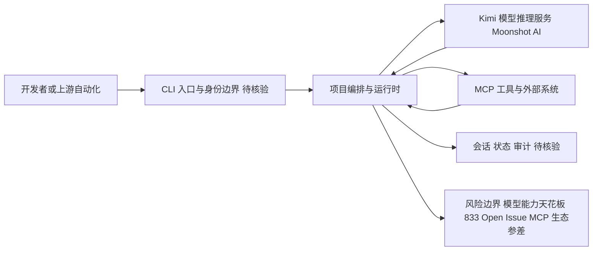

# MoonshotAI/kimi-cli

## 一句话定位
Moonshot AI（月之暗面）官方推出的终端编程 Agent（Kimi Code CLI），对标 Claude Code / Codex CLI，以单二进制分发、多模态输入（含视频）、MCP 原生配置为核心差异化，是国产大模型厂商在"Agentic Coding"赛道的旗舰 CLI 产品。

## 它解决的问题
Agentic Coding（智能体编程）是 2025-2026 年最热的开发工具赛道。Claude Code 和 OpenAI Codex CLI 定义了"终端原生 AI 编程 Agent"的范式：在终端中用自然语言指挥 AI 读写代码、运行测试、执行命令。但它们绑定各自模型，中国开发者面临网络访问、合规、中文场景适配等问题。Moonshot AI 推出 kimi-cli，提供**国产模型驱动的终端编程 Agent**，让开发者在熟悉的 CLI 环境中获得 Kimi 模型的编码能力，同时支持 MCP 工具生态和多模态输入（这是早期差异化亮点）。它解决的是 **非 Anthropic/OpenAI 生态开发者对高质量终端编程 Agent 的需求**，以及国产模型在 Coding Agent 领域的存在感问题。

## 为什么值得关注
- **Stars:** 11,131（截至 2026-08-07），国产 Coding Agent CLI 中表现突出
- **Forks:** 1,285，社区参与度高
- **Watchers/Subscribers:** 57
- **Open Issues:** 833，反馈活跃（也反映一定成熟度问题）
- **License:** Apache-2.0
- **语言:** Python
- **活跃度:** created 2025-10-15，pushed_at 2026-08-03，持续迭代近 10 个月
- **官网:** moonshotai.github.io/kimi-cli，文档完善
- **规模:** 24.7MB，代码量充足，含文档与资源
- **背书:** Moonshot AI 官方维护，非个人项目

## 热度来源判断
kimi-cli 的热度是 **"国产 Claude Code 替代"刚需 + Moonshot 品牌 + Coding Agent 赛道红利** 三重驱动。Claude Code 在国内因网络和付费门槛，大量开发者寻找替代品；Kimi 作为国产头部模型，其 CLI 自然承接这波需求。Moonshot AI 的品牌（Kimi 智能助手已有庞大 C 端用户）带来初始流量。833 个 Open Issues 说明采用者众但 bug 也多——这是快速增长的副作用。热度**部分真实（确实填补国产空白），部分品牌驱动**。需警惕的是：Coding Agent 的核心壁垒是模型编码能力，而 Kimi 模型在编程基准上的表现仍落后于 Claude Sonnet/Opus 系列，这决定了 kimi-cli 的能力天花板。

## 关键技术亮点亮点
1. **单二进制/简易安装:** 对标 Claude Code 的"一行命令安装"体验，降低使用门槛
2. **多模态输入:** 支持图片甚至视频输入（早期差异化），可"给 Agent 看截图/UI 改 bug"
3. **MCP 原生配置:** 内置 Model Context Protocol 客户端，原生支持接入外部工具服务器
4. **终端原生:** 在 shell 中直接调用，读写文件、执行命令、运行测试，与开发者工作流深度融合
5. **Kimi 模型驱动:** 长上下文（Kimi 系列的招牌能力），适合处理大型代码库
6. **Python 实现:** 相比 Claude Code（可能闭源/受限），源码可审计、可扩展

## 架构师速览

| 决策问题 | 研究判断 | 证据边界 |
|---|---|---|
| 系统边界 | kimi-cli 是 Moonshot AI 官方维护的 Python 编写的终端 Coding Agent CLI（单二进制/简易安装），定位为 Claude Code / Codex CLI 的国产替代 | 依据档案"语言: Python"、标签"cli, coding-agent, mcp"与"单二进制/简易安装"条目；具体打包格式与入口实现待源码核验 |
| 主路径 | 用户在 shell 中以自然语言发出指令 → 编排/运行时 → 调用 Kimi 模型与 MCP 工具 → 回写会话/文件/状态 | 依据"终端原生、MCP 原生配置、Kimi 模型驱动"三条亮点；具体编排框架、协议、持久化方案档案未披露 |
| 关键权衡 | 在"Moonshot 品牌 + 国产合规叙事"驱动的扩展速度，与 Kimi 模型编码能力天花板（落后 Claude Sonnet/Opus）、833 个 Open Issue 所反映的成熟度、以及 MCP 生态质量参差之间的取舍 | 档案明确点出"模型能力天花板"与"高 Issue 数"两项风险；其他权衡项仅为研究观察 |
| 最小 PoC | 在受控仓库中以最小工具权限开启审计/日志，仅接入图片或文本一种模态与 1–2 个 MCP 工具服务器，先验证单任务闭环与退出路径，再评估扩面 | 档案给出"先做最小 PoC，把安全、成本、SLO 与退出路径作为验收项"的采用建议；具体权限模型与日志实现待核验 |

## 架构启发
kimi-cli 的核心启发是 **"Coding Agent 的竞争已从模型能力延伸到终端工具链"**。Claude Code 的成功证明：开发者要的不只是"聊天式写代码"，而是"能直接操作我代码库的 Agent"。这迫使所有大模型厂商推出自己的 CLI——Moonshot 跟进，说明这已成为**模型厂商的标配产品线**。更深层的启发是：**Coding Agent 的护城河 = 模型能力 × 工具链体验 × 生态（MCP/插件）**，三者缺一不可。kimi-cli 在工具链上对标头部，但模型能力仍是短板。值得关注它如何利用 Kimi 的长上下文优势做差异化（如整库理解）。

## 架构图（MMD）

> 证据边界：此图只采用本档案已有可核验描述；“待核验”节点不应视为项目实现事实。

## 定位判断
**工具型产品 + 战略卡位。** kimi-cli 本身是开发者工具，但其战略意义超出工具本身——它是 Moonshot AI 在"Agentic Coding"赛道的存在感证明。不做 CLI 就等于把开发者心智拱手让给 Claude/Codex。定位上是 Claude Code 的"国产替代"，核心用户是国内开发者和 Kimi 生态用户。作为独立产品，其价值取决于 Kimi 模型的编码能力能否追上第一梯队；作为战略卡位，它已成功完成"存在感"任务。不会成为平台，但会是国产 Coding Agent 的头部工具。

## 风险/局限/泡沫点
- **模型能力天花板:** Kimi 模型编程能力是否足以支撑复杂 Agent 任务，是根本性制约
- **高 Issue 数:** 833 Open Issues 暴露稳定性与成熟度问题，早期采用者体验参差
- **竞争白热化:** Claude Code、Codex CLI、Gemini CLI、Cursor 终端模式都在争夺同一批用户
- **国产替代叙事风险:** 若"替代"仅停留在地域/合规层面，而非技术领先，难以形成长期粘性
- **MCP 生态依赖:** kimi-cli 的工具扩展依赖 MCP 生态成熟，目前 MCP 工具质量参差
- **维护成本:** Coding Agent 需要持续跟进模型升级、IDE 变化、用户反馈，Moonshot 资源能否持续投入

## 与同类项目的关系
- **vs Claude Code（Anthropic）:** 行业标杆，模型能力与工具链体验领先；kimi-cli 是国产替代
- **vs OpenAI Codex CLI:** OpenAI 官方 CLI，与 GPT/Codex 模型深度绑定；kimi-cli 用 Kimi 模型
- **vs Gemini CLI（Google）:** Google 官方 CLI，免费额度是杀手锏；kimi-cli 在国内合规性更优
- **vs Cursor（终端模式）:** Cursor 是 IDE-first，终端为辅；kimi-cli 是终端-first
- **vs Aider / OpenCode:** 开源第三方 Coding Agent，模型无关；kimi-cli 是官方绑定 Kimi

## 是否值得持续跟踪
**值得跟踪（尤其国内视角）。** kimi-cli 代表国产大模型厂商在 Coding Agent 赛道的正式入场。建议关注：Kimi 模型编程能力的迭代速度、MCP 生态集成深度、以及国内企业采用情况。它是否能突破"国产替代"叙事、在纯技术体验上逼近 Claude Code，决定了其上限。对国内开发者，它是当前最现实的高质量终端编程 Agent 选项之一。

## 后续观察点
- Kimi 模型在 SWE-bench 等编程基准上的得分提升
- MCP 工具服务器的集成数量与质量
- Open Issues 的收敛速度（反映成熟度改善）
- 是否推出企业版/团队协作功能
- 与 Claude Code 的功能 gap 是否缩小（视频输入等差异化能否保持）

---
> 数据来源: GitHub API (2026-08-07) | Stars: 11,131 | Forks: 1,285 | License: Apache-2.0 | 语言: Python | 官网: moonshotai.github.io/kimi-cli
