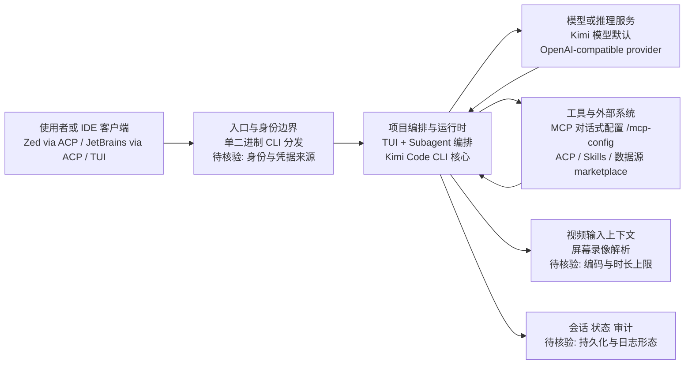

# Kimi Code CLI

## 一句话定位
Moonshot AI 出品的终端编程 Agent，单二进制分发，Kimi 模型驱动，支持视频输入和 MCP 原生配置。

## 它解决的问题
Coding Agent CLI 市场需要更多竞争。Claude Code 昂贵，OpenCode 需要复杂配置。用户需要一个轻量、快速启动、兼容多模型的终端编程 Agent。

## 为什么值得关注（2026-07-24 更新）
GitHub Trending Weekly 上榜，周增 1,610 stars（从 1.9K → 4.9K）。Moonshot 同时推出 kimi-code（TS）和 kimi-cli（Python, 10.7K⭐）两个项目，显示了对 Coding Agent 赛道的重大投入。单二进制分发 + 视频输入 + Subagent 编排是核心差异化。ACP（Agent Client Protocol）支持让它可集成 Zed / JetBrains IDE。

## 热度来源判断
- Moonshot / Kimi 品牌效应 + 大规模投入（双项目并行）
- 单二进制分发降低安装门槛（无需 Node.js）
- 视频输入功能在 Coding Agent 中是独创
- MCP 原生配置（/mcp-config 对话式配置）
- 中国开发者的本土化需求 + Kimi 模型免费额度
- 1.9K stars + 191 forks = 活跃早期社区

## 关键技术亮点亮点
1. **单二进制分发**：curl 一行安装，不需要 Node.js / Python 环境
2. **毫秒级启动**：TUI 瞬间就绪，启动不感觉沉重
3. **视频输入**：丢入屏幕录像，Agent 看视频理解需求 → 生成代码
4. **MCP 原生配置**：`/mcp-config` 对话式配置 MCP 服务器，不需要手编 JSON
5. **插件生态**：Skills / MCP / 数据源可从 marketplace 或任意 GitHub repo 安装
6. **Kimi + 兼容**：原生 Kimi 模型，也可配置其他 OpenAI-compatible provider

## 架构师速览

| 决策问题 | 研究判断 | 证据边界 |
|---|---|---|
| 系统边界 | 由终端入口、MCP/工具/数据源插件、Kimi 模型（可配其他 OpenAI-compatible provider）以及会话/状态构成的 TUI 编排层；分发形态为单二进制（无需 Node/Python） | 来自档案"单二进制分发""MCP 原生配置""Kimi + 兼容""ACP 集成 Zed/JetBrains"；内部模块边界未审计 |
| 主路径 | 用户在 TUI 发起请求（含视频/屏幕录像等输入）→ 项目编排与运行时进行 Subagent 编排 → 调用 Kimi/兼容模型与工具（含 MCP/ACP）→ 结果回写会话与状态 | 来自"视频输入""Subagent 编排""ACP 支持""会话或状态回写"；具体协议与持久化未披露 |
| 关键权衡 | 扩展速度（低门槛安装、对话式 MCP 配置、市场化 Skills） 与供应商耦合（默认 Kimi 优化）、稳定可观测性（123 个 open issues）、权限隔离之间的平衡 | 基于"风险/局限"段及"核心权衡"；未含未公开的安全/审计设计 |
| 最小 PoC | 单台机器 curl 拉取单二进制 → 在最小工具权限与可审计日志下接入单一渠道（如 IDE via ACP 或纯 TUI） → 用一两个 MCP/本地仓做 Subagent 与视频输入 smoke test，并以 Kimi 模型基准、退出口径作为验收 | 来源"采用建议"与"架构启发"中"单二进制""视频输入""MCP 对话式配置"；性能/成本数字须实测 |

## 架构启发
- **单二进制**是 Coding Agent CLI 的正确分发方式。Node.js 全局包（npm -g）有依赖地狱问题
- **视频输入**拓宽了 Agent 的上下文模态。不只是文字描述需求，可以直接展示
- **MCP 对话式配置**显著降低了 MCP 的使用门槛

## 架构图（MMD）

> 证据边界：此图只采用本档案已有可核验描述；“待核验”节点不应视为项目实现事实。

## 定位判断
**工具型。** Kimi 生态的终端入口。短期是 Claude Code / OpenCode 的替代选项，长期取决于 Kimi 模型的能力进化。

## 风险 / 局限 / 泡沫点
1. **123 个 open issues**：稳定性问题较多，早期阶段
2. **Kimi 模型绑定**：虽然兼容其他 provider，但优化默认是 Kimi
3. **中国市场定位**：海外用户可能优先选择 Claude Code / OpenCode
4. **生态薄弱**：Skills marketplace 内容数量远不及 Claude Code 生态
5. **竞品压力**：Claude Code 193K + OpenCode 170K 的规模优势巨大

## 与同类项目的关系
| 项目 | Stars | 定位 | 差异 |
|------|-------|------|------|
| Claude Code | 193K | 终端编程 Agent 霸主 | 生态最完善，但昂贵 |
| OpenCode | 170K | 开源终端 Agent | 更成熟，社区更大 |
| Kimi Code | 1.9K | Kimi 生态终端入口 | 单二进制 + 视频输入差异化 |
| ECC | 208K | Agent 性能优化 | 不同赛道 |

## 是否值得持续跟踪
**观察。** 中国大模型公司进入 Coding Agent 赛道的信号项目。短期更推荐 Claude Code / OpenCode，但长期看 Kimi 模型进化。

## 后续观察点
1. Kimi 模型编程能力基准评测对比
2. 视频输入功能的实际效果验证
3. 社区插件生态发展
4. Moonshot 是否投入战略资源持续迭代

---
*首次记录：2026-06-06*
