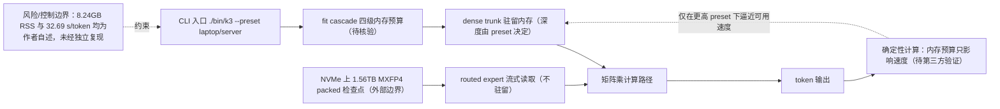

# kimi-k3-in-c — 便携 C99 跑全量 Kimi K3 2.78T（peak RSS 8.24GB）

## 一句话定位
便携 C99 实现的 Kimi K3 2.78T 推理引擎——纯 C99、no BLAS、no framework、no GPU，引擎本体 176KB，在 8.24GB peak RSS 下跑全量 2.78 万亿参数模型（1.56TB 检查点全在 NVMe）。

## 它解决的问题
目标用户是在消费级硬件上探索超大 MoE 模型推理极限的研究者/极客。痛点：Kimi K3 完整权重约 1.56TB，远超任何消费机内存。kimi-k3-in-c 要回答的不是"能否跑"（已被 waste/deltafin 回答），而是**"RAM 下限能压到多低"**——它把驻留内存量推到 8.24GB，比 waste（64GB）低一个数量级。

## 为什么值得关注（2026-08-03）

这是本周"超大模型本地推理"命题的**第四种独立实现**，且把速度-内存 Pareto 前沿的内存端推到新极限。waste（64GB/0.62 tok/s）、deltafin（Python/API）、colibri（多 GPU/744B）之后，kimi-k3-in-c 用 8.24GB peak RSS 给出了"能跑"的下限。作者 FareedKhan-dev 有从零实现公信力（train-llm-from-scratch 8,868⭐、all-agentic-architectures 4,044⭐、all-rl-algorithms 1,882⭐），非匿名新号。

## 热度来源判断
- **真实需求信号**：Apache-2.0、fork 23、README 所有性能数据标注"来自 docs/data/ 的实测输出"，附 CI badge——这是研究性项目的工程诚实姿态。
- **话题性成分**："2.78T 模型在 8GB RAM / 0 GPU 上跑"有极强传播性；218⭐ 主要来自"把内存下限推到极限"的话题性。
- **价值定位**：与 waste 一样，价值在**可行性证明**（RAM 下限的极限在哪），而非日常使用（32 s/token）。

## 关键技术亮点亮点

1. **Peak RSS 8.24GB（实测命令输出）**：README 展示 `./bin/k3 ... --preset laptop` 实测：`8 tokens in 261.5 s, 32.69 s/token average, PEAK RSS for the whole run: 8.24 GB`。给更多内存（`--preset server`，127.92GB RSS）则 10.69 s/token——**答案不变，只变时钟**。
2. **176KB 引擎 + 0 依赖**：纯 C99，no BLAS, no framework, no GPU。可移植（Linux x86-64），Makefile 构建。
3. **"8GB 与 224GB 字节一致输出"**：dense trunk 驻内存到所选深度并流式其余；1.45TB routed experts 从不驻留，直接从 packed 4-bit（MXFP4）形式相乘。作者的论证——**计算是确定性的，差别只在字节从哪来**（内存 vs 磁盘）以及多快，因此"底部的答案和顶部一样"。
4. **fit cascade（四级内存预算）**：从 server cluster → laptop 的四步，每步调整字节存放位置，输出在两端字节一致。`--preset laptop/server` 控制 trunk 深度与内存预算。

## 架构师速览

| 决策问题 | 研究判断 | 证据边界 |
|---|---|---|
| 系统边界 | 纯 C99 单进程推理引擎，无框架无 BLAS 无 GPU，依赖仅 1.56TB NVMe 检查点与宿主 OS；外部边界为 NVMe 上的 MXFP4 packed 检查点 + CPU 内存层级（dense trunk 驻内存 / routed experts 流式）。 | 基于档案"C99、no BLAS、no framework、no GPU、176KB 引擎、peak RSS 8.24GB、1.56TB 检查点、MXFP4"。 |
| 主路径 | CLI 入口（`./bin/k3 ... --preset laptop/server`）→ fit cascade 按内存预算选择 trunk 驻留深度 → dense trunk 直接矩阵乘、routed expert 从 NVMe 以 4-bit MXFP4 流式直接相乘（不驻留）→ 输出 token；计算路径不依赖外部服务。 | 依据"fit cascade（四级内存预算）"、"dense trunk 驻内存到所选深度并流式其余"、"routed experts 从不驻留，直接从 packed 4-bit 形式相乘"、"计算是确定性的"。 |
| 关键权衡 | 用吞吐（32.69 s/token，laptop 预设）换取 RAM 下限（8.24 GB），换 server 预设（127.92 GB RSS）才到 10.69 s/token——本质是"内存放置策略 vs 时钟"的取舍，速度不可与 waste（0.62 tok/s）同日而语。 | 仅来自 README 自述的 `--preset laptop` / `--preset server` 实测数据，未经第三方复现；作者明示"价值在可行性证明，非日常使用"。 |
| 最小 PoC | 在 Linux x86-64 + ≥1.56TB NVMe + ≥8.24GB RAM 机器上克隆仓库、Makefile 构建，跑 `./bin/k3 ... --preset laptop`，对照 docs/data/ 的 8.24GB RSS / 32.69 s/token 复现同一 prompt，并比对相同 prompt 在 `--preset server` 下的字节级输出一致性。 | PoC 形态、C99 工具链、Linux x86-64、Makefile 由档案确认；"字节一致输出"为作者自述断言，需独立验证。 |

## 架构启发
核心启发是 **"确定性计算 → 内存预算只影响速度不影响正确性"**。这与 waste 的"trunk 驻内存 + expert 磁盘流式"、esp32-ai 的"Per-Layer Embeddings + flash 存参数表"是同一原理家族——**"推理瓶颈是内存放置策略而非算力"**。kimi-k3-in-c 的独特贡献是把"放置策略"推到极端：几乎全部 expert 都不驻留，只保留最小 trunk，用 32s/token 的极端慢速换 8.24GB 的极端低内存。这定义了 Pareto 前沿的内存端极限点。

## 架构图（MMD）

> 证据边界：此图只采用本档案已有可核验描述；“待核验”节点不应视为项目实现事实。

## 定位判断
在"K3 本地推理四极"里，kimi-k3-in-c 占据**内存下限极限点**。waste（64GB/接近可用）、deltafin（Python/API server/易用）、colibri（多 GPU/744B/4 tok/s）分别占据速度、易用性、多 GPU 端。kimi-k3-in-c 不追求实用，追求"RAM 下限能压到多低"的回答。定位为观察型——价值在可行性证明与 Pareto 前沿定义。

## 风险 / 局限 / 泡沫点

1. **32.69 s/token 是"能跑"非"能用"**：261 秒生成 8 个 token。与 waste（0.62 tok/s ≈ 1.6s/token）相比慢约 20 倍。价值在 RAM 下限的可行性证明，**绝不能误读为"K3 可在 8GB 机器日常本地跑"**。
2. **性能数据为作者自述**：8.24GB RSS、32.69 s/token、"字节一致输出"均来自 README + 标注的 docs/data/ 实测，**非第三方独立复现**。"8GB 与 224GB 字节一致"是确定性计算的数学推论，但依赖 checkpoint 完整性与流式读取的无损性，仍需独立验证。
3. **需要 1.56TB 磁盘**：检查点 1.56TB 全在 NVMe——仍是高门槛，非普通消费机。
4. **极早期项目**：创建于 2026-08-01（2 天），218⭐，仅 23 fork。长期维护承诺待验证。

## 与同类项目的关系
- **vs waste（1,010⭐，C）**：同为纯 C 零依赖跑全量 K3，但 waste 要求 ~64GB RAM / 0.62 tok.s（接近可用），kimi-k3-in-c 只要 8.24GB / 32s/tok（极限慢）。同一 Pareto 前沿的不同点：waste 求速度，kimi-k3-in-c 求内存下限。
- **vs deltafin（615⭐，Python）**：deltafin 用 Python + OpenAI 兼容 API server（易用优先），kimi-k3-in-c 用纯 C99（依赖控制/可移植）。语言与目标不同。
- **vs colibri（22,197⭐，C）**：colibri 跑 GLM-5.2 744B 多 GPU（VRAM/RAM/NVMe 三级/4 tok/s），kimi-k3-in-c 跑 K3 2.78T 单 CPU（全 expert 流式/8.24GB）。规模与硬件策略不同。

## 是否值得持续跟踪
**是，作为"K3 本地推理 Pareto 前沿内存极限点"跟踪。** 关注是否有第三方验证 8.24GB RSS 与字节一致输出、以及 trunk 深度可配策略能否在更高内存预算下逼近可用速度。

## 后续观察点
1. **第三方验证字节一致输出**：8GB 与 224GB 输出是否真的字节一致，是验证流式无损性的关键。
2. **trunk 深度-速度曲线**：`--preset laptop/server` 之间的中间预设能否找到"中等内存 + 接近可用速度"的甜点。
3. **与 waste 的速度-内存 Pareto 对比**：两个纯 C 实现能否合并洞察，把前沿整体推进。

## 最近动态（2026-08-04）

- **爆发性增长 +955（218→1,173，单日近 5.4 倍），fork 23→176**：这是今日 K3 本地推理品类中增速最猛的项目。"8.24GB RAM 跑全量 K3"的极端内存下限卖点在第三日引爆关注。fork 176（vs 昨日 23）说明有人在尝试复现/部署。
- **与 waste 的对比**：kimi-k3-in-c 今日增量（+955）首次超过 waste（+510），说明"最低 RAM"这个卖点的传播力强于"接近可用速度"。但需注意：32s/token 的速度意味着其价值仍在**可行性证明**而非日常使用。
- **待验证**：8.24GB RSS 与"字节一致输出"仍为作者自述（标注来自 docs/data/ 实测），未见独立第三方复现。fork 增长可能带来首批独立验证信号。

## 最近动态（2026-08-05）

- **持续放量 +779（1,173→1,952，逼近 2K），fork 176→318（+142）**：第四日增量虽较昨日 +955 衰减，但仍维持高位。"极限低内存（8.24GB）"叙事延续。fork 318 持续增长，独立验证信号在累积。
- **品类叙事分裂加剧**：kimi-k3-in-c 第四日 +779，而 waste 骤降到 +145——两者增量比从昨日 1.9:1 扩大到今日 5.4:1。"最低 RAM"卖点持续压倒"可用速度"卖点。这不是品类降温，而是**注意力在品类内部从"可用速度端"迁移到"极限低内存端"**。
- **待验证（不变）**：8.24GB RSS、32s/token、字节一致输出仍为作者自述，未见独立第三方复现。open_issues 7（低），pushed_at 停在 08-01（代码未更新，热度由已有版本驱动）。
- **判断**：score 维持 83。叙事热度高，但价值仍在可行性证明（RAM 极限），非日常可用。

---
*首次记录：2026-08-03* · *最近更新：2026-08-06（1,952→2,544，+592，突破 2K 关口）*

## 最近动态（2026-08-06）

- **突破 2K 关口 +592（1,952→2,544），fork 318→424（+106）**：第五日增量 +592 较昨日 +779 略有衰减，但仍维持高位。突破 2K 是品类热度延续的标志。fork 424 持续增长（+106），独立验证信号继续累积。
- **叙事分裂持续**：kimi-k3-in-c +592 vs waste +93，增量比从 5.4:1 扩大到 ~6.4:1。"极限低内存"叙事持续压倒"可用速度"，品类内部注意力迁移未停止。
- **待验证（不变）**：8.24GB RSS、32s/token、字节一致输出仍为作者自述，未见独立第三方复现。open_issues 8（低），pushed_at 停在 08-01（代码未更新，热度由已有版本驱动）。
- **判断**：score 维持 83。叙事热度延续，价值仍在可行性证明（RAM 极限），非日常可用。

## 最近动态（2026-08-07）

- **逼近 3K 关口 +257（+10%），fork 424→466（+42）**：2,544 → 2,801。增量从 +592 衰减到 +257，热度在收敛但仍维持正增长。逼近 3K 关口。
- **"极限低内存"叙事延续**：作为"2.78T 参数在 8.24GB RAM 跑"的可行性证明，持续吸引注意力。fork 466 说明有人在尝试复现/学习。
- **判断**：score 维持 83。叙事热度收敛中，价值仍在可行性证明（RAM 极限），非日常可用。pushed_at 08-06（有新代码推送）。open_issues 2（低）。
- **待验证（不变）**：8.24GB RSS、32s/token、字节一致输出仍为作者自述，未见独立第三方复现。

## 最近动态（2026-08-08）

- **突破 3K 关口 +446（+16%），增速回升**：2,801 → 3,247，fork 466 → 534（+68）。增速从 +10%（08-07）回升到 +16%（08-08），打破收敛趋势。
- **判断修正**：score 83 → 84。增速回升 + 突破 3K 关口。

## 最近动态（2026-08-10）

- **继续加速 +411（+11%），fork 582→652（+70）**：3,751 → 4,162。**增速从昨日 +16% 略降到 +11%，但绝对增量 +411 与昨日 +504 基本持平**——持续放量。fork +70（vs 昨日 +48）说明部署/二次开发意愿上升。
- **本地 MoE 推理赛道绝对头部确认**：4,162⭐ 已是该赛道最高 star 数。与 Swiftlet（456→469，Apple 原生栈，今日 +13）共同信号：本地大模型推理从 C99 单点扩展到多平台覆盖，kimi-k3-in-c 是头部。
- **subscribers 38 → 43**：深度跟踪意愿维持。
- **判断（维持 score 85）**：持续放量 + 赛道头部 + fork 加速，score 维持 85。
- **待验证（不变）**：8.24GB RSS、32s/token、字节一致输出仍为作者自述，未见独立第三方复现。
