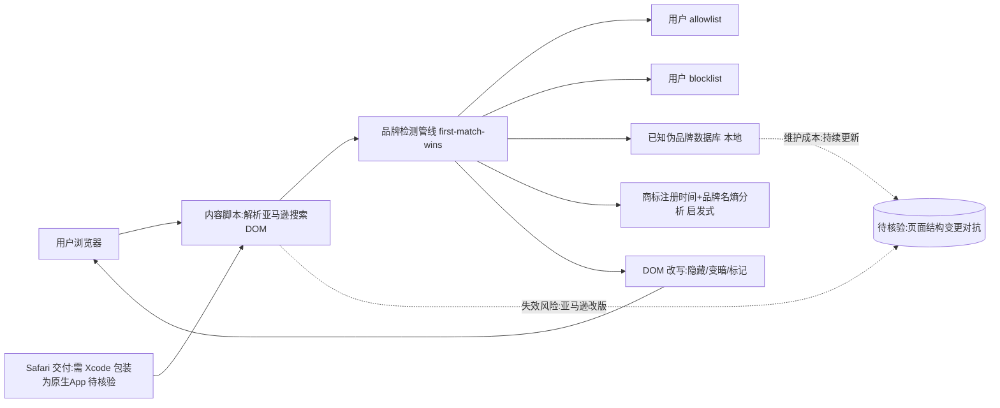

# Knockoff

## 一句话定位
Chrome/Firefox/Safari 扩展——过滤亚马逊上的伪品牌商品，在搜索结果中隐藏、变暗或标记商标抢注品牌。

## 它解决的问题
亚马逊上有大量商标抢注品牌（SZHLUX、HORUSDY、LATTOOK、DOZAWA 等）：在美国专利商标局注册随机字符串仅为解锁亚马逊品牌注册，销售没有公司、没有保修、没有信誉的商品。消费者在搜索时难以分辨真品牌和伪品牌。

## 为什么值得关注（2026-07-12）
6 天内获 1.7K star，被 Fast Company、Gizmodo、404 Media、PC Gamer、Yahoo、Lifehacker 等主流科技媒体报道。不蹭任何 AI 概念，解决真实消费痛点，全本地运行无追踪——信号：开发者社区对"真正解决问题的小工具"仍有巨大需求。

## 热度来源判断
- **真实痛点驱动** — 亚马逊伪品牌是全球消费者的日常困扰
- **媒体放大** — 多家主流科技媒体同时报道
- **零摩擦** — Chrome Web Store 一键安装
- **非 AI 概念** — 在 AI 饱和的信息环境中，朴素工具反而引人注目

## 关键技术亮点亮点
1. **品牌检测管线**（first-match-wins）：用户 allowlist → 用户 blocklist → 已知伪品牌数据库 → 商标注册时间+品牌名熵分析 → 可疑标记
2. **全本地运行** — 内容脚本执行在浏览器内，无服务器往返、无追踪、无账号
3. **三平台覆盖** — Chrome、Firefox、Safari（Safari 需 Xcode 包装为原生 App）
4. **品牌名熵分析** — 用信息熵识别随机生成的品牌名（如 SZHLUX 熵值高于 Apple）

## 架构师速览

| 决策问题 | 研究判断 | 证据边界 |
|---|---|---|
| 系统边界 | 浏览器扩展形态的客户端工具，职责落在 content script 解析亚马逊 DOM、本地品牌判定管线、用户 allow/blocklist 管理；不包含后端服务、账号体系或外部 API 调用 | 边界基于 JavaScript 语言、browser-extension / local-first / amazon / brand-detection 标签及档案描述的"全本地运行，无服务器往返、无追踪、无账号" |
| 主路径 | 内容脚本抓取搜索结果 → 品牌检测管线（first-match-wins：allowlist → blocklist → 已知伪品牌库 → 熵+注册时间启发式）→ DOM 改写（隐藏/变暗/标记） | 管线顺序与三档处理（隐藏/变暗/标记）来自档案；具体正则匹配、熵阈值、注册时间抓取来源未在档案中给出，视为待核验 |
| 关键权衡 | 确定性列表（allow/blocklist、伪品牌库）与启发式熵分析互补，构成"快路径 vs 误判风险"的取舍；全本地隐私与伪品牌库持续维护成本是一对结构性张力 | "确定性管线 + 启发式判断"在档案中有原文表述；熵分析是否回退、人工审核回路未在档案中说明 |
| 最小 PoC | 在 Chrome/Firefox 上加载扩展，构造含已知真伪品牌的亚马逊搜索查询，验证 DOM 改写三档行为与离线工作；评估亚马逊改版后的失效模式 | 档案仅承诺三平台覆盖（Chrome/Firefox/Safari，Safari 需 Xcode 包装），未给出更新机制、社区贡献模式或灰度策略 |

## 架构启发
- **全本地隐私架构** — 在数据隐私敏感的消费场景中，"无服务器"本身就是产品卖点
- **确定性管线 + 启发式判断** — allowlist/blocklist 提供确定性，熵分析提供启发式判断，两者互补
- **浏览器扩展作为轻量交付** — 无需后端、无需 App Store 审核、直接触达用户

## 架构图（MMD）

> 证据边界：此图只采用本档案已有可核验描述；“待核验”节点不应视为项目实现事实。

## 定位判断
单一功能消费工具。不涉及企业场景、不涉及基础设施。但作为"小工具解决大问题"的范例值得记录。

## 风险 / 局限 / 泡沫点
1. **亚马逊对抗风险** — 扩展依赖亚马逊页面 DOM 结构，亚马逊随时可能改版
2. **伪品牌数据库维护成本** — 需要持续更新已知伪品牌列表
3. **增长可持续性存疑** — 媒体驱动增长可能在报道热度消退后放缓
4. **单平台依赖** — 只服务于亚马逊，其他电商平台（eBay/Wish/Temu）未覆盖

## 与同类项目的关系
- **BuyMinusBlock / Fakespot** — 类似的亚马逊评价质量工具，但 Knockoff 更聚焦品牌维度
- **uBlock Origin** — 通用广告拦截，不针对品牌质量
- 无直接竞品在"伪品牌检测"这个精确切口上

## 是否值得持续跟踪
否。一次性关注即可。除非扩展到更多电商平台或演化为品牌质量 API。

## 后续观察点
1. 是否被亚马逊以技术手段对抗（页面改版、检测扩展等）
2. 伪品牌数据库的增长速度和社区贡献模式
3. 是否有商业化的空间（品牌认证、API 授权等）

---
*首次记录：2026-07-12*
