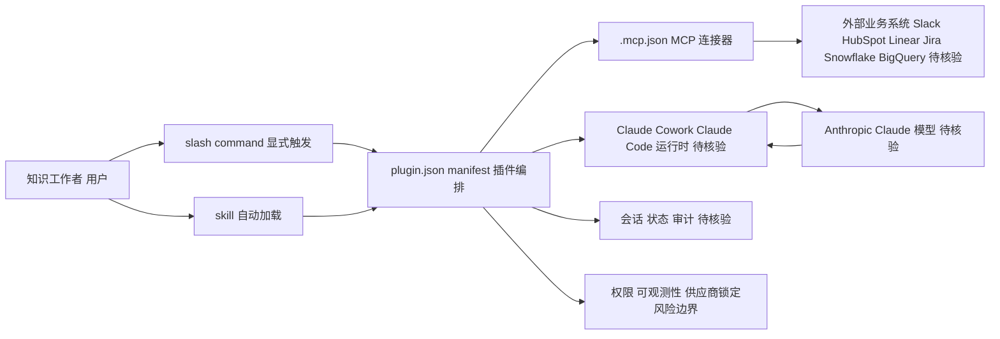

# knowledge-work-plugins

## 一句话定位

Anthropic 官方开源的知识工作者插件仓库，面向 Claude Cowork 和 Claude Code，提供 11 个按职能划分的插件（销售、客服、产品、营销、法务、财务、数据等）。

## 它解决的问题

知识工作者（非开发者）使用 AI Agent 时缺乏专用工具。本仓库提供文档处理、信息整理、研究辅助等知识工作专用插件。每个插件打包了 skills、connectors（MCP）、slash commands 和 sub-agents，覆盖一个完整职能的工作流。

## 为什么值得关注

- **Anthropic 官方出品**，23,353 stars / 2,819 forks，Apache-2.0 开源
- 11 个插件覆盖核心企业职能：productivity、sales、customer-support、product-management、marketing、legal、finance、data、enterprise-search、bio-research、cowork-plugin-management
- 每个 plugin 是纯文件（markdown + JSON），无代码、无基础设施、无构建步骤 — 降低了企业定制门槛
- 与 anthropics/skills（开发者向）互补，覆盖知识工作者场景

## 热度来源判断

- **官方背书驱动。** Anthropic 官方仓库自带信任度，23K stars 主要来自 Claude 生态用户
- 与 Claude Cowork 产品深度绑定，代表 Anthropic 企业市场的插件战略
- Apache-2.0 许可证利于企业采用和二次开发

## 关键技术亮点亮点

1. **标准化插件结构**：`plugin.json` manifest + `.mcp.json` connectors + `commands/` + `skills/`
2. **MCP 集成**：每个插件通过 MCP server 连接外部工具（Slack、HubSpot、Linear、Jira、Snowflake、BigQuery 等）
3. **纯文件架构**：markdown + JSON，Claude 自动加载 skills，slash commands 显式触发
4. **可定制性**：企业可以 swap connectors、添加公司上下文、调整工作流

## 架构师速览

| 决策问题 | 研究判断 | 证据边界 |
|---|---|---|
| 系统边界 | 仓库定位为 Claude Cowork 与 Claude Code 的职能插件集合，由 Anthropic 官方维护，承载 11 个职能插件并通过 MCP 接入外部业务系统 | 仅依赖档案与简介信息，未审计源码 |
| 主路径 | 用户调用 → 插件 manifest 加载 → slash command / skill 触发 → 通过 `.mcp.json` 连接器调用 Slack、HubSpot、Linear、Jira、Snowflake、BigQuery 等外部工具 | 文档未公开具体协议与时序 |
| 关键权衡 | “纯文件 + 通用起点”带来的低定制门槛，与企业场景中权限、上下文、可观测性、供应商锁定之间的平衡 | 档案明示“需大量定制才能真正可用”，无生产案例佐证 |
| 最小 PoC | 选取单一职能插件（如 enterprise-search 或 sales），最小 MCP 连接器集合、最小权限与可审计日志下跑通一个工作流，验证后再扩面 | 档案未给出部署形态与验收指标，需源码补齐 |

## 架构启发

**插件 = 技能 + 连接器 + 命令的三合一打包**。这比单一的 skills 目录更完整 — 一个插件就是一个完整的"数字员工角色"。对 Agent 平台设计有参考价值：面向职能而非面向功能的插件粒度。

## 架构图（MMD）

> 证据边界：此图只采用本档案已有可核验描述；“待核验”节点不应视为项目实现事实。

## 定位判断

**平台候选。** 这是 Anthropic 企业市场的插件基础设施，与 Claude Cowork 形成产品 + 插件生态的飞轮。

## 风险 / 局限 / 泡沫点

1. **仅服务于 Claude 生态**，通用性受限于 Anthropic 平台
2. 插件内容是通用起点（generic starting points），企业需要大量定制才能真正可用
3. 依赖 MCP 连接器生态成熟度 — 如果 MCP server 不可用，插件价值大打折扣
4. 11 个插件覆盖面有限，长尾职能（HR、运维、供应链）尚未覆盖

## 与同类项目的关系

- **anthropics/skills**（166K stars）：同为 Anthropic 官方，但面向开发者/通用 Skills
- **ECC**：第三方 Harness，knowledge-work-plugins 是官方插件标准
- **wshobson/agents**：社区多 Harness 插件市场，定位类似但非官方

## 是否值得持续跟踪

**是。** 官方知识工作者插件仓库，代表 Anthropic 企业 Agent 市场的插件战略方向。

## 后续观察点

1. 插件数量和质量增长（从 11 个扩展到多少）
2. 企业实际采用案例和定制模式
3. MCP 连接器覆盖的工具范围扩展
4. 是否会形成跨平台插件标准（超越 Claude 生态）
