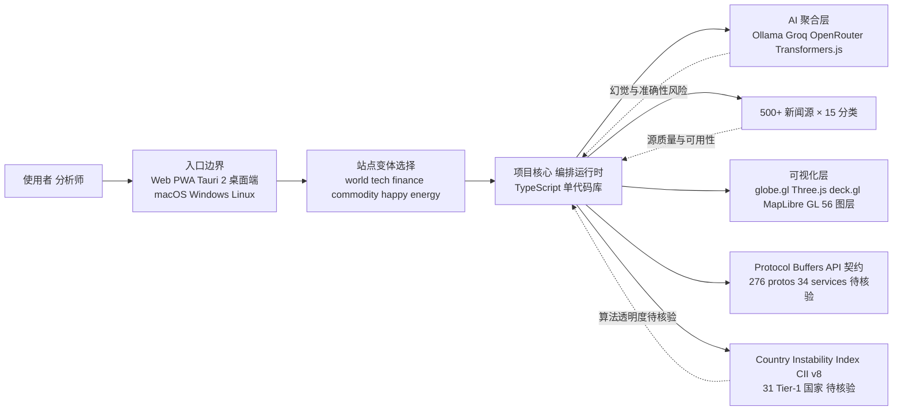

# koala73/worldmonitor

## 一句话定位
实时全球情报仪表盘——AI 驱动的新闻聚合、地缘政治监控和基础设施追踪，统一态势感知界面。

## 它解决的问题
信息碎片化时代，没有统一工具能同时追踪新闻、地缘政治、金融市场、基础设施事件。分析师需要跨多个平台手动拼接信息，缺乏实时关联和预警能力。

## 为什么值得关注（2026-06-24）
59K stars 持续增长（周增 2K），是一个少见的"AI 聚合 + 可视化 + 桌面端"全栈项目。单代码库构建 6 个站点变体（world/tech/finance/commodity/happy/energy）的架构设计极具参考价值。

## 热度来源判断
- **地缘政治不确定性**：2026 年全球局势紧张，情报需求上升
- **技术架构精良**：Protocol Buffers 定义 API、Tauri 2 桌面端、3D globe.gl 可视化
- **本地 AI 支持**：Ollama 集成意味着完全离线运行，隐私友好
- **多平台覆盖**：桌面（macOS/Windows/Linux）+ Web + PWA

## 关键技术亮点亮点
1. **500+ 新闻源 × 15 分类**：AI 合成摘要，跨流关联分析（军事/经济/灾难/升级信号）
2. **双地图引擎**：3D globe.gl（Three.js）+ WebGL deck.gl（MapLibre GL），56 种图层类型
3. **Country Instability Index (CII) v8**：31 个 Tier-1 国家的不稳定性压力评分，服务端权威计算
4. **金融雷达**：29 个证券交易所 + 大宗商品 + 加密货币 + 7 信号市场合成
5. **6 站点变体**：从单一代码库构建 world/tech/finance/commodity/happy/energy
6. **Tauri 2 桌面端**：Rust + Node.js sidecar，非 Electron
7. **Protocol Buffers**：276 protos / 34 services / sebuf HTTP annotations
8. **本地 AI**：Ollama + Groq + OpenRouter + Transformers.js（浏览器端推理）

## 架构师速览

| 决策问题 | 研究判断 | 证据边界 |
|---|---|---|
| 系统边界 | 单一 TypeScript 代码库同时输出 Web/PWA 与 Tauri 2 桌面端，对外交付边界由 6 个站点变体（world/tech/finance/commodity/happy/energy）共同承担 | 桌面端具体打包链路、Tauri sidecar 进程通信细节未在档案中给出，需源码核验 |
| 主路径 | 新闻源采集 → AI 聚合（Ollama/Groq/OpenRouter/Transformers.js）→ Protocol Buffers API 契约 → globe.gl / deck.gl 可视化 → 终端 UI 呈现 | 276 protos / 34 services 的服务拓扑、刷新频率、缓存策略档案未描述 |
| 关键权衡 | "多产品单代码库 + 多 AI provider + 500+ 源"的扩展速度，对冲的是 CII v8 算法不透明、AGPL 商业传染性、AI 摘要幻觉与新闻源质量波动 | CII v8 评分公式、聚合权重、AI 摘要评估方法档案未披露 |
| 最小 PoC | 单一站点变体 + 单一 AI provider（Ollama 离线）+ 受限新闻源 + 关闭金融雷达，验证地图渲染与 PB 契约后再扩展 | Railway relay、Vercel Edge Functions(60+) 的部署拓扑与配额档案未列 |

## 架构启发
worldmonitor 展示了一种优雅的"多产品单代码库"架构——通过 Protocol Buffers 定义统一 API 契约，同一个前端切换数据源和主题即可生成不同站点。这对需要做 white-label 或多市场的团队非常有启发。

Vercel Edge Functions（60+）+ Railway relay + Tauri + PWA 的部署策略也值得学习——一个代码库覆盖 Web、桌面、移动端。

## 架构图（MMD）

> 证据边界：此图只采用本档案已有可核验描述；“待核验”节点不应视为项目实现事实。

## 定位判断
**工具型（偏平台化）。** 当前是高质量的情报工具，但单代码库 6 站点变体的架构本质上是"情报聚合 white-label 平台"。如果开放 API 和自定义站点生成能力，可演化为平台。

## 风险 / 局限 / 泡沫点
1. **AI 合成准确性**：500+ 源的 AI 摘要可能出现事实错误或幻觉，影响情报可信度
2. **维护复杂度**：6 站点 + 桌面 + 多 AI provider = 极高的维护成本
3. **新闻源依赖**：500+ 源的可用性和质量随时间变化
4. **AGPL 协议**：对商业使用有传染性要求

## 与同类项目的关系
- **OSINT 工具（如 Maltego）**：更偏专业调查，worldmonitor 更偏实时态势感知
- **Bloomberg Terminal**：金融专业终端，worldmonitor 是开源替代
- **Google News**：聚合但不做关联分析和可视化
- **Strator/LangChain Agent**：worldmonitor 不是 Agent 框架，但可以作为 Agent 的数据源

## 是否值得持续跟踪
**是。** 作为"AI 聚合 + 可视化 + 多端部署"的架构范例非常值得研究。特别是对需要多产品/多市场/多端的团队。

## 后续观察点
1. 是否开放自定义站点变体生成能力（white-label 平台化）
2. CII 指数的算法透明度和准确性验证
3. 社区贡献的地图层和数据源扩展
4. Protocol Buffers API 契约是否可被第三方复用

---
*首次记录：2026-06-24*
