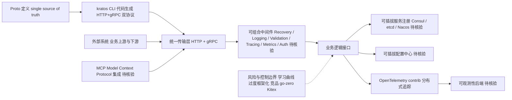

# go-kratos/kratos

## 一句话定位
B 站（哔哩哔哩）出品的 Go 语言云原生微服务框架——API-first 开发，Protobuf 驱动，统一 HTTP/gRPC 传输层，为云原生时代的微服务提供轻量、显式的组件化方案。

## 它解决的问题
Go 微服务开发的"框架选择困难"：标准库 net/http 太底层，grpc-go 只支持 gRPC，而 Beego/Gin 等 Web 框架偏单体应用。Kratos 填补了"云原生微服务全栈框架"的空白——从传输层（HTTP+gRPC 双协议）、中间件、服务注册发现、配置中心、日志追踪到代码生成，一站式覆盖微服务开发。

## 为什么值得关注
- **25,856 stars**，Go 微服务框架中最成熟的开源方案之一
- **大厂背书**：哔哩哔哩（B 站）核心业务生产环境使用
- **API-First 设计**：Protobuf 作为 single source of truth，自动生成 HTTP/gRPC 代码
- **2026 年仍活跃**：持续更新，Go 1.25+ 支持
- **MCP 集成**：最新版本已支持 MCP（Model Context Protocol），拥抱 AI 时代

## 热度来源判断
热度来自中国市场对 Go 微服务框架的巨大需求，以及 B 站的技术品牌背书。Kratos 在国内 Go 社区有很高的认知度，Trendshift 和 Product Hunt 等平台的推荐也带来了国际流量。

## 关键技术亮点亮点
- **Protobuf 驱动**：一个 .proto 文件生成 HTTP 和 gRPC 双协议代码
- **统一传输层**：HTTP 和 gRPC 接口共用同一套业务逻辑
- **可组合中间件**：Recovery、Logging、Validation、Tracing、Metrics、Auth 等开箱即用
- **可插拔组件**：服务注册（Consul/etcd/Nacos）、配置中心、编码等均可替换
- **CLI 代码生成**：`kratos new` 一键创建项目骨架，`kratos upgrade` 更新工具链
- **OpenTelemetry 集成**：contrib 包提供完整的分布式追踪支持

## 架构师速览

| 决策问题 | 研究判断 | 证据边界 |
|---|---|---|
| 系统边界 | Kratos 是一个面向 Go 微服务的全栈框架边界，覆盖传输层（HTTP+gRPC）、中间件、服务注册发现、配置中心、日志追踪与代码生成；不构成编排/模型/工具平台本身 | 边界仅依据档案"它解决的问题"与"关键技术亮点"段；与 AI Agent/编排平台的边界未在档案中证实 |
| 主路径 | Protobuf → 代码生成（HTTP/gRPC 双协议）→ 统一传输层 → 可组合中间件（Recovery/Logging/Validation/Tracing/Metrics/Auth）→ 可插拔组件（Consul/etcd/Nacos、配置中心、OpenTelemetry） | 路径基于档案亮点列举的组件串联；具体启动顺序、依赖注入与运行时拓扑未在档案中描述，需源码核验 |
| 关键权衡 | "显式优于隐式"、Protobuf single source of truth 带来的协议一致性收益 vs. Protobuf+gRPC+Kratos 的较高学习曲线与对简单项目的"过度框架化"风险；可插拔组件灵活性 vs. 与国内同类（go-zero、Kitex）竞争下的生态选择压力 | 权衡仅来自档案"架构启发"与"风险/局限"段；性能基准、生产案例细节、版本兼容性未给出 |
| 最小 PoC | 用 `kratos new` 生成骨架，写一个 .proto，验证 HTTP/gRPC 双协议出口与基础中间件链路，在单一服务注册/配置后端（如 etcd 或 Nacos）下跑通请求 → 中间件 → 业务逻辑回路 | PoC 步骤依据档案提到的 `kratos new`/升级 CLI、Protobuf 代码生成、OpenTelemetry contrib；具体依赖版本与部署形态"待核验" |

## 架构启发
Kratos 的核心设计理念是"显式优于隐式"——每个组件都有清晰的接口定义，不过度使用反射和魔法。Protobuf 作为协议层的 single source of truth 是重要设计——一份协议定义驱动接口文档、客户端 SDK、服务端实现，消除了协议层的不一致。

## 架构图（MMD）

> 证据边界：此图只采用本档案已有可核验描述；“待核验”节点不应视为项目实现事实。

## 定位判断
**Go 微服务基础框架**，定位类似于 Spring Cloud 之于 Java，但更轻量、更聚焦云原生。适合中大型后端团队的微服务体系建设。

## 风险 / 局限 / 泡沫点
- **学习曲线**：Protobuf + gRPC + Kratos 概念栈对新手不友好
- **Go 生态竞争**：go-zero、Kitex 等框架在同一赛道竞争激烈
- **国际化不足**：虽然文档有英文版，但社区讨论以中文为主
- **过度框架化风险**：简单项目可能不需要这么重的框架

## 与同类项目的关系
- **直接竞品**：go-zero（万星级 Go 微服务框架）、Kitex（字节跳动）、goa（设计优先）
- **上游依赖**：gRPC-Go、Protobuf、OpenTelemetry
- **生态定位**：在 Gin/Echo（Web 框架）和 Istio（Service Mesh）之间

## 是否值得持续跟踪
**值得跟踪**。作为国内 Go 微服务领域的重要框架，其架构演进（特别是最近的 MCP 集成）值得持续关注。对于 Go 后端开发者，这是必了解的框架之一。

## 后续观察点
- MCP 集成能否让 Kratos 在 AI 基础设施领域获得新增长
- 与 go-zero 的竞争格局变化
- 是否会推出 Cloud Native 的 managed 服务

---
> 数据来源: GitHub API (2026-08-07) | Stars: 25,856 | Forks: 4,172 | 语言: Go | License: MIT | 首次发现: 2026-06-17
