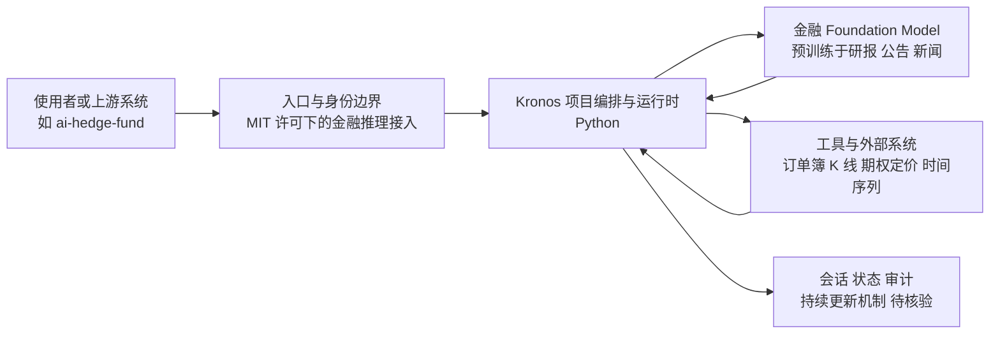

# Kronos

## 一句话定位
为金融市场语言训练的 Foundation Model——理解订单簿、K 线、期权定价、风险敞口等金融领域特殊语言。

## 它解决的问题
通用 LLM（GPT-4、Claude）对金融市场的语言理解不足。金融领域有大量特殊术语、数据格式和推理模式（如隐含波动率、希腊字母、期限结构），通用模型无法有效处理。

## 为什么值得关注（2026-04-15）
- 17,799 stars，MIT 许可，日增 963
- 验证"垂直领域 Foundation Model"路径在金融领域的可行性
- 与 ai-hedge-fund（54,140 stars）形成互补

## 热度来源判断
**概念吸引力 + 真实需求：** AI + 金融是热门话题，但金融 NLP 的技术需求也是真实的。stars 中约 50% 来自概念热度，50% 来自实际应用需求。

## 关键技术亮点亮点
1. **金融语言预训练**：在金融文本（研报、公告、新闻）上预训练，理解金融术语和推理
2. **多模态金融数据**：不仅处理文本，还能理解时间序列数据的语义
3. **MIT 许可**：商业友好，金融行业可以自由使用

## 架构师速览

| 决策问题 | 研究判断 | 证据边界 |
|---|---|---|
| 系统边界 | Kronos 作为 Python 实现的金融垂直 Foundation Model，定位是通用 LLM 之上的金融语义层（订单簿、K 线、期权定价、风险敞口），由调用方编排接入。 | "一层"判断依据为档案"垂直 FM …… 深度覆盖 20%"定位；具体 API 形态、训练/推理拆分不明。 |
| 主路径 | 输入（订单簿/研报/新闻/时间序列）→ Kronos 金融语义理解 → 输出金融推理结果（含隐含波动率、希腊字母、期限结构等）。 | 档案仅列出"金融语言预训练 + 多模态金融数据"两大能力，是否含工具调用与会话状态未证实。 |
| 关键权衡 | 垂直深度 vs 时效与监管：金融数据快速变化，且用于决策时受监管审查，须权衡自建/采购与持续更新成本。 | 风险点直接来自档案"风险/局限"小节；与 ai-hedge-fund 互补关系为档案原话。 |
| 最小 PoC | 在 MIT 许可下用单一金融语料子集（研报或 K 线）跑通预训练→推理闭环，对比通用 LLM 在隐含波动率等术语上的理解差异，留审计日志。 | PoC 形态仅为研究建议；实际训练脚本、checkpoint 格式、数据 schema 需源码核验。 |

## 架构启发
垂直领域 Foundation Model 的路径正在被验证：
- **通用 LLM** → 覆盖 80% 的场景
- **垂直 FM**（如 Kronos）→ 深度覆盖 20% 的高价值垂直场景
- 两者互补，不是替代关系

## 架构图（MMD）

> 证据边界：此图只采用本档案已有可核验描述；“待核验”节点不应视为项目实现事实。

## 定位判断
金融领域的专用 AI 基础设施。不与通用 LLM 竞争，而是在金融垂直场景提供更深度的理解。

## 风险 / 局限 / 泡沫点
1. **金融监管风险**：AI 模型用于金融决策面临严格的监管审查
2. **数据时效性**：金融市场数据快速变化，模型需要持续更新
3. **17K stars 可能虚高**：AI + 金融 的概念热度大于实际使用
4. **金融行业壁垒**：真正的大资金机构更倾向自建模型

## 与同类项目的关系
- **ai-hedge-fund**（54,140 stars）：AI 投资决策框架，Kronos 可以作为其底层理解引擎
- **FinGPT**：学术界类似的金融 NLP 项目

## 是否值得持续跟踪
**是。** 垂直 FM 路径如果成功，将是 AI 落地的重要模式。

## 后续观察点
1. 是否有金融机构公开采用
2. 模型在真实交易场景的回测表现
3. 是否出现其他垂直领域的类似项目（法律、医疗）

---
*首次记录：2026-04-15*
