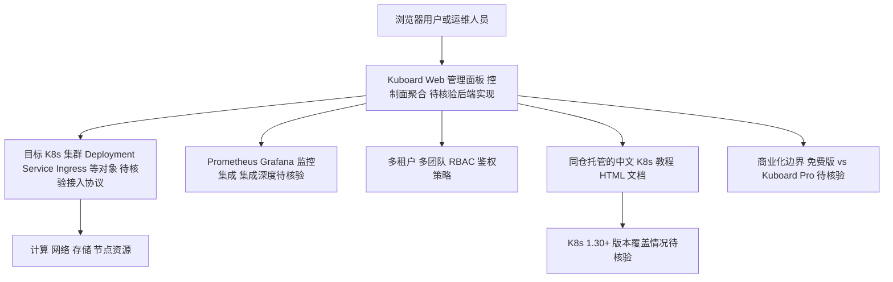

# eip-work/kuboard-press

## 一句话定位
Kubernetes 微服务管理界面 + 中文 K8s 免费教程——提供可视化 K8s 管理面板，同时提供最全面的中文 Kubernetes 安装和使用教程。

## 它解决的问题
Kubernetes 原生命令行操作（kubectl）学习曲线陡峭，对新手不友好。同时中文 K8s 教程稀缺且分散。Kuboard 一方面提供 Web 界面简化 K8s 管理（类似 Dashboard 的增强版），另一方面提供高质量的中文 K8s 教程（从安装到进阶），降低了国内开发者使用 K8s 的门槛。

## 为什么值得关注
- **Stars:** 25,152 stars，中文 K8s 生态头部
- **Forks:** 1,600
- **HTML 格式**：教程在线可读
- **K8s 管理面板**：可视化微服务管理
- **中文教程**：从安装到实战的完整教程
- **持续维护**（2026-08-06），跟进 K8s 最新版本
- 在国内 K8s 社区有很高知名度

## 热度来源判断
- **国内 K8s 采用率高（极高）**：云原生在国内已成主流
- **中文教程稀缺（高）**：Kuboard 教程是很多人入门 K8s 的第一站
- **可视化需求（高）**：不是所有人都喜欢命令行
- **长期积累（高）**：运营多年，口碑稳定

## 关键技术亮点亮点
1. **K8s 可视化管理**：图形化界面管理 Deployment/Service/Ingress 等
2. **微服务视角**：从微服务角度组织 K8s 资源视图
3. **中文教程体系**：安装手册（各版本）+ 入门教程 + 进阶实战 + 在线答疑
4. **多集群管理**：支持管理多个 K8s 集群
5. **监控集成**：内置 Prometheus/Grafana 监控
6. **权限管理**：多租户/多团队 RBAC

## 架构师速览

| 决策问题 | 研究判断 | 证据边界 |
|---|---|---|
| 系统边界 | Kuboard 同时承担两层职责：Web 形态的可视化 K8s 管理面板（控制面代理/聚合层），以及与项目同仓托管的中文 K8s 教程（HTML 文档资源）。 | 档案明确"语言: HTML"，标注 HTML 在线可读；管理面板与教程是否同进程、是否共用后端，公开资料未说明。 |
| 主路径 | 用户浏览器 → Kuboard Web 控制台 → 目标 K8s 集群 API（按档案所述管理 Deployment/Service/Ingress 等对象）。教程路径则独立于集群控制平面。 | 协议、认证方式、是否 in-cluster 部署均未在档案中描述，属待核验。 |
| 关键权衡 | Web GUI 易用性 vs 功能深度：档案自承相比 Rancher 功能有限，与 K9s/Lens/官方 Dashboard 存在差异化竞争；多集群能力与教程跟随 K8s 新版本(1.30+)的更新速度是核心变量。 | 具体安全模型、RBAC 边界、教程覆盖率与版本对齐进度均无公开数据。 |
| 最小 PoC | 建议在隔离的测试 K8s 集群上部署 Kuboard，验证多集群接入、RBAC/多租户隔离、Prometheus/Grafana 监控集成，以及教程内容对目标版本的覆盖度；把商业模式（免费版 vs Kuboard Pro）边界列为验收项。 | 是否支持多集群由档案列举为"亮点"，但具体集群接入方式、监控集成深度、RBAC 粒度均未给出。 |

## 架构启发
- **本地化教程的力量**：在非英语市场，本地化高质量教程是关键流量入口
- **工具+教程双轮驱动**：管理工具吸引使用，教程吸引学习，相互促进
- **可视化降低门槛**：复杂系统（K8s）需要好的可视化

## 架构图（MMD）

> 证据边界：此图只采用本档案已有可核验描述；“待核验”节点不应视为项目实现事实。

## 定位判断
**成熟工具型+资源型项目**。在国内 K8s 生态中扮演重要角色，既是管理工具又是学习资源。

## 风险/局限/泡沫点
- **与 K9s/Lens 竞争**：K9s（TUI）和 Lens（GUI）是更强竞品
- **功能深度**：相比 Rancher 等企业级方案，Kuboard 功能有限
- **K8s Dashboard 官方**：官方 Dashboard 虽然简单但零依赖
- **教程时效性**：K8s 版本迭代快，教程需持续更新
- **商业模式不明**：免费版 vs 专业版的功能划分

## 与同类项目的关系
- **vs K9s**：K9s 是 TUI 工具，Kuboard 是 Web GUI
- **vs Lens**：Lens 是桌面客户端，Kuboard 是 Web 服务
- **vs Rancher**：Rancher 更企业级（多集群管理），Kuboard 更轻量
- **vs K8s Dashboard**：官方 Dashboard 功能基础，Kuboard 功能丰富
- **vs Kubernetes 中文社区**：社区偏论坛，Kuboard 偏系统教程

## 是否值得持续跟踪
**推荐关注（国内 K8s 用户）。** 如果在国内使用 K8s，Kuboard 教程是最好的中文学习资源之一。管理工具按需采用。

## 后续观察点
- K8s 新版本（1.30+）的教程更新速度
- 是否增加云原生 AI 工作负载管理
- 与 Service Mesh（Istio/Linkerd）的集成
- 商业化进展（Kuboard Pro 的功能和企业采用）
- 是否有 K8s 安全管理功能

---
> 数据来源: GitHub API (2026-08-06) | Stars: 25,152 | Forks: 1,600 | 语言: HTML
