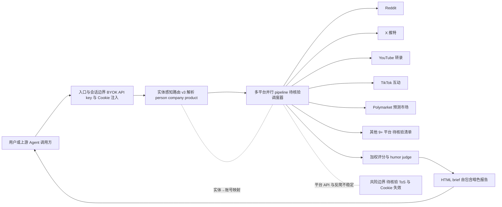

# last30days-skill

## 一句话定位
AI agent 跨平台搜索技能，聚合 Reddit/X/YouTube/TikTok/Polymarket 等 10+ 平台信号，按真实互动数据评分合成研究简报。

## 它解决的问题
AI Agent 无法同时访问多个社交/内容平台的数据孤岛。Google 不搜 Reddit 评论，ChatGPT 只有 Reddit 协议，Gemini 有 YouTube 没有Reddit。Agent 需要跨平台综合信号才能做出有价值的研究判断。

## 为什么值得关注（2026-06-07）
首次将"多源社交信号聚合"做成 Agent 原生 skill，且 v3 引擎引入了**实体感知路由**——不是简单关键词搜索，而是先解析实体（人、公司、产品），再路由到正确的平台账号和社区。这代表了 Agent 搜索从"关键词匹配"到"实体理解"的重要升级。

## 热度来源判断
- **真实需求驱动**：AI Agent 做研究时确实需要跨平台数据，这是刚需
- **Claude Code skill 生态红利**：通过 marketplace 分发，安装零配置
- **病毒性案例**：README 中的"/last30days Peter Steinberger"案例极具说服力
- GitHub Trending 首日上榜，趋势信号强

## 关键技术亮点亮点
1. **实体感知路由（v3 核心）**：输入"Peter Steinberger"自动解析为 @steipete (X) + steipete (GitHub) + r/ClaudeCode，双向映射 person→company→product
2. **多平台信号融合**：Reddit upvotes + X likes + YouTube transcripts + TikTok engagement + Polymarket 真金白银预测，不是简单的搜索聚合而是**加权评分**
3. **竞争分析模式**：`--competitors` 参数自动发现竞品并并行运行多 pipeline
4. **HTML brief 输出**：生成自包含的暗色模式 HTML 报告，可直接拖入 Slack/Notion
5. **Humor/wit 评分**：v3 第二个 judge 专门评分幽默感和病毒性

## 架构师速览

| 决策问题 | 研究判断 | 证据边界 |
|---|---|---|
| 系统边界 | last30days-skill 是一个 Agent 原生 Skill 桥接层，向上承接 Claude Code 这类 agent 运行时与用户，向下桥接 Reddit/X/YouTube/TikTok/Polymarket 等 10+ 外部平台 API/Cookie 数据源；自身不建搜索引擎，也不持有平台账户 | 平台清单与"Agent Skill 层"定位来自档案与 README 摘录；具体 API/协议、Cookie 注入方式未在档案中证实 |
| 主路径 | 用户查询 → 实体感知路由（v3，先解析人/公司/产品，再映射到各平台账号与社区）→ 多 pipeline 并行检索与加权评分（互动量、转录、Polymarket 真金白银信号）→ HTML brief 合成输出；竞争分析走 `--competitors` 多 pipeline 并行 | 实体路由、加权评分、HTML 报告、`--competitors` 均来自档案；评分权重公式、并行度上限、缓存与重试策略档案未披露 |
| 关键权衡 | BYOK 模式下扩展性 vs 合规与稳定性：易接入 14+ 平台（"快"），但把 Cookie、反爬与平台 ToS 风险全部下沉到用户侧；单人维护带来 bus factor 风险；跨平台适配数与维护成本正相关增长 | 风险条目来自档案"风险/局限"小节；实际 Cookie 失效频率、封禁率、单人维护属实性需以仓库贡献者与 issue 节奏核验 |
| 最小 PoC | 单一封闭查询（如仅 Reddit+YouTube 两个低风险源）、最小 Cookie/API key 权限、全程审计日志、HTML brief 输出可复现；验收需含平台 ToS 合规检查、退出路径（关闭 Cookie 与 key ）、单平台失败隔离三条 | PoC 边界为架构推断，档案未给出官方示例查询或测试集，组件细节须以源码/文档核验 |

## 架构启发
- **Agent Skill 作为桥接层**：不是建新搜索引擎，而是用 Agent 桥接现有平台 API
- **BYOK 模式**：用户自带 API key 和 Cookie，基础设施不承担平台合规风险
- **预研究 → 并行搜索 → 合成** 三阶段流水线，比串行搜索快 3x

## 架构图（MMD）

> 证据边界：此图只采用本档案已有可核验描述；“待核验”节点不应视为项目实现事实。

## 定位判断
**Agent Skill 层** — 不是平台也不是基础设施，而是 Agent 生态中的垂直能力插件。类比：last30days-skill 之于 Agent，相当于 Raycast Extensions 之于 Raycast。

## 风险 / 局限 / 泡沫点
1. **平台 API/Cookie 稳定性风险**：X/Twitter 经常改 API 和反爬策略
2. **合规风险**：Cookie 方式访问平台数据存在灰色地带
3. **单人维护**：目前主要是 mvanhorn 个人项目，bus factor 低
4. **功能复杂度高**：14+ 平台适配的维护成本随时间递增

## 与同类项目的关系
- **vs Agent-Reach**：Agent-Reach 是 CLI 脚手架（装工具+配环境），last30days-skill 是 Skill（Agent 原生能力）。不同层次，互补关系
- **vs Perplexity**：Perplexity 做网页搜索，last30days 做**社交信号搜索**，维度不同
- **vs Tavily/Exa**：通用搜索 API vs 社交平台深度聚合

## 是否值得持续跟踪
**是。** 跨平台信号聚合是 Agent 生态的关键能力缺口，last30days-skill 的实体感知路由设计有平台化潜力。

## 后续观察点
1. 是否从 skill 演化为独立平台/服务
2. 商业化路径（目前免费 + BYOK）
3. 平台适配稳定性——X/Twitter 封禁频率
4. 是否有大型 Agent 框架（Claude Code/Cursor）官方集成

---
*首次记录：2026-06-07*
