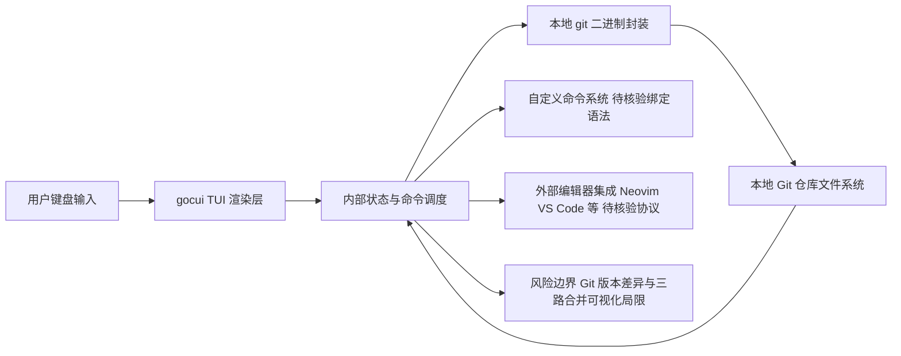

# jesseduffield/lazygit

## 一句话定位
终端原生的 Git 图形化 TUI 客户端，通过键盘驱动的交互界面大幅简化 Git 操作复杂度。

## 它解决的问题
Git 命令行虽然强大，但操作复杂、记忆负担重——尤其是 rebase、cherry-pick、冲突解决等高级操作。图形化 Git 客户端（如 SourceTree、GitKraken）需要切换到 GUI 窗口，打断了终端工作流。lazygit 面向习惯终端工作但希望降低 Git 操作复杂度的开发者，在终端内提供了一个直观的 TUI 界面，用快捷键完成几乎所有 Git 操作。

## 为什么值得关注
- **Stars:** 81,112 stars，在终端工具中属于顶级项目
- **开发者生产力工具标杆:** lazygit 的 TUI 设计模式被大量其他工具借鉴
- **活跃维护:** 创建于 2018 年，持续迭代至今，社区活跃且响应及时
- **跨平台 Go 实现:** 单二进制部署，Linux/macOS/Windows 全平台支持

## 热度来源判断
热度完全来自真实需求——Git 是每个开发者的日常工具，降低 Git 操作复杂度是普遍痛点。81K stars 经过 8 年积累，年均约 10K stars，增长曲线稳定无泡沫。lazygit 已经成为终端开发者的「基础设施级」工具，与 bat、fzf、ripgrep 等并列。

## 关键技术亮点亮点
1. **精心设计的 TUI 交互:** 基于 Go 的 gocui 库构建，键盘快捷键布局经过深思熟虑，学习曲线平缓且操作高效
2. **交互式 Rebase:** 最强大的功能之一——可视化地 rebase、reorder、squash commits，比命令行直观一个数量级
3. **可视化 Diff 查看:** 支持 line-level diff 查看，可以精确选择文件的部分变更进行 staging（patch mode）
4. **自定义命令系统:** 支持用户定义快捷键绑定到自定义 Git 命令，扩展性极强
5. **集成编辑器支持:** 可与 Neovim、VS Code 等编辑器深度集成，实现终端内的完整开发工作流

## 架构师速览

| 决策问题 | 研究判断 | 证据边界 |
|---|---|---|
| 系统边界 | lazygit 是终端内 TUI 应用，边界落在「用户键盘输入 → 本地 gocui 渲染层 → Git 命令封装与仓库状态同步 → 本地文件系统/外部编辑器」，不涉及服务端或网络服务 | 档案未给出具体依赖清单与外部 API；外部能力以"集成编辑器/自定义命令"描述，具体协议未证 |
| 主路径 | 用户按键 → gocui TUI 渲染 → 内部状态/命令层调用本地 `git` 二进制 → 解析仓库状态后回写 UI；rebase/diff/staging/patch 等功能均沿此闭环 | 档案提及 gocui 与 Git 封装，未公开具体模块划分，命令调度细节需源码核验 |
| 关键权衡 | 「终端原生体验 vs GUI 可视化能力」与「gocui 单进程状态同步 vs Git 命令外部副作用」之间的张力；自定义命令体系是核心可扩展点也是潜在风险面 | 三路合并、Git 版本差异、bus factor 已在档案"风险"段标注；具体快捷键集与自定义命令语法未列 |
| 最小 PoC | 在本地仓库用 lazygit 完成「分支切换 → patch staging → 交互式 rebase（reorder/squash）→ 触发自定义命令」一条主路径，并记录快捷键学习成本、版本兼容与编辑器联动行为 | 档案未提供版本兼容性矩阵与 PoC 验收指标，需在测试中自行定义 |

## 架构启发
lazygit 的成功证明了一个设计原则：对于复杂命令行工具，TUI 比纯 CLI 或 GUI 更适合开发者——它保持了终端的原生体验（可嵌入 tmux、可 SSH 使用），同时提供了 GUI 的可视化便利。其架构上的关键是「状态管理」——Git 仓库状态变化频繁，lazygit 需要高效地同步文件系统状态和 TUI 渲染。

## 架构图（MMD）

> 证据边界：此图只采用本档案已有可核验描述；“待核验”节点不应视为项目实现事实。

## 定位判断
属于终端开发者工具生态的核心组件。在 Git 工具链中，lazygit 是「终端 TUI」赛道的绝对王者，与 GUI 类工具（GitKraken、SourceTree）服务不同用户群体。

## 风险 / 局限 / 泡沫点
1. **TUI 的天然局限:** 对于复杂的三路合并冲突，TUI 的可视化能力仍然不如图形化工具
2. **Git 命令依赖:** lazygit 是 Git 的封装层，Git 的行为变化（如版本更新导致的命令差异）可能影响稳定性
3. **学习曲线存在:** 虽然比 Git CLI 易用，但 lazygit 自身也有大量快捷键需要记忆
4. **维护者依赖:** 项目高度依赖 jesseduffield 个人维护，bus factor 较低

## 与同类项目的关系
- **GitUI (extrawurst/gitui):** 同为 Rust TUI Git 客户端，性能更好但功能覆盖不如 lazygit 全面
- **Tig:** 更老牌的 TUI Git 浏览器，但偏只读浏览，操作能力远不如 lazygit
- **Fork/GitKraken:** 图形化 Git 客户端，功能更丰富但需要离开终端

## 是否值得持续跟踪
**值得持续跟踪但优先级中等。** lazygit 已是成熟的基础工具，后续演进主要在新功能优化和适配 Git 新特性。对于终端工具生态的观察者，它仍是 TUI 设计模式的标杆参考。

## 后续观察点
- 关注 lazygit 是否支持 Git 的新特性（如 --filter=blob:none 部分克隆的可视化）
- 观察是否有与 LSP/AI 工具集成的计划（如 AI 辅助 commit message 生成）
- 跟踪项目的社区贡献健康度和长期维护可持续性

---
> 数据来源: GitHub API (gh cli) | 更新: 2026-08-07 | Stars: 81,112 | Language: Go | License: MIT | Forks: 2,964
