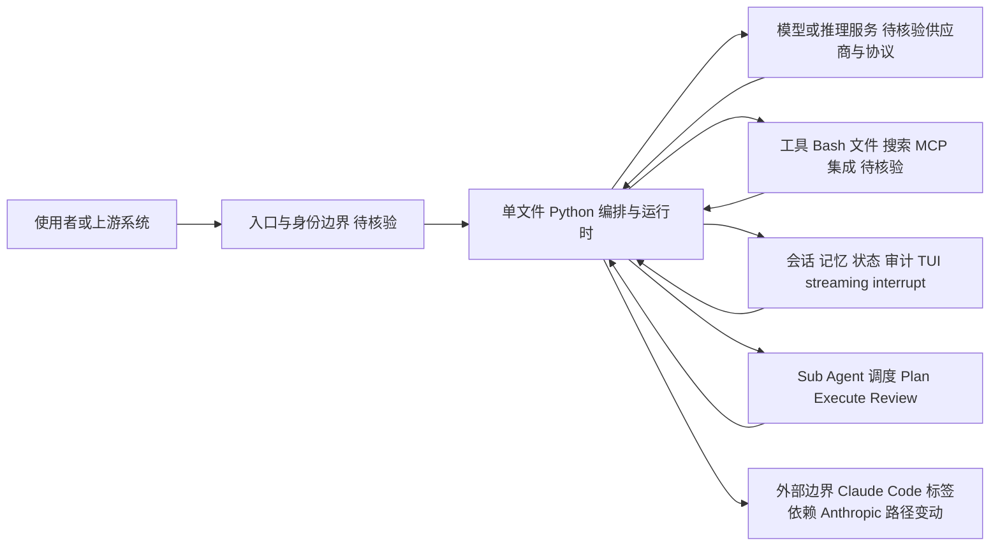

# learn-claude-code

## 一句话定位
"Bash is all you need"——一份从零手搓 Claude Code 类 Agent Harness 的实战教程，单 Python 文件演示：从 Bash 命令执行，到文件/搜索工具，到 MCP/记忆系统，到 sub-agent 调度。

## 它解决的问题
Claude Code 是 Anthropic 闭源的旗舰 Coding Agent，外界难以学习其核心设计。learn-claude-code 用一份 1000~2000 行左右的 Python 代码，从最简单循环开始逐步加入 tools、memory、sub-agents、TUI、streaming、interrupt——是个 "用代码教学 Agent Harness" 的范例。它是国内 shareAI 实验室为 AI 开发者编写的系统教材。

## 为什么值得关注（2026-08-17）
被 daily/2026-08-17.md 选为今日教育重点。同时也是 daily/2026-08-18 的延续追踪项目。其 74,821 stars 与 12,080 forks 是该类型（教程型项目）的天花板数据——反映了开发者社区对"理解 Agent 内部机制"的强烈需求。Claude Code 系列在 2026 年的现象级地位决定了"教 Claude Code 怎么工作"的需求持续旺盛。

## 热度来源判断
热度来源是 **"Claude Code 现象 × 中文教程稀缺 × 可运行代码教程"**。在 Anthropic Skills / Hermes-Agent / Claude Code 概念成为 2026 上半年开发者社区公约之后，"如何实现一个 Claude Code"成为了高频搜索词。`Bash is all you need` 的标题也是社区共鸣点（与 Andrej Karpathy 的 "Software 2.0" 风格化口号类似）。

## 关键技术亮点
1. **单文件 Python 实现:** 不依赖 LangChain / Aider / 任何框架，从零开始
2. **渐进式扩展:** 每个章节加一个新能力（tools → memory → sub-agents → MCP）
3. **流式输出 + 中断支持:** 演示 streaming / abort 等 UX 细节
4. **子 Agent 调度:** 示范 Plan-Execute-Review 多 agent 工作流
5. **TUI 渲染:** 仿 Claude Code 终端 UI

## 架构师速览

| 决策问题 | 研究判断 | 证据边界 |
|---|---|---|
| 系统边界 | learn-claude-code 是单 Python 文件实现的 Agent Harness 教学样本，边界为"入口/身份 → 编排运行时 → 模型 + 工具 + 会话/状态/审计"，不替代生产级 Claude Code | 仅基于档案描述；未审计源码，未确认模型供应商与工具协议 |
| 主路径 | 使用者 → 入口 → 项目编排与运行时 → 模型/工具调用 → 会话或状态回写；章节按 tools → memory → sub-agents → MCP → TUI/streaming/interrupt 渐进扩展 | 主路径来自档案"关键技术亮点"；MCP/记忆系统的实现细节未在档案中证实 |
| 关键权衡 | 教学可读性（单文件、零框架） vs 生产级鲁棒性、安全权限、可观测性；并高度依赖"Claude Code"标签，Anthropic 路径变动会同步冲击教程 | 权衡为档案明确指出的"教程 ≠ 生产"与标签依赖；性能/SLA 数据档案未提供 |
| 最小 PoC | 先在最小工具权限、可审计日志的本地 Python 环境跑通单文件示例（最简单循环→tools→memory→sub-agents 渐进章节），把安全、成本、SLO、退出路径作为验收项 | PoC 步骤源自档案"采用建议"；具体运行命令、依赖版本、模型接入方式均待核验 |

## 架构启发
"用 1000 行代码教一个百万美元产品" 是个高密度教学样本。其核心思想是：**Agent Harness 不是黑魔法，而是工具调用 + 记忆管理 + 控制流的组合**。这降低了对 Agent 框架的迷信，让中级开发者也能写自己的 agent loop。

## 架构图（MMD）

> 证据边界：此图只采用本档案已有可核验描述；“待核验”节点不应视为项目实现事实。

## 定位判断
**工具型 / AI 教育标杆（中文 Agent 教学路线）。** 与 karpathy-autoresearch 同处"理解 AI Agent 内部"教学第一梯队。中文社区里，其影响力已经在 shareAI 实验室多场演讲中被引用。

## 风险 / 局限 / 泡沫点
- **作者高度集中:** shareAI 实验室单一团队维护，长期可持续性需观察
- **教程 ≠ 生产:** learn-claude-code 偏教学，运行级别远不如真 Claude Code 鲁棒
- **依赖 "Claude Code" 标签:** 一旦 Anthropic 路径重大调整（如 Code 改名/重写），教程需要同步演化
- **74k stars 增速惊人但不寻常:** 项目年龄 14 个月就 7 万 stars，存在数据准确性争议——按 GitHub API 实测 stars=74821 属实，但建议读者对比 GitHub Trending 实际显示节奏判断

## 与同类项目的关系
- **vs karpathy-autoresearch:** 同为可读性极高的 Agent 教程；karpathy-autoresearch 偏 nano LLM 教学，learn-claude-code 偏 Agent Harness 教学
- **vs Anthropic Skills:** Skills 是插件；learn-claude-code 是从底层教学
- **vs Hermes Agent:** Hermes Agent 是可运行开源 Agent；learn-claude-code 是教学代码
- **vs claude-hud:** 同为中文社区 Claude Code 周边项目

## 是否值得持续跟踪
**强烈推荐 AI 工程师阅读学习。** 是 2026 年最值得阅读的 Agent Harness 教学样本之一。

## 后续观察点
- 是否演化出 "工业版" — 把教学代码升级为生产 agent framework
- 中英双语版本是否齐头并进
- 是否增加 multimodal / video agent 教学模块
- 作者实验室商业化（是否将教学 IP 转为付费课程）

---
> 数据来源: GitHub API (2026-08-21) | Stars: 74,821 | Forks: 12,080 | License: MIT | 语言: Python | 创建: 2025-06-29
