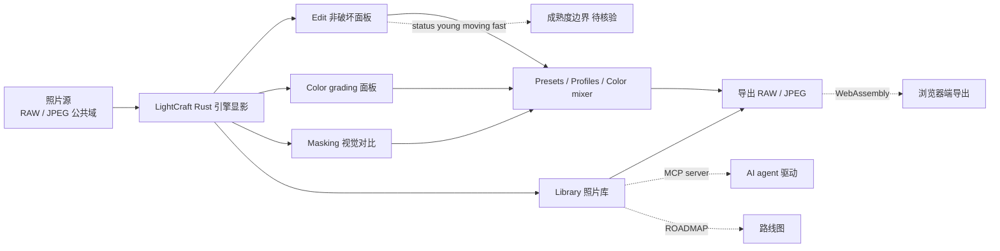

# storytold/lightcraft

## 一句话定位
Adobe Lightroom 照片库 / RAW 显影工作流的 clean-room Rust 重实现，跨 macOS/Windows/Linux + 浏览器 WebAssembly + MCP server（agent-ready）+ ROADMAP 公开，由 ArtCraft 团队 + MIT OR Apache-2.0 推出。

## 它解决的问题
Adobe Lightroom 是摄影师行业事实标准，但闭源 + 订阅制 + 平台限制（macOS/Windows，无 Linux）+ 与其他 Adobe 产品强绑定。lightcraft 是其"开源清洁替代"：100% Rust + clean-room + 跨 4 平台 + WebAssembly + MCP server（agent-ready）+ MIT OR Apache-2.0 商用清晰。目标用户是摄影师（想要等效工作流但不愿付费）、Linux 平台用户（Lightroom 不支持）、AI agent 开发者（通过 MCP server 驱动照片处理）。

## 为什么值得关注
- **Stars:** 2,859（截至 2026-10-08），8 天突破 2800
- **Forks:** 836
- **License:** MIT OR Apache-2.0
- **语言:** Rust
- **覆盖:** Editing / Color grading the cinematic way / Before & after / Masking / Presets, profiles and the color mixer / Library / Agents & MCP / Fast native + Private / Performance / Feature Status / Quick start / Roadmap
- **ROADMAP.md:** 公开路线图
- **ArtCraft 全家桶:** photocraft + filmcraft + lightcraft + pdfcraft + vectorcraft + effectcraft 6 件套
- **跨平台:** macOS / Windows / Linux 原生 + 浏览器 WebAssembly

## 热度来源判断
lightcraft 的热度是 **"Adobe Lightroom 替代刚需 × clean-room Rust 重实现 × 4 平台覆盖 × MCP agent-ready × ArtCraft 全家桶"** 的强劲组合。Adobe 闭源订阅是长期痛点，但开源替代品（darktable、RawTherapee 等）UX 或功能深度不足。lightcraft 通过 Rust + 4 平台 + WebAssembly + MCP + ROADMAP 公开提供差异化能力。836 个 forks 反映摄影师社区的高度期待。热度**真实且具 Adobe 替代品潜力**——但需警惕：（1）"young and moving fast" 与稳定生产工具的差距；（2）RAW 显影引擎的解码支持广度；（3）Masking 算法的成熟度。

## 关键技术亮点
1. **clean-room Rust 重实现：** 100% Rust + 不参考 Adobe 闭源代码
2. **4 平台覆盖：** macOS / Windows / Linux 原生 + WebAssembly 浏览器端
3. **非破坏编辑：** 每个调整都是非破坏性的
4. **照片库管理：** Library 组织功能
5. **RAW 显影：** 相机 RAW 文件解码与显影
6. **Masking：** "Masking that goes where you point" 的视觉对比
7. **Presets + Profiles + Color mixer：** 预设与色彩管理
8. **Color grading the cinematic way：** 电影级调色
9. **MCP server（agent-ready）：** AI agent 可驱动照片处理
10. **ROADMAP 公开：** 路线图透明
11. **MIT OR Apache-2.0 商用清晰：** 双 license

## 架构师速览

| 决策问题 | 研究判断 | 证据边界 |
|---|---|---|
| 系统边界 | Adobe Lightroom 照片库/RAW 显影工作流的 clean-room Rust 重实现：照片库 + RAW 显影 + 非破坏编辑 + Masking + Presets + Profiles + Color mixer + Color grading + Library + Agents（MCP） + macOS/Windows/Linux + Web WebAssembly + ArtCraft 团队 + Discord + ROADMAP + MIT OR Apache-2.0 | 仅基于 README 描述的 LightCraft 工作流；具体 RAW 解码支持广度 / Masking 算法 / ROADMAP 实施节奏未在档案中明示 |
| 主路径 | 照片源（RAW/JPEG）→ LightCraft Rust 引擎显影/非破坏编辑 → Edit/Color/Library 等面板 → 导出（RAW/JPEG） | 主路径为档案语义抽象；具体 RAW 解码 pipeline、非破坏编辑数据模型、WebAssembly 边界未在档案中讨论 |
| 关键权衡 | clean-room Rust 重实现 vs Adobe Lightroom 闭源 + 跨 macOS/Windows/Linux/Web vs 单平台 + 100% Rust vs 部分原生 + 非破坏编辑 vs 破坏性编辑 + Masking 视觉对比 vs 复杂工具栏 + agent-ready（MCP）vs 单 GUI + MIT OR Apache-2.0 vs Adobe 商业授权 + ROADMAP 公开 vs 路线不明 + young moving fast vs 稳定 | 档案明示 100% Rust + clean-room + 跨 4 平台 + Web WebAssembly + MCP + ROADMAP + MIT OR Apache-2.0 + ArtCraft 团队；具体 RAW 解码支持广度 / Masking 算法严谨度 / ROADMAP 实施节奏未在档案中讨论 |
| 最小 PoC | git clone storytold/lightcraft → 在 macOS/Windows/Linux 上 cargo build/run → 加载公共域照片（如 Ansel Adams The Tetons）→ 验证非破坏编辑 → 验证 Masking → 验证 Presets → 验证 Library → 验证 MCP 接口 → 跟踪 ROADMAP | PoC 范围由档案「非破坏编辑/Masking/Presets/Profiles/Color grading/Library/MCP/ROADMAP + 跨 4 平台」建议推导；具体 RAW 解码支持广度 / Masking 算法严谨度 / ROADMAP 实施节奏未在档案中讨论 |

## 架构启发
lightcraft 的核心启发是 **"Adobe 创意套件 clean-room 重实现需要 Rust + 跨平台 + agent-ready + 路线图透明四件套"**。当前 Adobe 替代品（darktable、RawTherapee 等）多停留在 C++/Python，单平台，agent 集成弱。lightcraft 通过 Rust + WebAssembly + MCP server + ROADMAP 四件套组合，提供"原生 + 浏览器 + agent 驱动 + 路线透明"四位一体能力。ROADMAP 公开是显著差异化——Adobe 从不公开产品路线图，而开源项目可借此建立社区信任。更深层的启发是：**ArtCraft 全家桶（6 件套）形成 Adobe 创意套件完整开源替代的网络效应**。单个 lightcraft 难以撬动 Adobe，但 6 件套联合可提供"用户离开 Adobe 的完整路径"。决定其能否成为"照片处理杀手"的是 RAW 解码支持广度 + Masking 算法严谨度 + ROADMAP 实施节奏。

## 架构图（MMD）

> 证据边界：此图只采用本档案已有可核验描述；"待核验"节点不应视为项目实现事实。

## 定位判断
**工具型项目（Adobe Lightroom 杀手）。** lightcraft 是 storytold ArtCraft 全家桶中负责照片处理的产品，与 photocraft（Photoshop）、filmcraft（Premiere Pro）、pdfcraft（Acrobat）、vectorcraft（Illustrator）、effectcraft（After Effects）形成"Adobe 创意套件"全替代组合。8 天 2859⭐ ⑂836 fork/star 29.2% 说明市场对该方向的强需求。Rust 重实现 + WebAssembly + MCP + ROADMAP 四件套是其差异化优势。决定其长期价值的是 RAW 解码支持广度 + Masking 算法严谨度 + ROADMAP 实施节奏 + MCP tool 完整度。

## 风险/局限/泡沫点
- **RAW 解码支持广度：** 具体 Canon/Nikon/Sony/Fujifilm 等支持矩阵未列出
- **Masking 算法严谨度：** 与 Lightroom 的 AI Masking 差距未量化
- **ROADMAP 实施节奏：** 路线图公开但落地节奏受限于个人/团队产能
- **WebAssembly 性能边界：** 浏览器端大 RAW 文件处理的可行性未充分测试
- **agent-ready 覆盖广度：** MCP server 的 tool 集合完整度未公开
- **status young moving fast：** 与稳定生产工具（darktable、RawTherapee）差距
- **商业化路径不明：** ArtCraft 团队是否计划商业版本
- **Adobe 法律风险：** clean-room 重实现虽合法，但 Adobe 可能推出对抗措施
- **GPU 加速覆盖：** 跨平台 GPU 加速（CUDA/Metal/Vulkan/WebGPU）的完整性
- **Color mixer 与 Presets 体系：** 与 Adobe Camera Raw 插件体系兼容性

## 与同类项目的关系
- **vs darktable / RawTherapee：** 跨平台但 C，lightcraft Rust 优势
- **vs Capture One：** 专业级闭源，lightcraft 开源但功能深度不足
- **vs Adobe Lightroom Classic：** 商业闭源，lightcraft 清洁替代
- **vs Apple Photos / Google Photos：** 消费级，lightcraft 专业级摄影师定位
- **vs storytold 全家桶：** lightcraft 是 ArtCraft 6 件套之一，跨产品协作潜力

## 是否值得持续跟踪
**值得跟踪（照片处理杀手）。** lightcraft 与 darktable / RawTherapee 等相比仍年轻，但 Rust + MCP + WebAssembly + ROADMAP 四件套组合是显著差异化。8 天 2859⭐ ⑂836 fork/star 29.2% 说明社区对其"Adobe 替代品"定位的认可。建议关注：（1）RAW 解码支持广度推进；（2）Masking 算法严谨度；（3）ROADMAP 实施节奏；（4）MCP server tool 集合完整度；（5）ArtCraft 团队治理与多产品路线图。

## 后续观察点
- RAW 解码支持广度（Canon/Nikon/Sony/Fujifilm 等）
- Masking 算法与 Lightroom AI Masking 差距量化
- ROADMAP 实施节奏（季度/年度）
- MCP server tool 完整度与公开度
- WebAssembly 大 RAW 文件处理可行性
- ArtCraft 全家桶协作（lightcraft + photocraft + filmcraft 等）

---
> 数据来源: GitHub API (2026-10-08) | Stars: 2,859 | Forks: 836 | License: MIT OR Apache-2.0 | 语言: Rust | 创建: 2026-09-30