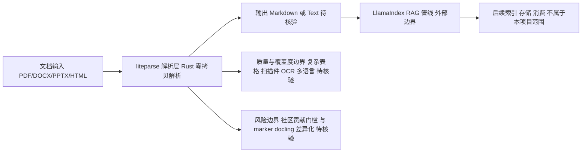

# liteparse

## 一句话定位
run-llama 出品的快速开源文档解析器，Rust 实现，轻量级替代重型解析方案。

## 它解决的问题
RAG 管线中文档解析（PDF/DOCX/PPTX/HTML）是第一道关卡。现有方案（Unstructured、Apache Tika）偏重，依赖多，启动慢。liteparse 用 Rust 实现快速、轻量的文档解析。

## 为什么值得关注（2026-05-30）
LlamaIndex 团队出品，品牌背书强。Rust 实现性能有保证。本周 +1.5K/week 增速健康。文档解析是 RAG Infra 的刚需环节。

## 热度来源判断
真实需求 + LlamaIndex 品牌效应。RAG 管线中文档解析的轻量化是真实痛点。

## 关键技术亮点亮点
1. **Rust 实现**：原生性能，无 JVM/Python 依赖开销
2. **多格式支持**：PDF、DOCX、PPTX、HTML 等常见文档格式
3. **轻量级设计**：无需重型依赖，适合嵌入 RAG 管线
4. **LlamaIndex 生态集成**：与 LlamaIndex RAG 管线无缝对接

## 架构师速览

| 决策问题 | 研究判断 | 证据边界 |
|---|---|---|
| 系统边界 | liteparse 位于"原始文档（PDF/DOCX/PPTX/HTML）→ 结构化文本"边界，向下不接触存储与索引，向上对接 LlamaIndex RAG 管线，由 LlamaIndex 团队出品 | 边界来自档案中的格式清单、LlamaIndex 生态集成描述与"工具型"定位，未声明独立服务/部署形态 |
| 主路径 | 文档输入 → liteparse 解析（Rust，零拷贝解析） → Markdown/Text → LlamaIndex 管线 → 后续索引/消费 | 路径完全来自档案中的架构启发图与"第一公里"叙述；零拷贝为档案原话，未给基准数据 |
| 关键权衡 | 轻量/快 vs 复杂文档覆盖度（表格、扫描件、OCR、多语言待核验）；Rust 性能门槛 vs 社区贡献门槛；与 marker/docling 的差异化尚未明确 | 仅引用档案中"7.2K 星，功能覆盖度需验证"、"复杂表格/扫描件解析质量待观察"、"OCR 与多语言待观察"等原话，未引入外部对比 |
| 最小 PoC | 选取代表性 PDF/DOCX/PPTX/HTML 各 1 类小样本，验证：解析吞吐与延迟、Markdown 输出质量、LlamaIndex 接入成本；将复杂文档（表格/扫描件/公式）与失败可恢复性纳入验收；不立即扩展来源 | 验证项对应档案"先测质量、延迟与失败可恢复性再扩展来源"建议；OCR/多语言列为"待核验"，不作为 PoC 通过条件 |

## 架构启发
```
┌─────────────┐
│  Documents   │
│ PDF/DOCX/... │
└──────┬──────┘
       │
┌──────▼──────┐
│  liteparse   │ ← Rust, 零拷贝解析
│  (解析层)    │
└──────┬──────┘
       │ Markdown/Text
┌──────▼──────┐
│  LlamaIndex  │
│  (RAG 管线)  │
└─────────────┘
```
- 文档解析是 RAG 管线的"第一公里"，性能直接影响整体吞吐
- Rust 在 I/O 密集型解析场景有天然优势
- 轻量化设计符合"RAG Infra 组件化"趋势

## 架构图（MMD）

> 证据边界：此图只采用本档案已有可核验描述；“待核验”节点不应视为项目实现事实。



## 定位判断
**工具型**。RAG 管线的基础组件，定位清晰，不追求平台化。

## 风险/局限/泡沫点
1. 7.2K 星，功能覆盖度需要验证（复杂表格、扫描件等）
2. Rust 实现虽然快但社区贡献门槛高
3. 与 marker、docling 等同类项目的差异化需要持续观察

## 与同类项目的关系
- **marker**：PDF→Markdown，Python 实现，偏 PDF 场景
- **docling**（IBM）：文档解析，Python，更重但功能更全
- **Unstructured**：最全但最重的方案
- **liteparse**：轻量快速，Rust，定位"够用就好"

## 是否值得持续跟踪
**是**。文档解析是 RAG Infra 刚需，Rust 实现有性能优势，LlamaIndex 生态加持。

## 后续观察点
1. 复杂文档（表格/公式/扫描件）的解析质量
2. 与 LlamaIndex 的集成深度
3. 是否支持 OCR 和多语言
4. 与 docling 的功能对比
