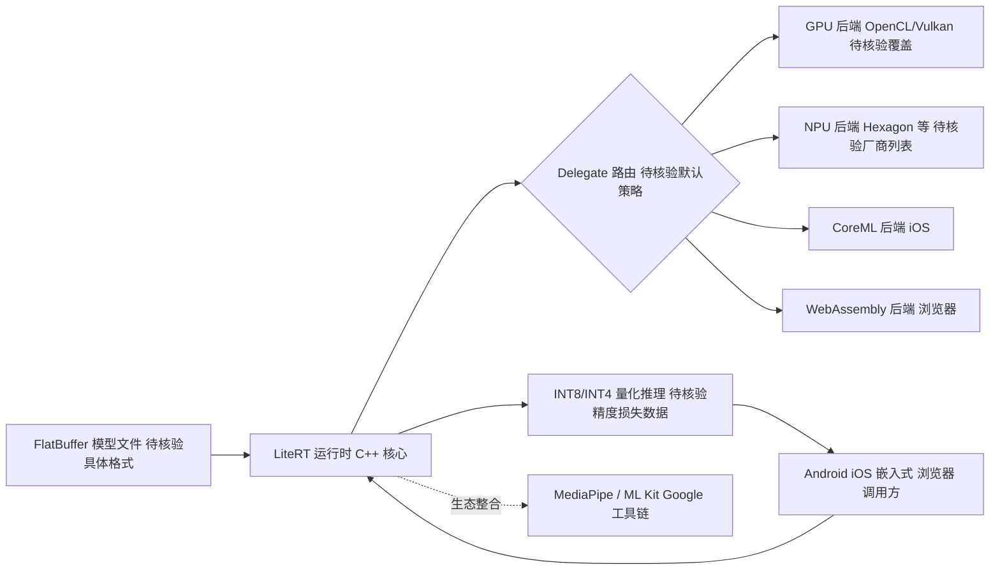

# google-ai-edge/LiteRT

## 一句话定位
Google 官方的设备端 AI 推理运行时，前身为 TensorFlow Lite，支持在移动设备、嵌入式和浏览器中高效运行 ML 模型。

## 它解决的问题
随着 AI 应用从云端扩展到边缘设备，开发者需要一个能在手机、IoT 设备、浏览器中高效运行 ML 模型的轻量级推理引擎。标准 TensorFlow/PyTorch 运行时体积过大且依赖桌面级 GPU。LiteRT（原 TensorFlow Lite）面向移动端和边缘端开发者，提供了极小体积、低功耗的推理引擎，支持 Android、iOS、嵌入式 Linux 和 WebAssembly 多平台部署。

## 为什么值得关注
- **Google 官方维护:** 前身 TensorFlow Lite 拥有十年以上积累，品牌重命名为 LiteRT 标志着战略升级
- **设备端 AI 基础设施:** 是 Android 生态设备端 ML 事实上的标准运行时
- **硬件加速覆盖广:** 支持 GPU、NPU、DSP、TFLite Delegate 等多种硬件加速后端
- **生态整合深:** 与 MediaPipe、ML Kit 等 Google AI 工具链深度集成

## 热度来源判断
LiteRT 的 GitHub stars（3,263）远低于其真实影响力——因为其核心用户群（Android/iOS 移动开发者）主要通过 Google 的 Maven/Gradle 包管理获取，而非直接从 GitHub clone。stars 数不反映真实使用量。LiteRT 的战略价值远超其 GitHub 关注度——它是全球数十亿移动设备上 AI 推理的底层运行时。

## 关键技术亮点亮点
1. **极小运行时体积:** 解释器核心库可压缩到约 1MB（含优化），适合移动端 APK 嵌入
2. **多硬件后端 Delegate:** 通过 Delegate 机制支持 GPU（OpenCL/Vulkan）、NPU（高通Hexagon、三星 NPU）、CoreML（iOS）等加速后端
3. **FlatBuffer 模型格式:** 使用 FlatBuffer 而非 Protocol Buffers 实现零拷贝反序列化，大幅减少模型加载时间和内存占用
4. **量化推理:** 支持 INT8/INT4 量化推理，在精度损失可控的前提下大幅提升推理速度和降低内存
5. **WebAssembly 支持:** 通过 LiteRT Web 版本，可在浏览器中高效运行 ML 模型

## 架构师速览

| 决策问题 | 研究判断 | 证据边界 |
|---|---|---|
| 系统边界 | 移动端/嵌入式/Web 设备上的本地推理运行时，与 MediaPipe、ML Kit 等 Google AI 工具链共生，覆盖 Android、iOS、嵌入式 Linux 与 WebAssembly 四类运行时 | 平台与生态整合描述来自档案；具体集成接口、SDK 边界、Maven/Gradle 坐标未在档案中给出 |
| 主路径 | 模型（FlatBuffer）→ LiteRT 解释器/运行时 → Delegate 选定的硬件后端（GPU/NPU/DSP/CoreML/WASM）→ 量化推理结果回写 | FlatBuffer、Delegate、量化、约 1MB 核心库在档案中有明确描述；各 Delegate 的具体协议与算子覆盖度未核验 |
| 关键权衡 | 跨平台 API 一致性 vs 各端硬件加速最优（Delegate 可插拔后端抽象是核心杠杆） | Delegate 机制在档案中明确；各硬件后端成熟度、厂商私有扩展未在档案中证实 |
| 最小 PoC | 用单段量化模型（如 MobileNet）在 Android 上验证 GPU/NPU Delegate 的推理延迟、APK 体积增量与冷启动时间，再扩到 iOS 与 WebAssembly | 量化等级、具体性能数字、APK 体积基线未在档案中给出；标注"待核验" |

## 架构启发
LiteRT 的架构体现了「跨平台抽象」的设计挑战——需要在 Android（Java/Kotlin）、iOS（Swift）、Linux（C++）和 Web（JS/WASM）四个截然不同的运行时环境中保持统一的 API 和一致的推理行为。其 Delegate 机制是关键创新——将硬件加速抽象为可插拔的后端，允许不同设备的芯片厂商各自实现最优 delegate。

## 架构图（MMD）

> 证据边界：此图只采用本档案已有可核验描述；“待核验”节点不应视为项目实现事实。

## 定位判断
属于设备端 AI 推理生态的核心基础设施。在边缘 AI 运行时赛道中，LiteRT（Google）与 CoreML（Apple）、ONNX Runtime（Microsoft）、ExecuTorch（Meta/PyTorch）形成四方竞争格局。LiteRT 在 Android 生态拥有统治地位。

## 风险 / 局限 / 泡沫点
1. **品牌迁移的混乱期:** 从 TensorFlow Lite 重命名为 LiteRT 可能导致社区文档碎片化和短期认知混乱
2. **模型生态依赖:** 主要支持 TensorFlow/Keras 导出的模型，PyTorch 生态模型需要转换流程
3. **自定义算子支持弱:** 对于使用非标准算子的模型，LiteRT 的支持需要手动编写自定义 op，门槛高
4. **竞品挤压:** ONNX Runtime 正在快速覆盖跨平台场景，ExecuTorch 在 PyTorch 生态中有原生优势

## 与同类项目的关系
- **ONNX Runtime (Microsoft):** 跨平台推理引擎，支持更广泛的模型格式，在 PC 和服务器端更强
- **ExecuTorch (PyTorch):** Meta 的设备端推理方案，原生集成 PyTorch 工作流
- **MLC-LLM:** 通用设备端 LLM 推理引擎，在 LLM 场景更灵活
- **NCNN (Tencent):** 腾讯开源的移动端推理框架，在中国移动开发者中有一定份额

## 是否值得持续跟踪
**值得跟踪。** 设备端 AI 推理是确定的增长方向——隐私保护和延迟要求推动更多 AI 推理从云端迁移到设备。LiteRT 作为 Android 生态的事实标准，其演进方向直接影响数十亿设备。

## 后续观察点
- 关注 LiteRT 对大语言模型（LLM）在设备端推理的支持进展（目前仍是弱项）
- 观察品牌迁移后社区文档和教程的完善程度
- 跟踪 LiteRT 与 Gemini Nano 等 Google 设备端 AI 模型的整合方式

---
> 数据来源: GitHub API (gh cli) | 更新: 2026-08-07 | Stars: 3,263 | Language: C++ | URL 已修正: google-ai-edge/LiteRT
