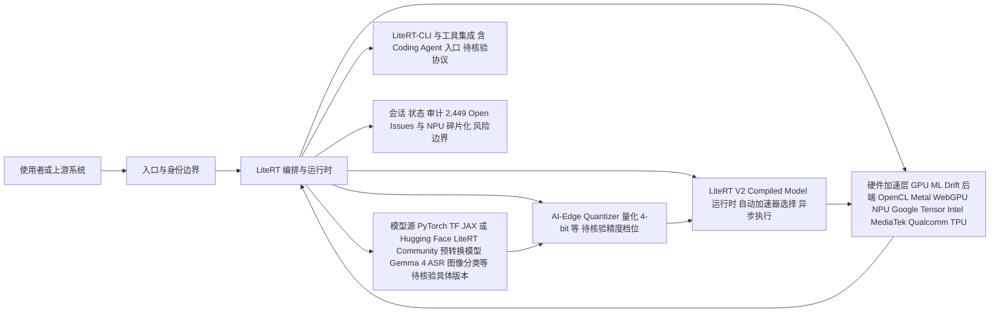

# google-ai-edge/LiteRT — Google 端侧 AI 推理引擎，TensorFlow Lite 继任者

## 一句话定位
LiteRT 是 Google 官方的端侧高性能 ML & GenAI 部署运行时——TensorFlow Lite 的正式继任者，支持 LLM、扩散模型等生成式 AI 在移动设备、嵌入式和浏览器上的高效推理，覆盖 GPU/NPU/TPU 多硬件加速。

## 它解决的问题
端侧 AI 推理面临三大瓶颈：模型部署复杂度高、推理速度慢、内存占用大。同时，TensorFlow Lite 生态老旧，无法很好支持现代 GenAI 工作负载。LiteRT 提供完整的端侧部署工具链（转换 → 量化 → 运行时 → 加速），将云端 AI 能力下沉到设备端，解决延迟、隐私、离线三大核心问题。LiteRT V2 引入了全新的编译模型 API 和统一 NPU 加速。

## 为什么值得关注（2026-08-11）
- **3,285 stars**（截至 2026-08-11），Apache-2.0 许可
- **415 forks**，社区贡献活跃
- **Google 官方产品**：google-ai-edge 团队维护，代表 Google 端侧 AI 战略
- **C++ 实现**，361MB 代码库，规模庞大且工程严谨
- **持续高活跃**：pushed_at 2026-08-11（当天推送），几乎每日更新
- **跨平台覆盖**：Android、iOS、Linux、macOS、Windows、Web、IoT 全平台支持
- **全硬件加速**：GPU（OpenCL/OpenGL/Metal/WebGPU）、NPU（Google Tensor/Intel/MediaTek/Qualcomm/S.LSI）、TPU
- **GenAI 支持**：通过 LiteRT-LM 在端侧部署量化 LLM 和扩散模型
- **Web 推理**：通过 WebGPU + WASM 在浏览器中运行安全客户端 ML
- **CI/CD 完善**：Linux/macOS/Windows Nightly + Continuous 构建

## 热度来源判断
**Google 官方背书 + 端侧 AI 必然趋势。** Stars 数不高（3.3K）是因为 LiteRT 面向企业级和嵌入式开发者，不是面向个人开发者的"酷工具"。但它是 TFLite 的正式继任者——所有使用 TFLite 的产品（数以百万计的移动应用）都有迁移需求。热度来自产业基础设施更替而非社区炒作。所有需要 AI 功能的移动/嵌入式应用都有端侧推理需求，隐私保护和离线能力是企业级刚需。

## 关键技术亮点
1. **LiteRT V2 Compiled Model API**：自动化加速器选择（无需显式 delegates）、真异步执行、NPU 分布式调度、高效 I/O 缓冲管理
2. **统一 NPU 加速**：通过单一 API 接入所有主流芯片厂商的 NPU（Google Tensor/Intel/MediaTek/Qualcomm）
3. **ML Drift GPU 加速**：新一代 GPU 加速后端，支持 GenAI 推理，最小化跨 GPU 缓冲区延迟
4. **Tensor API（C++）**：轻量级 tensor-centric C++ 库，用于高性能张量操作
5. **全链路工具支持**：PyTorch/TF/JAX 模型 → LiteRT Torch 转换 → AI-Edge Quantizer 量化 → LiteRT-LM 部署 → LiteRT Runtime 推理
6. **LiteRT-CLI**：支持 Coding Agent 集成（`litert --help`），可在 AI 编程工作流中使用
7. **模型生态**：Hugging Face LiteRT Community 提供预转换模型（Gemma 4、ASR、图像分类等）

## 架构师速览

| 决策问题 | 研究判断 | 证据边界 |
|---|---|---|
| 系统边界 | 端侧推理运行时 + 转换/量化工具链 + 跨平台覆盖（Android/iOS/Linux/macOS/Windows/Web/IoT）+ 多硬件加速（CPU/GPU OpenCL/Metal/WebGPU/NPU Google Tensor/Intel/MediaTek/Qualcomm/TPU），作为 TFLite 正式继任者承载模型供应与硬件调度边界 | 组件名/平台/加速器清单见档案；具体 API 边界与硬件抽象层实现未在档案中给出，待源码核验 |
| 主路径 | 模型源（PyTorch/TF/JAX 或 Hugging Face LiteRT Community 预转换模型）→ LiteRT Torch 转换 → AI-Edge Quantizer 量化 → LiteRT-LM/Compiled Model (V2) 运行时 → GPU(ML Drift)/NPU/TPU 加速执行；浏览器路径另经 WebGPU+WASM | 工具链顺序与组件名取自档案；V2 Compiled Model 自动加速器选择机制细节未描述 |
| 关键权衡 | 全模型类型覆盖 vs 各芯片厂商 NPU 行为不一致（碎片化）、自动加速降低心智负担 vs 切换 TFLite 需代码改造、端云协同（隐私+离线）vs 端侧 LLM 仍受模型大小限制（Gemma 4 等需重度量化） | 权衡来自档案"风险/局限"与"架构启发"；具体 NPU 厂商差异矩阵与量化阈值未给出 |
| 最小 PoC | 在 Android 上用预转换模型（Gemma 4/ASR/图像分类之一）经 AI-Edge Quantizer 量化后接入 LiteRT V2 Compiled Model API，对比 CPU 与设备 NPU 的延迟/内存，并保留 TFLite 回退路径作为退出选项；将 2,449 Open Issues 与 NPU 碎片化列为验收风险项 | PoC 步骤基于档案明示组件编排；具体设备/模型选型、基准指标、CI 产物均待核验 |

## 架构启发
- **端云协同设计**：设备本地推理，云端模型更新后下发——隐私 + 性能 + 可更新的平衡
- **模型-硬件协同优化**：针对不同硬件能力（CPU/GPU/NPU）自动选择最优加速路径
- **V2 架构升级**：从 V1 的"手动 delegate"升级到 V2 的"自动加速器选择"——降低开发者心智负担
- **Runtime + Tools 分离**：LiteRT Runtime（C++/Kotlin/JS）与转换工具（LiteRT Torch/Quantizer）解耦
- **端侧 GenAI 路线**：不是只有小模型才能端侧，通过量化（4-bit）可以在手机上跑 LLM

## 架构图（MMD）

> 证据边界：此图只采用本档案已有可核验描述；“待核验”节点不应视为项目实现事实。

## 定位判断
**基础设施级**——端侧 AI 推理的标准基础设施。不是"候选"，而是"已是"。作为 TFLite 的继任者，承载 Google 端侧 AI 战略的下一代引擎。所有需要端侧 ML 推理的应用都会（或应该）迁移到 LiteRT。

## 风险 / 局限 / 泡沫点
1. **硬件依赖性强**：NPU 支持碎片化严重，不同芯片厂商的 NPU 行为不一致
2. **模型大小限制**：复杂 LLM 在端侧仍受限（Gemma 4 等需重度量化）
3. **2,449 Open Issues**：大量未解决问题，反映端侧 AI 工程复杂度
4. **生态迁移成本**：从 TFLite 迁移到 LiteRT V2 需要代码改造，部分团队可能观望
5. **与 PyTorch Mobile/ExecuTorch 竞争**：Meta 推 ExecuTorch 争抢端侧推理标准
6. **文档门槛**：361MB C++ 代码库，入门门槛较高

## 与同类项目的关系
- **vs TFLite**：LiteRT 是其正式继任者，提供迁移指南
- **vs Core ML**：Apple 端侧推理，不同生态（Apple vs Google）
- **vs ONNX Runtime**：微软跨平台推理运行时，通用性强但 GenAI 支持弱于 LiteRT
- **vs ExecuTorch (Meta)**：PyTorch 生态的端侧推理，直接竞争
- **vs llama.cpp**：llama.cpp 专注 LLM CPU 推理，LiteRT 覆盖全 ML 模型类型 + 全硬件
- **vs MLX (Apple)**：Apple 的端侧 ML 框架，仅限 Apple Silicon

## 是否值得持续跟踪
**是。** 端侧 AI 是确定性趋势，Google 官方背书使其成为基础设施级项目。移动/嵌入式开发者必须关注。

## 后续观察点
1. NPU 标准化进展（是否能形成统一抽象层）
2. LiteRT V2 的企业级迁移率（TFLite → LiteRT V2）
3. 第三方框架（Flutter/React Native）的集成情况
4. 端侧 GenAI 的实际性能基准（LLM tokens/s 在不同设备上）
5. 与 ExecuTorch 的市场份额竞争

---
> 数据来源: GitHub API (2026-08-11) | Stars: 3,285 | Forks: 415 | License: Apache-2.0 | 语言: C++ | 创建: 2024-09-04
