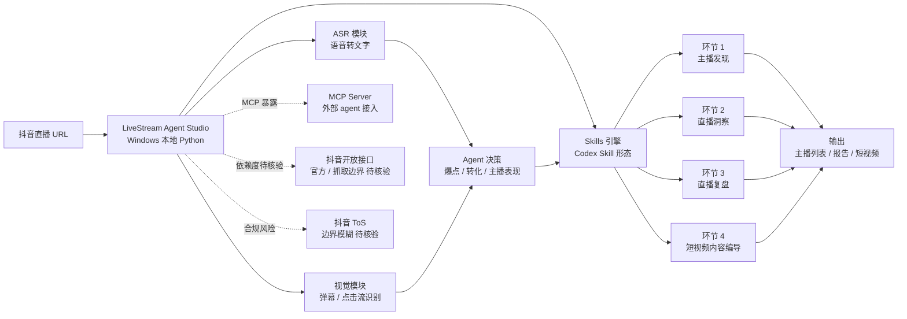

# HanyuanWang/LiveStream-Agent-Studio

## 一句话定位
**面向抖音直播电商的 Windows 本地 AI Agent Studio** ——贯通"主播发现 → 直播洞察 → 直播复盘 → 短视频内容编导"四大环节的统一智能工作流，ASR + 视觉识别 + Skills + MCP 组合的"垂直 SaaS + agent"严肃样本。

## 它解决的问题
中文直播电商运营团队的日常工作流高度重复且数据密集：(1) **选品 / 主播筛选**：需要从大量直播回放中识别高转化主播；(2) **直播洞察**：实时从语音流 + 弹幕 + 商品点击中识别爆点与转化；(3) **直播复盘**：事后从长录像中切出关键片段、写复盘报告；(4) **短视频二剪**：从直播录像中自动切短视频、生成配套文案。**这套工作流过去依赖人肉 + 多个 SaaS 工具（蝉妈妈 / 飞瓜 / 抖查查）+ Adobe PR / 剪映**。LiveStream-Agent-Studio 把这套完整工作流做成 Windows 本地的 AI Agent Studio，让一个主播运营/投手不再需要切换 5+ 工具。

## 为什么值得关注（2026-08-26）
- **4 天 167⭐ / 19 forks / 20 watchers**：中文直播电商运营群体的真实痛点验证
- **MIT 许可 / Python**：降低二次集成门槛
- **4 天 9 open issues**：维护积极但产品仍在快速迭代
- **topic 覆盖关键能力**：ai-agent, douyin, livestream, speech-to-text —— ASR + 视觉 + 抖音场景组合
- **"贯通四大环节"的产品定位**：不是单点 skill，而是完整工作流
- **与 8-25 LiveStream 相关项目的对照**：是同一垂直方向的更工程化实现

## 热度来源判断
热度来自 **"中文直播电商高频重复工作流 × agent 垂直场景化 × 抖音 ToS 灰色地带 × Codex Skill 形态"** 的组合：(1) 中文直播电商是 2026 年最具商业活力的赛道之一，运营群体真实痛点；(2) agent 垂直场景化（与通用 coding agent 区分）是 2026 下半年趋势；(3) 抖音 ToS 边界让"灰色工具"有市场需求；(4) Codex Skill 形态降低了分发门槛。**主要风险：** 抖音 ToS 合规边界；与抖音官方 AI 工具的潜在竞争；MVP 状态需观察。

## 关键技术亮点
1. **ASR + 视觉 + Skills + MCP 四件套**：覆盖语音 → 文字、视觉 → 决策、Skill → 工作流、MCP → 工具调用
2. **贯通"主播发现 → 直播洞察 → 复盘 → 短视频"四大环节**：不是单点能力，是完整工作流
3. **Windows 本地部署**：适配中文直播电商运营团队的实际工作机配置
4. **Codex Skill 形态分发**：让 Claude Code / Codex CLI 用户可直接 install
5. **中文 README**：降低中文运营群体的理解与采用门槛
6. **4 天 19 forks / 9 open issues**：体现社区活跃度与功能迭代速度

## 架构师速览

| 决策问题 | 研究判断 | 证据边界 |
|---|---|---|
| 系统边界 | Windows 本地 AI Agent Studio；四环节贯通（主播发现 → 直播洞察 → 复盘 → 短视频）；ASR + 视觉 + Skills + MCP 组合 | 边界由 topic + README 描述确认；具体每个环节的实现位置、Python 依赖、模型权重来源需源码核验 |
| 主路径 | 抖音直播 URL → ASR 转写 + 视觉识别 → Agent 决策（爆点 / 转化 / 主播表现）→ Skill 化工作流（复盘 / 短视频）→ MCP 工具调用（外部接口） | 主路径为档案语义抽象；具体 ASR 模型（本地 whisper？云端？）、视频处理 pipeline、对抖音开放接口的依赖程度需源码核验 |
| 关键权衡 | 全工作流贯通 vs 单点能力深度；本地部署 vs 云端性能；抖音生态依赖 vs 合规边界；通用 coding agent 适配 vs 垂直场景专精 | 取舍由 topic + README "贯通四大环节" + "Windows 本地" 描述确认；具体抖音 ToS 边界、与抖音官方 AI 工具的差异化未公开 |
| 最小 PoC | 安装 Studio → 选择一场直播录像 → 跑"复盘"环节 → 验证 ASR 转写准确率 + 爆点切分准确率 → 再跑"短视频二剪"环节 → 评估生成质量 | PoC 流程由档案语义推导；具体安装命令、模型下载、所需 GPU/磁盘未公开 |
| 证据边界 | README + topic + GitHub API；具体 ASR 模型、视频处理 pipeline、抖音接口依赖度、MCP server 暴露的 tool 列表均需源码核验 | 已核验事实来自 GitHub API 与 topic；其他来自语义推断 |

## 架构图（MMD）

> 证据边界：此图只采用本档案已有可核验描述；"待核验"节点不应视为项目实现事实。

## 架构启发
LiveStream-Agent-Studio 的核心启发是 **"agent 垂直场景化是 2026 下半年最大创业窗口"** ——把通用 coding agent 适配到一个具体行业（直播电商），就能形成 4 天 167⭐ 的真实需求验证。更深层的启发：**"贯通工作流的全部环节" 比 "单点 skill" 更具用户粘性** —— 蝉妈妈 / 飞瓜 + 剪映 + ChatGPT 三件套的合并 agent 化版本，本质是 "把开发者需要的多个 SaaS 工具合一"，这种 "场景整合 agent" 可能在 12 月内大量涌现。再深一层：**"垂直 SaaS + agent skill 形态" 让 Claude Code / Codex 用户直接 install 是天然分发渠道** —— Codex Skill 形态降低了分发门槛，相当于 "agent skill 化的垂直 SaaS 商店"，对关注出海 / 跨文化的 agent 团队是 12 月内最大的用户增量来源。

## 定位判断
**垂直 SaaS + agent 严肃样本（中文直播电商场景）。** LiveStream-Agent-Studio 不仅是工具，更试图把"直播电商运营的完整工作流"做成 Windows 本地的 Agent Studio——类似蝉妈妈 / 飞瓜 + 剪映 + ChatGPT 三件套的合并 agent 化版本。4 天 167⭐ / 19 forks 显示中文直播电商运营群体的真实需求。**主要风险：** 抖音 ToS 合规边界；MVP 状态需观察；与抖音官方 AI 工具的竞争。

## 风险 / 局限 / 泡沫点
- **抖音 ToS 边界**：若项目依赖未授权抓取，可能被封号；需在 README / 文档明确"仅对接官方开放接口"边界
- **MVP 状态**：4 天 9 open issues + 167⭐ 表明仍处于早期功能迭代期；企业采用需等待 3-6 月
- **Windows-only 平台约束**：限制 macOS / Linux 用户采用
- **垂直场景天花板**：直播电商运营群体虽大，但 LTV 有限
- **与抖音官方 AI 工具的潜在竞争**：若抖音官方推出"抖音直播 AI 助手"，开源项目的差异化将被压缩
- **跨语言可移植性差**：中文 README + 中文场景限制英文用户采纳

## 与同类项目的关系
- **vs 蝉妈妈 / 飞瓜 / 抖查查**：商业 SaaS / 数据查询为主；LiveStream-Agent-Studio 是 AI Agent 形态，含 ASR + 视觉 + Skill
- **vs Adobe PR / 剪映**：传统视频剪辑工具；LiveStream-Agent-Studio 是 Agent 形态，从直播录像自动切短视频
- **vs 8-25 的 LiveStream 相关项目**：同一垂直方向更工程化的实现
- **vs cclank/lanshu-create-ai-presenter-video**（910⭐）：都是 Codex Skill 形态；cclank 偏 AI presenter video 生成，LiveStream-Agent-Studio 偏直播电商工作流
- **vs wshobson/agents / oil-oil/oil-skill-creator**：通用 agent skills 聚合；LiveStream-Agent-Studio 是垂直场景专精

## 是否值得持续跟踪
**值得跟踪（中文直播电商垂直 agent）。** LiveStream-Agent-Studio 代表了"垂直 SaaS + agent"方向的严肃样本。4 天 167⭐ 显示真实需求。**建议关注：** (a) 是否被抖音官方 API 限制；(b) 是否会扩展到其他直播平台（快手 / 视频号）；(c) 是否会被收购或被官方工具整合。**对中文直播电商运营团队：** 可直接试用 MVP。**对关注 agent 垂直场景的开发者：** 12 月内持续观察是否跑通商业闭环。

## 后续观察点
- 抖音 ToS 合规边界（是否被官方封禁）
- 是否扩展到其他直播平台（快手 / 视频号 / 小红书）
- 与抖音官方 AI 工具的差异化定位是否清晰
- 4 大环节的完成度（哪些是 mock / 哪些是真实现）
- 商业模式（开源 + SaaS？纯开源？商业版？）
- 跨平台（macOS / Linux）支持计划

---
> 数据来源: GitHub API (2026-08-26) | Stars: 167 | Forks: 19 | License: MIT | 语言: Python | 创建: 2026-08-22 | Pushed: 2026-08-24