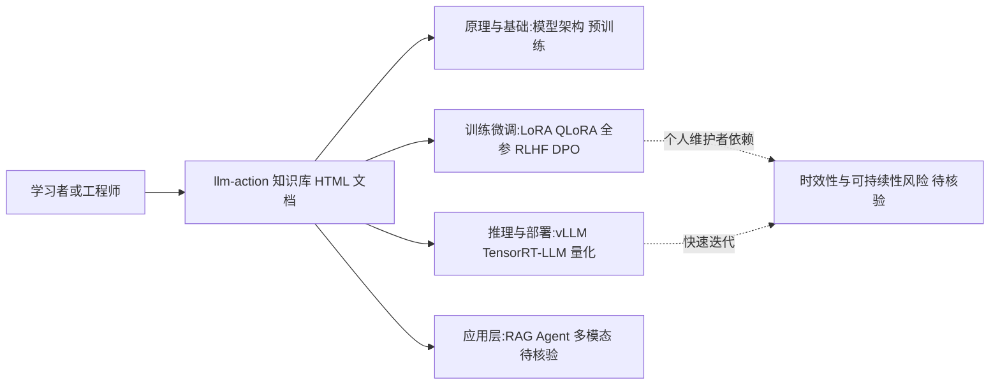

# liguodongiot/llm-action

## 一句话定位
大模型技术原理与实战经验分享库——系统化覆盖大模型工程化、训练微调、推理部署、应用落地全链路的中文学习资源。

## 它解决的问题
大语言模型技术栈复杂，从模型架构、预训练、指令微调、RLHF、推理优化到部署运维，每个环节都有大量论文和工具。中文开发者面临信息分散、英文门槛高、实战经验少的困难。llm-action 系统性整理了大模型工程化的全链路知识，包含原理讲解、代码实践、行业方案，是中文 LLM 学习的重要参考。

## 为什么值得关注
- **Stars:** 24,869 stars，中文 LLM 学习资源头部项目
- **Forks:** 2,840
- **内容深度**：不只有清单，还有原理分析和实战代码
- **覆盖面广**：从模型原理到工程部署到应用开发
- **持续更新**（2026-07-19），跟进最新技术
- 对企业 LLM 落地有实际指导价值

## 热度来源判断
- **中文 LLM 学习刚需（极高）**：中国开发者大模型学习需求爆发
- **内容质量（高）**：系统性、深度和实战性优于碎片化博客
- **SEO 优势（中高）**：GitHub 和搜索引擎排名高
- **Datawhale/社区推荐（中）**：中文 AI 社区互相推荐效应

## 关键技术亮点亮点
1. **全链路覆盖**：预训练→微调（LoRA/QLoRA/全参）→RLHF/DPO→量化→推理（vLLM/TensorRT-LLM）→部署
2. **原理+代码**：不只有理论讲解，配套可运行代码
3. **工程视角**：关注生产环境问题（性能、成本、监控）
4. **行业方案**：包含 RAG、Agent、多模态等应用层实践
5. **HTML 格式**：在线可读，比纯 README 更友好

## 架构师速览

| 决策问题 | 研究判断 | 证据边界 |
|---|---|---|
| 系统边界 | 仓库是 HTML 形态的中文 LLM 学习资源，覆盖原理讲解、代码实践与工程化整理；本质为知识载体，不是可部署运行时 | 仅有"HTML 格式""语言: HTML"和标签集合（llm/llm-training/llm-inference/llm-serving/llmops/chinese/tutorial）支持此判断 |
| 主路径 | 学习者沿"原理→训练微调→RLHF/DPO→量化→推理（vLLM/TensorRT-LLM）→部署→应用（RAG/Agent/多模态）"线性推进 | 档案明示的技术亮点清单支持该路径；具体章节索引与目录顺序未在档案中给出 |
| 关键权衡 | 覆盖面广 vs 单一主题深度有限；持续追踪 vs 个人维护者瓶颈；中文亲和 vs 信息时效性衰减 | 档案"风险/局限"段已显式列出这些权衡，未提供量化对比或基准 |
| 最小 PoC | 抽取一个具体主题（如 LoRA 微调或 vLLM 推理）的原理页+配套代码样例，验证内容可复现性与工程化深度，再扩展到全链路学习 | 档案未提供任何具体章节、代码链接或可运行示例，PoC 形态只能定位到主题层级 |

## 架构启发
- **知识系统化优于碎片化**：在信息过载时代，系统性整理的价值巨大
- **中文技术内容生态**：中文开发者需要母语的高质量技术资源
- **开源知识库模式**：个人维护的高质量技术仓库可以成为行业标准参考

## 架构图（MMD）

> 证据边界：此图只采用本档案已有可核验描述；“待核验”节点不应视为项目实现事实。

## 定位判断
**头部资源型项目**。中文 LLM 工程化领域最有影响力的学习资源之一。不是技术工具而是知识载体，但在技术传播和人才培养方面价值巨大。

## 风险/局限/泡沫点
- **时效性挑战**：LLM 技术迭代极快，内容可能快速过时
- **个人维护风险**：依赖单一维护者的持续投入
- **深度 vs 广度**：覆盖面广意味着某些主题深度有限
- **竞品增多**：越来越多的中文 LLM 教程和书籍涌现
- **AI 辅助学习替代**：ChatGPT 可直接回答 LLM 技术问题

## 与同类项目的关系
- **vs datawhalechina/self-llm**：self-llm 更偏操作教程（部署微调），llm-action 更偏原理+工程
- **vs Hugging Face 课程**：HF 课程更体系化但英文，llm-action 更接地气
- **vs各种 LLM 博客/公众号**：系统性更强，可作为入口资源
- **vs魔搭社区文档**：魔搭偏平台使用，llm-action 偏通用知识

## 是否值得持续跟踪
**推荐跟踪（中文开发者）。** 作为 LLM 工程化知识库有持续参考价值。建议关注其对新技术的跟进速度。

## 后续观察点
- 对最新技术（如推理时计算 scaling、agentic training）的覆盖速度
- 是否有书籍出版计划
- 企业培训和社区合作情况
- 是否扩展为多模态/Agent 专题
- 维护者团队是否扩大（减少单人依赖）

---
> 数据来源: GitHub API (2026-07-19) | Stars: 24,869 | Forks: 2,840 | 语言: HTML
