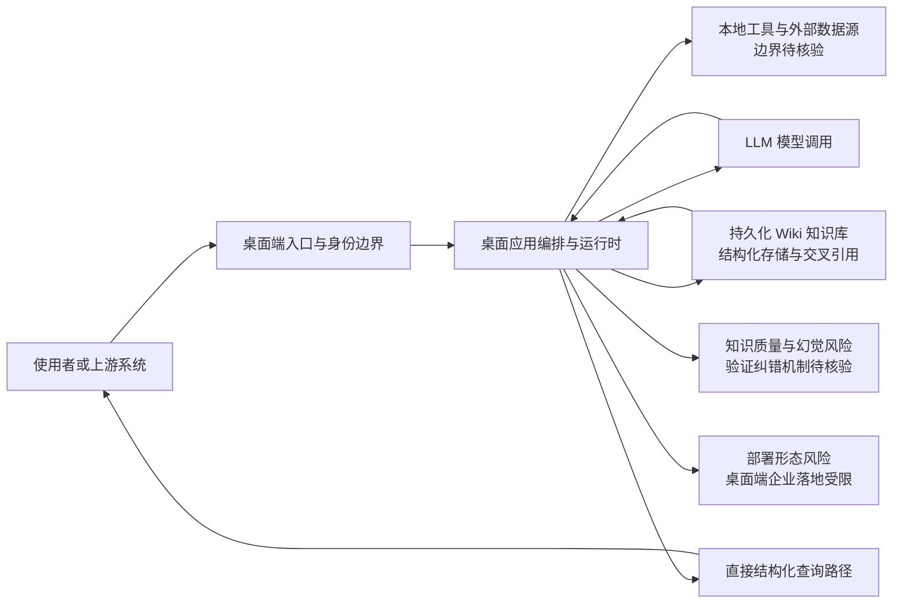

# LLM Wiki

## 一句话定位
桌面应用，用 LLM 增量构建和维护持久化 Wiki 知识库，替代传统 RAG 的即查即弃模式。

## 它解决的问题
传统 RAG 每次查询都从零开始：检索 → 排序 → 生成，效率低且结果不稳定。LLM Wiki 让 LLM 将知识结构化存储到 Wiki 中，后续查询可以直接走结构化路径，显著提升检索质量和效率。

## 为什么值得关注
- 提出了一个值得深思的范式迁移：从 RAG 到持久化知识库
- 8 天 1,387 stars，增速稳定
- 跨平台桌面应用（TypeScript），易于上手
- 151 forks 说明有开发者在使用和改造

## 热度来源判断
技术理念驱动。RAG 的局限性是业界共识，LLM Wiki 提出了一个可行的替代方向。

## 关键技术亮点亮点
1. **增量构建** — LLM 不是一次性处理，而是持续维护和更新 Wiki
2. **结构化存储** — 知识以 Wiki 形式存储，支持交叉引用和层级结构
3. **跨平台桌面应用** — 降低使用门槛

## 架构师速览

| 决策问题 | 研究判断 | 证据边界 |
|---|---|---|
| 系统边界 | 本项目是一类以"持久化 Wiki 知识库"替代"即查即弃 RAG"的桌面应用（TypeScript），定位为 LLM、桌面端、Knowledge Base、Wiki、RAG Alternative 五个标签共构的边界；具体协议、模型供应商、存储后端与进程模型未在档案中给出 | 仅可由分类、标签、语言与一句话定位推断；部署形态、IPC、存储引擎、网络出入口须以源码核验 |
| 主路径 | LLM 在桌面运行时内对知识做"增量构建 → 结构化 Wiki 存储 → 直接查询"的有状态维护，与传统"检索 → 排序 → 生成"的 RAG 主路径形成对照；具体链路与触发器档案未证实 | "增量构建""结构化存储""跨平台桌面应用"为档案原话；编排细节、检索回退、并发模型未披露 |
| 关键权衡 | 知识复用效率（持久化 Wiki）换取知识质量风险（幻觉与错误累积）与桌面端形态带来的部署/协作受限，需用验证纠错机制对冲 | 档案明示"LLM 自动构建的 Wiki 质量如何保证"为关键未解问题；具体纠错回路未给出 |
| 最小 PoC | 在单一渠道、最小工具权限与可审计日志下，先验证"一次增量入库 → 直接结构化查询"的命中率与一致性，再评估扩大接入面；验收须含质量验证、退出路径与维护成本上限 | 档案仅给出"先做最小 PoC"的采用建议方法论，未提供具体指标、阈值或接口 |

## 架构启发
这可能是 RAG 之后的下一代知识工程范式：
- 传统 RAG：查询 → 检索 → 生成（每次从零开始）
- LLM Wiki：增量构建 → 结构化存储 → 直接查询（复用历史知识）

关键问题：LLM 自动构建的 Wiki 质量如何保证？需要引入验证和纠错机制。

## 架构图（MMD）

> 证据边界：此图只采用本档案已有可核验描述；“待核验”节点不应视为项目实现事实。

## 定位判断
短期工具型，中长期有平台化潜力。如果能解决知识质量问题，可能成为企业知识管理的新范式。

## 风险/局限/泡沫点
1. **知识质量不确定** — LLM 构建的 Wiki 可能存在幻觉和错误
2. **桌面应用形态** — 限制了企业场景的部署灵活性
3. **竞品众多** — Notion AI、Obsidian AI 等都在做类似方向
4. **增量维护成本** — 随着知识库增长，维护成本可能指数级上升

## 与同类项目的关系
- vs. 传统 RAG：从即查即弃到持久化存储
- vs. Obsidian AI：Obsidian 更偏编辑器，LLM Wiki 更偏知识工程
- vs. Graphify：Graphify 做知识图谱，LLM Wiki 做 Wiki 结构，互补关系

## 是否值得持续跟踪
**是。** 知识工程范式迁移是中期趋势，LLM Wiki 的理念值得验证。

## 后续观察点
1. 是否推出 Web 版或 API 版
2. 知识质量验证机制是否完善
3. 是否支持多人协作
4. 与 MCP 的集成可能性

## 评分

| 维度 | 分数 | 理由 |
|------|------|------|
| 热度质量 | 6 | 增速稳定但规模不大 |
| 技术创新度 | 7 | 持久化Wiki理念有启发性 |
| 工程成熟度 | 5 | 14个issues，早期阶段 |
| 架构启发价值 | 8 | 触及RAG根本问题 |
| 企业落地潜力 | 5 | 桌面应用形态受限 |
| 中期趋势概率 | 7 | 知识工程范式迁移是趋势 |
| 平台化潜力 | 6 | 需要解决知识质量和服务化 |
| 基础设施潜力 | 4 | 更偏应用层 |

**总分：48/80**
**归类：工具型 → 平台候选**
**持续跟踪：是**
