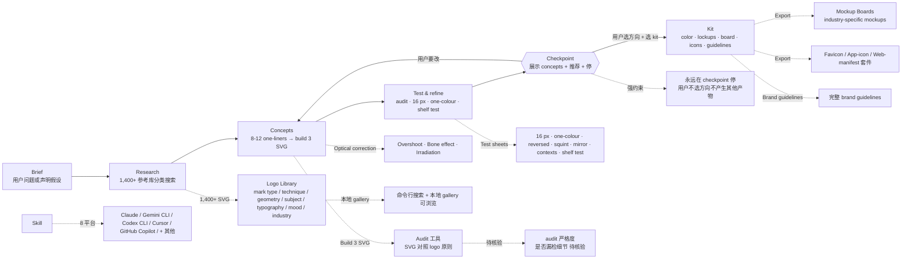

# kaankiziltug/logo-design-skill

## 一句话定位
**Comprehensive logo-design skill** —— 把 Claude / Gemini CLI / Codex CLI / Cursor / GitHub Copilot 变成纪律严明的 identity designer：从 brief 到 production-ready SVG 文件 + brand guidelines；**1,400+ 真实 SVG logo 参考库**（按 mark type / technique / geometry / subject / typography / mood / industry 分类）+ 纯 Python 工具（SVG audit / concept sheets / test sheets / mockup boards / favicon 导出）；**checkpoint 强约束** —— 永远在 checkpoint 停，展示 concepts + 推荐 + 提供完整 kit。

## 它解决的问题
2026 年 logo 设计赛道的同构问题：**AI 生成 logo 多以"风格模板 + 一次 prompt + 一张图"为主** —— 没有 brief 流程 / 没有 word mapping / 没有 mark type 选择 / 没有几何构造 / 没有光学校正（overshoot / bone effect / irradiation）/ 没有色彩 / 没有 typography / 没有 lockups / 没有 testing（16 px / one-colour / squint / mirror / contexts / shelf test）/ 没有 brand guidelines；**且 AI 容易重复 / 撞 logo 模板**——缺少 1,400+ 真实 logo 参考库做防撞；**用户一次 prompt 拿到的常是"半成品"，没有完整 kit**。
logo-design-skill 直击这一痛点：它给 agent 一个 **完整的 logo design 纪律化 skill** —— 13 个步骤（discovery / word mapping / mark type 选择 / concepting / 几何构造 / 光学校正 / 色彩 / typography / lockups / testing / 演示 / 交付 / 重设计）+ 1,400+ SVG logo 参考库（命令行可搜索 + 本地 gallery 可浏览）+ 纯 Python 工具（audit / test sheets / mockup boards / PNG 渲染 / favicon 套件导出）+ **checkpoint 强约束**（永远在 checkpoint 停）。解决的是 **"agent skill 严肃工程化 + logo 设计纪律化 + 防撞 + 可交付完整 kit"** 的全栈工程化问题——把 09-19 ~ 09-28 十日 Agent Skill 严肃工程化从"视觉生成 / 上线 / 检索 / 切换"推到 **"纪律化设计流程 + 参考库 + 工具 + checkpoint"**。

## 为什么值得关注（2026-09-29）
- **Stars:** 405（截至 2026-09-29），3 天突破 400，**09-26 ~ 09-29 Agent Skill 严肃工程化向「视觉生成 + 纪律化设计」演化的典型样本**
- **Forks:** 18，**fork/star 4.5%** 较健康 + Agent Skill 设计严肃工程化持续关注信号
- **License:** MIT（商用清晰）
- **语言:** Markdown + Python（SVG audit + 工具）
- **规模:** 5704 KB（约 5.6 MB —— 含 1,400+ SVG logo + 文档 + Python 工具）
- **活跃度:** created 2026-09-26，pushed_at 2026-09-28，持续高活跃
- **Topics:** 8 个（agent-skills / branding / claude / claude-skills / codex / gemini-cli / logo-design / svg）覆盖清晰
- **核心荣誉:** The New 100: #14（agentic leaderboard 排名）
- **核心方法论:** Brief → Research → Concepts → Test & refine → Checkpoint → Kit
- **8 平台兼容:** Claude / Gemini CLI / Codex CLI / Cursor / GitHub Copilot / + 其他 Agent Skills 兼容

## 热度来源判断
logo-design-skill 的热度是 **"Agent Skill 严肃工程化向「纪律化设计 + 参考库 + 工具 + checkpoint」演化"** 的强劲组合。09-19 ~ 09-28 十日 Agent Skill 严肃工程化多线同时铺开：09-19 wuyoscar/jev-skill + 09-21 Haleclipse/CometixCode + 09-22 chat-seek-vscode + 09-23 WeChatBridge + 09-24 lhlGitHub/threejs-architecture-effects + 09-25 samyost1/3dicon + 09-25 mikehasa/golive-skill + 09-25 yetone/magpie + 09-28 feitangyuan/onetake + 09-28 supermemoryai/company-brain + 09-28 amitshekhariitbhu/ai-system-design。logo-design-skill 把这条主线推到 **"纪律化设计流程 + 1,400+ 参考库 + 纯 Python 工具 + checkpoint 强约束"**。405⭐ / 18f / fork/star 4.5% 与 feitangyuan/onetake 814⭐ / 53f / 7.6% 同步，反映 **"Agent Skill 严肃工程化向设计纪律化"** 的典型早期 fork 率特征。热度**真实且具严肃工程化生态价值**——这是 "Agent Skill 严肃工程化从视觉生成 → 纪律化设计流程" 演化关键信号。

## 关键技术亮点
1. **13 步骤纪律化设计流程** —— discovery / word mapping / mark type / concepting / 几何构造 / 光学校正 / 色彩 / typography / lockups / testing / 演示 / 交付 / 重设计
2. **1,400+ 真实 SVG logo 参考库** —— 按 mark type / technique / geometry / subject / typography / mood / industry 分类；命令行可搜索 + 本地 gallery 可浏览
3. **纯 Python 工具（依赖为零）** —— audit SVG 对照 logo 原则 + concept / test sheets 生成（16 px 像素测试 / one-colour / 反色 / squint / mirror / contexts / shelf test）+ mockup boards + PNG 渲染 + 完整 favicon / app-icon / web-manifest 套件导出
4. **Checkpoint 强约束** —— skill 永远在 checkpoint 停；展示 concepts + 推荐 + 提供完整 kit；在用户选择方向前不产生其他产物
5. **8 平台兼容** —— Claude / Gemini CLI / Codex CLI / Cursor / GitHub Copilot / + 其他 Agent Skills 兼容
6. **光学校正** —— overshoot / bone effect / irradiation（不止画图，还考虑视觉）
7. **18 fictional briefs** —— quiet luxury / neon festivals / B2B SaaS / fintech / health 等端到端示例
8. **SaaS / finance / health 拥挤类别规避** —— no chat bubbles / no coins / no piggy banks / no bank blue / no crosses / no pills / no heartbeat lines
9. **The New 100: #14** —— agentic leaderboard 排名
10. **Mermaid 嵌入** —— README 内嵌流程图（A → B → C → D → E{{Checkpoint}} → F）
11. **MIT 商用清晰**
12. **topics 8 个** —— agent-skills / branding / claude / claude-skills / codex / gemini-cli / logo-design / svg

## 架构师速览

| 决策问题 | 研究判断 | 证据边界 |
|---|---|---|
| 系统边界 | Logo 设计领域的 agent skill + 1,400+ SVG 参考库 + 纯 Python 工具 + checkpoint 强约束；仓库是 skill manifest + 工具集 + 参考库 | 描述层准确；具体 skill runtime（agent 解析、checkpoint 实现、参考库搜索接口）均待核验 |
| 主路径 | 用户说 brief → discovery → word mapping → mark type → 8-12 one-liners → build 3 SVG → audit + test → checkpoint 停 → 用户选 → kit（color / lockups / board / icons / guidelines） | 主路径为 README 表述；具体 audit 规则、test 自动化、mockup 模板、1,400+ logo 分类准确性均待核验 |
| 关键权衡 | 设计纪律化 13 步骤 vs 用户耐心 vs 1,400+ 参考库覆盖广度 vs 防撞 vs 8 平台兼容 vs checkpoint 强约束 vs MIT 商用清晰 | README 明示 "brief → research → concepts → test & refine → checkpoint"——checkpoint 是核心约束；13 步骤的覆盖广度（specialty coffee / fintech / health / SaaS）在 18 fictional briefs 中体现 |
| 最小 PoC | 在单 agent (Claude Code 或 Gemini CLI) 上安装 skill + 跑 1 个简短 brief（如 specialty coffee），验证：(1) 8-12 one-liners 是否覆盖广度；(2) build 3 SVG 是否能在 checkpoint 停；(3) audit + test 工具是否报错；(4) favicon / app-icon / web-manifest 套件是否完整导出 | PoC 范围、退出路径由 README"先单 brief、最短 checkpoint、可导出验证"建议推导；具体 audit 严格度、参考库搜索性能、SVG 质量待核验 |

## 架构图（MMD）

> 证据边界：此图只采用本档案已有可核验描述；"待核验"节点不应视为项目实现事实。

## 架构启发
logo-design-skill 的核心启发是 **"Agent Skill 严肃工程化已从单点工具 → 纪律化设计流程 + 参考库 + 工具 + checkpoint 强约束演化"**。当前 Agent Skill 生态多以"单点工具"为主（onelake 一镜到底 / company-brain 商用副驾 / 3dicon 一个 prompt 3D 图标），但 logo-design-skill 把 **13 步骤纪律化流程 + 1,400+ 参考库 + 纯 Python 工具 + checkpoint 强约束** 同时推到严肃工程化形态——这意味着 **Agent Skill 已从"单点工具" → "纪律化工作流 + 参考库 + 工具集"演化**。更深层的启发：**checkpoint 强约束** ——"永远在 checkpoint 停，在用户选择方向前不产生其他产物"——这是 agent skill 的关键设计哲学：用户的"选择方向"是严肃工程化的必要步骤。

## 定位判断
**Logo 设计 Agent Skill 严肃工程化的具体路径（工具型 + 设计纪律化）。** logo-design-skill 不仅是 logo 生成工具，更是 **"纪律化 logo 设计流程 + 1,400+ 参考库 + 纯 Python 工具 + checkpoint 强约束"** 的严肃工程化代表。405⭐ + 18f 已显示严肃工程化持续关注。但"checkpoint 强约束"是核心设计哲学——用户必须选方向才能继续，与 happy-path 反报。目前定位是"Agent Skill 严肃工程化向设计纪律化演化的代表样本"，向多平台扩展 + 参考库增长是合理演化。

## 风险 / 局限 / 泡沫点
- **1,400+ 参考库覆盖广度** —— 真实 logo 库可能偏向某些类别（SaaS / finance / health 拥挤类别是设计纪律化重点）
- **13 步骤纪律化流程的耐心** —— 用户可能想要"一键 logo"，13 步骤可能过长
- **checkpoint 强约束的摩擦** —— 用户必须选方向才能继续；happy-path 用户可能放弃
- **SVG audit 严格度** —— 1,400+ logo 的 audit 规则是否漏检细节未明示
- **8 平台兼容实际兼容度** —— README 明示 8 平台；实际在每个平台上的兼容性需要测试
- **The New 100: #14** —— agentic leaderboard 排名可能随时间下降
- **个人开发者属性** —— kaankiziltug 个人维护；持续维护承诺 + 长期风险
- **纯 Python 工具的依赖** —— Python 3 + 必要包；用户需自备 Python 环境

## 与同类项目的关系
- **vs feitangyuan/onetake（09-26 814⭐）:** 一镜到底连贯动效 + probe.py oracle carry score；logo-design-skill 是纪律化设计 + 1,400+ 参考库
- **vs lemomo-ai/lemo-opuscar（09-26 512⭐）:** 39 种风格的视频严肃工程化 skill；logo-design-skill 是 logo 设计纪律化
- **vs Rieranthony/product-film-skill（09-26 356⭐）:** Remotion + 你的设计系统的产品片 skill；logo-design-skill 是 logo 设计
- **vs lhlGitHub/threejs-architecture-effects（09-24）:** Three.js 古建程序化动态组装；logo-design-skill 是 logo 设计纪律化
- **vs amitshekhariitbhu/ai-system-design（09-25 ~ 09-29 持续）:** AI 系统设计 step-by-step 教程；logo-design-skill 是 logo 设计 step-by-step

## 是否值得持续跟踪
**值得跟踪（Agent Skill 严肃工程化向设计纪律化演化的代表样本）。** logo-design-skill 代表了 **"Agent Skill 严肃工程化已从单点工具 → 纪律化设计流程 + 参考库 + 工具 + checkpoint 强约束"** 的演化方向。建议关注：(1) 1,400+ 参考库的覆盖广度扩展（哪些类别最常被引用）；(2) 8 平台兼容的实际兼容度测试；(3) checkpoint 强约束的用户接受度（happy-path vs 严肃用户）；(4) The New 100 排名是否稳定或上升；(5) MIT 商用清晰的边界在企业 / 商业复用的实际情况。对 logo 设计 / brand identity 用户，这个 skill 是"纪律化 logo 设计 + 防撞 + 完整 kit 交付"的实用工具，值得直接采用。

## 后续观察点
- 1,400+ 参考库的覆盖广度（mark type / industry / technique）
- 8 平台兼容的实际兼容度（Claude / Gemini CLI / Codex CLI / Cursor / GitHub Copilot）
- checkpoint 强约束的用户接受度与放弃率
- The New 100 排名的稳定性
- SVG audit 规则的严格度与漏检率
- 是否新增更多步骤（如 SVG 动画 / 动效 logo / 暗色模式 logo）
- MIT 商用清晰的边界在企业 / 商业复用的实际情况
- 18 fictional briefs 是否扩展到 50 / 200

---
> 数据来源: GitHub API (2026-09-29) | Stars: 405 | Forks: 18 | License: MIT | 语言: Markdown + Python | 创建: 2026-09-26 | 规模: 5704 KB