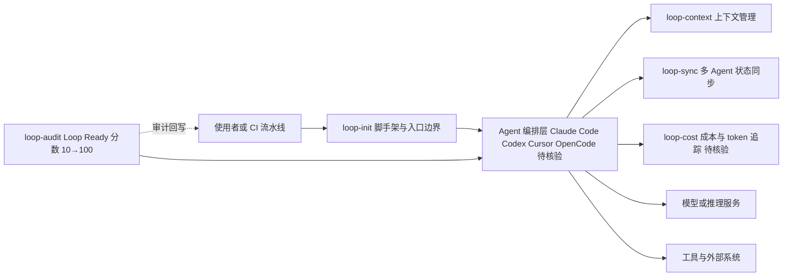

# Loop Engineering

## 一句话定位
将 AI Coding Agent 的编排从 ad-hoc prompting 提升为系统化工程方法论，配套 5 个 CLI 工具实现脚手架→评分→成本→同步→上下文管理全链路。

## 它解决的问题
当前 AI Coding Agent（Claude Code、Codex、Cursor 等）的使用方式高度依赖个人 prompting 技巧。同一个任务，不同人写的 prompt 效果差异巨大。缺乏标准化的方法来设计、评估和优化 Agent 工作循环。Loop Engineering 的核心命题是：不要手动 prompt Agent，而是设计一个系统来 prompt Agent，然后给这个系统打分。

## 为什么值得关注
- **方法论+工具并重**：不只是概念，有 5 个 npm 包可以直接用
- **27 天 5.9K⭐**：2026-06-09 创建，稳定增长
- **受 Addy Osmani + Boris Cherny 启发**：行业意见领袖背书
- **loop-audit 评分系统**：Loop Ready 分数（10→100）让 Agent 编排质量可量化
- **多 Agent 兼容**：支持 Claude Code、Codex、OpenCode 等主流工具
- **GitHub Actions 集成**：CI/CD 中自动运行 loop-audit

## 热度来源判断
- Addy Osmani 等大 V 的推广效应
- Agent 编排方法论是社区普遍痛点
- 实际可用的 npm 工具（不只是 README 项目）
- 持续活跃（最近 push: 2026-07-05）

## 关键技术亮点亮点
1. **loop-init**：脚手架工具，自动创建 skills/state/budget 文件，输出 Loop Ready 分数
2. **loop-audit**：审计现有 loop 配置，输出质量评分和改进建议
3. **loop-cost**：追踪 Agent 运行的 token 消耗和成本
4. **loop-sync**：多 Agent 状态同步
5. **loop-context**：Agent 上下文窗口管理

## 架构师速览

| 决策问题 | 研究判断 | 证据边界 |
|---|---|---|
| 系统边界 | Loop Engineering 是位于 Coding Agent（Claude Code/Codex/Cursor/OpenCode 等）与开发者/CI 之间的方法论 + CLI 工具链层，5 个 npm 包覆盖脚手架→评分→成本→同步→上下文管理全链路 | 系统边界基于档案"五件套"描述与标签 `agent-orchestration`、`devtools`、`ci-cd` 推导，未在档案中给出具体 npm 包名边界清单 |
| 主路径 | 用户/CI 触发 → loop-init 脚手架或 loop-audit 审计 → loop-context 管理上下文 → 编排 Agent 调用模型与工具 → loop-cost 计费/loop-sync 同步 → loop-audit 回写 Loop Ready 分数 | 主路径映射到档案"关键技术亮点"五件套；具体协议、持久化与传输层档案未给出 |
| 关键权衡 | 扩展速度（多 Agent 兼容 + 方法论易复制）vs 评分权威性、bus factor 单一维护者、主观评分标准；可观测性/成本追踪（loop-cost）与供应商耦合之间的取舍 | 权衡基于档案"风险/局限/泡沫点"章节；未提供实际性能或生产部署数据 |
| 最小 PoC | 在单一 Coding Agent、最小工具权限与可审计日志下，部署 loop-init 生成工程骨架 → 用 loop-audit 获得基线 Loop Ready 分 → 用 loop-cost 追踪 token 成本 → 接入 GitHub Actions 跑 CI 评分；验收项必须包含评分复现性、维护者活跃度、退出路径 | PoC 路径仅基于档案明确列出的五个 CLI 与 GitHub Actions 集成点；具体命令、配置 schema 与评分公式档案未提供 |

## 架构启发
Agent 编排质量可以像代码质量一样被度量和自动化。传统软件工程有 lint/test/coverage 来度量代码质量，Loop Engineering 用 loop-audit 度量 Agent 编排质量。五件套对应软件工程的五个阶段：loop-init=脚手架、loop-audit=lint+test、loop-cost=profiling、loop-sync=CI/CD、loop-context=依赖管理。

## 架构图（MMD）

> 证据边界：此图只采用本档案已有可核验描述；“待核验”节点不应视为项目实现事实。

## 定位判断
**平台候选** — 不是 Agent 框架，不是 Agent 运行时，是 Agent 工程方法论 + 开发者工具链。如果 Agent 工程标准化持续推进，有潜力成为 Agent 开发的标准方法论框架。

## 风险/局限/泡沫点
- **方法论项目的通病**：看的人多，真正落地的人少
- **评分标准主观性**：Loop Ready 分数的权威性需要社区验证
- **竞争壁垒低**：方法论+CLI 工具容易被模仿或集成到其他工具中
- **维护者单一**：主要是个人项目（cobusgreyling），bus factor 风险

## 与同类项目的关系
| 项目 | 定位 | 关系 |
|------|------|------|
| Forsy-AI/agent-apprenticeship | Agent 学徒制生态 | 不同路径：自我提升 vs 系统设计 |
| Ponytail | YAGNI Agent Skill | 互补：控制过度工程 vs 设计循环 |
| Claude Code / Codex | Coding Agent | Loop Eng 的目标是编排这些 Agent |

## 是否值得持续跟踪
**是** — Agent 工程方法论的先行者，关注 loop-audit 评分标准的社区采纳度。

## 后续观察点
- loop-audit 评分标准的社区采纳度与权威性建立
- 是否从个人项目演进为团队维护
- 多 Agent 兼容性扩展（支持更多 Coding Agent）
- 企业级 adoption 案例积累
