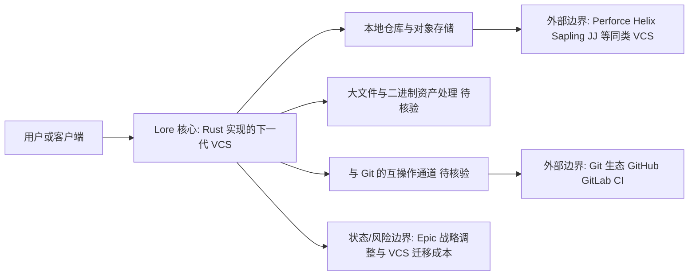

# EpicGames/lore

## 一句话定位
Epic Games 开源的下一代版本控制系统——用 Rust 实现的新一代 VCS，试图重新定义代码版本管理。

## 它解决的问题
Git 虽然是版本控制的事实标准，但在大规模代码库（monorepo）、大文件（游戏资产）、二进制文件管理方面有明显不足。游戏开发、媒体制作等行业被迫使用 Perforce 等闭源/付费系统。Lore 试图用现代设计（Rust+新数据模型）构建一个兼顾 Git 的灵活性和 Perforce 的大文件能力的下一代 VCS。

## 为什么值得关注
- **Stars:** 8,326 stars，新 VCS 赛道最受关注项目
- **Epic Games 出品**：游戏行业巨头，有大规模资产管理痛点
- **Rust 实现**，性能和安全保障
- **下一代 VCS 定位**：直接挑战 Git 的霸主地位（特定领域）
- 持续活跃（2026-08-07 更新）
- 对游戏开发/媒体制作行业可能产生深远影响

## 热度来源判断
- **Epic Games 品牌（极高）**：UE/Fortnite/Epic Games Store 带来的信誉
- **Git 痛点共识（高）**：大文件/monorepo 是公认问题
- **Rust 生态（中高）**：Rust 写基础设施工具是趋势
- **新 VCS 稀缺（中）**：成功的新 VCS 极其罕见，引发好奇心

## 关键技术亮点亮点
1. **Rust 实现**：内存安全+高性能，适合处理大规模数据
2. **下一代数据模型**：可能采用内容寻址+分支优化等新设计
3. **大文件支持**：原生支持游戏资产等大文件，不需 Git LFS
4. **分布式架构**：保留 Git 的分布式优势
5. **可能的分支创新**：针对 monorepo 的分支性能优化

## 架构师速览

| 决策问题 | 研究判断 | 证据边界 |
|---|---|---|
| 系统边界 | 面向"Git 痛点场景（monorepo / 大文件 / 二进制资产）"的下一代 VCS 客户端与本地仓库运行时，外部边界为 Git 生态（GitHub/GitLab/CI）与现有 VCS（Git、Perforce Helix、Sapling、JJ）；架构档案未给出源码级模块切分。 | 仅基于"version-control, vcs, open-source, rust, next-gen"标签与定位描述，不含 README 证实的组件清单。 |
| 主路径 | 用户/客户端 → Rust 实现的 Lore 核心（内容寻址 + 分支优化）→ 本地仓库对象存储；潜在主路径还包括与 Git/UE 资产的互操作通道，但具体协议与传输方式档案未证实。 | "Rust 实现""下一代数据模型""分布式架构""大文件支持"为定位级描述，未见 API/CLI/传输层细节。 |
| 关键权衡 | 大文件/分支性能 vs Git 互操作性；Epic 内部驱动 vs 社区通用性；Rust 系统级安全/性能 vs 新 VCS 生态稀缺风险；自建生态 vs 依附 GitHub/CI。 | 权衡来自档案"风险/局限/与同类项目的关系"段落，性能基准、与 Git 互操作、UE 集成均列为"待核验"。 |
| 最小 PoC | 用一个含大体积二进制资产（如 UE 资源）的真实 monorepo 路径跑通：提交/分支/合并 → 验证大文件性能、错误恢复、与 Git 的双向互操作 → 把 Git 生态适配（CI、托管平台）作为退出/回滚路径验收项。 | 档案未提供 PoC 步骤，需结合待发布的"设计白皮书与技术架构文档"才能落地验证。 |

## 架构启发
- **Git 不是终点**：版本控制仍有创新空间，尤其在特定领域
- **Rust for system tools**：VCS 这种系统级工具用 Rust 重写是合理选择
- **游戏行业驱动**：游戏开发的极端需求催生基础设施创新

## 架构图（MMD）

> 证据边界：此图只采用本档案已有可核验描述；“待核验”节点不应视为项目实现事实。

## 定位判断
**高潜力基础设施候选**。如果成功，可能成为游戏/媒体行业的标准 VCS，甚至挑战 Git 在某些领域的地位。但 VCS 迁移成本极高，普及需要时间。

## 风险/局限/泡沫点
- **VCS 迁移成本极高**：生态（GitHub/GitLab/CI）都围绕 Git 构建
- **Epic 项目维护风险**：Epic 可能因战略调整放弃项目
- **信息不透明**：描述简短，详细设计文档可能不足
- **社区采用门槛**：没有 GitHub 等平台支持，新 VCS 难以推广
- **与 Git 的互操作**：如果不能与 Git 无缝互操作，采用难度极大

## 与同类项目的关系
- **vs Git**：Git 通用性强，Lore 专攻大规模/大文件场景
- **vs Perforce (Helix)**：Perforce 是闭源付费的游戏行业标准，Lore 是开源替代
- **vs Sapling (Meta)**：Meta 的 Sapling 也解决 monorepo 问题，定位接近
- **vs JJ (Jujutsu)**：JJ 是 Git 兼容的新 VCS，Lore 可能不完全兼容

## 是否值得持续跟踪
**强烈推荐跟踪。** 新 VCS 极其罕见且影响深远。Epic 的投入说明有真实需求。即使不取代 Git，也可能成为特定行业的标准。

## 后续观察点
- 设计白皮书和技术架构文档
- 与 Git 的互操作能力（关键采用因素）
- Unreal Engine 的集成（内部采用信号）
- 大规模代码库（百万文件级）的性能基准
- 社区生态：是否有 GUI 工具、CI 集成
- 是否有企业开始迁移尝试

---
> 数据来源: GitHub API (2026-08-07) | Stars: 8,326 | Forks: 393 | 语言: Rust
