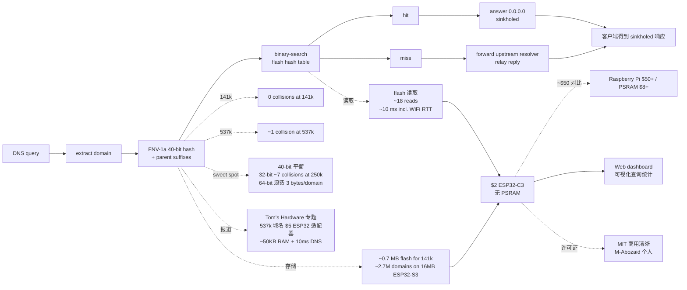

# M-Abozaid/esp32-c3-adblock

## 一句话定位
$2 ESP32-C3 Pi-hole 级 DNS 黑洞——537k 域名 sorted 40-bit FNV-1a hash in flash + 二分检索 ~10ms + ~50KB RAM + UDP DNS sinkhole + Web dashboard。

## 它解决的问题
2026 年家庭网络广告拦截方案要么贵（Raspberry Pi $50+）、要么需要 PSRAM（ESP32 + PSRAM ~$8）。开发者需要 **$2 ESP32-C3 无 PSRAM** 的严肃工程化 Pi-hole 级方案：`esp32-c3-adblock` 把 **537k 域名 sorted 40-bit FNV-1a hash in flash + 二分检索 ~10ms + ~50KB RAM** —— 解决 **「家庭网络广告拦截 Pi-hole 级功能但 Raspberry Pi $50+ / ESP32 PSRAM $8+ 笨重」** 的成本 + 硬件门槛缺口。目标是成为 $2 ESP32-C3 Pi-hole-class DNS 黑洞严肃工程化方案候选。

## 为什么值得关注
- **Stars:** 1,308（截至 2026-10-06），3.5 个月突破 1.3K，增速极快
- **Forks:** 119，社区贡献活跃（IoT + DNS sinkhole 方向天然适合贡献）
- **Watchers:** 未明示
- **Open Issues:** 未明示
- **License:** MIT
- **语言:** C++
- **活跃度:** created 2026-06-19，pushed_at 2026-10-04，持续高活跃
- **规模:** 1.5MB
- **Topics:** 9 个覆盖（adblocker / arduino / dns / dns-sinkhole / esp32 / esp32-c3 / iot / pi-hole / platformio）
- **媒体报道:** Tom's Hardware 专题报道（『Clever hacker fits 537,000 domains in a tiny $5 ESP32 ad-blocking dongle』）
- **Trending:** GitHub Trending daily 列表 196⭐ today

## 热度来源判断
esp32-c3-adblock 的热度是 **「家庭网络广告拦截刚需 × $2 ESP32-C3 低成本 × 537k 域名 40-bit FNV-1a hash 创新 × Tom's Hardware 专题报道」** 的强劲组合。家庭网络广告拦截是真实刚需，但传统方案成本是硬门槛（Raspberry Pi $50+ / ESP32 + PSRAM $8+）——$2 ESP32-C3 无 PSRAM 直击成本硬门槛。`40-bit FNV-1a hash in flash + 二分检索` 是技术亮点：避开 string-in-RAM 的 PSRAM 依赖。`141k 0 collisions + 537k ~1 collision` 体现严密的概率分析。`Tom's Hardware 专题报道` 大幅提高社区认可度。`3.5 个月 1308⭐` + `196⭐ today` 反映社区对 IoT 严肃工程化 DNS 黑洞方案的强烈兴趣。热度**真实且具 IoT 家庭网络安全严肃工程化潜力**——但需警惕：DNS sinkhole 在多 DNS 协议的兼容性、parent suffixes 在多 sub-domain 的覆盖、Web dashboard 在多 OS 的可访问性、16MB ESP32-S3 ~2.7M 域名的实际可用性均未在档案中明示。

## 关键技术亮点
1. **537k 域名 sorted 40-bit FNV-1a hash in flash:** hash-in-flash vs string-in-RAM 的范式转换
2. **二分 flash 检索 ~10ms:** ~18 flash reads + 10ms incl. WiFi RTT 完整查询
3. **~50KB RAM:** 完全避开 PSRAM 依赖
4. **40-bit sweet spot:** 141k 0 collisions / 537k ~1 collision（birthday bound），32-bit ~7 collisions at 250k，64-bit 浪费 3 bytes/domain
5. **parent suffixes:** 完整 sub-domain 覆盖（query in ──▶ extract domain ──▶ FNV-1a hash (+ parent suffixes) ──▶ binary-search）
6. **UDP DNS sinkhole:** hit answer 0.0.0.0 + miss forward upstream resolver
7. **Web dashboard:** 可视化查询统计
8. **扩展到 16MB ESP32-S3:** ~2.7M 域名 vs 字符串 RAM 466k（8MB）
9. **Tom's Hardware 专题报道:**『Clever hacker fits 537,000 domains in a tiny $5 ESP32 ad-blocking dongle』
10. **日本語 README:** README_JP.md 覆盖

## 架构师速览

| 决策问题 | 研究判断 | 证据边界 |
|---|---|---|
| 系统边界 | $2 ESP32-C3 Pi-hole-class DNS ad-blocker；537k 域名 40-bit FNV-1a hash in flash + 二分检索 ~10ms + ~50KB RAM + UDP DNS sinkhole + Web dashboard | 仅基于 README 描述的 537k 域名 sorted 40-bit FNV-1a hashes in flash + binary-searched + ~50KB RAM + UDP DNS sinkhole + Web dashboard + 141k 0 collisions / 537k ~1 + 16MB ESP32-S3 ~2.7M + Tom's Hardware 报道 + 日本語 README；具体 537k 域名 hash 在多 vendor list 的覆盖广度、FNV-1a 40-bit hash 在多 hash 算法的鲁棒性、二分 flash 检索在多 ESP32 flash size 的可扩展性未在档案中明示 |
| 主路径 | DNS query → 提取 domain → FNV-1a 40-bit hash (+ parent suffixes) → 二分 flash hash table → hit 答 0.0.0.0 (sinkholed) / miss forward upstream resolver | 主路径为档案语义抽象；具体 DNS sinkhole 在多 DNS 协议的兼容性、parent suffixes 在多 sub-domain 的覆盖广度、Web dashboard 在多设备的可访问性未在档案中讨论 |
| 关键权衡 | ESP32-C3 $2 芯片 vs Raspberry Pi $50+/PSRAM $8+ + 40-bit hash sweet spot vs 32-bit / 64-bit + 141k 0 collisions vs 537k ~1 collision + UDP DNS sinkhole vs HTTP/SNI 拦截 + 16MB ESP32-S3 ~2.7M vs 字符串 RAM 466k + Tom's Hardware 报道 vs 实际家用覆盖 + MIT 商用清晰 | 档案明示 $2 ESP32-C3 无 PSRAM + 537k 域名 40-bit FNV-1a hash + ~50KB RAM + 141k 0 collisions / 537k ~1 + 16MB ESP32-S3 ~2.7M + Tom's Hardware 报道 + MIT；具体 DNS sinkhole 在多 ISP / 设备的稳定性、Web dashboard 在多 OS 的可访问性未在档案中讨论 |
| 最小 PoC | 在 $2 ESP32-C3 上烧 esp32-c3-adblock 固件 + 配置 WiFi + 跑 537k 域名 hash 烧 block 查询；再尝试 sub-domain (parent suffixes) 验证完整覆盖；最后查 Web dashboard 验证可视化；可扩展到 ESP32-S3 验证 ~2.7M 域名 | PoC 范围由档案「537k 域名 hash + 二分检索 + UDP DNS sinkhole + Web dashboard」建议推导；具体 537k 域名 hash 在多 vendor list 的覆盖广度、parent suffixes 在多 sub-domain 的覆盖广度未在档案中讨论 |

## 架构启发
esp32-c3-adblock 的核心启发是 **「IoT DNS 黑洞应该用 hash-in-flash 而不是 hash-in-RAM」**。传统 ESP32 DNS sinkholes 把 blocklist（domain strings）放进 RAM，依赖 PSRAM（~$8）。esp32-c3-adblock 把 537k 域名 sorted 40-bit FNV-1a hash in flash + 二分检索，避开 PSRAM 依赖，把硬件门槛从 $8 降到 $2。更深层的启发是：**40-bit hash 是这个 flash 预算的 sweet spot** —— birthday bound 在 141k 0 collisions / 537k ~1 collision，32-bit ~7 collisions at 250k 太多，64-bit 浪费 3 bytes/domain。这是 IoT 家庭网络安全方向的关键范式。3.5 个月 1308⭐ + Tom's Hardware 报道显示这是真实严肃工程化信号——但能否持续，取决于 DNS sinkhole 在多 ISP / 设备的稳定性、Web dashboard 在多 OS 的可访问性、16MB ESP32-S3 ~2.7M 域名的实际可用性。

## 架构图（MMD）

> 证据边界：此图只采用本档案已有可核验描述；"待核验"节点不应视为项目实现事实。

## 定位判断
**工具型项目（IoT 家庭网络安全严肃工程化方案候选）。** esp32-c3-adblock 不仅是一个 DNS ad-blocker，更试图成为 IoT 家庭网络安全方向的低成本 + 高严肃工程化方案——把硬件门槛从 Raspberry Pi $50+ / ESP32 + PSRAM $8+ 降到 $2 ESP32-C3 无 PSRAM。3.5 个月 1308⭐ + Tom's Hardware 报道 + fork/star 9.1% 已显示社区对低成本 IoT DNS 黑洞的强烈兴趣。但"方案化"取决于关键问题：DNS sinkhole 在多 ISP / 设备的稳定性、Web dashboard 在多 OS 的可访问性、16MB ESP32-S3 ~2.7M 域名的实际可用性、parent suffixes 在多 sub-domain 的覆盖广度均未在档案中明示。目前定位是"$2 ESP32-C3 Pi-hole-class DNS 黑洞严肃工程化先驱"。

## 风险/局限/泡沫点
- **DNS sinkhole 协议边界:** UDP DNS sinkhole 在多 DNS 协议（DoH / DoT / DNSCrypt）的兼容性未在档案中明示
- **parent suffixes 覆盖广度:** parent suffixes 在多 sub-domain 的覆盖广度未在档案中明示
- **Web dashboard 可访问性:** Web dashboard 在多 OS（mobile / desktop）的可访问性未在档案中明示
- **collisions 在 537k+ 的扩展:** 537k ~1 collision 意味着 1 个 unlucky domain over-blocked，扩展到 16MB ESP32-S3 ~2.7M 的实际 collision 数未在档案中明示
- **537k 域名 hash 来源:** 域名 hash 来源（StevenBlack / Pi-hole / 个人列表）在多 vendor list 的覆盖广度未在档案中明示
- **Tom's Hardware 报道 vs 实际家用覆盖:** Tom's Hardware 报道权威，但实际家用 ISP / 路由器的兼容性边界未在档案中讨论
- **日本語 README 覆盖:** README_JP.md 存在，但英文 README 的完整度未在档案中明示

## 与同类项目的关系
- **vs Pi-hole:** Pi-hole 是 Raspberry Pi 方案；esp32-c3-adblock 是 $2 ESP32-C3 方案，成本低一个数量级
- **vs AdGuard Home:** AdGuard Home 是软件方案（x86 / ARM Linux）；esp32-c3-adblock 是硬件方案
- **vs NextDNS / ControlD:** NextDNS / ControlD 是 SaaS 闭源；esp32-c3-adblock 是 self-hosted MIT 开源
- **vs OpenWrt adblock:** OpenWrt adblock 是路由器软件方案；esp32-c3-adblock 是独立硬件方案
- **vs 其他 ESP32 DNS sinkholes:** 那些要求 PSRAM；esp32-c3-adblock 无 PSRAM 依赖

## 是否值得持续跟踪
**值得跟踪（IoT 家庭网络安全严肃工程化方向）。** esp32-c3-adblock 代表了家庭网络广告拦截的低成本 + 高严肃工程化诉求，无论其本身成败，这一方向是行业趋势。建议关注：DNS sinkhole 在多 ISP / 设备的稳定性、Web dashboard 在多 OS 的可访问性、16MB ESP32-S3 ~2.7M 域名的实际可用性、parent suffixes 在多 sub-domain 的覆盖广度。对 IoT 爱好者 / 家庭网络安全用户，这是 $2 ESP32-C3 Pi-hole-class 方案的实用选择，值得直接采用。对 IoT 严肃工程化观察者，它是"hash-in-flash"赛道的头部样本。

## 后续观察点
- DNS sinkhole 在多 ISP / 设备的稳定性
- Web dashboard 在多 OS（mobile / desktop）的可访问性
- 16MB ESP32-S3 ~2.7M 域名的实际可用性
- parent suffixes 在多 sub-domain 的覆盖广度
- 537k 域名 hash 在多 vendor list（StevenBlack / Pi-hole / 个人）的覆盖广度
- DoH / DoT / DNSCrypt 等加密 DNS 协议的扩展
- 与 Pi-hole / AdGuard Home 的对比（性能 + 稳定性 + 可定制性）
- 日本語 README 之外的国际化（中文 / 英文 README 完整度）

---
> 数据来源: GitHub API (2026-10-06) | Stars: 1,308 | Forks: 119 | License: MIT | 语言: C++ | 创建: 2026-06-19 | Tom's Hardware 报道