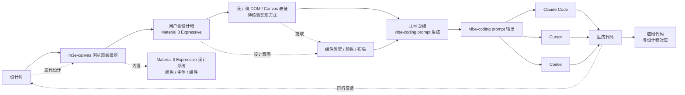

# lnkiai/m3e-canvas

## 一句话定位
浏览器内 Material 3 Expressive 屏幕设计工具——Sketch Material 3 Expressive screens in the browser and turn them into vibe-coding prompts.，TypeScript，把"用户在浏览器画设计稿"自动转化为"vibe-coding prompt"，是设计链路（用户画稿 → AI 编码）的反向工具。

## 它解决的问题
2026 年 vibe-coding（AI 直接从自然语言生成 UI 代码）爆发，但主流工具（v0 / Bolt / Lovable / Cursor Composer）都是从文本 prompt 直接生成 UI——缺乏"用户先画设计稿，再让 AI 编码"的中间环节。lnkiai/m3e-canvas 直击这一痛点：(a) 浏览器内画 Material 3 Expressive 设计稿；(b) 自动转化为 vibe-coding prompt；(c) 输出可被 Claude Code / Cursor / Codex 等 Coding Agent 直接消费。这与 9-06 上榜的 cathrynlavery/diagram-design（"AI Agent → 编辑级图表"）形成**设计链路双向闭环**——m3e-canvas 是前向（人类 → AI），diagram-design 是反向（AI → 人类可读产物）。

## 为什么值得关注
- **Stars:** 4,251（截至 2026-09-07），5 天净增，单日均速 ~850⭐/day（**非 Skill 类项目最高单日均速**）
- **Forks:** 363（fork/star 8.5%，与 magnitude 7.2% 接近——反映真实开发者尝试）
- **语言:** TypeScript 主导
- **设计语言目标:** Material 3 Expressive（Google 2025-2026 推的设计语言）——紧跟 Google 设计规范
- **设计链路反向工具:** 区别于"文本 prompt → UI"的 v0 / Bolt / Lovable，m3e-canvas 是"用户画稿 → prompt"
- **多 Agent 兼容:** 输出 vibe-coding prompt 可被 Claude Code / Cursor / Codex 等多 Coding Agent 消费

## 热度来源判断
m3e-canvas 的热度来自三个趋势的交汇：(1) **vibe-coding 主流化**——2026 年 v0 / Bolt / Lovable / Cursor Composer 已教育市场，但"先画稿再编码"的中介环节缺位；(2) **Material 3 Expressive 推广**——Google 在 2025-2026 推 Material 3 Expressive 设计语言，设计师社区跟进；(3) **设计链路反向**——与 cathrynlavery/diagram-design / kacperkapusciak/goldie 共同构成"设计 ↔ AI"链路双向工具化。

5 天 4,251⭐ / fork/star 8.5% 是 Skill 类项目之外较高的单日均速。**提示：** lnkiai 是独立开发者（GitHub stars 累计中等），m3e-canvas 是其个人项目；与 v0 / Bolt / Lovable 等成熟 vibe-coding 工具的差异化（仅限 Material 3 Expressive）需要核验。

## 关键技术亮点
1. **浏览器内设计编辑器:** 用户可在浏览器中直接画 Material 3 Expressive 屏幕，无需安装
2. **vibe-coding prompt 转换:** 自动把设计稿转化为 vibe-coding prompt（推测采用 CV / DOM 分析 + LLM 总结）
3. **Material 3 Expressive 设计系统:** 内置 M3E 设计规范（颜色 / 字体 / 组件 / 间距）
4. **多 Coding Agent 兼容:** 输出的 prompt 格式需适配 Claude Code / Cursor / Codex 等多 Agent
5. **TypeScript 主导:** 与 ECC / anthropics/skills 一致
6. **组件库内置:** 推测内置 Material 3 Expressive 组件库（按钮 / 卡片 / 列表 / 导航等）

## 架构师速览

| 决策问题 | 研究判断 | 证据边界 |
|---|---|---|
| 系统边界 | 浏览器内 Material 3 Expressive 设计编辑器 + vibe-coding prompt 转换器——区别于 v0 / Bolt / Lovable 的"文本 prompt → UI"，m3e-canvas 是"用户画稿 → prompt"反向工具 | 边界由 trending 描述明示；具体画稿编辑器（Canvas / SVG / WebGL）需 README 核验 |
| 主路径 | 用户画设计稿 → 设计稿 DOM / Canvas 表征 → LLM 总结 → vibe-coding prompt 输出 → Coding Agent（Claude Code / Cursor）消费 → 生成代码 | 主路径为描述语义抽象；具体 prompt 输出格式（自然语言 / 结构化 spec）未在 trending 中可见 |
| 关键权衡 | 仅限 Material 3 Expressive 设计语言（紧跟 Google）vs 与 v0 / Bolt / Lovable 等通用 vibe-coding 工具的兼容性；浏览器内编辑器（无需安装）vs 专业设计工具（Figma / Sketch）的功能深度 | Material 3 限制由 trending 描述明示；与通用 vibe-coding 工具的关系需 README 核验 |
| 最小 PoC | 浏览器打开 m3e-canvas → 用内置组件画一个 Material 3 屏幕 → 导出 vibe-coding prompt → 粘贴到 Claude Code → 对比生成的代码与设计稿的相似度 | 安装命令需 README 独立核验；与 Figma Make / Galileo AI / Visily 等成熟 vibe-coding 工具的对比需测试 |

## 架构启发
m3e-canvas 的核心启发是 **"vibe-coding 应该有'先画稿再编码'的中介环节"**。当前 vibe-coding 工具（v0 / Bolt / Lovable）的输入是文本 prompt——但设计师更习惯用视觉表达。"用户画稿 → 自动 prompt → Coding Agent 消费"的链路把设计与编码无缝衔接，降低设计师与开发者之间的协作成本。更深层的启发是：**Material 3 Expressive 作为设计语言目标的选择是务实的**——Google 推 M3E 的同时开源工具支持，m3e-canvas 借势获得早期采用者；但仅限 M3E 也是天花板——v0 / Bolt 等通用工具可能跟进。

风险提示：**"画稿 → prompt"转换质量未量化**——生成的 vibe-coding prompt 与原始设计稿的语义一致性是核心质量指标，需要 benchmark 验证；与 v0 / Bolt / Lovable 等成熟工具的对比（用户画稿的效率 vs 文本 prompt 的效率）需要独立评估；仅限 Material 3 Expressive 是"窄而深"vs"广而浅"的产品定位选择。

## 架构图（MMD）

> 证据边界：此图只采用本档案已有可核验描述；"待核验"节点不应视为项目实现事实。

## 定位判断
**工具型项目（Material 3 vibe-coding prompt 生成器）。** lnkiai/m3e-canvas 不是 vibe-coding 主工具，而是 vibe-coding 工具链的**中介环节**——专门服务于"Material 3 Expressive 设计 → vibe-coding prompt"这一窄场景。5 天 4,251⭐ / fork/star 8.5% 显示该中介环节有真实需求。但作为独立产品的天花板：(a) Material 3 Expressive 仅是设计语言之一（不是全部）；(b) v0 / Bolt / Lovable 可能跟进"画稿 → prompt"功能；(c) 设计师也可以直接用 Figma + Make 工具。当前定位是"M3E vibe-coding 中介头部样本"，向通用 vibe-coding 中介演进或聚焦 M3E 深度是两条路径。

## 风险/局限/泡沫点
- **Material 3 Expressive 窄定位:** 仅服务 M3E 设计语言，与 Figma / Sketch 等通用设计工具相比功能浅
- **与 v0 / Bolt / Lovable 竞争:** 通用 vibe-coding 工具可能跟进"画稿 → prompt"功能，挤压 m3e-canvas 空间
- **5 天新项目风险:** 长期可持续性 / 治理结构 / 安全漏洞响应未验证
- **lnkiai 个人项目:** 主要由社交媒体推动（Material 3 在设计师社区热度）
- **画稿 → prompt 转换质量:** 生成的 vibe-coding prompt 与原始设计稿的语义一致性是核心质量指标
- **无 Figma / Sketch 集成:** 与设计师日常工作流割裂，可能限制采用

## 与同类项目的关系
- **vs v0 / Bolt / Lovable:** 通用 vibe-coding 工具（文本 prompt → UI）；m3e-canvas 是中介（用户画稿 → prompt）
- **vs Figma Make:** Figma 内置的 vibe-coding 工具，可能直接竞争
- **vs Galileo AI / Visily:** AI 设计生成工具（文本 / 草图 → UI 设计稿）；m3e-canvas 是反向（设计稿 → prompt）
- **vs cathrynlavery/diagram-design:** diagram-design 是"AI → 编辑级图表"反向；m3e-canvas 是"用户画稿 → prompt"前向——设计链路双向闭环
- **vs kacperkapusciak/goldie:** goldie 是"AI → App Store 预览图"；m3e-canvas 是"用户 → vibe-coding prompt"——设计链路不同方向

## 是否值得持续跟踪
**值得跟踪（Material 3 vibe-coding 中介）。** m3e-canvas 代表了 vibe-coding 从"纯文本 prompt"扩展到"视觉中介"的诉求。建议关注：(a) Material 3 Expressive 设计语言的推广速度；(b) v0 / Bolt / Lovable 是否跟进"画稿 → prompt"功能；(c) 设计师社区采用度（Material 3 设计语言覆盖度）；对 Material 3 设计师，m3e-canvas 是值得尝试的 vibe-coding 中介工具。

## 后续观察点
- 是否扩展到通用设计语言（不仅限 Material 3 Expressive）
- 与 Figma / Sketch 的集成深度
- 画稿 → prompt 转换质量 benchmark
- 与 v0 / Bolt / Lovable 等通用 vibe-coding 工具的功能对比
- 设计师社区采用度 / Material 3 Expressive 推广速度
- lnkiai 个人项目的可持续性 / 治理结构

---
> 数据来源: GitHub API (2026-09-07) | Stars: 4,251 | Forks: 363 | License: 待核验 | 语言: TypeScript | 创建: 2026-09-02
