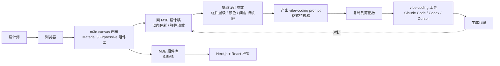

# lnkiai/m3e-canvas

## 一句话定位
Material 3 Expressive 浏览器设计画布 + vibe-coding prompt 产出器——在浏览器内画 Material 3 Expressive 屏幕并自动产出 AI coding prompt，把"设计 → 代码"链路直接打通。

## 它解决的问题
2026 年 vibe-coding 工具爆发，但所有主流工具（Cursor / Claude Code / Codex / v0 / Bolt 等）的输入都是**文本 prompt**——设计师需要"先写文字描述，再让 AI 生成代码"。这个流程对设计师不友好：(1) 设计师的思维是可视化的，不是文字；(2) prompt 描述与最终设计稿之间存在歧义；(3) 反复迭代成本高。`m3e-canvas` 把"画 Material 3 Expressive 设计稿"和"产出 vibe-coding prompt"耦合在同一界面——设计师直接在浏览器画，工具自动产出对应 prompt。这是 vibe-coding 工具的"上游化"（upstream shift）：把 AI 编程的输入端从文本转移到视觉，从设计稿直接生成代码。

## 为什么值得关注（2026-09-05）
- **Stars:** 1,754（截至 2026-09-05），3 天即达 1.7k⭐，处于"早期爆发 + 持续高增长"阶段
- **Forks:** 119 / 3 天 = 40 forks/日，6.8% fork/star 比正常——说明有相当比例的 fork → 二次开发
- **License:** MIT
- **语言:** TypeScript
- **活跃度:** created 2026-09-02，pushed_at 2026-09-04，3 天内快速进入 1.7k⭐ 区间
- **规模:** 9.5MB——完整组件库 + 画布实现
- **Topics:** 完整度 8 项（design-tool / material-3-expressive / material-design / material3 / nextjs / prompt / react / vibe-coding）——定位清晰

## 热度来源判断
`m3e-canvas` 的热度是 **"vibe-coding 上游化 × Material 3 Expressive 设计语言风口 × Next.js + React 完整组件库"** 的组合。Vibe-coding 是 2026 年最热方向（Cursor 数十亿美元估值 / Claude Code 增长 / Codex 持续进化），但所有 vibe-coding 工具的输入端都是文本，"设计 → prompt" 这一上游步骤仍是空白。Material 3 Expressive 是 Google 2025-2026 推的设计语言（动态色彩 / 弹性动效 / 真实感物理效果），m3e-canvas 是首批把 Material 3 Expressive 作为 vibe-coding 输入的浏览器工具。9.5MB / TypeScript 仓库大小说明有完整组件库与画布实现，不是 PoC。热度**真实且具有工具链价值**——但需警惕：(1) Material 3 Expressive 是 Google 设计语言，m3e-canvas 是社区实现，与 Google 官方工具的差异需对比；(2) 9.5MB 仓库中可能含大量图片 / 字体 / 文档，不是纯代码；(3) vibe-coding prompt 输出格式与具体 AI 工具兼容性需测试。

## 关键技术亮点
1. **Material 3 Expressive 浏览器画布**：动态色彩 / 弹性动效 / 真实感物理效果——首批把 M3E 引入浏览器工具的开源项目
2. **Vibe-coding prompt 产出**：从设计稿直接生成 AI coding prompt——vibe-coding 工具的"上游化"
3. **Next.js + React 完整组件库**：topics 同时出现 nextjs + react + material3 + design-tool——技术栈清晰
4. **9.5MB 完整实现**：仓库大小说明有完整组件库 + 画布，不是 PoC / 模板
5. **MIT License 商业可用**：相比 NOASSERTION / Fair Source，MIT 是企业最友好的开源协议
6. **3 天 1,754⭐**：处于"早期爆发 + 持续高增长"阶段，符合热门 vibe-coding 工具的典型曲线

## 架构师速览

| 决策问题 | 研究判断 | 证据边界 |
|---|---|---|
| 系统边界 | 浏览器内设计画布层（Material 3 Expressive 组件库）+ vibe-coding prompt 生成器层 + Next.js + React 前端框架 | 三要素由 description 与 topics 明示；具体组件库覆盖度（Material 3 Expressive 全部组件 vs 部分）需 README 核验 |
| 主路径 | 用户在浏览器画 Material 3 Expressive 屏幕 → m3e-canvas 记录设计参数 + 组件层级 → 产出 vibe-coding prompt → 复制到 AI coding 工具 | 主路径为 description 抽象；具体 prompt 模板格式（XML / Markdown / JSON）未在 API 中可见 |
| 关键权衡 | "Material 3 Expressive" 设计语言与社区实现的差异；"vibe-coding prompt" 通用性（Claude / Codex / Cursor 兼容 vs 仅 Claude）；"开源组件库" vs "Google 官方 Material 3 Expressive 工具"的生态定位 | 9.5MB 来自 API；MIT License 商业可用；具体 prompt 模板与 vibe-coding 工具兼容性边界需 README 核验 |
| 最小 PoC | 在浏览器打开 m3e-canvas → 选择 Material 3 Expressive 组件 → 画 1 个屏幕 → 导出 vibe-coding prompt → 在 Claude / Codex 中粘贴 → 评估生成代码与设计稿的一致性 | 安装命令需 README 独立核验；vibe-coding prompt 输出格式与具体 AI 工具兼容性需测试 |

## 架构启发
`m3e-canvas` 的核心启发是 **"vibe-coding 工具的'上游化'——从 prompt 文本到可视设计"**。2025-2026 年 vibe-coding 工具的输入端从 prompt 文本开始（Cursor / Claude Code / Codex），但设计师的思维是可视化的，"先写文字描述，再让 AI 生成代码"对设计师不友好。m3e-canvas 把"设计 → prompt → 代码"链路打通：画设计稿 → 自动产出 prompt → 喂给 vibe-coding 工具。更深层的启发是：**"工具的胜利在于降低非专家用户的认知负担"**——设计师不懂 prompt，但懂设计；m3e-canvas 让设计师在熟悉的领域（视觉设计）完成任务，结果自动转译到不熟悉的领域（prompt 文本）。下一波可能是"Figma / Sketch / Adobe XD 直接 → vibe-coding prompt"或"3D 设计 → 场景代码"。

## 架构图（MMD）

> 证据边界：此图只采用本档案已有可核验描述；"待核验"节点不应视为项目实现事实。

## 定位判断
**工具型项目（vibe-coding 工具的"上游化"代表）。** `m3e-canvas` 不仅是设计画布，更代表 vibe-coding 工具链的"上游化"方向——把 AI 编程的输入端从文本转移到视觉。1.7k⭐ / 3 天的爆发力 + 9.5MB / TypeScript 仓库 + Material 3 Expressive 风口定位 + 完整 8 项 topics，说明这不是个人玩具，而是有明确产品定位的工具。但"工具型"项目的胜负取决于：(1) Material 3 Expressive 是否成为主流设计语言；(2) 产出的 vibe-coding prompt 是否被主流工具（Claude Code / Cursor / Codex）良好支持；(3) 与 Google 官方 Material 3 Expressive 工具的生态竞争。

## 风险 / 局限 / 泡沫点
- **Material 3 Expressive 普及度不确定**：Material 3 Expressive 是 Google 2025-2026 推的设计语言，但与 Figma / Sketch / Adobe XD 等传统设计工具的兼容性、与 Material Design 既有项目的迁移成本未观察
- **Vibe-coding prompt 输出格式未公开**：具体是 XML / Markdown / JSON 等格式、是否被 Claude Code / Cursor / Codex 良好支持、是否能保留设计意图到代码——README 核验前都是未知
- **9.5MB 仓库的"代码 vs 资源"比例**：9.5MB 中相当一部分可能是图片 / 字体 / 文档（Material 3 Expressive 设计 token），纯代码部分比例待核验
- **与 Google 官方 M3E 工具的竞争**：如果 Google 发布官方 Material 3 Expressive 设计工具，m3e-canvas 作为社区实现可能面临生态竞争
- **设计师 → 开发者协作的版本管理**：设计稿 → prompt → 代码的链路中，版本管理 / diff / 协作工具尚未成熟
- **依赖 Next.js + React 技术栈**：与其他框架（Vue / Svelte / Solid.js）集成需额外开发

## 与同类项目的关系
- **vs Cursor / Claude Code / Codex**：这些是 vibe-coding 工具的"下游"（接收 prompt → 生成代码）；m3e-canvas 是"上游"（设计 → prompt）——互补关系
- **vs Figma / Sketch / Adobe XD**：这些是设计工具，但产出的是静态设计稿 + 手动代码导出；m3e-canvas 自动产出 vibe-coding prompt
- **vs v0 / Bolt.new / Replit Agent**：这些是 AI 设计 → 代码工具，但输入是文本；m3e-canvas 输入是可视设计
- **vs plasmic / builder.io / animate-ui**：这些是设计 → 代码的可视化构建工具；m3e-canvas 专注于 Material 3 Expressive + vibe-coding prompt

## 是否值得持续跟踪
**值得跟踪（vibe-coding 工具链的"上游化"代表）。** `m3e-canvas` 代表了 vibe-coding 工具链从"下游（接收 prompt）"向"上游（生成 prompt）"演进的趋势，无论其本身成败，这一方向是行业趋势。建议关注：(1) Material 3 Expressive 是否成为主流设计语言；(2) 产出的 vibe-coding prompt 是否被主流工具支持；(3) 与 Figma / Sketch 的集成可能性。对设计师，这是值得试验的 vibe-coding 工具上游；对 vibe-coding 工具开发者，这是值得研究的"输入端 UX"样本。

## 后续观察点
- Material 3 Expressive 在设计社区的普及度
- Vibe-coding prompt 输出格式与 Claude Code / Cursor / Codex 的兼容性测试
- 与 Figma / Sketch / Adobe XD 的集成可能性
- 是否扩展到其他设计语言（Tailwind UI / shadcn / MUI）
- 设计师社区采用率与反馈
- 9.5MB 仓库的纯代码 vs 资源比例
- 与 Google 官方 M3E 工具的竞争态势
- 多语言 / 多框架支持（Vue / Svelte）

---
*首次记录：2026-09-05；数据来源: GitHub API (2026-09-05) | Stars: 1,754 | Forks: 119 | License: MIT | 语言: TypeScript | 创建: 2026-09-02*