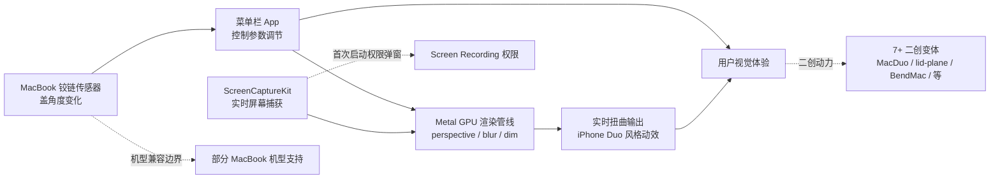

# sumimakito/Mac-Duo

## 一句话定位
Mac Duo——MacBook 盖角度触发的 iPhone Duo 折叠动效菜单栏 App；Metal GPU 渲染 perspective / blur / dim + ScreenCaptureKit 实时屏幕内容；菜单栏控制；中英双语；prebuilt DMG 已签名 + 公证。

## 它解决的问题
iOS 26 / iPhone 17 Pro 推出 iPhone Duo 折叠动画（合盖时屏幕内容倾斜、模糊、淡出）后，MacBook 用户无法享受同等视觉体验。**Mac Duo 把 iPhone Duo 动效完整移植到 macOS**——通过 MacBook 铰链传感器检测盖角度变化，用 Metal GPU 实时渲染 perspective / blur / dim 效果，ScreenCaptureKit 捕获真实屏幕内容做实时扭曲。菜单栏控制，无需打开主窗口。

## 为什么值得关注（2026-09-12）
- 1 天 512⭐ / fork 40——今日最大单点灵感引爆
- Apache-2.0——商业友好
- prebuilt DMG 已签名 + 公证（Apple Developer Program 由 Moeru AI 赞助）
- Apple Silicon + Intel 双架构
- 525 KB size（轻量桌面 App）
- 中英双语 README
- 引发 7+ 个二创变体（同日 DhananjayBhosale/MacDuo / jh3y/lid-plane / IuCC123/BendMac 等）

## 热度来源判断
iPhone Duo 动效是 iOS 26 的标志性视觉卖点，Mac 圈开发者迅速二创。**热度来源是「iPhone Duo 视觉冲击 × MacBook 用户基数 × Metal + ScreenCaptureKit 技术成熟 × 菜单栏 App 极简形态」四因素叠加**。1 天 512⭐ 是 2026-09-12 最大单点热度事件，并引发 7+ 二创变体（同日 MacDuo 132⭐ / lid-plane 131⭐ / Duo-animation 128⭐ / DuoLikeAnimation 125⭐ / iphone-duo 98⭐ / BendMac 88⭐ / Bendable 76⭐）。**热度真实但属于"氛围 App"**——满足视觉愉悦而非生产效率，长期热度依赖 iPhone Duo 持续曝光。

## 关键技术亮点
1. **Metal GPU 渲染**：GPU 加速 perspective / blur / dim 计算，流畅渲染不卡顿
2. **ScreenCaptureKit 实时屏幕内容**：捕获真实屏幕内容做实时扭曲，无需预渲染视频
3. **盖角度实时驱动**：MacBook 铰链传感器（部分机型）检测盖角度变化，自动触发动画
4. **菜单栏控制**：无需打开主窗口，所有调节在菜单栏
5. **prebuilt DMG 已签名 + 公证**：Apple Silicon + Intel 双架构；用户首次启动无 Gatekeeper 警告
6. **Moeru AI 赞助 Apple Developer Program**：README 明示商业化路径
7. **中英双语 README**：覆盖更广用户群体

## 架构师速览

| 决策问题 | 研究判断 | 证据边界 |
|---|---|---|
| 系统边界 | 单 Swift 桌面 App + 菜单栏 UI + Metal 渲染管线 + ScreenCaptureKit 屏幕捕获；macOS 14+ 兼容 | 仅基于 README 与 GitHub 元数据；盖角度传感器 API、Metal shader 实现、ScreenCaptureKit 权限管理均待核验 |
| 主路径 | 铰链传感器（盖角度变化）→ 菜单栏控制 App → 实时渲染参数（perspective / blur / dim）→ Metal GPU 渲染 → ScreenCaptureKit 屏幕捕获 → 实时扭曲输出 | 主路径为 README 描述语义；菜单栏状态机、Metal pipeline 状态切换、ScreenCaptureKit 帧率均待核验 |
| 关键权衡 | 视觉冲击力 vs 性能开销 vs 机型兼容性 vs 屏幕捕获权限 vs "氛围 App"长期活跃度 | 档案明示菜单栏 App 极简形态 + Apple Silicon + Intel 双架构；屏录权限摩擦、盖角度传感器机型限制、"氛围依赖症"风险均待核验 |
| 最小 PoC | 在兼容机型（如 MacBook Pro M2/M3/M4）下载 DMG，安装并授权 Screen Recording 权限；缓慢合盖到约 30° 观察 perspective 过渡；再合到约 10° 观察 blur + dim | PoC 范围与退出路径由档案"先单机型、最小设置、可审计"原则推导；具体兼容机型列表、性能基准、二创 fork 兼容性均待核验 |
| 依赖与红线 | 依赖 macOS 14 + 兼容盖角度传感器的 MacBook；首次启动需授权 Screen Recording；Apache-2.0 允许商业衍生 | 依赖与红线均来自 README + GitHub 元数据；具体 macOS SDK 版本、Xcode 构建版本、传感器 API 限制需独立核验 |

## 架构图（MMD）

> 证据边界：此图只采用本档案已有可核验描述；“待核验”节点不应视为项目实现事实。

## 架构启发
Mac Duo 的核心启发是 **「单点视觉灵感可以引爆多 repo 集群」**——iPhone Duo 动效作为 iOS 26 标志性卖点，被 Mac 圈开发者迅速二创为 7+ 个变体（同日 MacDuo 132⭐ / lid-plane 131⭐ / Duo-animation 128⭐ 等）。**更深层的启发是「Metal + ScreenCaptureKit 技术成熟度」**——现代 macOS 桌面 App 可以用 GPU 实时扭曲真实屏幕内容，性能足够。**最值得借鉴的是「prebuilt DMG 签名 + 公证 + Apple Silicon + Intel 双架构」的发布工程**——个人项目也能达到接近 Apple 官方的分发体验。

## 定位判断
**氛围 App（视觉体验工具）。** Mac Duo 不是生产效率工具，是"氛围 App"——满足用户的视觉愉悦，类似 iOS 上的许多动态壁纸 App。**它的价值定位是「iPhone Duo 动效的 Mac 移植」**，短期热度高但长期活跃度依赖 iPhone Duo 持续曝光。能否从"氛围 App"升级为"基础设施"取决于：(a) Apple 官方是否在 macOS 下个版本内置类似 API（决定长期可持续性）；(b) 是否有第三方扩展机制（决定生态丰富度）；(c) 是否被任何 Mac 工具集成商引入（决定主流曝光）。当前定位是"最有影响力的 Mac Duo 移植工具"，向主流 Mac 工具演进是小概率事件。

## 风险 / 局限 / 泡沫点
- **依赖 macOS 14 + 兼容盖角度传感器的 MacBook**：机型覆盖有限
- **屏实时截屏触发 Screen Recording 权限弹窗**：首次启动体验门槛
- **"氛围 App 依赖症"**：iPhone Duo 热度一旦消退，整个集群活跃度都会下降
- **性能开销**：Metal 实时渲染 + ScreenCaptureKit 持续捕获对老款 MacBook 是负担
- **Apache-2.0 与二创分散**：7+ 个变体同时存在，"谁是主版本"问题已出现
- **个人维护**：sumimakito 个人项目，长期维护依赖作者持续投入

## 与同类项目的关系
- **vs iPhone Duo（iOS 26 原生）**：iPhone Duo 是 Apple 官方动效；Mac Duo 是 Mac 圈非官方移植
- **vs DhananjayBhosale/MacDuo / jh3y/lid-plane / IuCC123/BendMac 等**：这些是同日二创变体，技术路线相似（Swift + Metal），差异在 UI 细节
- **vs Bokeh / ScreenFX 等屏幕特效 App**：那些是 GPU 渲染通用特效；Mac Duo 是 iPhone Duo 特定移植
- **vs HammingDev / 同日 maskit 类隐私网关**：完全不同领域
- **vs Mac 自定义壁纸 / 动态壁纸 App**：那些是桌面背景；Mac Duo 是全屏扭曲动效

## 是否值得持续跟踪
**值得短期观察（氛围 App 集群引爆点）。** Mac Duo 代表了 2026-09-12 最显著的"单点灵感 → 多 repo 集群"事件，无论其本身成败，这一现象本身值得记录。建议关注：(a) Apple 是否在 macOS 27 内置类似 API（决定长期可持续性）；(b) 二创变体的最终收敛（哪个成为事实标准）；(c) 是否被任何 Mac 工具集成商引入。**对 macOS 桌面开发者，这是 macOS Metal + ScreenCaptureKit 技术参考的好样本**。对 macOS 用户，这是"氛围 App"的好玩样本。

## 后续观察点
- 是否被 Apple 官方在 macOS 27 内置类似 API
- 二创变体的最终收敛（sumimakito/Mac-Duo 是否成为事实标准）
- 兼容机型列表是否扩展（更多 MacBook 型号支持）
- 是否出现更激进的扭曲效果（不只是 iPhone Duo 模仿）
- 是否出现 macOS 桌面 App 集成商引入或收购

---

*首次记录：2026-09-12*
