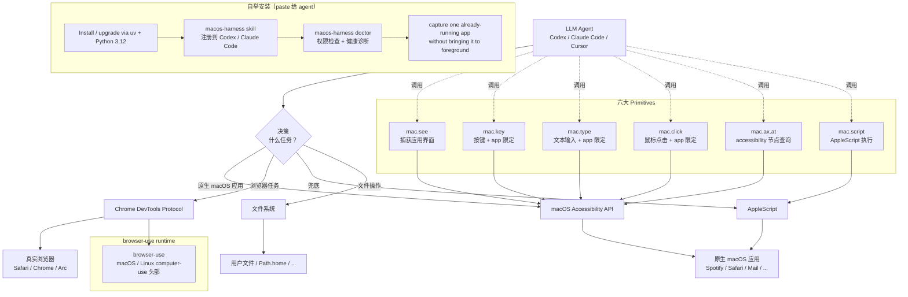

# browser-use/macos-harness

## 一句话定位
**macOS Harness ⌘ —— 最薄一层让 LLM 完全控制 Mac**——`browser-use` 官方出品的 macOS Harness，单一 Python 进程直连 macOS + 真实浏览器 + 文件系统，agent 可写缺失逻辑（"agent writes what is missing, mid-task"），六大 primitives（`mac.see` / `mac.key` / `mac.type` / `mac.click` / `mac.ax.at` / `mac.script`）覆盖整个 Mac。15 天 818⭐ / 55 forks / 7 open issues / 5.6MB / Python / MIT。

## 它解决的问题
2026 下半年 AI agent 在 macOS 上的应用面对两个痛点：(1) **框架过厚**——LangChain / CrewAI / AutoGen 等框架抽象太多，agent 无法"中任务中写缺失逻辑"；(2) **集成过浅**——AppleScript / Keyboard Maestro 等传统 macOS 自动化工具与 LLM 集成度低。`browser-use` 已是 GitHub 上 macOS / Linux 浏览器自动化头部项目，官方出品 `macos-harness` 把"browser-use 的 browser automation + LLM 直连 macOS 系统 primitives + 文件系统"整合为**最薄 Harness**——

> "The agent writes what is missing, mid-task. No framework, no recipes, no rails. One Python process connected directly to macOS, your real browser, and your files."

六大 primitives：
- `mac.see(app)`——捕获应用界面（截图 / accessibility tree）
- `mac.key("cmd+k", app="Spotify")`——按键 + 应用限定
- `mac.type("Alessia Cara", app="Spotify")`——文本输入 + 应用限定
- `mac.click(640, 420, app="Spotify")`——鼠标点击 + 应用限定
- `mac.ax.at(640, 420, app="Spotify")`——accessibility tree 节点查询
- `mac.script('tell application "Spotify" to play')`——AppleScript 执行
- `browser.page_info()` / `list(Path.home().iterdir())`——浏览器 + 文件系统

**安装命令**（可直接 paste 给 Codex / Claude Code）：
```
Install or upgrade macOS Harness from https://github.com/browser-use/macos-harness with uv using Python 3.12. Register the skill printed by `macos-harness skill`, then run `macos-harness doctor`. Explain any missing macOS permissions and ask before requesting them. Finally, verify the harness by capturing one already-running app without bringing it to the foreground.
```

agent 自己安装包 + 教自己工作流 + 检查权限 + 验证连接——**典型的"harness 让 agent 自举"**。

## 为什么值得关注（2026-09-02）
- **15 天 818⭐ / 55 forks**（GitHub API 可核验）：browser-use 官方出品，2026 下半年 macOS 桌面 AI 协同三方势力之一（CopilotKit/OpenBot + yetone/cumora + browser-use/macos-harness）
- **MIT License**：商业可用
- **browser-use 头部背书**：browser-use 已是 GitHub 上 macOS / Linux 浏览器自动化头部项目（数万⭐）
- **accessibility + CDP 双通道**：macOS accessibility API + Chrome DevTools Protocol，覆盖整个 macOS 桌面 + 浏览器
- **Codex / Claude Code 一键安装**：可直接 paste 给 agent 自举安装
- **七大 primitives 覆盖整个 Mac**：UI 操作 / 文本输入 / 鼠标点击 / accessibility 节点 / AppleScript / 浏览器 / 文件系统

## 热度来源判断
**"macOS 桌面 AI 协同 × browser-use 头部背书 × 最薄 Harness 抽象 × Codex/Claude Code 自举安装"四重驱动。** browser-use 已是 macOS / Linux computer-use 头部项目，其官方 Harness 自然有真实用户基础。`最薄 Harness` 抽象层（thinnest harness）与 LangChain / CrewAI 等厚框架形成对比——"agent writes what is missing, mid-task"哲学符合 [Anthropic / LangChain 2026 年对"框架过厚"的反思](https://www.anthropic.com/research/building-effective-agents)。Codex / Claude Code 一键安装 paste 指令降低 agent 自举门槛。

**关键证据 vs 推断：** 818⭐ / 55 forks / 5.6MB / Python / MIT / created 2026-08-17 00:22:20Z / pushed 2026-08-17 16:48:19Z——GitHub API 当日截取。**`pushed_at` 与 `created_at` 仅相差 16 小时**说明此后无新 commit，是"一次性 release + 持续打磨"模式。**风险：** 7 open issues 中可能含 blocker；macOS accessibility API 滥用风险；与 OpenBot / cumora 定位重叠；与 browser-use 主仓的边界（standalone vs submodule）需观察。

## 关键技术亮点
1. **最薄 Harness 抽象**（thinnest harness）："no framework, no recipes, no rails"——agent 可写缺失逻辑
2. **单一 Python 进程**：直连 macOS + 真实浏览器 + 文件系统
3. **六大 primitives**：UI 操作（`mac.see`）/ 按键（`mac.key`）/ 文本（`mac.type`）/ 点击（`mac.click`）/ accessibility 节点（`mac.ax.at`）/ AppleScript（`mac.script`）
4. **accessibility + CDP 双通道**：macOS accessibility API + Chrome DevTools Protocol 覆盖整个 macOS 桌面 + 浏览器
5. **Codex / Claude Code 自举安装**：直接 paste 给 agent 安装 + 教自己工作流 + 检查权限 + 验证连接
6. **`macos-harness doctor`**：权限检查 + 健康诊断
7. **`macos-harness skill`**：注册到 Codex / Claude Code skill
8. **应用限定**：所有 primitives 都可指定 app 参数（如 `app="Spotify"`），避免误操作
9. **background 截图**："capture one already-running app without bringing it to the foreground"——避免对用户视觉的打扰
10. **AppleScript fallback**：`mac.script` 提供 macOS 原生 AppleScript 作为兜底
11. **uv + Python 3.12 安装**：现代 Python 包管理

## 架构师速览

| 决策问题 | 研究判断 | 证据边界 |
|---|---|---|
| 系统边界 | macOS accessibility API 控制层 + CDP 浏览器控制层 + AppleScript fallback 层 + 文件系统访问层 + LLM 调用层 + browser-use runtime 集成层 | 六要素是 topics 与 description 明示；具体 macOS 权限请求粒度、accessibility 与 CDP 切换策略、browser-use 与本 harness 的边界划分需 README 核验 |
| 主路径 | 用户任务 → LLM 决策 → accessibility API 控制原生 macOS 应用 + CDP 控制浏览器 → 屏幕读取验证 → 反馈；agent 可 mid-task 写缺失 Python 逻辑 | 主路径为 README 描述；具体 accessibility API 调用细节、CDP 协议版本、browser-use 集成方式需 README 核验 |
| 关键权衡 | "最薄 Harness"灵活性 vs "复杂任务可靠性"；"accessibility"通用性 vs "误操作风险"；"LLM 全权控制" vs "人工审批门缺失"；"browser-use 官方背书" vs "商业产品边界" | 5.6MB 来自 API；MIT License 商业可用；与 browser-use 主仓的关系（standalone vs submodule）需 README 核验 |
| 最小 PoC | macOS 上 clone 仓库 → uv install（Python 3.12） → `macos-harness skill` 注册 → `macos-harness doctor` 检查权限 → 在 Codex / Claude Code 中执行粘贴指令自举安装 → 执行 1 个简单任务（如"打开 Safari 搜索 X → 提取 Y 字段"）→ 验证 accessibility + CDP 双通道是否工作 → 与 OpenBot / cumora 对比使用体验 | 安装命令需 README 独立核验；具体 macOS 权限申请流程（系统设置 → 隐私 → 辅助功能）需文档指引；LLM 误操作风险评估需独立设计 |

## 架构启发
`macos-harness` 的核心启发是 **"agent harness 应是最薄一层，让 agent 自己写缺失逻辑"**。这与 [Anthropic《Building Effective Agents》](https://www.anthropic.com/research/building-effective-agents) 的核心观点一致——"框架越厚，agent 越蠢"。`macos-harness` 把抽象层压到极致：六大 primitives（`mac.see` / `mac.key` / `mac.type` / `mac.click` / `mac.ax.at` / `mac.script`）+ 浏览器 + 文件系统，agent 可中任务中写缺失 Python 逻辑，**没有 recipes / rails / framework 限制**。

更深层的启发是 **"agent 自举安装"**。README 提供的"Install or upgrade macOS Harness from https://github.com/browser-use/macos-harness..."可直接 paste 给 Codex / Claude Code，agent 自己安装包 + 注册 skill + 检查权限 + 验证连接——**agent 不再是被动工具，而是主动配置自己工作环境的主体**。这与 [Karpathy "Software 3.0"](https://x.com/karpathy/status/1930833239335338384) 思路（LLM-as-runtime）一脉相承——但具体到桌面 AI 协同，"agent 自举 Harness"是落地版本。

对桌面 AI 协同生态的启发是 **"三方势力同时入场 = 标准化窗口"**。`CopilotKit/OpenBot`（商业框架方 AG-UI 协议）+ `yetone/cumora`（个人团队聊）+ `browser-use/macos-harness`（开源自动化头部）三方同时押注 macOS 桌面 AI 协同。三者定位不同（OpenBot = agent runtime / cumora = team chat / macos-harness = thinnest Harness），但都指向"AI agent 完全控制 Mac"这一共同目标。下一波可能是"统一协议 + 跨平台扩展"。

## 架构图（MMD）

> 证据边界：此图只采用本档案已有可核验描述；"待核验"节点不应视为项目实现事实。



## 定位判断
**平台候选项目（macOS 桌面 AI 协同 Harness）。** `browser-use/macos-harness` 是 browser-use 官方出品的 macOS Harness，把"browser-use browser automation + LLM 直连 macOS 系统 primitives + 文件系统"整合为最薄 Harness 层。15 天 818⭐ + 55 forks + browser-use 头部背书已显示真实社区参与度。能否持续，取决于：(1) 误操作风险与人工审批门的平衡；(2) 与 OpenBot / cumora 等竞品的差异化能否维持；(3) browser-use 是否持续投入。

目前定位是"macOS 桌面 AI 协同三方势力之一"——最薄 Harness 抽象层 + Codex/Claude Code 自举安装 + accessibility/CDP 双通道，对开发者群体有真实价值。

## 风险/局限/泡沫点
- **LLM 全权控制 = 误操作风险**：缺"人工审批门"，agent 误操作可能导致数据丢失 / 系统损坏
- **macOS accessibility API 滥用风险**：系统权限要求（辅助功能 / 屏幕录制 / 完全磁盘访问）需谨慎评估
- **与 Apple App Sandbox / 隐私政策兼容性**：macOS 沙盒与 LLM 控制应用的边界需采用方自评
- **agent 误操作法律责任**：LLM 误删除文件 / 误发送邮件 / 误付款等场景的法律责任边界不清晰
- **7 open issues**：可能含 blocker
- **browser-use 主仓关系不明**：standalone vs submodule 的边界需 README 核验
- **`pushed_at` 与 `created_at` 仅差 16 小时**：典型"一次性 release + 持续打磨"模式，长期 commit 节奏待观察
- **Python 3.12 + uv 依赖**：对非 Python 用户上手成本较高

## 与同类项目的关系
- **vs CopilotKit/OpenBot**：OpenBot 是 AG-UI agent runtime + governance + browser/files/tools；本项目是 thinnest Harness + accessibility/CDP 双通道。两者定位不同
- **vs yetone/cumora**：cumora 是跨平台团队聊 + AI 一等公民；本项目是单 macOS Harness。两者定位不同
- **vs LangChain / CrewAI / AutoGen**：这些是厚框架（high-level abstractions）；本项目是最薄 Harness（primitives only）
- **vs AppleScript / Keyboard Maestro**：这些是传统 macOS 自动化工具；本项目是 LLM 驱动的 macOS 自动化
- **vs Skyvern / Anthropic Computer Use**：Skyvern 是浏览器自动化；Anthropic Computer Use 是 macOS / Linux 通用 computer-use；本项目是 browser-use 出品的官方 Harness
- **vs Anthropic《Building Effective Agents》**：本项目是"harness 应最薄"哲学的具体实现

## 是否值得持续跟踪
**值得跟踪（macOS 桌面 AI 协同三方势力之一）。** `browser-use/macos-harness` 代表了 macOS 桌面 AI 协同的"最薄 Harness"方向，与 OpenBot / cumora 形成不同切入角度。无论项目本身成败，这一方向是行业趋势。建议关注：误操作风险与人工审批门的平衡、browser-use 是否持续投入、是否扩展到 iOS / Windows / Linux 平台。

对 macOS 桌面 AI 开发者，这个项目是"如何构建最薄 Harness"的具体实现；对 LLM agent 设计者，它是"框架越薄 agent 越聪明"哲学的样本；对桌面 AI 协同生态，它是"browser-use 头部背书 + Codex/Claude Code 一键安装"的具体落地。

## 后续观察点
- 误操作风险评估与人工审批门设计（是否会引入可选 approval 机制）
- 7 open issues 的解决节奏（决定维护可持续性）
- browser-use 是否持续投入（commit 频率 / 社区参与度）
- 是否扩展到 iOS / Windows / Linux 平台（browser-use 主仓路线）
- 与 OpenBot / cumora 的互操作性（AG-UI 协议 / A2A 协议）
- 是否出现"macos-harness 兼容 harness"生态（如 windows-harness / linux-harness）
- Codex / Claude Code 自举安装 paste 指令的演进（是否扩展到更多 agent）

---
> 数据来源: GitHub API (2026-09-02) | Stars: 818 | Forks: 55 | License: MIT | 语言: Python | 创建: 2026-08-17 | Pushed: 2026-08-17 | Open Issues: 7 | Size: 5.6MB