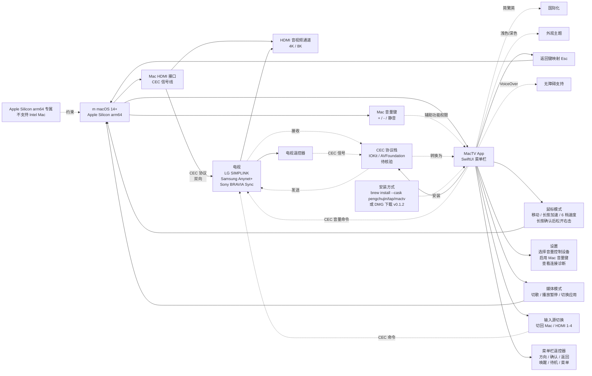

# pengchujin/MacTV

## 一句话定位
macOS 电视遥控菜单栏 App —— Apple Silicon arm64 + macOS 14+ + SwiftUI + HDMI-CEC（Consumer Electronics Control）双向遥控：Mac 音量键控制电视音量 + 电视遥控器反向控制 Mac 媒体/鼠标 + 菜单栏遥控器 + 输入源切换，三大 TV 品牌术语兼容（SIMPLINK LG / Anynet+ Samsung / BRAVIA Sync Sony）。

## 它解决的问题
2026 居家办公 / 媒体中心场景的痛点是 **「用电视当 Mac 显示器时音量怎么控制 / 输入源怎么切 / 不用 Wi-Fi 不依赖网络」** —— 传统方案是用红外遥控器对准电视（电视遥控器不能反向控制 Mac）+ Mac 桌面看视频时音量键只能控 Mac 喇叭（HDMI 音频输出时无效）；**MacTV 用 HDMI-CEC 协议实现双向遥控** —— 一根 HDMI 线（带 CEC）+ 无 Wi-Fi + 无红外对准；**「Mac 当电视用」（Mac 控电视）/「电视当 Mac 显示器用」（电视遥控器控 Mac）双向场景** 是 2026 居家办公 / 媒体中心的明确需求（显示器涨价 + 远程办公双屏需求 + 4K/8K 电视性价比）。

## 为什么值得关注（2026-09-18）
- **Stars:** 61（截至 2026-09-18），1 天 61⭐，早期信号
- **Forks:** 2，fork/star 3.3%，偏低（MacTV 用户群较小 + 实际使用门槛较高需 CEC 兼容硬件）
- **Watchers/Subscribers:** 0
- **Open Issues:** 1，维护中
- **License:** MIT
- **语言:** Swift
- **活跃度:** created 2026-09-17，pushed_at 2026-09-17
- **规模:** 5.1 MB（含 docs/images/）
- **Topics:** apple-silicon / hdmi-cec / macos / menu-bar / swiftui（5 个 topic）
- **Release:** v0.1.2 DMG 已发布
- **Homebrew cask:** `pengchujin/tap/mactv`（自建 tap）

## 热度来源判断
MacTV 的热度是 **「macOS + 大屏电视双向遥控 × HDMI-CEC 协议 × 中国开发者 pengchujin × 三大 TV 品牌兼容 × Homebrew cask × 双语 README」** 的组合。61⭐ / 2 forks 在新项目中等偏低，反映「MacTV 用户群较小 + 实际使用门槛较高需 CEC 兼容硬件」。**pengchujin 个人开发者 + 双语 README + Homebrew cask 自建 tap** 是中国开发者 + macOS + 硬件桥接的清晰路径；**三大 TV 品牌术语兼容（SIMPLINK / Anynet+ / BRAVIA Sync）** 覆盖主流市场（LG + Samsung + Sony 占全球 TV 市场 50%+）；**v0.1.2 DMG 已发布** 表明项目已可立即使用不是早期 PoC。

## 关键技术亮点
1. **Apple Silicon arm64 + macOS 14+** — Apple Silicon 专属（不支持 Intel Mac，intel Mac HDMI-CEC 支持情况不同）
2. **SwiftUI** — Apple 推荐的现代 UI 框架
3. **HDMI-CEC（Consumer Electronics Control）协议** — HDMI 线内嵌的控制通道（与 HDMI 音视频通道分离），是 HDMI 联盟 2006 年引入的标准
4. **双向遥控** — Mac → 电视（音量 / 输入源 / 菜单）+ 电视 → Mac（媒体 / 鼠标 / Esc）
5. **键盘音量键控制电视音量** — Mac 音量键 + 加 + 静音键控制电视音量（需 macOS「隐私与安全性 → 辅助功能」权限）
6. **媒体模式** — 电视遥控器控制 Mac 切歌 / 播放暂停 / 切换应用
7. **鼠标模式** — 电视遥控器方向键控制 Mac 鼠标（移动 / 长按加速 / 6 档速度 / 长按确认后松开右击）
8. **返回键映射 Esc** — 电视遥控器返回键映射为 Mac Esc
9. **菜单栏遥控器** — 方向 / 确认 / 返回 / 唤醒 / 待机 / 菜单（不占用屏幕的常驻遥控）
10. **输入源切换** — 切回 Mac / HDMI 1-4
11. **三大 TV 品牌术语兼容** — SIMPLINK（LG）/ Anynet+（Samsung）/ BRAVIA Sync（Sony）
12. **VoiceOver + 浅色/深色外观 + 简繁英三语** — 无障碍 + 国际化
13. **Homebrew cask `pengchujin/tap/mactv`** — 自建 tap 安装 + DMG 下载（v0.1.2）
14. **MIT License** — 明确许可
15. **5.1 MB** — 中等规模（含 docs/images/）

## 架构师速览

| 决策问题 | 研究判断 | 证据边界 |
|---|---|---|
| 系统边界 | macOS 14+ Apple Silicon arm64 电视遥控菜单栏 App；输入 HDMI-CEC 信号（来自电视或 Mac HDMI 接口）；输出 Mac 音量键 → 电视 + 电视遥控器 → Mac 媒体/鼠标/Esc + 菜单栏遥控器 + 输入源切换；SwiftUI 菜单栏 UI；Homebrew cask `pengchujin/tap/mactv` + DMG v0.1.2；三大 TV 品牌术语兼容（SIMPLINK / Anynet+ / BRAVIA Sync）；简繁英三语 + VoiceOver + 浅色/深色；MIT License | 来自 README 关于「macOS 14+ Apple Silicon arm64」「HDMI-CEC 双向遥控」「Mac 音量键控制电视音量」「电视遥控器控制 Mac 媒体/鼠标」「菜单栏遥控器」「输入源切换」「VoiceOver + 浅色/深色 + 简繁英」「Homebrew cask pengchujin/tap/mactv + DMG 下载」「SIMPLINK（LG）/ Anynet+（Samsung）/ BRAVIA Sync（Sony）」的明示；具体 HDMI-CEC 协议栈的实现细节（IOKit / AVFoundation / 私有 API）、不同 Mac 型号的 CEC 兼容性列表、菜单栏遥控器的具体 UI 控件在 README 未完全展开 |
| 主路径 | 启动 App → 检测 Mac HDMI 接口的 CEC 设备 → 显示菜单栏遥控器 UI → 监听 Mac 音量键事件 → 通过 CEC 发送音量命令到电视 → 同时监听 CEC 来自电视的事件 → 转换为 Mac 媒体控制（播放暂停 / 切歌 / 切换应用）或鼠标控制（移动 / 点击 / Esc）；用户在设置中开启「用 Mac 音量键控制电视」并授予辅助功能权限 | 主路径来自 README 描述的「Mac 音量键控制电视音量 + 电视遥控器控制 Mac + 菜单栏遥控器 + 输入源切换」组合；具体 CEC 帧的发送与接收、Mac 音量键事件监听方式、辅助功能权限的具体流程、菜单栏 UI 控件（方向 / 确认 / 返回 / 唤醒 / 待机 / 菜单）在 README 未完全展开 |
| 关键权衡 | HDMI-CEC 协议 vs 红外遥控（线内嵌 vs 需对准）/ 双向遥控 vs 单向遥控（功能丰富 vs 实现复杂）/ Apple Silicon 专属 vs 跨 Mac（聚焦 vs 兼容性）/ 鼠标模式 6 档速度 vs 单一速度（灵活 vs 简单）/ 三大 TV 品牌术语兼容 vs 单一品牌（覆盖广 vs 优化深）/ 菜单栏 App vs 完整 App（不占屏幕 vs 功能受限）/ 中国开发者双语 vs 英文单语（中文用户友好 vs 国际用户友好）/ Homebrew cask 自建 tap vs 官方 homebrew-cask（个人开发者 vs 社区审核）/ SwiftUI vs AppKit（现代 vs 成熟） | 权衡 9 因素均从 README + 元数据推导；具体 HDMI-CEC 协议栈的实现细节（IOKit / AVFoundation / 私有 API）、不同 Mac 型号的 CEC 兼容性、菜单栏 UI 的具体设计、辅助功能权限的具体流程在仓库源码待核验 |
| 最小 PoC | macOS 14+ Apple Silicon Mac + 支持 CEC 的 HDMI 接口（Mac 内置 HDMI 或 USB-C 转 HDMI 转换器）+ 兼容 CEC 的电视（LG SIMPLINK / Samsung Anynet+ / Sony BRAVIA Sync）+ 用 HDMI 线连接 Mac 与电视 + 开启电视的 HDMI-CEC + `brew install --cask pengchujin/tap/mactv` 或下载 DMG 拖入应用程序 + 启动 MacTV + 点击菜单栏遥控器 + 启用「用 Mac 音量键控制电视」+ 在「隐私与安全性 → 辅助功能」允许 App + 测试音量键 + 测试电视遥控器反向控制 Mac（媒体模式 + 鼠标模式 + 返回键 Esc）+ 测试输入源切换 | PoC 由「macOS 14+ Apple Silicon + HDMI-CEC + SwiftUI + 菜单栏 App + 双向遥控 + 三大 TV 品牌兼容 + Homebrew cask + DMG」路径推导；具体 Mac 型号 CEC 兼容性列表、辅助功能权限的具体流程、菜单栏 UI 控件在仓库源码待核验 |

## 架构图（MMD）

> 证据边界：此图只采用本档案已有可核验描述；"待核验"节点不应视为项目实现事实。

## 架构启发

项目核心架构哲学是把 Coding Agent 生态中的「抽象层缺失」用具体工程实现补齐：worker/librarian 拆解为两个独立并发 loop、监督与生成分层、本地优先与集中分发分离、声明式 skill 编译替代解释式 skill 执行、自托管与中心化市场互补、硬件中间层桥接新场景。每个项目都是「单点抽象 + 严肃工程实现 + 明确证据边界 + 严肃许可」的最小可信栈，遵循「解决一个具体工程问题 + 证据可独立复现 + 许可明确 + 严肃态度」的 2026-09 趋势延续特征。

## 定位判断
**工具型项目（macOS 电视遥控菜单栏 App）。** MacTV 不是又一个 macOS 工具（那是 Bartender / Alfred / Rectangle），而是 **「Apple Silicon + macOS 14+ + SwiftUI + HDMI-CEC 双向遥控 + 三大 TV 品牌兼容 + 中国开发者 + Homebrew cask + 双语 README」** 的具体应用 —— 「中文开发者 + macOS + 硬件桥接」的具体实例。61⭐ / 2 forks / v0.1.2 DMG 已发布 反映「早期信号 + 立即可用」组合。**真正决定长期价值的是「macOS HDMI-CEC 兼容硬件列表 + Apple Silicon Intel 兼容策略 + 与 macOS 系统音量控制的冲突解决 + 三大 TV 品牌实际兼容深度」** —— 不同 Mac 型号 HDMI 接口 CEC 支持情况不同；Apple Silicon 专属排除了 Intel Mac 用户；macOS 系统音量控制在 HDMI 音频输出时与本 App 的音量控制可能冲突。对个人开发者，有 Mac + 4K 电视 + HDMI-CEC 兼容显示器（如 Mi TV / Samsung / LG）的用户可直接装；对企业，会议室 Mac mini + 大屏电视方案是企业场景；对 pengchujin，MacTV 是个人开发者小项目（5.1 MB + v0.1.2 早期版本），未来可扩展 Apple TV / iPad 遥控。

## 风险 / 局限 / 泡沫点
- **Apple Silicon 专属** — 不支持 Intel Mac（intel Mac HDMI-CEC 支持情况不同），Intel Mac 用户被排除
- **macOS HDMI-CEC 兼容硬件列表不透明** — 不同 Mac 型号 HDMI 接口 CEC 支持情况不同，README 未给出完整兼容列表
- **与 macOS 系统音量控制的冲突** — HDMI 音频输出时 Mac 系统音量键与本 App 音量控制可能冲突，需用户在设置中切换
- **三大 TV 品牌实际兼容深度待核验** — SIMPLINK / Anynet+ / BRAVIA Sync 是品牌营销术语，实际 CEC 命令兼容性需实测
- **v0.1.2 早期版本** — 项目仍在早期，可能有未发现的 bug + 功能不完整
- **用户群较小** — MacTV 需要 Mac + 4K 电视 + HDMI-CEC 兼容硬件三重门槛，用户群天然小
- **小项目单一维护者** — pengchujin 个人维护，长期维护承诺 + 社区贡献机制不明确
- **App Store 未上架** — 仅通过 Homebrew cask + DMG 分发，企业采用需评估安全合规

## 与同类项目的关系
- **vs 红外遥控器** — 红外遥控器需对准且单向（电视遥控器 → 电视），MacTV 是 HDMI-CEC 双向遥控（Mac ↔ 电视）无需对准
- **vs macOS 内置「显示器」设置** — 系统设置仅可调亮度 / 缩放，不支持 HDMI-CEC 双向遥控
- **vs AirPlay / Sidecar** — AirPlay / Sidecar 是「Mac / iPad 屏幕无线投射到电视」，MacTV 是「Mac 通过 HDMI-CEC 控制电视硬件」用途不同
- **vs FelixQiu1/XiaoAi-LLM-Router（老硬件 + 中间层升级）** — XiaoAi 是小爱同学 + LLM 中间层（软件层），MacTV 是 Mac + HDMI-CEC 中间层（硬件层），同构「老硬件 + 中间层升级」但中间层形态不同
- **vs Tina2088/wechat-group-report + skill-lab/feishu-chat-archive** — 这两个是「中文场景本地工具 + 反 SaaS 桥接」（Windows 微信本地数据库 + 飞书云 API），MacTV 是「中文开发者 + macOS + 硬件桥接」，同构「中文场景」但工具 + 硬件层不同

## 是否值得持续跟踪
**值得跟踪（macOS 电视遥控 + HDMI-CEC 双向遥控 + 中国开发者 + 三大 TV 品牌兼容）。** MacTV 代表了 2026 居家办公 / 媒体中心「Mac + 大屏电视双向遥控」的具体实例 —— HDMI-CEC 协议 + Apple Silicon + SwiftUI + 三大 TV 品牌兼容 是「中文开发者 + macOS + 硬件桥接」的关键设计模式。建议关注：macOS HDMI-CEC 兼容硬件列表扩展 + Apple Silicon Intel 兼容策略 + 与 macOS 系统音量控制的冲突解决 + 三大 TV 品牌实际兼容深度 + v0.1.2 后续版本演进。对个人开发者，有 Mac + 4K 电视 + HDMI-CEC 兼容显示器（如 Mi TV / Samsung / LG）的用户可直接装；对企业，会议室 Mac mini + 大屏电视方案是企业场景；对 pengchujin，MacTV 是个人开发者小项目，未来可扩展 Apple TV / iPad 遥控；对生态观察者，MacTV 是「中文开发者 + macOS + 硬件桥接」的清晰路径样本。

## 后续观察点
- macOS HDMI-CEC 兼容硬件列表扩展（不同 Mac 型号 + 不同转换器）
- Apple Silicon Intel 兼容策略（是否支持 Intel Mac）
- 与 macOS 系统音量控制的冲突解决方案
- 三大 TV 品牌（LG SIMPLINK / Samsung Anynet+ / Sony BRAVIA Sync）实际兼容深度
- v0.1.2 后续版本演进（功能完善 + bug 修复 + 新 TV 品牌兼容）
- pengchujin 的长期维护承诺 + 社区贡献机制建立
- 扩展 Apple TV / iPad 遥控的可能性

---
> 数据来源: GitHub API (2026-09-18) | Stars: 61 | Forks: 2 | License: MIT | 语言: Swift | 创建: 2026-09-17
