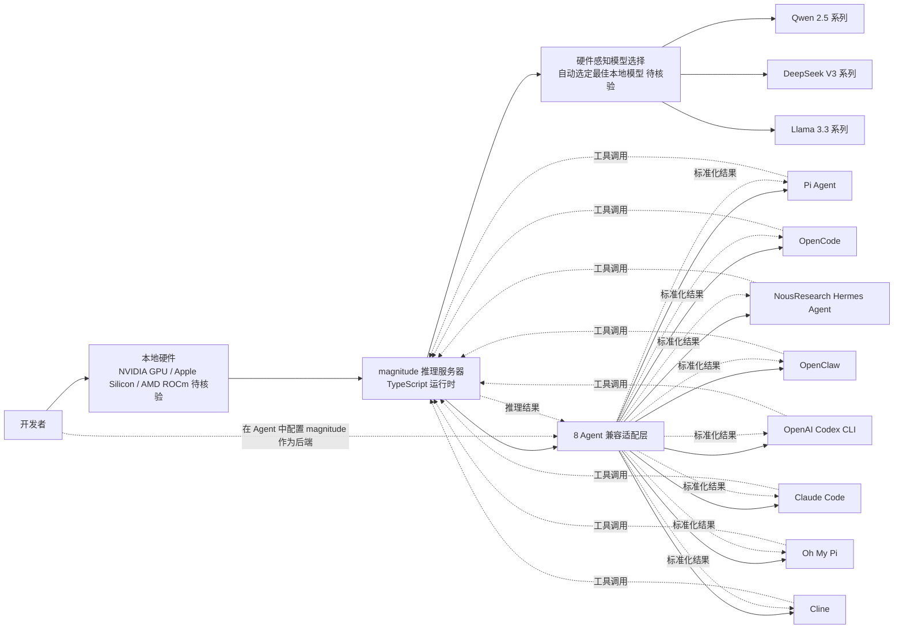

# magnitudedev/magnitude

## 一句话定位
开源本地推理服务器（Open source inference server）——为本地硬件运行"最适合的本地模型"，并通过统一接口对接 Pi / OpenCode / Hermes / OpenClaw / Codex / Claude Code / Oh My Pi / Cline 等 7-8 个主流 Coding Agent，是"本地 Agent 栈"的推理基础设施层。

## 它解决的问题
2026 年 Coding Agent 爆发，但**底层推理服务器选型复杂**——开发者面对 llama.cpp / vLLM / Ollama / LM Studio / SGLang 等多种推理后端，需要为不同模型、不同硬件（NVIDIA GPU / Apple Silicon / AMD ROCm）做选型、调参、版本管理。magnitude 直击这一痛点：(a) 自动为硬件选择"最佳本地模型"；(b) 通过统一接口对接多个 Coding Agent，开发者**无需关心推理后端**。这与 ECC / Hermes Agent / Skills CLI 共同构成 Local-first Agent Stack 的拼图——ECC 提供 Skills + Instincts 层，Hermes Agent 提供运行时，magnitude 提供推理基础设施。

## 为什么值得关注
- **Stars:** 3,159（截至 2026-09-06），单日 +686⭐ 创 GitHub Trending 总榜 #14 / typescript trending #5
- **Forks:** 226（fork/star 7.2%，与 ECC 15.1% / anthropics-skills 11.8% 相比偏低，**反映新项目真实部署较少**）
- **语言:** TypeScript 主导（与 ECC、anthropics/skills、humanlayer 一致——Coding Agent 周边工具栈 TypeScript 化）
- **对接 Agent 数:** 7-8 个 Coding Agent 同时支持（Pi / OpenCode / Hermes / OpenClaw / Codex / Claude Code / Oh My Pi / Cline）——多平台兼容矩阵是 magnitude 的关键卖点
- **本地推理差异化:** 区别于云端 API（Claude / GPT / Gemini），magnitude 专注本地硬件 + 开源模型，对数据隐私 / 离线 / 成本敏感场景是刚需

## 热度来源判断
magnitude 的热度来自三个趋势的交汇：(1) **Local-first Agent Stack 需求**——开发者希望数据不离开本机、不依赖云端 API 配额；(2) **多 Coding Agent 兼容矩阵**——开发者同时使用 Claude Code + Cursor + Codex 等多 Agent，需要统一的推理后端；(3) **开源模型质量提升**——Qwen / DeepSeek / Llama 等开源模型在 2026 年已接近 GPT-4 水平，本地运行成为可能。

单日 +686⭐ 的可信度：**3,159 total_stars 与 226 forks 的比例 7.2% 偏低**，说明大部分 star 用户没有实际 fork / 部署——这与 anthropics/skills 11.8%、ECC 15.1% 形成鲜明对比。**提示：** magnitude 仍处于"早期传播期"，需要观察 1-2 周后是否仍有持续 star 流入；fork 率偏低也可能反映"本地推理部署门槛较高"（需要 GPU / Apple Silicon 硬件 + 模型下载）。

## 关键技术亮点
1. **硬件感知的模型选择:** "runs the best local models for your hardware"——magnitude 自述会根据硬件配置（GPU / Apple Silicon / CPU）自动选择适合的模型版本（量化精度 / 模型规模）
2. **多 Coding Agent 适配层:** 同时支持 Pi / OpenCode / Hermes / OpenClaw / Codex / Claude Code / Oh My Pi / Cline——8 个 Agent 的 Skill / Tool 调用协议差异是 magnitude 的核心适配复杂度
3. **统一推理接口:** 开发者无需关心底层是 llama.cpp / vLLM / Ollama——magnitude 抽象统一接口
4. **TypeScript 主导:** 与 ECC / anthropics/skills / humanlayer 一致——Coding Agent 周边工具 TypeScript 化的趋势
5. **Agent 兼容矩阵的兼容性差异:** 不同 Agent 的 Skill / Tool 调用协议不同——magnitude 如何处理（如部分 Agent 不支持某些 Skill）需要 README 核验
6. **本地推理性能优化:** 推测可能使用量化（GGUF / AWQ / GPTQ）、batch 处理、KV cache 复用等优化手段

## 架构师速览

| 决策问题 | 研究判断 | 证据边界 |
|---|---|---|
| 系统边界 | 本地推理服务器 + Coding Agent 适配层——硬件感知模型选择 + 8 个 Agent 兼容接口 + 统一推理抽象 | 三要素由 trending 描述明示；具体模型选择算法、Agent 协议适配深度、量化支持范围需 README 核验 |
| 主路径 | 用户硬件配置 → magnitude 推理服务器启动 → 选定最佳本地模型 → 用户在 Coding Agent（Claude Code / Cursor / Codex 等）中调用 → 推理请求 → 本地模型推理 → 结果返回 | 主路径为描述语义抽象；具体模型加载时延、推理吞吐、Agent 协议转换细节未在 trending 中可见 |
| 关键权衡 | 本地推理的隐私/离线优势 vs 硬件门槛（需要 GPU / Apple Silicon）vs 与云端 API 的性能/质量差距；8 个 Agent 同时支持的兼容广度 vs 每个 Agent 的适配深度 | 8 个 Agent 来自 trending 描述；具体兼容矩阵（哪些 Agent 完全支持 / 哪些部分支持）需 README 核验 |
| 最小 PoC | 安装 magnitude → 在 Apple Silicon Mac 或 NVIDIA GPU 上启动推理服务器 → 在 Claude Code 或 Cursor 中配置 magnitude 作为后端 → 运行 1 个真实任务 → 对比云端 API 的响应时延与质量 | 安装命令需 README 独立核验；模型选择算法的实际表现（如 Qwen 2.5 32B vs Llama 3.3 70B 的自动选择）需测试 |

## 架构启发
magnitude 的核心启发是 **"Local-first Agent Stack 需要三层拼图"**：(1) **运行时**——Hermes Agent；(2) **优化层**——ECC 的 Skills / Instincts / Memory；(3) **推理基础设施**——magnitude。每一层可以独立发展，但需要统一的接口才能组合。magnitude 选择"对接 8 个 Coding Agent"作为切入点是务实的——开发者不会为了某个推理服务器放弃 Claude Code，所以 magnitude 必须做"通用适配层"。

更深层的启发是：**本地推理生态正在从"少数极客的玩具"变成"开发者可选的工作流"**。2025 年本地推理需要用户自己编译 llama.cpp / 下载 GGUF / 配置量化参数；2026 年 magnitude 这种"硬件自动选型 + Agent 兼容"工具出现后，本地推理对普通开发者的门槛大幅降低。这与 Hugging Face Transformers 之于 PyTorch 的演进类似——Transformers 把预训练模型的使用门槛从"研究员"降到"任何开发者"，magnitude 把本地推理的使用门槛从"极客"降到"任何 Coding Agent 用户"。

风险提示：**Local-first 不是银弹**——本地推理的硬件门槛（GPU / Apple Silicon）、模型质量上限（开源模型 vs GPT-5 / Claude Opus 4.5）、维护成本（模型版本管理）仍是真实痛点。magnitude 的"最佳本地模型"主张需要第三方 benchmark 验证（是否真的在所有硬件配置上选择最优模型）。

## 架构图（MMD）

> 证据边界：此图只采用本档案已有可核验描述；"待核验"节点不应视为项目实现事实。

## 定位判断
**工具型项目（Local-first Agent 基础设施）。** magnitude 不是 Agent Framework 也不是 Coding Agent，而是**底层推理服务器**——与 Ollama / LM Studio 类似，但多了"对接 8 个 Coding Agent"的差异化。3,159⭐ 与 226 forks 偏低说明仍处于早期阶段，但单日 +686⭐ 反映 Local-first 叙事的传播力。定位为"Local-first Agent Stack 的推理基础设施层"是合理路径——能否持续取决于 (a) 8 个 Agent 的兼容深度；(b) 第三方 benchmark 验证"最佳本地模型"主张；(c) 与 ECC / Hermes Agent / Skills CLI 的协作生态。

## 风险 / 局限 / 泡沫点
- **本地推理硬件门槛:** 需要 NVIDIA GPU（≥8GB VRAM）或 Apple Silicon（≥16GB RAM）；AMD ROCm 支持情况需 README 核验；普通笔记本电脑用户难以使用
- **开源模型质量上限:** 2026 年开源模型（Qwen / DeepSeek / Llama）已接近 GPT-4 水平，但与 GPT-5 / Claude Opus 4.5 仍有差距；"最佳本地模型"主张需要 benchmark 验证
- **8 Agent 兼容广度 vs 适配深度:** 兼容 8 个 Agent 是营销卖点，但每个 Agent 的 Skill / Tool 协议差异巨大——具体支持深度（哪些 Skill 可用 / 哪些 Agent 功能受限）需 README 核验
- **3,159⭐ 项目方自述能力 vs 实际部署:** total_stars 偏低 + 226 forks / 7.2% fork/star 表明真实部署较少；可能是"早期传播但未实际使用"
- **维护成本与版本管理:** 本地推理需要管理模型版本（Qwen 2.5 / 3.0 / Llama 3.3 / 4.0）、量化版本（GGUF / AWQ / GPTQ）、推理后端版本（llama.cpp / vLLM / Ollama）；magnitude 的版本管理策略需观察
- **与云端 API 的竞争:** Claude API / GPT API 的成本下降（GPT-5 / Claude Sonnet 5 已降至 $3/M tokens 级别）使得本地推理的成本优势减弱；本地推理的核心优势是**隐私 / 离线 / 数据控制**，而非成本
- **同类项目竞争:** Ollama / LM Studio / vLLM / SGLang 都在做类似定位——magnitude 的差异化是"对接 8 个 Coding Agent"，但 Ollama 也有 OpenCode 集成；竞争格局激烈

## 与同类项目的关系
- **vs Ollama:** Ollama 是本地推理服务器的事实标准，但与 Coding Agent 集成主要靠 OpenCode 等少数 Agent；magnitude 对接 8 个 Agent 是广度优势
- **vs LM Studio:** LM Studio 是 GUI 工具，定位"普通用户的本地推理"；magnitude 是 CLI / SDK 工具，定位"开发者的本地推理 + Agent 集成"
- **vs vLLM / SGLang:** vLLM / SGLang 是高性能推理框架，主要面向云端部署；magnitude 是本地推理 + Agent 适配
- **vs llama.cpp:** llama.cpp 是底层 C++ 推理引擎；magnitude 可能在底层依赖 llama.cpp 或类似引擎
- **vs ECC / Hermes Agent / Skills CLI:** 三者是 Local-first Agent Stack 的其他层（优化层 / 运行时 / Skill 分发）；magnitude 是推理基础设施层

## 是否值得持续跟踪
**值得跟踪（Local-first Agent 基础设施）。** magnitude 代表了"本地推理 + Coding Agent 兼容"的新方向，与 ECC / Hermes Agent / Skills CLI 共同构成 Local-first Agent Stack。3,159⭐ 偏低 + 单日 +686⭐ 反映处于早期传播阶段，需要观察 1-2 周后的持续性。

**建议关注：**
- 8 个 Agent 兼容矩阵的实际表现（是否真正"开箱即用"，还是需要用户大量配置）
- "最佳本地模型"主张的第三方 benchmark 验证
- 与 ECC / Hermes Agent / Skills CLI 的协作生态（是否形成 Local-first Agent Stack 联盟）
- Ollama / LM Studio / vLLM 等同类项目的反应（是否被巨头收购或竞争挤压）

**不推荐立即在生产环境采用**——3,159⭐ 总数 + 226 forks 表明真实部署案例较少；本地推理对硬件要求 + 模型质量上限是真实约束。

## 后续观察点
- **8 Agent 兼容矩阵的实际表现:** 哪些 Agent 完全支持 / 哪些部分支持 / 哪些仅实验性——README / Issue tracker 需独立核验
- **第三方 benchmark 验证:** "runs the best local models for your hardware" 是否真的在不同硬件上选择最优模型——需独立测试 Qwen 2.5 32B vs Llama 3.3 70B 在 RTX 4090 vs Apple M3 Ultra 上的自动选择表现
- **Local-first Agent Stack 联盟:** 是否与 ECC / Hermes Agent / Skills CLI 形成"Local-first 四件套"组合（共同 README / 共同 PoC / 共同 Slack）
- **与云端 API 的博弈:** GPT-5 / Claude Sonnet 5 持续降价后，本地推理的成本优势是否被削弱——观察 magnitude 是否强调"隐私 / 离线 / 数据控制"等非成本卖点
- **量化版本支持范围:** 是否支持 GGUF / AWQ / GPTQ / FP8 / BF16 等多种量化方案——决定硬件兼容性广度
- **多模态推理支持:** 是否支持图像 / 视频 / 音频等多模态输入——决定是否能替代 GPT-5 Vision / Claude Opus 4.5 Vision

---
> 数据来源: GitHub Trending 2026-09-06 快照 | Stars: 3,159 | Forks: 226 | License: 待核验 | 语言: TypeScript | 创建: 2026 年内
