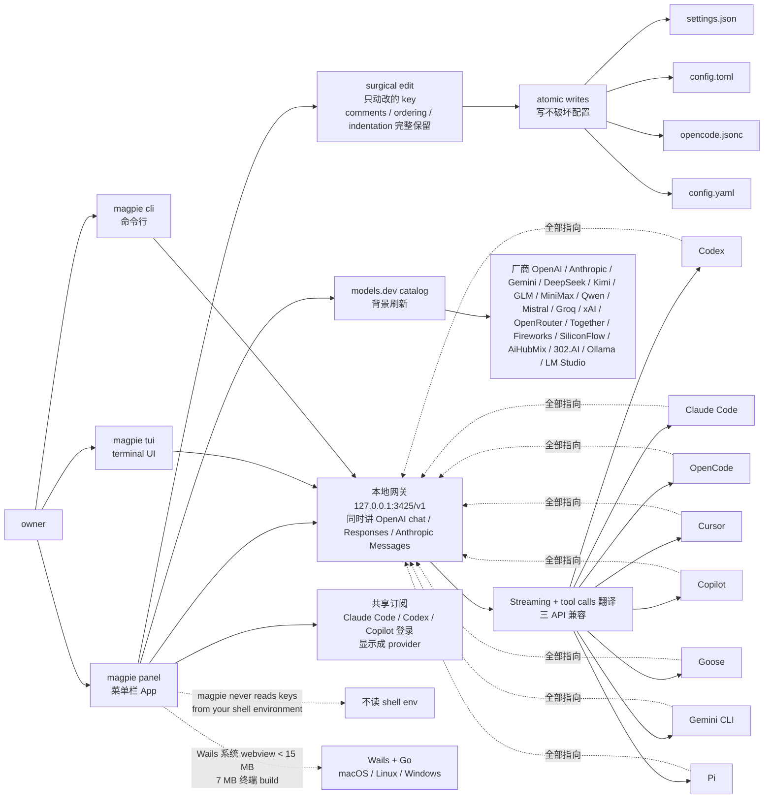

# yetone/magpie

## 一句话定位
跨 Agent 模型统一网关菜单栏 App——Wails 系统 webview < 15 MB + 7 MB 终端 build + macOS / Linux / Windows 三平台 + 本地网关 `127.0.0.1:3425/v1` 同时讲 OpenAI chat completions / OpenAI Responses / Anthropic Messages，把 Codex / Claude Code / OpenCode / Cursor / Copilot / Goose / Gemini CLI / Pi 都指向一个 catalog，surgical edit + atomic writes + 模型列表拉取 models.dev + 共享订阅 + 不读 shell env 的 MIT 开源严肃工程化跨 Agent 网关。

## 它解决的问题
2025-2026 年 coding agent 生态爆发，Codex / Claude Code / OpenCode / Cursor / Copilot / Goose / Gemini CLI / Pi 各有自己的 config 文件（settings.json / config.toml / opencode.jsonc / config.yaml），多 agent 多 model 配置分散、model 切换要手动编辑多个 config、改 model 破坏 comments / ordering / indentation、多 vendor key 重复管理、共享订阅 / 团队订阅困难、模型列表编译进新版本不及时、shell 环境变量泄漏 key 风险。magpie 直击——它提供 **菜单栏 App + 统一网关 `127.0.0.1:3425/v1`** + **同时讲 OpenAI chat completions / OpenAI Responses / Anthropic Messages** + **Codex / Claude Code / OpenCode / Cursor / Copilot / Goose / Gemini CLI / Pi 都指向一个 catalog** + **surgical edit（只动改的 key comments / ordering / indentation 完整保留）** + **atomic writes** + **模型列表拉取 models.dev 不编译进** + **共享订阅（登录 Claude Code / Codex / Copilot 显示成 provider）** + **不读 shell env** + **TUI / Panel / CLI 三形态** + **macOS / Linux / Windows 三平台** + **Wails 系统 webview < 15 MB desktop + 7 MB 终端 build** + **厂商覆盖 OpenAI / Anthropic / Gemini / DeepSeek / Kimi / GLM / MiniMax / Qwen / Mistral / Groq / xAI / OpenRouter / Together / Fireworks / SiliconFlow / AiHubMix / 302.AI / Ollama / LM Studio**。解决的是 **「跨 Agent 模型统一网关 + 菜单栏 App + surgical 配置 + 模型列表拉取 + 共享订阅 + 三平台 + 系统 webview < 15 MB」** 的严肃工程化缺位问题。

## 为什么值得关注
- **Stars:** 595（截至 2026-09-25），2 天突破 595，增速极快
- **Forks:** 29，社区贡献较活跃
- **License:** MIT（完全开源商用）
- **语言:** Go
- **活跃度:** created 2026-09-23，pushed_at 2026-09-24，持续高活跃
- **规模:** 6.7MB，含 Wails app + TUI + CLI + 本地网关
- **Topics:** claude-code, codex, deepseek, gemini-cli, llm, macos
- **Wails 系统 webview < 15 MB desktop + 7 MB 终端 build** —— 极小 binary
- **macOS / Linux / Windows 三平台**
- **本地网关 `127.0.0.1:3425/v1`** —— 统一 endpoint
- **OpenAI chat completions + OpenAI Responses + Anthropic Messages** —— 三 API 同时讲
- **Codex / Claude Code / OpenCode / Cursor / Copilot / Goose / Gemini CLI / Pi** —— 八 agent 全支持

## 热度来源判断
yetone/magpie 的热度是 **「跨 Agent 模型统一网关菜单栏 App 严肃工程化刚需 × Wails 系统 webview < 15 MB × 7 MB 终端 build × macOS / Linux / Windows 三平台 × 本地网关 127.0.0.1:3425/v1 × OpenAI chat completions / OpenAI Responses / Anthropic Messages 三 API 同时讲 × Codex / Claude Code / OpenCode / Cursor / Copilot / Goose / Gemini CLI / Pi 八 agent × surgical edit × atomic writes × 模型列表拉取 models.dev × 共享订阅 × 不读 shell env」** 的强劲组合。跨 Agent / 跨 model 管理是 2026 年最热工程化诉求，但每个 agent / model 各有 config + 改 model 破坏 comments + 多 vendor key 重复管理 + 共享订阅困难 + shell 环境变量泄漏 key。magpie 直击痛点——一个 **菜单栏 App + 统一网关 + surgical edit + atomic writes + 模型列表拉取 + 共享订阅 + 不读 shell env + 三平台 + 系统 webview < 15 MB**。热度**真实且具平台候选潜力**——但需警惕：Wails 系统 webview < 15 MB 在 macOS / Linux / Windows 多版本的兼容性；本地网关在 Codex / Claude Code / OpenCode / Cursor / Copilot / Goose / Gemini CLI / Pi 多 agent 的稳定性；三 API（OpenAI chat completions / OpenAI Responses / Anthropic Messages）同时讲的兼容性；Surgical edit 在 settings.json / config.toml / opencode.jsonc / config.yaml 多格式的实用性；模型列表拉取 models.dev 在新 model 发布的及时；共享订阅在 Claude Code / Codex / Copilot 登录的兼容性；厂商覆盖的稳定性；不读 shell env 在 README 的明确表态与实际代码一致性。

## 关键技术亮点
1. **One small binary** —— Under 15 MB desktop app（Wails 系统 webview 什么都不打包），7 MB 终端-only build；macOS / Linux / Windows
2. **Edits config files surgically** —— 只动 owner 改的 key，comments / ordering / indentation 在 settings.json / config.toml / opencode.jsonc / config.yaml 完整保留
3. **Atomic writes** —— 写不破坏配置
4. **One endpoint for every agent** —— magpie 跑本地网关讲 OpenAI chat completions + OpenAI Responses + Anthropic Messages，转发到 model 所在的 vendor；Codex / Claude Code / OpenCode 都指向 `http://127.0.0.1:3425/v1` 从一个 catalog 选 model
5. **Streaming + tool calls** —— 网关翻译 streaming 和 tool calls
6. **Your subscriptions, shared** —— 登录 Claude Code / Codex / Copilot，登录显示成 provider，其他 agent 通过网关用 models，nothing copied / no key to paste
7. **Providers with one field** —— 选 preset（OpenAI / Anthropic / Gemini / DeepSeek / Kimi / GLM / MiniMax / Qwen / Mistral / Groq / xAI / OpenRouter / Together / Fireworks / SiliconFlow / AiHubMix / 302.AI / Ollama / LM Studio），粘 key，done
8. **Real model lists, nothing compiled in** —— 有 key 后 magpie 问 vendor 提供哪些 model，models.dev catalog 填名字 / reasoning efforts / 没 catalog 的 vendor 列表，背景刷新
9. **Custom vendors** —— 需要名字 + base URL
10. **magpie never reads keys from your shell environment** —— magpie 从不读 shell 环境变量
11. **TUI / Panel / CLI 三形态** —— `magpie` 命令打开 panel，`magpie tui` 打开 terminal UI，`magpie cli` CLI
12. **键盘快捷键** —— ↑↓ agent / ←→ field / ↵ change / s save profile / p profiles / q quit

## 架构师速览

| 决策问题 | 研究判断 | 证据边界 |
|---|---|---|
| 系统边界 | Wails 系统 webview < 15 MB desktop + 7 MB 终端 build + 本地网关 `127.0.0.1:3425/v1` 同时讲 OpenAI chat completions / OpenAI Responses / Anthropic Messages + Codex / Claude Code / OpenCode / Cursor / Copilot / Goose / Gemini CLI / Pi 八 agent config 改写器 + models.dev catalog 拉取器；macOS / Linux / Windows 三平台；零 backend / 零 account / 不读 shell env | 仅基于 README 公开摘录 + GitHub Search API 元数据；具体 Wails 系统 webview 实现、本地网关 streaming / tool calls 翻译细节、surgical edit 在 settings.json / config.toml / opencode.jsonc / config.yaml 的具体规则、models.dev 拉取频率、共享订阅在 Claude Code / Codex / Copilot 登录的具体兼容性未在档案中给出 |
| 主路径 | owner 启动 magpie panel/tui/cli → 本地网关 `127.0.0.1:3425/v1` 监听 → Codex / Claude Code / OpenCode / Cursor / Copilot / Goose / Gemini CLI / Pi 都指向 `127.0.0.1:3425/v1` → owner 在 panel/tui 选 model → surgical edit 改 agent config（settings.json / config.toml / opencode.jsonc / config.yaml）只动改的 key → atomic writes → 网关接请求 → 翻译 OpenAI chat / Responses / Anthropic Messages → 转发到 vendor → streaming + tool calls 翻译回 agent | 主路径为 README 语义抽象；Wails 系统 webview 多平台兼容性、本地网关 streaming / tool calls 翻译延迟、surgical edit 在多 agent config 格式的规则完整性、models.dev 拉取频率、共享订阅多 vendor 兼容性均待核验 |
| 关键权衡 | 跨 Agent 统一网关 vs 单 agent 定制 config vs 菜单栏 App vs TUI/CLI vs 系统 webview < 15 MB vs bundle webview 大小 vs surgical edit vs 改 comments / ordering / indentation vs atomic writes vs 写破坏配置风险 vs 模型列表拉取 vs 编译进及时性 vs 共享订阅 vs 团队 / 个人订阅边界 vs 不读 shell env vs key 管理 UX | 档案明示「One small binary + Edits config files surgically + Atomic writes + One endpoint for every agent + Streaming + tool calls + Your subscriptions, shared + Providers with one field + Real model lists, nothing compiled in + magpie never reads keys from your shell environment」十点权衡；具体 surgical edit 规则完整性、本地网关 streaming / tool calls 翻译稳定性、厂商覆盖稳定性均待核验 |
| 最小 PoC | 启动 magpie panel/tui/cli → Codex / Claude Code / OpenCode / Cursor / Copilot / Goose / Gemini CLI / Pi 全部指向 `http://127.0.0.1:3425/v1` → 在 panel 选 Codex 切到 DeepSeek → 验证 surgical edit 只动 settings.json 的 model 字段 comments / ordering / indentation 完整保留 → 在 panel 选 Claude Code 切到 Kimi → 验证 surgical edit 只动 settings.json 的 model 字段 → 登录 Claude Pro → 验证共享订阅显示成 provider → 验证不读 shell env `OPENAI_API_KEY` 等 | PoC 范围、退出路径由档案「八 agent 全指向 + surgical edit + 共享订阅 + 不读 shell env」建议推导；具体 Wails 多平台兼容性、本地网关 streaming / tool calls 翻译细节、surgical edit 规则完整性、models.dev 拉取频率均待核验 |

## 架构启发
yetone/magpie 的核心启发是 **「菜单栏 App + 统一网关 + surgical edit + atomic writes + 模型列表拉取 + 共享订阅」是跨 Agent 模型统一网关严肃工程化的关键模式**。当前所有跨 agent 工具都是「CLI / 配置文件 / 环境变量」的分散形态——每个 agent 各有 config、每个 vendor 各有 key、改 model 要手动编辑多个文件、改 model 破坏 comments / ordering / indentation、多 vendor key 重复管理、共享订阅困难、shell 环境变量泄漏 key。magpie 尝试做 **「跨 Agent 严肃工程化统一网关」**——菜单栏 App 集中管理 model、本地网关统一 endpoint、surgical edit + atomic writes 保护 agent config、模型列表拉取 models.dev 不编译进、共享订阅让 Claude Code / Codex / Copilot 登录变成其他 agent 可用的 provider、不读 shell env 让 key 管理 UX 可控。更深层的启发是：**「Wails 系统 webview < 15 MB + 7 MB 终端 build」是严肃工程化桌面 App 的极小 binary 路径**——vs Electron 打包整个 webview (100MB+)，Wails 用系统 webview，desktop app < 15 MB；vs Tauri 集成 Rust 后端，magpie 用 Go 后端 + Wails；让 binary 大小接近终端 build。再深一层：**「OpenAI chat completions / OpenAI Responses / Anthropic Messages 三 API 同时讲 + Streaming + tool calls 翻译」是 LLM API 网关的严肃工程化挑战**——三 API 的 request / response schema 不同（tool calls 结构、streaming 事件类型、function calling 字段），需要网关做完整翻译。

## 架构图（MMD）

> 证据边界：此图只采用本档案已有可核验描述；"待核验"节点不应视为项目实现事实。

## 定位判断
**工具型 + 平台候选型项目（跨 Agent 模型统一网关）。** yetone/magpie 不仅是菜单栏 App，更是 **跨 Agent 模型统一网关严肃工程化** 的标志——它提供 Wails 系统 webview < 15 MB + 7 MB 终端 build + macOS / Linux / Windows 三平台 + 本地网关 `127.0.0.1:3425/v1` + OpenAI chat completions / OpenAI Responses / Anthropic Messages 三 API + Codex / Claude Code / OpenCode / Cursor / Copilot / Goose / Gemini CLI / Pi 八 agent + surgical edit + atomic writes + 模型列表拉取 models.dev + 共享订阅 + 不读 shell env，让跨 Agent 用户一处切换 model 不动配置。595⭐ / fork 29 / Wails 系统 webview / 三平台 / 八 agent 显示严肃工程化雏形。但「平台化」取决于一个关键问题：跨 vendor 厂商覆盖（OpenAI / Anthropic / Gemini / DeepSeek / Kimi / GLM / MiniMax / Qwen / Mistral / Groq / xAI / OpenRouter / Together / Fireworks / SiliconFlow / AiHubMix / 302.AI / Ollama / LM Studio）的稳定性 vs 跨 agent config 格式（settings.json / config.toml / opencode.jsonc / config.yaml）的扩展性。目前定位是「跨 Agent 模型统一网关菜单栏 App」的标志性样本，向平台演进是合理路径。

## 风险/局限/泡沫点
- **Wails 系统 webview 多版本兼容性:** Wails 系统 webview < 15 MB 在 macOS / Linux / Windows 多版本（Windows 10/11 不同 webview2 版本 / macOS WebKit 版本）的兼容性需要长期验证
- **本地网关稳定性:** 本地网关 `127.0.0.1:3425/v1` 在 Codex / Claude Code / OpenCode / Cursor / Copilot / Goose / Gemini CLI / Pi 多 agent 的稳定性需要长期验证
- **三 API 兼容性深度:** OpenAI chat completions / OpenAI Responses / Anthropic Messages 三 API 同时讲（tool calls 结构 / streaming 事件类型 / function calling 字段）的兼容性深度需要长期验证
- **Surgical edit 规则完整性:** surgical edit 在 settings.json / config.toml / opencode.jsonc / config.yaml 多格式的规则完整性（comments / ordering / indentation / 多行 JSON / TOML 嵌套 / YAML 注释）需要长期验证
- **Atomic writes 边界:** atomic writes 写不破坏配置的边界（owner config 已被外部修改、并发写入、磁盘满）需要长期验证
- **模型列表拉取及时性:** models.dev catalog 在新 model 发布（每天都有新 model）的及时性
- **共享订阅兼容性:** 共享订阅在 Claude Code / Codex / Copilot 登录的兼容性（Claude Pro / ChatGPT Plus / Copilot Pro）
- **厂商覆盖稳定性:** OpenAI / Anthropic / Gemini / DeepSeek / Kimi / GLM / MiniMax / Qwen / Mistral / Groq / xAI / OpenRouter / Together / Fireworks / SiliconFlow / AiHubMix / 302.AI / Ollama / LM Studio 二十家厂商的稳定性需要长期验证
- **不读 shell env 一致性:** magpie never reads keys from your shell environment 在实际代码的一致性需要验证
- **个人项目属性:** yetone 个人维护，社区治理 / 长期维护可持续性存疑

## 与同类项目的关系
- **vs unreallabsai/unreal-agent:** unreal-agent 是 async-first Go harness 八组件；magpie 是跨 Agent 模型统一网关菜单栏 App，互补
- **vs SewCabinSpout/cleanupper:** cleanupper 是 macOS 终端清理 CLI；magpie 是跨 Agent 模型统一网关菜单栏 App，互补（都强调 Zero telemetry）
- **vs edison-land/paragravity:** paragravity 是 Chromium / Electron user-data-dir 多账号并行；magpie 是跨 Agent config 多 model 并行，互补
- **vs 各类 LLM API gateway（LiteLLM / OpenRouter / Portkey）:** 那些是 SaaS API gateway；magpie 是本地 + 菜单栏 + 跨 agent config 改写器
- **vs 各类 Claude Code / Codex 配置工具:** 那些是单 agent 配置；magpie 是多 agent 统一网关
- **vs models.dev:** models.dev 是 catalog 数据源；magpie 是 catalog 消费者 + 网关 + 菜单栏 App

## 是否值得持续跟踪
**值得跟踪（跨 Agent 模型统一网关菜单栏 App）。** yetone/magpie 代表了「跨 Agent / 跨 model 严肃工程化统一网关」的方向，无论其本身成败，这一方向是行业趋势。建议关注：Wails 系统 webview 多版本兼容性；本地网关稳定性；三 API 兼容性深度；Surgical edit 规则完整性；厂商覆盖稳定性；共享订阅在 Claude Pro / ChatGPT Plus / Copilot Pro 的兼容性；对 coding agent 用户，可一处切换 model 不动配置；对菜单栏 App 严肃工程化爱好者，是「Wails 系统 webview + TUI / Panel / CLI 三形态 + 本地网关 + 跨 Agent catalog」的具体路径；对组织 / 企业，是 MIT 开源 + 不读 shell env + 共享订阅严肃工程化参考；对 vendor 模型发布者，是「模型列表拉取 models.dev + 新 model 及时同步」的具体路径。

## 后续观察点
- Wails 系统 webview 多版本兼容性扩展（macOS WebKit / Windows WebView2 / Linux WebKitGTK）
- 本地网关稳定性（Codex / Claude Code / OpenCode / Cursor / Copilot / Goose / Gemini CLI / Pi 八 agent）
- 三 API 兼容性深度扩展（OpenAI chat completions / OpenAI Responses / Anthropic Messages）
- Surgical edit 规则完整性扩展（settings.json / config.toml / opencode.jsonc / config.yaml 多格式）
- Atomic writes 边界强化（owner config 外部修改 / 并发写入 / 磁盘满）
- 模型列表拉取及时性（models.dev catalog 背景刷新频率）
- 共享订阅兼容性扩展（Claude Pro / ChatGPT Plus / Copilot Pro / Cursor Pro）
- 厂商覆盖稳定性（二十家厂商的稳定集成）
- 不读 shell env 在实际代码的一致性
- TUI / Panel / CLI 三形态在多用户场景的实用性
- 是否演化为独立平台（从 GitHub 仓库升级为跨 Agent 模型门户）

---
> 数据来源: GitHub API (2026-09-25) | Stars: 595 | Forks: 29 | License: MIT | 语言: Go | 创建: 2026-09-23 | pushed_at: 2026-09-24 | Topics: claude-code, codex, deepseek, gemini-cli, llm, macos