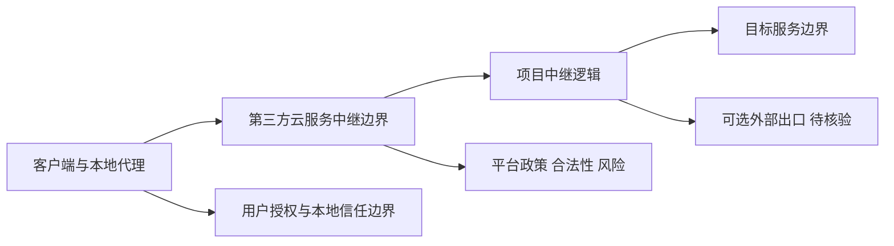

# masterking32/MasterHttpRelayVPN

## 一句话定位
利用 Google Apps Script 作为中继、通过 Domain Fronting（域前置）和 MITM TLS 技术穿透深度包检测（DPI）的反审查代理隧道工具。

## 它解决的问题
在实施严格网络审查和 DPI（深度包检测）的地区，传统 VPN 协议（OpenVPN、WireGuard）的流量特征容易被识别和封锁。本项目通过将流量伪装成对 Google 服务的正常 HTTPS 请求（借助 Google Apps Script 作为中继服务器），实现"流量隐藏在合法云服务中"的隐蔽通信。核心创新是利用 Google 的全球基础设施作为免费、高可用的代理跳板。

## 为什么值得关注
- **Stars:** 3,941（截至 2026-08-07），在反审查工具中增长迅速
- **Forks:** 460，社区活跃贡献衍生项目
- **技术新颖:** 将 Google Apps Script（GAS）用作代理中继，思路独特
- **License:** MIT，完全开源
- **衍生生态:** 已有 Rust 重写版本（therealaleph/MasterHttpRelayVPN-RUST，3.7K stars）
- **活跃度:** pushed_at 2026-06-09

## 热度来源判断
热度来源于**特定地缘政治需求驱动**。项目创建于 2026-04-20，短时间内获得近 4K stars，反映了某些地区网络审查收紧后对新型翻墙工具的迫切需求。技术上属于"对抗性创新"——每次审查升级都会催生新的对抗工具。Rust 版本的出现说明社区认可度较高，形成了事实标准。

## 关键技术亮点亮点
1. **Google Apps Script 中继:** 利用 Google 免费提供的 GAS 运行时作为代理服务器，零基础设施成本
2. **Domain Fronting（域前置）:** 流量目标地址显示为 google.com，实际转发到 Apps Script，DPI 难以区分
3. **MITM TLS 拦截:** 在中继层对 TLS 流量进行解密-重加密，支持 HTTP/1-2 多路复用
4. **DPI 规避:** 流量特征完全融入 Google 正常流量，SNI 和证书均指向 Google
5. **SOCKS5 支持:** 支持标准 SOCKS5 协议，兼容各类客户端

## 架构师速览

| 决策问题 | 研究判断 | 证据边界 |
|---|---|---|
| 系统边界 | 本地代理入口、第三方云服务中继与目标网络之间的高风险通信链路；项目把客户端连接和中继服务作为主要边界。 | 来自档案的 Browser/Local proxy/Google front/Apps Script relay/Target 路径；不对实际流量处理或安全性作源码级结论。 |
| 主路径 | 客户端 → 本地代理 → 第三方云服务中继 → 目标服务；可选出口节点属于外部依赖。 | 仅为高层数据流，不包含部署、配置、规避或可操作步骤。 |
| 关键权衡 | 可达性依赖第三方服务政策与网络环境；隐私、安全、合法性和长期稳定性是同等重要的约束。 | 档案列出 MITM、平台政策和法律风险；没有独立安全审计证据。 |
| 最小 PoC | 不建议将其接入组织生产网络；如需安全研究，应在合规、隔离和授权的测试环境中仅验证可观测性与风险处置流程。 | 这是防御/治理建议，不是使用说明。 |

## 架构启发
本项目展示了一种"寄生式架构"——利用大型云服务商的免费服务（GAS）构建隐蔽通信通道。启发是：**任何提供 serverless 执行能力的平台都可能被用作代理跳板**。这对于网络防御方也具参考价值：审查者需要关注的不仅是 VPN 协议，还包括对合法云服务 API 的异常调用模式。

## 架构图（MMD）

> 证据边界：此图仅表示档案已记录的高层信任与数据边界；不包含部署、配置、规避或操作步骤。

## 定位判断
**特定场景工具型项目。** 这不是通用 VPN，而是专门针对高审查环境的对抗性工具。其存在价值完全取决于目标地区的审查策略——审查放松则需求锐减。

## 风险/局限/泡沫点
- **法律风险:** 在某些司法管辖区使用此类工具可能违法
- **Google 政策风险:** Google 随时可能修改 GAS 使用条款或封锁此类用法
- **性能瓶颈:** GAS 免费配额有限，不适合高带宽场景
- **对抗脆弱性:** 一旦审查方针对性封锁 GAS 端点，方案即失效
- **安全审计:** MITM 设计意味着中继层理论上可见明文，信任假设强

## 与同类项目的关系
- **vs V2Ray/Xray:** V2Ray 是成熟的多协议框架；本项目利用 Google 基础设施，隐蔽性更强但功能单一
- **vs Shadowsocks:** SS 是加密代理，本项目是域前置隧道，技术路线完全不同
- **vs Rust 版本:** therealaleph/MasterHttpRelayVPN-RUST 是性能优化重写，功能对等
- **vs Cloudflare Workers 方案:** 类似思路用 CF Workers 做中继，各有优劣

## 是否值得持续跟踪
**中等优先级跟踪。** 作为反审查技术风向标有参考价值，但高度依赖地缘政治环境变化。建议关注 Google 是否收紧 GAS 策略，以及审查方的技术应对。

## 后续观察点
- Google 是否修改 Apps Script 限制以封锁此类用法
- 是否被更多地区用户采纳（Star 增速的地理分布）
- Rust 版本是否成为主流（性能与安全的平衡）
- 是否衍生出针对其他云平台（CF Workers、AWS Lambda）的类似方案

---
> 数据来源: GitHub API (2026-08-07) | Stars: 3,941 | Forks: 460 | License: MIT
