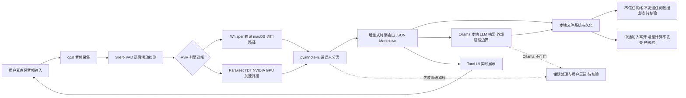

# Meetily — 隐私优先的 AI 会议助手

## 一句话定位
100% 本地处理的 AI 会议助手——Rust 实现、Whisper/Parakeet 实时转录、说话人分离、Ollama 摘要生成，无需云端。

## 它解决的问题
企业会议录音和转写面临三重痛点：
1. **隐私合规风险**——GDPR/CCPA 要求下，会议录音上云面临巨大法律风险
2. **云端 API 成本高**——Otter.ai 等服务月费 $20+，且数据不在自己手里
3. **延迟不可控**——云端转录延迟通常在 2-5 秒，影响实时记笔记体验

目标用户：隐私敏感行业（法律/医疗/金融）从业者、远程团队、重视数据主权的开发者。

## 为什么值得关注（2026-07-13）
23.5K stars 周增 8.6K 登顶 GitHub Trending。这是本地优先 AI 应用赛道中第一个达到"可交付产品质量"的项目。Rust 全栈实现（从音频 I/O 到推理引擎），实时转录延迟 <200ms，macOS + Windows 双平台支持。它证明了本地优先 AI 不只是理念——它是可交付的产品。

## 热度来源判断
- **真实需求驱动**（80%）：隐私法规收紧 + 本地模型成熟（Ollama 176K⭐ 支持 GLM-5.1/Kimi-K2.6）+ 消费级硬件够用（M3 Pro 16GB 可实时转录）
- **Trending 效应**（20%）：GitHub 首页推荐带来的曝光增益

## 关键技术亮点亮点
1. **Rust 全栈**——从音频采集（cpal）到推理引擎（whisper-rs/parakeet-rs）到 UI（Tauri），全链路 Rust，零 GC 延迟
2. **Parakeet 加速**——NVIDIA Parakeet TDT 模型，速度是标准 Whisper 的 4 倍，准确率持平
3. **说话人分离（Diarization）**——基于 pyannote 模型的 Rust 移植，纯本地运行
4. **Ollama 集成**——摘要生成通过本地 Ollama 完成，支持自定义 prompt 模板
5. **增量式转录**——支持流式音频输入，实时输出转录结果，无需等待整段录音结束

## 架构师速览

| 决策问题 | 研究判断 | 证据边界 |
|---|---|---|
| 系统边界 | Meetily 的边界落在「本地音频 I/O → 本地推理引擎 → 本地 LLM 摘要」这条全本地管道；外部边界仅在 Ollama 进程间通信一处，文件落盘为唯一持久化形态 | 仅基于档案描述的 cpal/Silero/Parakeet/pyannote-rs/Ollama 组件；具体端口、IPC 协议与 Ollama 集成方式待核验 |
| 主路径 | 音频采集 → VAD → ASR（Whisper/Parakeet 二选一）→ 说话人分离 → Ollama 摘要 → Markdown/JSON 输出，全程零网络出站 | 档案未给出 Tauri 前后端协议、增量转录的缓冲策略与摘要调度细节 |
| 关键权衡 | 用 GPU 加速换取 macOS 端性能减半、用本地模型换合规与延迟、用单场景聚焦换横向扩展受限 | 是否引入 Metal/AMD 加速、Ollama 进程失败时的降级路径档案未覆盖 |
| 最小 PoC | 用一条录音验证管道跑通并核对「无网络出站」「延迟 <200ms」「JSON/Markdown 落盘」三项可观测验收点 | 实际硬件门槛（如 N 卡要求、显存下限）需以源码/文档二次确认 |

## 架构启发
Meetily 的架构展示了本地优先 AI 应用的标准模式：

```
音频采集 (cpal) → VAD (Silero) → 转录 (Parakeet/Whisper) → 分离 (Pyannote) → 摘要 (Ollama)
     ↑                                                                              ↓
   本地文件系统 ←—————————————————— 结构化输出 (JSON/Markdown) ————————————————————→
```

核心设计哲学：
- **管道式架构**——每个阶段独立，可替换模型，可单独优化
- **零信任网络**——不发送任何数据到网络，包括遥测
- **增量计算**——支持中途加入会议、中途离开，不丢失已有转录

## 架构图（MMD）

> 证据边界：此图只采用本档案已有可核验描述；“待核验”节点不应视为项目实现事实。



## 定位判断
Meetily 在本地优先 AI 应用生态中定位为**应用层标杆**。它不是框架或平台——它是一个直接面向终端用户的产品。但它所展示的 Rust 全栈本地 AI 管道模式，可以被复制到其他场景（客服录音、播客制作、字幕生成）。

## 风险 / 局限 / 泡沫点
1. **GPU 依赖**——Parakeet 加速依赖 NVIDIA GPU，Mac 端只能用标准 Whisper，速度优势减半
2. **模型更新滞后**——本地模型不如云端模型更新频繁，新语言/方言支持可能滞后
3. **单点场景**——会议助手是单一场景，如果要扩展到客服/播客/字幕，需要显著工程投入
4. **竞争压力**——如果 Apple/Google 在系统中原生集成本地会议转录（Apple 已经在 iOS 18 中做了部分），Meetily 可能面临生存压力

## 与同类项目的关系
| 项目 | 定位 | 差异 |
|------|------|------|
| Otter.ai | 云端会议助手 | Meetily 完全本地，Otter 需要云端 |
| Whisper.cpp | 本地转录引擎 | Whisper.cpp 是引擎，Meetily 是完整产品 |
| mac-whisper | Mac 本地转录 | mac-whisper 偏离线处理，Meetily 支持实时 |

## 是否值得持续跟踪
**是。** Meetily 是本地优先 AI 应用赛道的标杆项目，其 Rust 全栈架构模式对设计其他本地 AI 应用有直接参考价值。

## 后续观察点
1. **GPU 支持**——是否推出 Metal/AMD GPU 加速，降低对 NVIDIA 的依赖
2. **场景扩展**——是否从会议扩展到播客、字幕、客服等场景
3. **企业采纳**——是否有企业级部署案例和反馈
4. **Ollama 深度集成**——是否支持自定义会议摘要模型（如 fine-tune 一个会议摘要专用模型）

---
*首次记录：2026-07-13*
