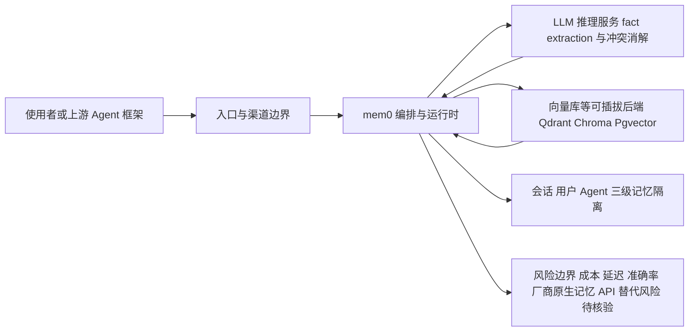

# mem0ai/mem0

## 一句话定位
为 AI Agent 提供统一的、可持久化的记忆层（Memory Layer），让 LLM 应用拥有跨会话的长期记忆能力。

## 它解决的问题
LLM 本质上是"无状态"的，每次对话结束上下文就丢失。传统 RAG 虽然能检索外部知识，但难以管理"关于用户/会话的个性化记忆"。mem0 解决的是 Agent 的"记忆缺失症"：自动从对话中提取关键事实、去重、冲突消解、按用户/会话/Agent 分层存储，并在后续交互中智能召回。它填补了 LLM 从"单轮问答"走向"持续陪伴型 Agent"最关键的一块基础设施。

## 为什么值得关注
- **Stars:** 62,753（截至 2026-08-07），增速极快，2023-06 创建至今已突破 6 万
- **Forks:** 7,317，社区参与度高，生态插件丰富
- **官方背书:** Apache-2.0 开源，Python 编写，已被众多 Agent 框架（CrewAI、AutoGen 等）集成
- **商业闭环:** mem0.ai 提供托管云服务，开源版可自部署，典型 Open-Core 模式
- **活跃度:** pushed_at 2026-08-07（当日更新），open_issues 690，维护频繁
- **标签命中热点:** agents / ai-agents / long-term-memory / state-management / rag

## 热度来源判断
mem0 的热度是**真实需求驱动**而非纯炒作。它精准踩中了 2024-2026 年 Agent 浪潮的核心痛点——没有记忆的 Agent 不可能成为真正的"助手"。从 GitHub 趋势看，它与 LangGraph、CrewAI 等 Agent 编排框架同期崛起，属于"Agent 基础设施"赛道的第一梯队。但需要注意：记忆层赛道竞争激烈，Zep、Letta（前 MemGPT）、Chroma 等都在切入，mem0 的护城河尚在构建中。

## 关键技术亮点亮点
1. **智能记忆提取:** 使用 LLM 自动从对话中抽取事实（fact extraction），而非简单全文向量入库
2. **冲突消解（Conflict Resolution）:** 当新事实与旧事实矛盾时，自动更新而非简单堆叠，这是相比纯 RAG 的核心差异
3. **多层级记忆:** 支持 user / session / agent 三个维度的记忆隔离与共享
4. **可插拔后端:** 向量库支持 Qdrant、Chroma、Pgvector 等，LLM 支持 OpenAI 及开源模型，部署灵活
5. **Graph Memory（图记忆）:** 支持知识图谱式记忆结构，适合复杂关系推理场景

## 架构师速览

| 决策问题 | 研究判断 | 证据边界 |
|---|---|---|
| 系统边界 | mem0 是面向 AI Agent 的记忆中间件，定位为入口渠道、LLM/工具与上层 Agent 框架之间的横向能力层，而非端到端 Agent OS | 档案明确其为"平台候选"、Open-Core 模式、Apache-2.0；具体协议、部署形态、SDK 清单未在档案中给出 |
| 主路径 | 主路径为"对话输入 → LLM 做 fact extraction → 去重/冲突消解 → 按 user/session/agent 分层存储 → 后续智能召回" | 档案明确"提取-去重-冲突消解-存储-召回"管线与三级记忆隔离；底层向量库（Qdrant/Chroma/Pgvector）仅作为可插拔后端列出 |
| 关键权衡 | 核心权衡是"写时计算带来的能力增益"与"每次写入引入 LLM 调用的成本/延迟"之间的取舍，且在长期面临大模型原生长上下文与厂商原生记忆 API 的替代风险 | 档案明确列出成本、延迟、准确率、竞争、可替代性五项风险；具体 SLO 基准、性能数字未给出 |
| 最小 PoC | 建议在单一渠道、最小工具权限、可审计日志下，先验证"写入提取+冲突消解"正确性与召回质量，再扩大接入面 | 档案"采用建议"原文支持此路径；未提供具体硬件/吞吐基准 |

## 架构启发
mem0 的"提取-去重-冲突消解-存储-召回"管线，本质上是一个**针对记忆场景特化的写入时计算（compute-on-write）架构**。它启发我们：对于 AI Agent，"数据写入"不再是简单的 INSERT，而是一次 LLM 推理。这种"写时智能"模式正在成为 Agent 时代基础设施的通用范式——与之类似的还有 Context7 的文档预处理、Letta 的记忆压缩。

## 架构图（MMD）

> 证据边界：此图只采用本档案已有可核验描述；“待核验”节点不应视为项目实现事实。

## 定位判断
**平台型候选。** mem0 定位为 Agent 时代的"记忆中间件"，类似数据库在 Web 时代的角色。它不解决某一类具体业务问题，而是为上层所有 Agent 应用提供横向能力。能否成为事实标准，取决于生态集成广度和性能/成本的平衡。

## 风险/局限/泡沫点
- **成本问题:** 每次写入都要调用 LLM 做 fact extraction，大规模场景下 API 成本不可忽视
- **延迟:** 写入路径引入 LLM 调用，实时性要求高的场景需要异步化
- **准确率:** 事实提取与冲突消解依赖 LLM 理解能力，复杂语境下可能误删/误改记忆
- **竞争白热化:** Zep、Letta/MemGPT、LangMem（LangChain 官方记忆模块）都在抢占同一赛道
- **可替代性:** 大模型原生上下文窗口持续增长（Gemini 已达 2M token），长期记忆的必要性在某些场景被削弱

## 与同类项目的关系
- **vs Letta (MemGPT):** Letta 更偏"完整 Agent OS"，mem0 更专注做"记忆层"单一组件，更易集成
- **vs Zep:** Zep 同样定位长期记忆，但商业化路径不同，Zep 更偏企业 SaaS
- **vs LangMem:** LangChain 官方推出的记忆模块，与 LangGraph 深度绑定；mem0 的优势是框架无关
- **vs 传统向量 RAG:** mem0 不是简单向量检索，而是"记忆管理"——包含写入时的语义理解和冲突消解

## 是否值得持续跟踪
**是。** mem0 是 AI Agent 基础设施赛道中"记忆层"的代表项目，其发展直接反映 Agent 从 demo 走向生产的关键瓶颈是否被突破。建议月度跟踪 Star 增速、企业采用案例、以及与大模型原生记忆能力（如 Gemini 记忆功能）的竞合关系。

## 后续观察点
- 商业化进展：mem0.ai 托管服务的客户数和 ARR 增长
- 技术演进：Graph Memory 的生产可用性与性能表现
- 标准化：是否被主流 Agent 框架（LangGraph、CrewAI、OpenAI Agents SDK）作为默认记忆后端
- 威胁信号：大模型厂商是否会推出"原生记忆 API"直接降维打击

---
> 数据来源: GitHub API (2026-08-07) | Stars: 62,753 | Forks: 7,317 | License: Apache-2.0
