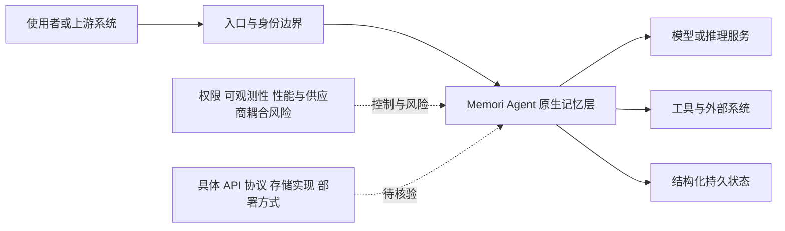

# Memori

## 一句话定位
Agent 原生记忆基础设施，LLM 无关的结构化持久状态层，将 Agent 执行和对话转化为可检索的结构化状态。

## 它解决的问题
生产环境中的 Agent 需要跨会话、跨用户、跨 LLM 的持久状态管理。当前方案要么依赖 LLM 自身的上下文窗口（有上限），要么自己拼凑向量数据库 + KV 存储（工程复杂度高）。Memori 提供统一的记忆抽象层。

目标用户：生产级 Agent 系统架构师、Multi-Agent 平台开发者、企业 AI 应用团队。

## 为什么值得关注（2026-05-19）

14.6K⭐，2.2K forks。「Agent 原生记忆基础设施」定位精准，与 agentmemory（Coding Agent 专注）形成互补。LLM 无关的设计使其适合 Multi-Agent 和 Multi-LLM 场景。

## 热度来源判断
热度 75% 真实需求。生产级 Agent 部署确实面临状态管理难题。Fork 数（2.2K）表明有实际采用意向。但「记忆基础设施」概念仍处于教育市场阶段。

## 关键技术亮点亮点
1. **LLM 无关设计**：不绑定特定 LLM 提供商，支持 GPT/Claude/Gemini/Llama 等任意后端
2. **结构化状态**：不是简单的文本存储，将对话和执行转化为结构化、可查询的状态
3. **Agent 原生 API**：接口设计围绕 Agent 执行模式（而非 CRUD），符合 Agent 开发心智模型

## 架构师速览

| 决策问题 | 研究判断 | 证据边界 |
|---|---|---|
| 系统边界 | Memori 定位于 LLM 无关的 Agent 记忆基础设施，承接 Agent 执行与对话，并向上提供结构化、可检索的持久状态；入口渠道、模型供应商、工具或数据源的具体编排方式待核验。 | 依据其“Agent 原生记忆基础设施”“LLM 无关”“结构化持久状态层”定位；未确认具体入口组件、权限模型、存储后端、向量数据库或部署形态。 |
| 主路径 | 档案给出的研究主路径是：请求进入编排或运行时，发起模型与工具调用，再将会话或状态回写至记忆层；实际 API、调用协议和状态回写机制待核验。 | “请求→编排/运行时→模型与工具调用→会话或状态回写”为架构抽象，并非已审计的源码实现；未确认执行时采用何种检索、存储或同步协议。 |
| 关键权衡 | 重点权衡结构化记忆带来的跨会话、跨用户、跨 LLM 持久化收益，与抽象层复杂度、读写延迟、权限治理、可观测性及供应商耦合风险。 | 风险来自项目定位、分类和架构师速览；没有性能基准、权限设计、审计机制、存储实现或生产 SLO 证据。 |
| 最小 PoC | 固定单一入口渠道、一个受控工具和一个 LLM 后端，验证会话状态能否跨调用持久化、结构化查询是否正确、结果是否可审计，并记录权限、成本、退出路径及任何读写延迟。 | PoC 仅验证状态持久化与查询基本链路；具体数据库、部署方式、协议、检索质量、并发规模和生产可用性均待核验。 |

## 架构启发
- **记忆即基础设施**：类似数据库在 Web 应用中的地位，记忆层将成为 Agent 应用的标配基础设施
- **结构化 > 非结构化**：纯向量检索的幻觉问题通过结构化状态可以缓解
- **LLM 无关是正确方向**：Multi-LLM 策略正在成为企业标配，记忆层不应绑定 LLM

## 架构图（MMD）

> 证据边界：此图只采用本档案已有可核验描述；“待核验”节点不应视为项目实现事实。

## 定位判断
在 Agent 基础设施栈中定位为「通用记忆基础设施」，类似于数据库领域的 PostgreSQL（通用存储 vs Redis 专用缓存）。与 agentmemory 形成互补而非竞争。

## 风险 / 局限 / 泡沫点
1. **抽象层过重**：在简单场景下可能过度设计，直接用向量数据库更轻量
2. **性能开销**：结构化记忆的读写延迟需要与原始 LLM 调用延迟做权衡
3. **标准化风险**：如果 OpenAI/Anthropic 在平台层内置记忆，第三方方案空间被压缩

## 与同类项目的关系
- **vs agentmemory**：agentmemory 专注 Coding Agent，Memori 更通用；类似 Redis vs PostgreSQL 的关系
- **vs 向量数据库（Pinecone/Weaviate）**：Memori 是更高层的抽象，底层可能使用向量数据库
- **vs LangChain Memory**：Memori 更底层、更生产级，LangChain Memory 更偏向原型

## 是否值得持续跟踪
**是。** Agent 记忆基础设施是中期确定性趋势。

## 后续观察点
1. 是否出现大型生产部署案例
2. 记忆检索质量在真实 Agent 场景中的表现
3. 是否形成事实标准的记忆 API 规范

---
*首次记录：2026-05-19*
