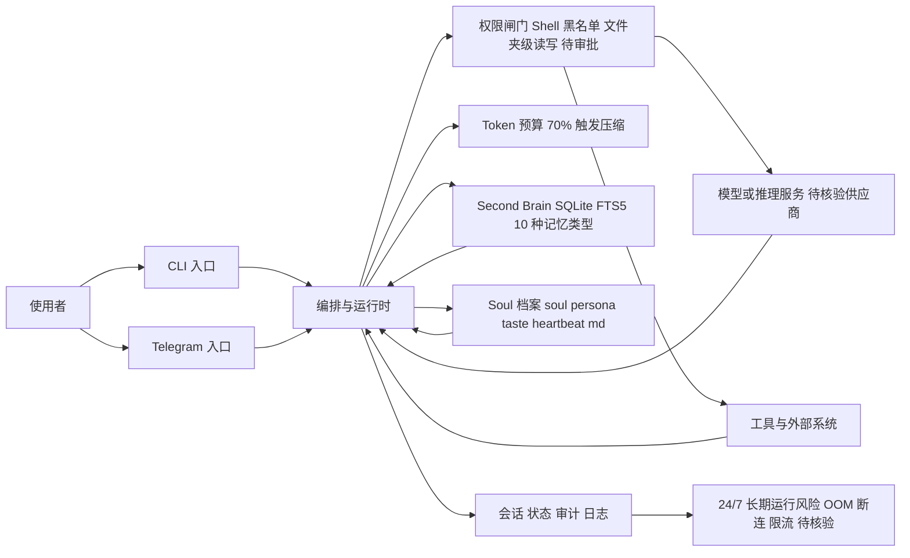

# Mercury Agent

## 一句话定位
Soul-Driven AI Agent — 权限硬化、Token 预算管理、Second Brain 记忆，24/7 运行于 CLI 或 Telegram。

## 它解决的问题
大多数 AI Agent 默认"先做再问"，缺乏权限控制、预算管理和持久记忆。Mercury 把这三个问题作为一等公民。

目标用户：需要长期运行的私人 AI 助理用户。

## 为什么值得关注（2026-04-30）
- "Soul-Driven" 概念 — 人格由用户拥有的 Markdown 文件定义
- 权限硬化设计（Shell 黑名单、文件夹级别读写范围、审批流）
- 10 种记忆类型 + SQLite + FTS5 的 Second Brain 实现

## 热度来源判断
**真实需求驱动**。"AI Agent 不该静默执行危险操作"是社区共识，Mercury 给出了具体实现。

## 关键技术亮点亮点

1. **Permission-Hardened**：Shell 命令黑名单（sudo、rm -rf / 等永远不执行），文件夹级读写限制，待审批流程。
2. **Second Brain Memory**：SQLite + FTS5 全文搜索，10 种记忆类型，自动提取、冲突解决、自动整合。
3. **Soul-Driven**：人格由 Markdown 文件定义（soul.md、persona.md、taste.md、heartbeat.md），用户完全可控。
4. **Token Budget**：日预算强制执行，超 70% 自动压缩，`/budget` 命令实时查看。

## 架构师速览

| 决策问题 | 研究判断 | 证据边界 |
|---|---|---|
| 系统边界 | 单一 TypeScript 项目，作为 CLI 与 Telegram 入口后方的编排层，对外接模型供应商与工具/数据源，对内维护 SQLite+FTS5 记忆与人格 Markdown 文件 | 边界描述基于档案中的标签、语言、入口渠道与存储选型（SQLite/FTS5、soul/persona/taste/heartbeat.md），未引用源码以验证运行时进程拓扑 |
| 主路径 | 使用者经入口（CLI 或 Telegram）进入运行时 → 触发权限闸门（Shell 黑名单与文件夹级读写白名单）→ 调用模型与工具 → 回写到 SQLite 记忆与人格文件，并在会话/状态/审计层沉淀 | 主路径来自档案的"Permission-Hardened、Second Brain、Soul-Driven、Token Budget"四项亮点线性串联；具体协议、传输格式与审批流实现细节待核验 |
| 关键权衡 | 在"先问再做"的权限硬化与个人助理长跑场景之间取舍：黑名单与待审批换取安全与可解释性，代价是高频自动执行效率；10 种记忆类型与 FTS5 换取检索与整合能力，代价是状态一致性与冲突解决的复杂度；人格由 Markdown 定义换取用户可控与可移植，代价是表达力与验证手段不足 | 权衡判断严格基于档案"为什么值得关注""架构启发/Trade-off""风险/屏限"三段描述，未对性能、并发模型、SLO 做推断 |
| 最小 PoC | 单一入口（Telegram）+ 最小工具白名单 + 日 Token 预算上限 + 全量审计日志，验收项包含：危险命令拦截命中、预算 70% 触发压缩、记忆回写与跨重启可检索、退出路径可控 | 验收项直接取自档案亮点的可观测行为；具体部署形态、依赖版本、密钥管理与 Telegram Bot 集成细节待核验 |

## 架构启发

**设计哲学**：Agent 应该"先问再做"，且预算透明。这与当前大多数 Agent 的"默认执行"形成鲜明对比。

**Trade-off**：权限硬化牺牲了部分自动化效率，适合个人助理场景，不太适合需要高频自动执行的 DevOps 场景。

## 架构图（MMD）

> 证据边界：此图只采用本档案已有可核验描述；“待核验”节点不应视为项目实现事实。

## 定位判断
**工具型**。定位为"更安全、更有个性的 Agent"，不追求平台化或基础设施层。

## 风险 / 屏限 / 泡沫点

1. **竞争激烈**：与 OpenClaw、Hermes Agent 等直接竞争，差异化主要在权限和记忆设计。
2. **Soul-Driven 概念验证不足**：Markdown 定义人格在实际使用中效果如何，缺乏用户反馈。
3. **24/7 运行的稳定性**：长期运行的 Agent 需要处理 OOM、网络断连、API 限流等边缘场景。

## 与同类项目的关系

| 项目 | 定位 | 差异 |
|------|------|------|
| OpenClaw | 通用 AI 助理基础设施 | 更底层，Mercury 聚焦个人助理体验 |
| Hermes Agent | Agent 框架 | 更偏研究，Mercury 更偏产品 |
| OpenChronicle | 独立记忆层 | Mercury 记忆是内置的，非独立服务 |

## 是否值得持续跟踪
**是，低优先级**。权限设计和 Token 预算概念有参考价值，但作为独立 Agent 产品，竞争格局过于拥挤。

## 后续观察点

1. Telegram 频道的活跃用户反馈
2. 权限硬化设计是否被其他项目借鉴
3. Second Brain 的实际使用效果

---
*首次记录：2026-04-30*
