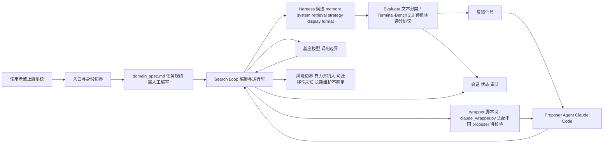

# meta-harness — Model Harness 自动优化

## 一句话定位

Stanford IRIS Lab（Chelsea Finn 组）出品的框架，自动搜索最优 model harness 配置 — harness 是模型外围代码（决定存储什么、检索什么、展示什么），meta-harness 通过迭代搜索在给定任务上自动优化这些配置。

## 它解决的问题

Model harness 直接影响 coding agent 的效果 — 同样的基座模型，不同的 harness（memory system、retrieval strategy、display format）会产生巨大性能差异。当前 harness 设计靠人工经验调优。meta-harness 把这个过程自动化：给定基座模型和任务，用 proposer agent（Claude Code）迭代搜索最优 harness 配置。

## 为什么值得关注

- **1,378 stars / 133 forks**，MIT 许可证，Stanford IRIS Lab（Chelsea Finn 组）学术背书
- **论文已发**：arXiv 2603.28052（Meta-Harness: End-to-End Optimization of Model Harnesses）
- 作者团队：Yoonho Lee、Roshen Nair、Qizheng Zhang、Kangwook Lee、Omar Khattab、Chelsea Finn
- **社区衍生项目涌现**：5+ 社区项目（HuggingFace Space、独立实现、CLI 库、Claude Code skill、Islo 沙箱适配）
- 两个参考实验：文本分类 memory-system 搜索 + Terminal-Bench 2.0 scaffold 演化

## 热度来源判断

- **学术影响力 + coding agent 社区关注双重驱动**
- 从首次记录的 444 stars 增长到 1,378，增速稳定
- 社区衍生项目（Harness Forge、SuperagenticAI/metaharness 等）说明思路被认可和采纳
- 解决的是 Agent 层的核心问题：外围代码的设计空间搜索

## 关键技术亮点亮点

1. **Harness = 可优化层**：memory system、retrieval strategy、display format 构成搜索空间
2. **自动搜索循环**：proposer agent（Claude Code）生成 harness 变体 → evaluate → 反馈 → 迭代
3. **两个参考实验**：
   - 文本分类：memory-system 搜索
   - Terminal-Bench 2.0：scaffold 演化（优化后的 harness 在独立 artifact repo）
4. **ONBOARDING.md 驱动**：指向 ONBOARDING.md 让 coding assistant 对话式生成 domain_spec.md
5. **可适配不同 proposer agent**：需编写 wrapper 脚本（如 claude_wrapper.py）

## 架构师速览

| 决策问题 | 研究判断 | 证据边界 |
|---|---|---|
| 系统边界 | meta-harness 是一个 Python 编写的优化框架，处于任务域与 coding-agent 之间的 harness 自动搜索层：用户/上游 → proposer agent（基于 Claude Code，需 wrapper）→ harness 候选生成与评估循环 → 最优 harness 配置。 | 基于项目语言（Python）、标签（harness/optimization/auto-search/coding-agent/llm-agents）、"proposer agent = Claude Code"描述与"harness = memory system / retrieval strategy / display format"定义。 |
| 主路径 | 主路径为：Task + 基座模型 → Search Loop（proposer 生成 harness 变体 → 在文本分类或 Terminal-Bench 2.0 等任务上 evaluate → 反馈给 proposer）→ 输出最优 harness 配置；ONBOARDING.md 驱动 domain_spec.md 生成，wrapper 脚本（如 claude_wrapper.py）对接不同 proposer。 | 基于"迭代搜索最优 harness 配置"、"两个参考实验：文本分类 memory-system 搜索 + Terminal-Bench 2.0 scaffold 演化"、"ONBOARDING.md"、"需编写 wrapper 脚本"等档案表述。 |
| 关键权衡 | 权衡在四方面：(1) 搜索空间表达力 vs. 每次搜索大量 agent 运行的算力开销；(2) 自动化的可优化层 vs. domain_spec.md 必须人工编写的人工介入；(3) 端到端自动优化 vs. 搜索结果在跨任务间的可迁移性未知；(4) 学术研究代码（作者声明"仅验证能运行"）vs. 长期维护不确定性（作者毕业/转向可能停滞）。 | 基于"搜索空间定义需要人工介入"、"计算开销大"、"搜索结果的可迁移性未知"、"研究代码…仅验证能运行，未做更多测试"、"学术项目，长期维护不确定"。 |
| 最小 PoC | 建议最小 PoC：在 Terminal-Bench 2.0 或一个文本分类子任务上，固定单一基座模型 + 单一 proposer（Claude Code via wrapper），固定评估指标，先跑 1 轮搜索循环验证 domain_spec.md → harness 候选 → evaluate → 反馈的闭环是否成立；验收项包含算力消耗、结果可复现性、跨任务迁移留观窗口。 | 基于"两个参考实验"、"proposer agent（Claude Code）迭代搜索"、"需编写 wrapper 脚本"以及档案中关于算力开销与迁移性未知的局限说明。 |

## 架构启发

```
Task → Search Loop → [Harness v1, v2, ... vN] → Evaluate → Feedback → Optimal Harness
```

**核心启发：Harness 是模型与任务之间的可优化层**。这和编译器的优化 pass 有类似的抽象 — 给定输入，搜索最优的中间表示。meta-harness 把这种思路应用到了 Agent 外围代码的设计上。对 Agent 平台设计者而言，这意味着 harness 优化可能成为标准 pipeline，而非人工调参。

## 架构图（MMD）

> 证据边界：此图只采用本档案已有可核验描述；“待核验”节点不应视为项目实现事实。



## 定位判断

**学习型/研究工具。** 短期是学术参考，中期可能启发商业 Agent 的 harness 优化产品。社区衍生项目涌现说明思路有生命力。

## 风险 / 局限 / 泡沫点

1. **研究代码**，作者声明"仅验证能运行，未做更多测试"
2. **搜索空间定义需要人工介入** — domain_spec.md 需要人工编写
3. **计算开销大** — 每次搜索需要大量 agent 运行
4. **学术项目**，长期维护不确定（作者毕业/转向后可能停滞）
5. 搜索结果的可迁移性未知（在 A 任务上优化的 harness 在 B 任务上表现如何）

## 与同类项目的关系

- **ECC / OpenCode / Hermes Agent**：生产级 Harness，meta-harness 是其优化的方法论
- **社区衍生**：Harness Forge（Claude Code skill 版）、SuperagenticAI/metaharness（CLI 库）、dkhanal/meta-harness（独立实现）
- **DSPy**：同为"自动优化 LM 程序"思路，DSPy 优化 prompt，meta-harness 优化 harness
- **编译器优化 pass**：架构思路类似

## 是否值得持续跟踪

**是。** Harness 优化是 coding agent 质量的关键瓶颈。meta-harness 是该方向的学术开创性工作，社区衍生项目涌现说明思路被采纳。

## 后续观察点

1. 工业界是否采纳 meta-harness 思路（ECC、OpenCode 等是否引入自动 harness 优化）
2. 是否有更轻量的 harness 优化方案出现（降低计算开销）
3. 论文引用和后续研究增长
4. 社区衍生项目的成熟度（Harness Forge 等）
5. 搜索结果的可迁移性研究（跨任务 harness 泛化）
