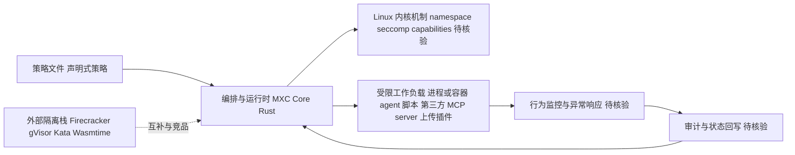

# Microsoft MXC

## 一句话定位
微软开源的策略驱动分层隔离与沙箱框架（Policy-driven, layered isolation and containment），用 Rust 实现的安全容器化基础设施工具。

## 它解决的问题
在云原生和 AI agent 时代，工作负载越来越需要执行不受信任的代码（如 agent 生成的脚本、用户上传的插件、第三方 MCP server）。传统容器隔离粒度太粗，VM 太重，需要一个轻量级、可声明式策略驱动的隔离层，能在进程/容器级别实现细粒度的安全隔离。MXC 提供了分层隔离方案，让安全团队可以用策略文件定义隔离边界。

## 为什么值得关注
- **Stars:** 1,200 stars，对于安全基础设施类项目来说是健康的起步
- **微软官方项目**，有安全团队的专业背景支撑
- **Rust 实现**，内存安全 + 高性能，符合基础设施工具的技术趋势
- **AI agent 安全背景**：随着 agent 执行任意代码的需求爆发，隔离技术变得关键
- 更新活跃（2026-08-07 仍在 push）

## 热度来源判断
- **微软品牌效应（高）**：微软安全类项目天然受关注
- **AI agent 安全焦虑（中高）**：agent 执行代码的安全问题被广泛讨论
- **Rust 生态红利（中）**：Rust 在基础设施领域的热度持续
- **尚未破圈（当前）**：1.2k stars 说明还在早期采用者阶段

## 关键技术亮点亮点
1. **策略驱动（Policy-driven）**：用声明式策略文件定义隔离规则，类似 OPA/Kubernetes admission controller 的模式
2. **分层隔离（Layered isolation）**：非单一隔离机制，而是组合 namespace、seccomp、capabilities 等多种 Linux 安全机制
3. **Containment 设计理念**：强调"遏制"而非仅"隔离"，包含行为监控和异常响应
4. **Rust 实现**：避免 C/C++ 的内存安全漏洞，同时保持系统级性能

## 架构师速览

| 决策问题 | 研究判断 | 证据边界 |
|---|---|---|
| 系统边界 | MXC 的对外边界是"策略层 + 分层隔离执行点"；对外暴露策略声明接口与受保护工作负载（agent 脚本/第三方 MCP server/上传插件等），对内依赖 Linux 内核机制（namespace、seccomp、capabilities）。Windows/macOS 兼容性未在档案中证实。 | 仅依据档案"策略驱动 / 分层隔离 / Rust / Linux 容器与进程级"描述，外内核边界组件未经源码核验。 |
| 主路径 | 策略文件 → 编排/运行时按策略组合 Linux 隔离机制 → 启动受限进程或容器 → 行为监控与异常响应 → 审计与状态回写。 | 主路径描述来自档案"Containment 设计理念 + 分层隔离 + 策略驱动"提炼，未指明具体 IPC、持久化与日志格式。 |
| 关键权衡 | 在"组合多种 Linux 安全机制带来的防御深度"与"策略复杂度、运维成本、内核兼容性依赖"之间取舍；同时需权衡其与 Firecracker/gVisor/Kata/WASM 沙箱的边界（自身定位偏策略层、OS 级、轻量）。 | 权衡引自档案"分层而非单一 / vs Firecracker-gVisor-Kata-WASM"段；性能与基准未提供。 |
| 最小 PoC | 用一条声明式策略定义单进程沙箱边界（namespace + seccomp + capability 裁剪），跑一个不可信脚本；验收项：行为/系统调用可观测、日志可审计、回退路径明确；只在一个 Linux 环境验证。 | 验收项来自档案"最小工具权限 / 可审计日志 / 退出路径"建议；具体 API 与策略语法未在档案中给出。 |

## 架构启发
- **安全即策略**：将安全边界从代码配置提升为独立策略层，可审计、可版本化
- **分层而非单一**：单一隔离机制（如只用容器）存在逃逸风险，组合多层防御更健壮
- **为 AI agent 时代设计**：agent 执行代码的安全沙箱是新兴刚需

## 架构图（MMD）

> 证据边界：此图只采用本档案已有可核验描述；“待核验”节点不应视为项目实现事实。

## 定位判断
**早期基础设施候选项目**。定位在容器安全和 agent 代码执行安全之间，目前还在概念验证和小规模采用阶段，但方向符合趋势。

## 风险/局限/泡沫点
- **文档可能不足**：1.2k stars 阶段的项目通常文档和最佳实践尚不完善
- **竞争激烈**：Firecracker、gVisor、Kata Containers、WASM 沙箱都在抢占"轻量隔离"赛道
- **采用门槛高**：安全基础设施需要极高的信任度，企业迁移成本大
- **微软项目维护风险**：微软有砍项目的习惯（如多个实验性项目被归档）
- **Linux 专精**：可能不支持 Windows/macOS，限制了适用范围

## 与同类项目的关系
- **vs Firecracker（AWS）**：Firecracker 是 microVM，MXC 更偏策略层和进程级隔离
- **vs gVisor（Google）**：gVisor 做系统调用拦截，MXC 做策略编排
- **vs Kata Containers**：Kata 走 VM 路线，MXC 更轻量
- **vs WASM 沙箱（Wasmtime）**：WASM 是语言级隔离，MXC 是 OS 级隔离，可互补

## 是否值得持续跟踪
**值得关注但需谨慎。** 微软安全项目方向正确，但需观察是否有真实大规模生产部署案例。建议半年后复查采用情况。

## 后续观察点
- 是否有 Azure 服务基于 MXC 构建（内部采用信号）
- 企业落地案例和安全评估报告
- 与 Kubernetes 生态的集成深度
- 是否被 AI agent 平台（如 AutoGen、Semantic Kernel）用于代码执行沙箱
- 社区贡献活跃度和 issue 响应速度

---
> 数据来源: GitHub API (2026-08-07) | Stars: 1,200 | Forks: 56 | 语言: Rust
