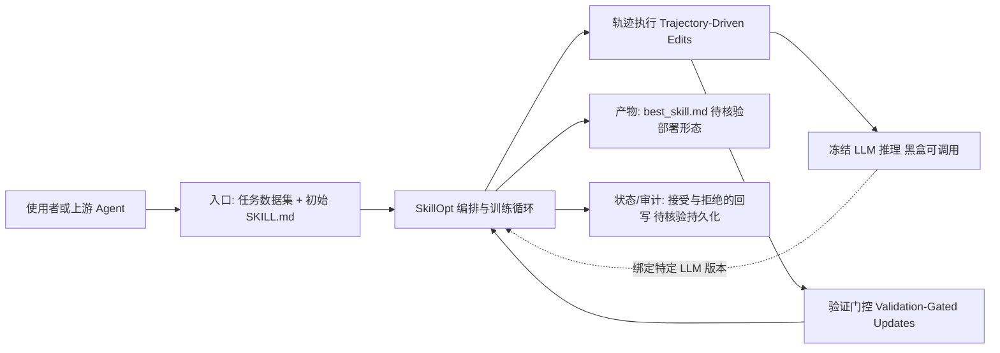

# microsoft/SkillOpt

## 一句话定位
微软研究院出品的文本空间技能优化器，通过"训练"自然语言技能（SKILL.md）来提升冻结 LLM Agent 的表现——像训练神经网络一样训练 Prompt，但不修改模型权重。

## 它解决的问题
LLM Agent 的表现高度依赖 Prompt / Skill 的质量，但人工编写和调优 Skill 是一件费时费力且依赖直觉的事。SkillOpt 将"Skill 调优"从手工试错升级为自动化训练流程：给定任务数据集和初始 Skill，系统自动迭代修改 Skill 文本，通过验证门控筛选改进版本，最终输出最优的 `best_skill.md`。这使得 Agent 的 Skill 可以像模型权重一样被"训练"和"部署"。

## 为什么值得关注
- **Stars:** 15,734 stars，2026 年增长极快
- **微软研究院出品:** 学术研究 + 工程实现的结合，有 arXiv 论文支撑
- **范式创新:** "文本空间优化"是全新范式——不改模型权重，而是优化自然语言指令
- **可验证:** 训练过程有验证门控，不是盲目修改，而是确保每次更新都有提升
- **实用输出:** 最终产物是 `best_skill.md`，可直接部署到任何 LLM Agent
- **PyPI 发布:** `pip install skillopt`，安装即用

## 热度来源判断
SkillOpt 的热度来自"Agent 自我进化"这一前沿概念的落地。2026 年 Agent 领域的热点正从"手动写 Skill"转向"自动优化 Skill"，SkillOpt 是这一方向的标杆项目。微软研究院的品牌 + arXiv 论文 + Trendshift #1 的曝光共同驱动了 Star 增长。社区中出现了多个衍生项目（SkillOpt-Lite、Hermes-SkillOpt），说明这一范式正在被广泛采纳和验证。

## 关键技术亮点亮点
- **文本空间训练:** 将神经网络训练概念（epoch、batch size、learning rate）迁移到文本/Prompt 空间
- **轨迹驱动编辑（Trajectory-Driven Edits）:** 基于 Agent 执行轨迹中的失败模式，自动定位并修改 Skill 中需要改进的部分
- **验证门控（Validation-Gated Updates）:** 每次修改后必须通过验证集测试，只有确认提升才接受修改，防止退化
- **冻结 LLM:** 不需要修改或微调模型权重，适用于任何黑盒 LLM（GPT-4、Claude、DeepSeek）
- **best_skill.md 产物:** 输出可直接部署的 Markdown 技能文件

## 架构师速览

| 决策问题 | 研究判断 | 证据边界 |
|---|---|---|
| 系统边界 | SkillOpt 是位于冻结 LLM Agent 之上的"Skill 训练优化器"，输入为任务数据集 + 初始 `SKILL.md`，输出为可部署的 `best_skill.md`，不修改模型权重 | 边界基于档案"冻结 LLM"与"`best_skill.md` 产物"两项表述；具体 CLI/SDK 形态、并发模型未在档案中描述，待源码核验 |
| 主路径 | 数据集 + 初始 Skill → 轨迹执行 → 轨迹驱动编辑 → 验证门控筛选 → 接受/拒绝 → 迭代至 `best_skill.md` | 路径来自"轨迹驱动编辑"与"验证门控（Validation-Gated Updates）"表述；epoch/batch size/learning rate 的具体实现未述，待核验 |
| 关键权衡 | 自动化 Skill 改写收益 vs. 验证集过拟合风险、黑盒可解释性下降、多次 LLM 调用带来的成本 | 权衡依据档案"风险/局限"小节；具体成本量级、跨 LLM 迁移效果待核验 |
| 最小 PoC | 在单一任务、最小数据集与受控 LLM（如固定版本 GPT-4/DeepSeek）下跑通训练循环，验收项：泛化性、成本、可审计日志、模型切换后重训路径 | PoC 形态由"冻结 LLM"与"PyPI `pip install skillopt`"推出；具体接口、训练超参、数据格式未在档案中描述，待核验 |

## 架构启发
SkillOpt 的核心架构启发是"文本即参数"——将自然语言指令（Skill/Prompt）视为可优化的参数，用训练循环来搜索最优文本。这打破了"模型训练"与"Prompt 编写"的界限。其验证门控机制借鉴了神经网络训练中的"early stopping"和"验证集评估"，将严谨的训练方法论引入了 Prompt 工程。轨迹驱动编辑的思路也值得借鉴——从失败中学习，而非随机搜索。

## 架构图（MMD）

> 证据边界：此图只采用本档案已有可核验描述；“待核验”节点不应视为项目实现事实。

## 定位判断
**AI 基础设施型项目（前沿探索期）。** SkillOpt 定义了一个新的技术子领域——文本空间优化。它不是通用 Agent 框架，而是 Agent 生态中的"训练工具"。其定位类似于神经网络训练中的优化器——不直接做任务，而是提升做任务的 Agent 的能力。这一领域正处于从学术研究到工程实践的转化期。

## 风险 / 局限 / 泡沫点
- **学术与工程差距:** 研究环境中验证的效果，在真实复杂任务上是否可复现尚需验证
- **计算成本高:** 每次迭代需要多次 LLM 调用（执行轨迹 + 编辑 + 验证），成本不低
- **任务特异性:** 优化的 Skill 可能过拟合到训练数据，泛化能力待验证
- **黑盒可解释性:** 自动修改的 Skill 文本人类不一定理解，调试困难
- **模型依赖:** 优化的 Skill 可能绑定特定 LLM 版本，模型更新后需重新优化

## 与同类项目的关系
- **vs Prompt Engineering 手动调优:** SkillOpt 是自动化版本，手动是手工版本
- **vs DSPy:** DSPy 也是自动优化 Prompt，但更侧重编译器范式（声明式 → 编译），SkillOpt 更侧重训练范式（epoch → 验证）
- **vs OPRO (Google):** OPRO 用 LLM 优化 Prompt，思路类似但缺少验证门控和轨迹驱动
- **vs Fine-tuning:** Fine-tuning 修改模型权重，SkillOpt 修改文本指令，前者更重但效果可能更好
- **vs EvolvingLMMs-Lab/SkillOpt-Lite:** 轻量化版本，更易使用

## 是否值得持续跟踪
**是，高优先级。** SkillOpt 代表了 Agent 时代的"训练"范式——不是训练模型，而是训练 Skill。如果这一范式成立，它将成为 Agent 开发的标准工具链组件。值得关注的是：训练效果的泛化性、与不同 LLM 的兼容性、以及从学术到生产的转化进度。

## 后续观察点
- arXiv 论文的同行评议反馈和引用情况
- 真实生产任务中 SkillOpt 优化的效果是否可复现
- 社区衍生项目（SkillOpt-Lite、HarnessOpt）的反馈和改进
- 是否出现"Skill 训练数据集"标准（类似 ImageNet 之于 CV）
- 与 Fine-tuning 的效果对比基准

---
> 数据来源: GitHub API (2026-08-07) | 首次发现: 2026-06-05
