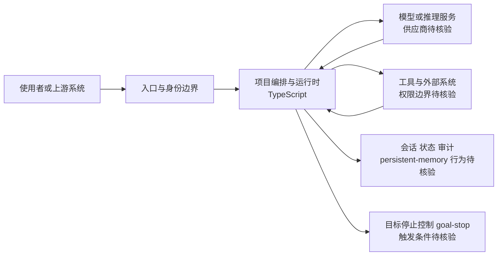

# MiMo-Code

## 一句话定位
小米开源的编码 Agent，TypeScript 实现，三天冲上 6.7K stars。

## 它解决的问题
编码 Agent 市场虽然已有 OpenCode、Claude Code、Codex 等玩家，但缺少中国大厂深度定制的选项。MiMo-Code 填补了这个空白。

## 为什么值得关注（2026-06-13）
三天 6,687 stars 的爆发式增长，Fork 数 528，open issues 421（社区参与度极高但可能暴露项目早期状态）。GitHub 描述为空，仓促开源的可能性较大。

## 热度来源判断
**品牌驱动为主。** 小米在中国开发者社区的品牌号召力是主要增长引擎。421 个 open issues 说明很多人在尝试但遇到问题。实际工程质量需要更多时间验证。

## 关键技术亮点亮点
1. **TypeScript 实现：** 与多数 Python 实现的 Coding Agent 不同，可能反映了小米的 Web 技术栈偏好
2. **高 Fork 数：** 528 forks 说明社区有较强的二次开发意愿
3. **小米生态整合潜力：** 未来可能与小米的 IoT 生态、MIUI 开发者工具整合

## 架构师速览

| 决策问题 | 研究判断 | 证据边界 |
|---|---|---|
| 系统边界 | 入口与身份边界 → 项目编排与运行时 → 模型/推理服务、工具与外部系统、会话/状态/审计三类下游边界 | 仅依据项目分类、TypeScript 语言与 tags（coding-agent、xiaomi、chinese-tech、typescript、persistent-memory、goal-stop）做抽象，源码未审计 |
| 主路径 | 请求进入入口与身份边界 → 编排与运行时调度 → 调用模型与外部工具 → 写回会话/状态/审计 | 主路径描述基于标签中的 persistent-memory、goal-stop 推导，具体协议与持久化实现未在档案中证实 |
| 关键权衡 | 扩展速度与权限、可观测性、模型/工具供应商耦合之间的平衡 | 这是基于品牌驱动热度与 421 open issues 的架构观察，非生产可用性证据 |
| 最小 PoC | 在单一入口、最小工具权限与可审计日志下验证持久记忆与目标停止行为，再扩大接入面 | 标签 persistent-memory、goal-stop 暗示这两项能力需重点核验，集成路径未在档案中给出 |

## 架构启发
大厂入局 Coding Agent 的路径正在分化：
- 海外：Google（Gemini CLI）、Anthropic（Claude Code）、OpenAI（Codex）→ 平台级
- 国内：小米（MiMo-Code）→ 生态级
- 开源社区：OpenCode、hermes → 去中心化

TypeScript 选择暗示这可能不是一个独立产品，而是小米开发者工具链的一环。

## 架构图（MMD）

> 证据边界：此图只采用本档案已有可核验描述；“待核验”节点不应视为项目实现事实。

## 定位判断
目前是**工具型**，信息不足。如果是小米生态的一环，有演化为平台候选的可能。但需要更多时间观察。

## 风险 / 局限 / 泡沫点
1. **仓促开源：** GitHub 描述为空，文档不足，可能是抢热度
2. **Issue 积压严重：** 421 个 open issues 说明质量堪忧
3. **Coding Agent 赛道拥挤：** 已有太多竞品，差异化不明显
4. **品牌泡沫风险：** stars 增速可能不可持续

## 与同类项目的关系
- **vs. anomalyco/opencode：** opencode 更成熟（174K stars），MiMo-Code 是后来者
- **vs. anthropics/claude-code：** Claude Code 有 Anthropic 的模型优势
- **vs. openai/codex：** Codex 有 OpenAI 生态

## 是否值得持续跟踪
**是，但需谨慎。** 关注小米是否会持续投入，以及是否会出现与小米生态的深度整合。

## 后续观察点
1. 文档和描述是否补齐
2. issue 解决速度和社区响应
3. 是否出现小米生态内的整合（IoT、MIUI 等）
4. 与国内其他 Coding Agent 的差异化路径

---
*首次记录：2026-06-13*
