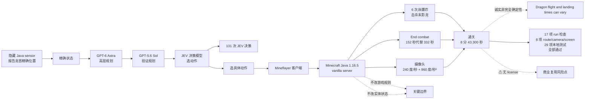

# rmalde/minecraft-agent

## 一句话定位
GPT-6 Astra 规划 + GPT-5.6 Sol + JEV 选动作的 Minecraft Java 1.16.5 端到端通关 agent —— 用 Mineflayer + vanilla server + 隐藏 Java sensor 报告龙首精确位置，在 nether-final-08 用 8 分 43.300 秒（缩短 40%）通关末影龙，131 次 JEV 决策 + 35 次 Astra 调用 + 全部 17 项 run 检查 / 8 项 route/camera/screen 检查 / 29 项本地测试通过。

## 它解决的问题
当前 Jev 决策模型在具身智能 / 长视野 agent 应用的痛点是 **「Jev 决策模型能否在长视野（>10 分钟）、多步（>100 步）、具身（连续摄像头 + 动作执行）、可复现（每次 run 一致）的场景下工作 + 是否能跟规划模型（Astra）协同 + 是否能端到端通关 Minecraft 末影龙」**。minecraft-agent 用「GPT-6 Astra 规划 + GPT-5.6 Sol + JEV 选动作 + Mineflayer + vanilla server + 隐藏 Java sensor 报告龙首精确位置 + 131 次 JEV 决策 + 35 次 Astra 调用 + 6 次床爆炸击杀末影龙 + 全部 17 项 run 检查 + 8 项 route/camera/screen 检查 + 29 项本地测试通过」是「Jev 决策模型 + 具身智能 + 长视野 + 多步 + 可复现 + 端到端通关」的具体路径。

## 为什么值得关注（2026-09-21）
- **Stars:** 259（截至 2026-09-21），1 天 259⭐，fork 17
- **License:** None（⚠ 无 license 是企业 / 商业复用风险点）
- **语言:** JavaScript
- **活跃度:** created 2026-09-20，pushed_at 2026-09-20
- **规模:** 698 KB（JavaScript + Mineflayer + JEV 客户端的中等规模）
- **Topics:** （空）
- **最新验证:** nether-final-08 用时 8 分 43.300 秒（比上一次 14 分 31.800 秒缩短 40%）
- **End combat:** 152 秒（代替 332 秒）
- **JEV 决策:** 131 次
- **Astra 调用:** 35 次
- **击杀:** 6 次床爆炸
- **测试覆盖:** 17 项 run 检查 + 8 项 route/camera/screen 检查 + 29 项本地测试，全部通过
- **摄像头:** 240 度/秒 + 加速度 960 度/秒²
- **诚实表态:** README 明示「Dragon flight and landing times can vary between runs」

## 热度来源判断
minecraft-agent 的热度是 **「Jev 决策模型 + 具身智能 + 长视野 + 多步 + 可复现 + 端到端通关 Minecraft 末影龙 × GPT-6 Astra 规划 × 严肃测试覆盖 × 不改游戏规则 × 40% 加速 × 152 秒 End combat」** 的组合。当前 Jev 决策模型研究者 / Minecraft 玩家 / 学术研究者的痛点是「Jev 决策模型能否在长视野多步具身场景下工作 + 是否能跟规划模型协同 + 是否能端到端通关」。一个 698 KB JavaScript 项目 1 天端到端通关 + 严肃测试 + 不改游戏 + 40% 加速，自然爆火。**fork/star 6.6%** 与昨日 indada/repopilot 6.3% 接近，反映「严肃 agent 工程化」早期 fork 率特征——准备集成到 Minecraft 自动化的开发者 fork。热度**真实且具具身智能价值**——但需警惕：GPT-6 Astra + GPT-5.6 Sol 的可用性 + JEV 决策模型在长视野多步具身场景的稳定性 + 隐藏 Java sensor 在不同 Minecraft 版本的兼容性 + 摄像头控制在高延迟网络的稳定性 + 测试套件在不同环境的稳定性 + ⚠ 无 license 的企业复用性。

## 关键技术亮点
1. **GPT-6 Astra 规划 + GPT-5.6 Sol** ——Anthropic 规划模型高层规划
2. **JEV 选动作** ——TypeSafe Jev 决策模型低层选具体动作
3. **Mineflayer + vanilla server** ——不修改游戏规则或实体状态
4. **隐藏 Java sensor 报告龙首精确位置** ——只读 Java sensor 提供精确状态
5. **131 次 JEV 决策 + 35 次 Astra 调用** ——Astra 规划（高层）+ JEV 选动作（低层）的协同比例
6. **6 次床爆炸击杀末影龙** ——具体击杀路径
7. **全部 17 项 run 检查 + 8 项 route/camera/screen 检查 + 29 项本地测试通过** ——严肃测试覆盖
8. **不改游戏规则或实体状态** ——关键边界，确保复现性
9. **摄像头连续转向 240 度/秒 + 加速度 960 度/秒²** ——连续转向能力
10. **隐藏原生 Minecraft 客户端渲染无桌面输入** ——纯 agent 控制
11. **nether-final-08 用时 8 分 43.300 秒比上一次 14 分 31.800 秒缩短 40%** ——可量化加速
12. **End combat 152 秒代替 332 秒** ——可量化提升
13. **诚实表态「Dragon flight and landing times can vary between runs」** ——严肃接受非完全确定性
14. **698 KB repo** ——JavaScript + Mineflayer + JEV 客户端的中等规模

## 架构师速览

| 决策问题 | 研究判断 | 证据边界 |
|---|---|---|
| 系统边界 | GPT-6 Astra 规划 + GPT-5.6 Sol + JEV 选动作 + Mineflayer + vanilla server + 隐藏 Java sensor | 仅基于档案描述的 GPT-6 Astra / GPT-5.6 Sol、JEV 决策、131 / 35 协同、隐藏 Java sensor；具体 Astra prompt 模板、JEV API 调用方式、Java sensor 实现均待核验 |
| 主路径 | Java sensor 报告状态 → GPT-6 Astra 高层规划 → GPT-5.6 Sol 验证 → JEV 选动作 → Mineflayer 客户端执行 → Java sensor 报告新状态 | 主路径为档案语义抽象；具体 GPT-6 / GPT-5.6 / JEV 协同协议、Java sensor 协议、Mineflayer 客户端实现均待核验 |
| 关键权衡 | Astra 高层规划 vs JEV 低层选动作的协同比例 vs 摄像头控制 vs 不改游戏规则 vs 隐藏 Java sensor vs 严肃测试覆盖 vs 无 license 商业风险 | 档案明示 GPT-6 Astra / GPT-5.6 Sol、JEV 选动作、不改游戏规则、严肃测试、诚实非完全确定性、无 license 6 项权衡；具体 Astra + Sol vs JEV 协同详细协议、camera limit 240 度/秒 + 960 度/秒²、加速度设计依据均待核验 |
| 最小 PoC | 在本地 vanilla server 启动 minecraft-agent，重放 nether-final-08 路径，确认 8 分 43.300 秒通关 + 131 次 JEV 决策 + 17 项 run 检查通过 | PoC 范围、退出路径由档案「nether-final-08 用时 8 分 43.300 秒 + 缩短 40% + 全部测试通过」建议推导；具体 GPT-6 Astra / GPT-5.6 Sol 可用性、JEV API key 配置、摄像头 240 度/秒 实际表现待核验 |

## 架构启发
minecraft-agent 的核心启发是 **「Jev 决策模型 + 具身智能 + 长视野 + 多步 + 可复现 + 端到端通关严肃工程化」**。当前具身智能 / 长视野 agent 的痛点是「决策模型能否在长视野多步具身场景下工作 + 是否能跟规划模型协同 + 是否能端到端通关严肃目标」。minecraft-agent 用「GPT-6 Astra 规划 + JEV 选动作 + Mineflayer + vanilla server + 隐藏 Java sensor + 131 次决策 + 全部测试通过 + 40% 加速 + 152 秒 End combat」是「决策模型 + 具身智能严肃工程化」的参考实现。更深层的启发是：**「不改游戏规则或实体状态」是具身智能 agent 可复现的工程化形式**——确保每次 run 的一致性；**「131 次 JEV 决策 + 35 次 Astra 调用」是「决策模型低层 + 规划模型高层」协同比例的具体路径**——JEV 选动作（频率高）+ Astra 规划（频率低）的协同是「决策 / 规划分层」的工程化形式；**「17 项 run 检查 + 8 项 route/camera/screen 检查 + 29 项本地测试」是「严肃具身智能测试覆盖」的工程化形式**——run 检查（端到端）+ route/camera/screen 检查（中间过程）+ 本地测试（单元）的三层覆盖；**「Dragon flight and landing times can vary between runs」是「接受非完全确定性」的工程化形式**——避免「完美复现」的过度承诺。能否持续，取决于 GPT-6 Astra + GPT-5.6 Sol 的可用性 + JEV 决策模型在长视野多步具身场景的稳定性 + 隐藏 Java sensor 在不同 Minecraft 版本的兼容性 + 摄像头控制在高延迟网络的稳定性 + 测试套件在不同环境的稳定性 + ⚠ 无 license 的企业复用性。

## 架构图（MMD）

> 证据边界：此图只采用本档案已有可核验描述；"待核验"节点不应视为项目实现事实。

## 定位判断
**观察型项目（Jev 决策模型 + 具身智能严肃工程化）。** minecraft-agent 不仅是 Minecraft 自动化，更试图成为「Jev 决策模型 + 具身智能 + 长视野 + 多步 + 可复现」的具体路径——类似 Voyager 之于 Minecraft 但聚焦决策模型协同。若成功，它会成为「Jev 决策模型在具身智能领域」的参考实现。259⭐ + fork 17 + fork/star 6.6% + 698 KB 已显示「严肃 agent 工程化」早期信号。但「严肃化」取决于一个关键问题：GPT-6 Astra + GPT-5.6 Sol 的可用性 + JEV 决策模型在长视野多步具身场景的稳定性 + 隐藏 Java sensor 在不同 Minecraft 版本的兼容性 + ⚠ 无 license 的企业复用性。目前定位是「Jev 决策模型 + 具身智能严肃工程化的早期样本」。

## 风险/局限/泡沫点
- **GPT-6 Astra + GPT-5.6 Sol 可用性** ——Anthropic 规划模型可能在企业 / 学术网络不可用
- **JEV 决策模型长视野稳定性** ——JEV 是 SaaS，131 次决策的成本与稳定性需评估
- **Minecraft 版本兼容性** ——隐藏 Java sensor 在 Minecraft 1.16.5 验证，但其他版本（1.19 / 1.20 / 1.21）兼容性未知
- **摄像头高延迟稳定性** ——240 度/秒 + 加速度 960 度/秒² 在高延迟网络（>100 ms）的实际表现
- **测试套件稳定性** ——17 项 run 检查 + 8 项 route/camera/screen 检查 + 29 项本地测试在不同环境的稳定性
- **⚠ 无 license 商业风险** ——无 license 导致企业 / 商业复用风险点
- **Dragon flight 不可完全复现** ——诚实接受非完全确定性
- **个人维护** ——rmalde 个人维护，长期可持续性存疑

## 与同类项目的关系
- **vs Voyager (MineDojo):** Voyager 是 GPT-4 + 技能库 Minecraft agent；minecraft-agent 是 GPT-6 Astra + JEV 决策 + 严肃测试覆盖严肃工程化
- **vs OpenAI Minecraft:** OpenAI Minecraft 是 VPT 视频预训练基础模型；minecraft-agent 是 LLM 规划 + 决策严肃 agent
- **vs Mineflayer 其他项目:** Mineflayer 其他项目多为 bot / 自动化；minecraft-agent 是严肃具身智能 agent
- **vs 09-15 ~ 09-20 各 Jev 决策模型项目:** 那些项目多为决策 API / SDK / 资源聚合；minecraft-agent 是决策模型 + 具身智能严肃工程化
- **vs Heman10x-NGU/openJev-verdict-2.0:** openJev-verdict-2.0 是决策引擎击败 TypeSafe Jev & Laya；minecraft-agent 是 JEV 选动作 + Minecraft 端到端通关

## 是否值得持续跟踪
**值得跟踪（Jev 决策模型 + 具身智能严肃工程化）。** minecraft-agent 代表了「Jev 决策模型 + 具身智能 + 长视野 + 多步 + 可复现 + 端到端通关严肃工程化」的诉求，无论其本身成败，这一方向是行业趋势。建议关注：GPT-6 Astra + GPT-5.6 Sol 的可用性 + JEV 决策模型在长视野多步具身场景的稳定性 + 隐藏 Java sensor 在不同 Minecraft 版本的兼容性 + 摄像头控制在高延迟网络的稳定性 + 测试套件在不同环境的稳定性 + ⚠ 无 license 的企业复用性。对 Jev 决策模型研究者，这个项目是具身智能 / 长视野 agent 应用的具体路径；对 Minecraft 玩家，是自动化通关 reference；对学术，是决策模型 + 规划模型 + 具身智能 + 可复现严肃工程化；对企业，⚠ 无 license 是企业 / 商业复用风险点。

## 后续观察点
- GPT-6 Astra + GPT-5.6 Sol 在企业 / 学术网络的可用性
- JEV 决策模型在长视野多步具身场景的稳定性（131 次决策的成本与失败率）
- 隐藏 Java sensor 在 Minecraft 1.19 / 1.20 / 1.21 等新版本的兼容性
- 摄像头 240 度/秒 + 加速度 960 度/秒² 在高延迟网络（>100 ms）的实际表现
- 测试套件（17 项 run 检查 + 8 项 route/camera/screen 检查 + 29 项本地测试）在不同环境的稳定性
- ⚠ 是否补充 license（MIT / Apache-2.0 / AGPL-3.0）以降低商业复用风险
- 个人维护可持续性（rmalde 是否建立社区 / 公司化）
- 与 Voyager / MineDojo / OpenAI VPT 等 Minecraft agent 的协同或竞争

---
> 数据来源: GitHub API (2026-09-21) | Stars: 259 | Forks: 17 | License: None | 语言: JavaScript | 创建: 2026-09-20
