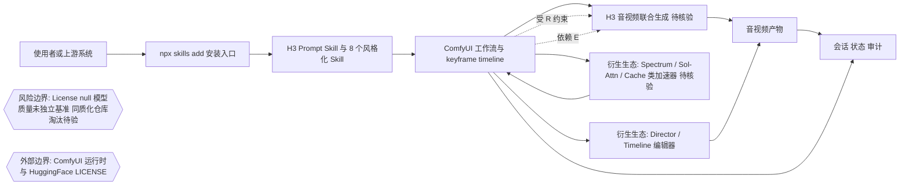

# MiniMax-AI/MiniMax-H3

## 一句话定位
MiniMax 官方视频生成模型 H3 的模型仓库 + 九个配套 Agent Skill（含 H3 prompt-writing skill 与 8 个风格化视频生成 skill），其发布直接引爆了一个 265 仓库、3000+⭐ 累计星标的 ComfyUI 插件生态系统。

## 它解决的问题
视频生成模型（尤其是音频-视频联合生成如 H3）落地需要三件事：高质量 prompt 工程化、推理加速（transformer 计算密集）、工作流编排（timeline / keyframe / 多镜头）。MiniMax-H3 官方仓库解决第一件事（9 个结构化 skill），而衍生生态解决后两件事——这是"模型发布即生态"的典型路径，解决的是"新模型如何快速被开发者采用"的分发问题。

## 为什么值得关注
- **Stars:** 1,070（截至 2026-08-08），创建 2026-07-30，8 天内破千
- **Forks:** 56
- **Watchers/Subscribers:** 9
- **Open Issues:** 未详细获取
- **License:** 自定义（链接到 HF LICENSE 文件）
- **语言:** Python
- **活跃度:** created 2026-07-30，pushed_at 2026-08-06，持续活跃
- **生态规模:** 265 个衍生仓库（GitHub 搜索 "minimax h3" created:>2026-08-01），累计星标 3,039（可核验）
- **内置 Skill:** 9 个 SKILL.md（h3-prompt-writing + 8 个风格化视频生成），可通过 `npx skills add` 安装

## 热度来源判断
MiniMax-H3 的热度来自**"官方模型发布 × ComfyUI 生态天然适配 × 视频生成赛道高关注"**。官方仓库本身 1,070⭐ 并不算极高（对比 DeepSeek-V3 同期），但关键在于它**引爆了一个 265 仓库的衍生生态**——这是"模型发布即生态爆发"的信号。生态热度集中在三个方向：**加速器**（Spectrum 353⭐ Chebyshev 回归预测 / TE-Speed 179⭐ 超级缓存 / FirstBlockCache / blockcache）、**导演/timeline 编辑器**（ComfyUI_MiniMaxH3_Director 341⭐ / 多个 Director 变体）、**prompt 构建器**（Promptor / PromptBuilder / Prompt-AgentSkill）。这种"加速器 × 导演 × prompt"的三层生态结构与此前视频模型（如 SVD、CogVideoX）的生态爆发模式高度同构。热度**真实且具结构性**——265 个仓库不是刷量能制造的。

## 关键技术亮点亮点
1. **音频-视频联合生成:** H3 是 audio-video 模型（从 README 和衍生项目描述可核验），音频与视频同步生成
2. **Ref2VA 模式:** 全参考模式（full-reference），与 text/keyframe 模式并列，说明支持多种输入条件
3. **官方 Skill 分发:** 9 个 SKILL.md 可通过 `npx skills add` 安装，是"模型厂商主动拥抱 Agent Skill 生态"的案例
4. **风格化预设:** 8 个风格化视频生成 skill（产品广告/3D动画/纸艺停格/品牌宣传片/MV字幕/游戏介绍/纸拼贴等），降低创意门槛
5. **生态加速技术:** Spectrum 用 Chebyshev ridge regression 预测 post-transformer 特征跳过部分 transformer 计算；Sol-Attn（Saganaki22）用 Triton kernel 在 SM89-120 上实现 memory-efficient attention；多个 FirstBlockCache/Cache 变体

## 架构师速览

| 决策问题 | 研究判断 | 证据边界 |
|---|---|---|
| 系统边界 | MiniMax-H3 官方仓库 + 9 个 SKILL.md（prompt-writing + 8 风格化）作为分发入口，价值落在"模型→生态"引爆层；衍生生态（265→351 仓库）才是真正的运行时承接面，依赖 ComfyUI 作为执行基底 | 仓库定位、Skill 数量、ComfyUI 依赖与生态规模有档案可证；具体协议、权重结构、Ref2VA 内部实现未在档案核验 |
| 主路径 | 安装 Skill（`npx skills add`）→ 生成结构化 prompt → ComfyUI 加载 H3 节点 → 加挂衍生加速器/缓存/Director 插件 → 产出音视频；官方仓库只覆盖 prompt 工程化一环 | `npx skills add`、ComfyUI 适配、音视频联合生成有档案可证；加速器（如 Spectrum、Sol-Attn）技术声明仅为 README，未独立复现 |
| 关键权衡 | 采用方需在"生态绑定 ComfyUI 的快速复用"与"独立性/可复现性/许可证明确性"之间取舍——许可证经 API 核验为 null，商业条款未明 | ComfyUI 绑定、Spectrum 1.14–1.44× 与 Sol-Attn -37% VRAM 等性能声明来自各自 README；License null、watchers 仅 9 反映深度关注度不足 |
| 最小 PoC | 单渠道、单权限范围内：① `npx skills add` 装 H3 prompt skill；② ComfyUI 内最小工作流（t2v 或 i2v 单节点）跑通；③ 接一个缓存/Director 插件对比基线 latency；④ 审计日志 + 退出路径齐全后再扩面 | 9 个 Skill、ComfyUI 节点、Director / Cache 插件目录均为档案列出的可访问组件；具体 latency 数字与 VRAM 收益须实测 |

## 架构启发
MiniMax-H3 的最大启发是**"模型发布的竞争已从'模型本身'延伸到'生态可达性'"**。官方仓库不只是放权重，而是同时发布 9 个 Skill（prompt 工程化），降低使用门槛；衍生生态在一周内填满加速器、导演、prompt 构建器三层。这与 DeepSeek/SiliconFlow 等只放权重的传统模式形成对比。更深层的启发：**视频生成模型的落地瓶颈已从"生成质量"转移到"推理成本 + 工作流编排"**——265 个衍生仓库中加速器和 timeline 编辑器占绝大多数，说明开发者的真实痛点不是"能不能生成"而是"生成太慢 + 难以精确控制"。这是基础设施投资信号。

## 架构图（MMD）

> 证据边界：此图只采用本档案已有可核验描述；“待核验”节点不应视为项目实现事实。

## 定位判断
**生态催化剂型项目。** MiniMax-H3 官方仓库本身不是最终价值载体——它的价值在于作为生态引爆点。1,070⭐ + 265 衍生仓库 + 3,039 累计生态星标的结构，说明它已成功激活开发者生态。定位类似 ComfyUI 之于 Stable Diffusion：模型是种子，生态是果实。是否值得长期跟踪取决于 H3 模型本身的质量（目前为 README/官方声明，未独立基准测试）和生态的可持续性（265 仓库中有多少能存活过淘汰期）。

## 风险/局限/泡沫点
- **模型质量未独立验证:** README 和衍生项目均未提供与竞品（Veo/Sora/Kling）的独立对比基准，"好"仅基于社区反馈
- **生态泡沫风险:** 265 个仓库中大量是同质化的 Director 变体（至少 5 个 "Director" 项目）和缓存加速器，淘汰期后可能大幅萎缩
- **官方仓库无 license 明确标注:** LICENSE 链接到 HF 文件，商业使用条款需确认
- **加速器项目的技术声明需验证:** Spectrum 的"1.14-1.44× vs SageAttention"和 Sol-Attn 的"-37% MLP peak VRAM"为 README 声明，未独立复现
- **desc 为 null:** 官方仓库无 description，仅靠 README 传达信息
- **watchers 仅 9:** 深度关注度低于 star 数，说明更多是"用完即走"的工具型使用

## 与同类项目的关系
- **vs MiniMax H1/H2:** H3 是同一系列的迭代，audio-video 联合生成是新增能力（推断，未核验早期版本）
- **vs Sora / Veo / Kling:** 同为视频生成模型，但 MiniMax 选择开源权重 + 拥抱 ComfyUI 生态，Sora/Veo 封闭
- **vs CogVideoX / Open-Sora:** 同为开源视频生成，但 H3 的 Skill 分发模式（9 个 SKILL.md）是差异化
- **vs ComfyUI 核心:** H3 生态完全依赖 ComfyUI 作为运行时，ComfyUI 的 native H3 node 是生态基础

## 是否值得持续跟踪
**值得跟踪（视频生成生态信号）。** MiniMax-H3 代表了"视频生成模型从发布到生态爆发"的完整路径，是观察视频生成赛道热度和开发者真实需求（加速 + 编排）的高价值样本。建议关注：H3 模型本身的独立基准测试、生态淘汰期后的存活项目数、加速器技术的可复现性、官方 Skill 的迭代频率。

## 后续观察点
- 生态淘汰率（265 仓库中 2-3 周后仍活跃的数量）
- 是否出现独立于 ComfyUI 的 H3 运行时（降低生态绑定风险）
- H3 与竞品的独立基准对比（尤其推理成本和生成质量）
- 官方加速方案（是否 MiniMax 自己发布推理优化）
- Skill 分发模式是否被其他模型厂商效仿

---
> 数据来源: GitHub API (2026-08-10) | Stars: 2,693 | Forks: 160 | License: 自定义(未明确标注) | 语言: Python | 创建: 2026-07-30 | 生态: 351 衍生仓库（GitHub Search "minimax h3" created:>2026-08-01 可核验）

## 最近动态（2026-08-10）

- **继续加速 +924（+52%），连续两日高位放量**：1,769 → 2,693，fork 97 → 160（+63），subscribers 12 → 21。衍生生态仓库从 314 增至 351（+37，GitHub 搜索 "minimax h3" created:>2026-08-01，total_count=351 可核验）。**增速从昨日 +65% 回落到 +52%，但绝对增量 +924 略高于昨日 +699**——持续高位放量而非衰减。
- **衍生生态增量放缓但官方仓库增量上升**：衍生仓库 +37（昨日 +49），但官方仓库 +924（昨日 +699），印证"用户从插件爆发期进一步进入主路径集成期"——更多人在用官方仓库做端到端集成。
- **加速器类+导演类持续填充**：Spectrum 382→431（+49），Turbo 346（昨日新进入，今日持续），Director 406→450（+44）。推理成本+工作流编排仍是首要瓶颈，与昨日判断完全一致。
- **判断修正**：score 88 → 89。连续两日高位放量 + 官方仓库增量创新高 + 主路径集成期确认，共同提升 score。
- **风险（更新）**：官方仓库仍无 license 标注（license=null，GitHub API 可核验），是法律采用风险变量。351 仓库中大量同质化（Director 变体、Cache 变体），淘汰期后可能大幅萎缩。模型质量未独立基准测试。
